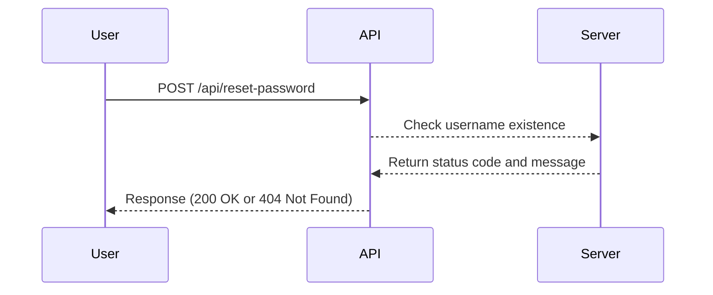

## User Enumeration in API Security

### Introduction to User Enumeration

User enumeration is a type of vulnerability that allows an attacker to determine whether a specific username exists within a system. This can be particularly dangerous in scenarios involving authentication mechanisms, such as login pages or password reset APIs. By systematically testing usernames, an attacker can gather a list of valid usernames, which can then be used in conjunction with other attacks, such as brute force or social engineering.

In the context of API security, user enumeration often occurs through the password reset functionality. When a user requests a password reset, the API checks if the provided username exists. Depending on the implementation, the API might return different responses based on whether the username is valid or not. This difference in responses can be exploited by attackers to enumerate valid usernames.

### Scenario: Password Reset API

Let's consider a typical password reset API scenario. Suppose a user requests a password reset by providing their username. The API endpoint might look something like this:

```http
POST /api/reset-password HTTP/1.1
Host: example.com
Content-Type: application/json

{
    "username": "john_doe"
}
```

The server would then respond with an appropriate message based on whether the username exists:

```http
HTTP/1.1 200 OK
Content-Type: application/json

{
    "message": "Password reset email sent to john_doe@example.com"
}
```

If the username does not exist, the server might respond with:

```http
HTTP/1.1 404 Not Found
Content-Type: application/json

{
    "message": "User not found"
}
```

### Goal of User Enumeration

The primary goal of user enumeration is to retrieve a list of valid usernames. This can be achieved by systematically testing various usernames and observing the server's responses. Once a list of valid usernames is obtained, an attacker can use this information to launch further attacks, such as brute-forcing passwords or conducting targeted phishing campaigns.

### How User Enumeration Works

User enumeration typically involves the following steps:

1. **Identify the API Endpoint**: Determine the API endpoint that handles password resets or similar functionalities.
2. **Craft Requests**: Send requests to the API with different usernames.
3. **Analyze Responses**: Observe the server's responses to determine if the username exists.

Here is a step-by-step breakdown using a Python script to demonstrate the process:

```python
import requests

def check_username_exists(url, username):
    data = {"username": username}
    response = requests.post(url, json=data)
    
    if response.status_code == 200:
        print(f"Username '{username}' exists.")
    elif response.status_code == 404:
        print(f"Username '{username}' does not exist.")
    else:
        print(f"Unexpected response: {response.status_code}")

# Example usage
url = "https://example.com/api/reset-password"
check_username_exists(url, "john_doe")
check_username_exists(url, "jane_doe")
```

### Real-World Examples

#### CVE-2021-21972: Microsoft Exchange Server

In March 2021, a series of vulnerabilities were discovered in Microsoft Exchange Server, collectively known as ProxyLogon. One of the vulnerabilities (CVE-2021-26855) allowed attackers to perform user enumeration by sending specially crafted requests to the Exchange server. This vulnerability was exploited in the wild, leading to widespread attacks and data breaches.

#### CVE-2022-22965: VMware vCenter Server

In May 2022, a critical vulnerability (CVE-2022-22965) was disclosed in VMware vCenter Server. This vulnerability allowed attackers to perform user enumeration by exploiting a flaw in the Single Sign-On (SSO) service. Attackers could send requests to the SSO service and determine if a given username existed, thereby gaining valuable information about the system's users.

### Mermaid Diagrams

To better understand the flow of user enumeration, let's visualize the process using a mermaid diagram:



### Pitfalls and Common Mistakes

One of the most common mistakes in implementing password reset APIs is returning different responses based on whether the username exists. This difference in responses can be easily detected by attackers, leading to successful user enumeration. Other common pitfalls include:

- **Verbose Error Messages**: Returning detailed error messages that reveal information about the system's internal workings.
- **Inconsistent Responses**: Providing inconsistent responses across different parts of the system, making it easier for attackers to identify patterns.
- **Insufficient Rate Limiting**: Failing to implement rate limiting on API endpoints, allowing attackers to make numerous requests in a short period.

### How to Prevent / Defend Against User Enumeration

#### Detection

To detect user enumeration attempts, organizations should monitor API logs for unusual patterns of requests. Tools like intrusion detection systems (IDS) and security information and event management (SIEM) systems can help identify suspicious activity.

#### Prevention

To prevent user enumeration, the following measures should be implemented:

1. **Consistent Responses**: Ensure that the API returns consistent responses regardless of whether the username exists. For example, always return a generic message like "A password reset email has been sent if the account exists."

2. **Rate Limiting**: Implement rate limiting on API endpoints to prevent attackers from making too many requests in a short period. This can be done using tools like `nginx` or `Apache`.

3. **Logging and Monitoring**: Maintain comprehensive logging and monitoring of API requests to detect and respond to potential enumeration attempts.

4. **Secure Coding Practices**: Follow secure coding practices to avoid revealing sensitive information through error messages or responses.

#### Secure Code Fix

Here is an example of how to implement a secure password reset API that prevents user enumeration:

**Vulnerable Code:**

```python
import requests

def check_username_exists(url, username):
    data = {"username": username}
    response = requests.post(url, json=data)
    
    if response.status_code == 200:
        print(f"Username '{username}' exists.")
    elif response.status_code == 404:
        print(f"Username '{username}' does not exist.")
    else:
        print(f"Unexpected response: {response.status_code}")
```

**Secure Code:**

```python
import requests

def check_username_exists(url, username):
    data = {"username": username}
    response = requests.post(url, json=data)
    
    if response.status_code == 200:
        print("A password reset email has been sent if the account exists.")
    else:
        print("Unexpected response: Please try again later.")

# Example usage
url = "https://example.com/api/reset-password"
check_username_exists(url, "john_doe")
check_username_exists(url, "jane_doe")
```

### Configuration Hardening

To further harden the configuration, consider the following steps:

1. **Use WAF Rules**: Configure Web Application Firewall (WAF) rules to block suspicious patterns of requests.
2. **Implement CAPTCHA**: Use CAPTCHA mechanisms to prevent automated enumeration attempts.
3. **Regular Audits**: Conduct regular security audits and penetration tests to identify and mitigate vulnerabilities.

### Hands-On Labs

For practical experience with user enumeration, consider the following labs:

- **PortSwigger Web Security Academy**: Offers a module on user enumeration that includes interactive challenges and detailed explanations.
- **OWASP Juice Shop**: A deliberately insecure web application that includes user enumeration vulnerabilities for educational purposes.
- **DVWA (Damn Vulnerable Web Application)**: Another intentionally vulnerable web application that can be used to practice identifying and mitigating user enumeration vulnerabilities.

By thoroughly understanding the concepts, mechanisms, and preventive measures related to user enumeration, organizations can significantly reduce the risk of such vulnerabilities being exploited.

---
<!-- nav -->
[[API Security/18-User Enumeration/01-User Enumeration Background Concept/01-User Enumeration Background Concept|User Enumeration Background Concept]] | [[API Security/18-User Enumeration/01-User Enumeration Background Concept/00-Overview|Overview]] | [[API Security/18-User Enumeration/01-User Enumeration Background Concept/03-Practice Questions & Answers|Practice Questions & Answers]]
