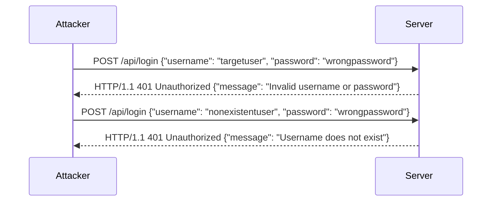

## User Enumeration in API Security

### Introduction to User Enumeration

User enumeration is a common vulnerability in web applications and APIs that allows attackers to determine whether a specific username exists within the system. This can be achieved through various methods, such as analyzing error messages, response times, or HTTP status codes. Understanding and preventing user enumeration is crucial for maintaining the security and privacy of user accounts.

### Background Theory

In a typical login process, an application receives a username and password from the user. The application then checks if the provided credentials match those stored in the database. If the username does not exist, the application might return an error message indicating that the username is invalid. Similarly, if the password is incorrect, the application might return a different error message. An attacker can exploit these differences to enumerate valid usernames.

### How User Enumeration Works

Let's consider a simple scenario where an attacker wants to determine if a specific username exists in the system. The attacker sends a login request with the target username and an arbitrary password. Based on the response from the server, the attacker can infer whether the username is valid.

#### Example Scenario

Consider an API endpoint `/api/login` that accepts a POST request with a JSON body containing `username` and `password`.

```json
{
  "username": "user1",
  "password": "wrongpassword"
}
```

The server responds with an HTTP status code and a message:

```http
HTTP/1.1 401 Unauthorized
Content-Type: application/json

{
  "message": "Invalid username or password"
}
```

If the attacker tries with a non-existent username:

```json
{
  "username": "nonexistentuser",
  "password": "wrongpassword"
}
```

The server might respond differently:

```http
HTTP/1.1 401 Unauthorized
Content-Type: application/json

{
  "message": "Username does not exist"
}
```

By comparing the responses, the attacker can determine if the username exists.

### Real-World Examples

#### CVE-2021-3116: User Enumeration in WordPress

In 2021, a vulnerability was discovered in WordPress plugins that allowed user enumeration. Attackers could send requests to the `/wp-json/wp/v2/users` endpoint and analyze the response to determine if a specific user existed. This vulnerability was exploited to gain unauthorized access to user accounts.

#### Breach Example: LinkedIn User Enumeration

LinkedIn faced a user enumeration issue where attackers could determine if a user existed by sending requests to the `/users/{username}` endpoint. By analyzing the HTTP status codes and error messages, attackers could compile a list of valid usernames.

### Detailed Mechanics of User Enumeration

To understand user enumeration in more detail, let's break down the process step-by-step.

#### Step 1: Crafting the Request

An attacker crafts a POST request to the login endpoint with a specific username and an arbitrary password.

```http
POST /api/login HTTP/1.1
Host: example.com
Content-Type: application/json

{
  "username": "targetuser",
  "password": "wrongpassword"
}
```

#### Step 2: Analyzing the Response

The server processes the request and returns a response based on the validity of the username and password.

```http
HTTP/1.1 401 Unauthorized
Content-Type: application/json

{
  "message": "Invalid username or password"
}
```

If the username does not exist:

```http
HTTP/1.1 401 Unauthorized
Content-Type:application/json

{
  "message": "Username does not exist"
}
```

#### Step 3: Inferring the Result

By comparing the responses, the attacker can determine if the username exists. If the response indicates that the username does not exist, the attacker knows that the username is invalid. Conversely, if the response indicates that the username is valid but the password is incorrect, the attacker knows that the username exists.

### Mermaid Diagram: User Enumeration Process

A visual representation of the user enumeration process can help illustrate the steps involved.



### Common Pitfalls and Mistakes

#### Inconsistent Error Messages

One common mistake is providing inconsistent error messages for different types of authentication failures. For example, returning "Invalid username or password" for both non-existent usernames and incorrect passwords can make it difficult for attackers to determine if a username exists.

#### Timing Attacks

Attackers can also perform timing attacks by measuring the response time of the server. If the server takes longer to respond when the username exists compared to when it does not, the attacker can infer the existence of the username.

### How to Prevent / Defend Against User Enumeration

#### Secure Coding Practices

1. **Consistent Error Messages**: Ensure that the server returns consistent error messages regardless of whether the username exists or the password is correct. For example, always return "Invalid username or password" for both cases.

2. **Rate Limiting**: Implement rate limiting to prevent attackers from making too many login attempts in a short period. This can slow down brute-force attacks and make user enumeration more difficult.

3. **Account Lockout Policies**: Implement account lockout policies that temporarily lock an account after a certain number of failed login attempts. This can prevent attackers from repeatedly guessing usernames and passwords.

#### Configuration Hardening

1. **Disable Username Hinting**: Disable any features that provide hints about the existence of a username. For example, disable the "Remember Me" feature that might reveal if a username exists.

2. **Use CAPTCHAs**: Implement CAPTCHAs to prevent automated attacks. This can make it more difficult for attackers to perform user enumeration through automated scripts.

#### Detection and Monitoring

1. **Logging and Monitoring**: Implement logging and monitoring to detect unusual login patterns. For example, monitor for repeated login attempts with different usernames and the same password.

2. **Security Tools**: Use security tools like intrusion detection systems (IDS) and security information and event management (SIEM) systems to detect and alert on potential user enumeration attacks.

### Secure Code Example

Here is an example of how to implement a secure login function that prevents user enumeration.

#### Vulnerable Code

```python
def login(username, password):
    user = get_user_by_username(username)
    if user and check_password(user.password, password):
        return True
    else:
        return False
```

#### Secure Code

```python
def login(username, password):
    user = get_user_by_username(username)
    if user:
        if check_password(user.password, password):
            return True
        else:
            # Simulate a delay to prevent timing attacks
            time.sleep(1)
            return False
    else:
        # Simulate a delay to prevent timing attacks
        time.sleep(1)
        return False
```

### Complete Example: Full HTTP Request and Response

#### Vulnerable Example

**Request**

```http
POST /api/login HTTP/1.1
Host: example.com
Content-Type: application/json

{
  "username": "targetuser",
  "password": "wrongpassword"
}
```

**Response**

```http
HTTP/1.1 401 Unauthorized
Content-Type: application/json

{
  "message": "Invalid username or password"
}
```

#### Secure Example

**Request**

```http
POST /api/login HTTP/1.1
Host: example.com
Content-Type: application/json

{
  "username": "targetuser",
  "password": "wrongpassword"
}
```

**Response**

```http
HTTP/1.1 401 Unauthorized
Content-Type: application/json

{
  "message": "Invalid username or password"
}
```

### Hands-On Labs

For hands-on practice with user enumeration, consider the following labs:

- **PortSwigger Web Security Academy**: Offers interactive labs on user enumeration and other web security topics.
- **OWASP Juice Shop**: A deliberately insecure web application for practicing web security skills.
- **DVWA (Damn Vulnerable Web Application)**: A PHP/MySQL web application that contains numerous security vulnerabilities.

These labs provide real-world scenarios and challenges to help you understand and defend against user enumeration attacks.

### Conclusion

User enumeration is a significant vulnerability that can compromise the security of user accounts. By understanding the mechanics of user enumeration and implementing secure coding practices, rate limiting, and account lockout policies, you can effectively prevent and defend against these attacks. Regular monitoring and the use of security tools can further enhance your defense strategy.

---
<!-- nav -->
[[01-User Enumeration Vulnerability|User Enumeration Vulnerability]] | [[API Security/18-User Enumeration/02-User Demonstration Demonstration/00-Overview|Overview]] | [[03-User Enumeration in APIs|User Enumeration in APIs]]
