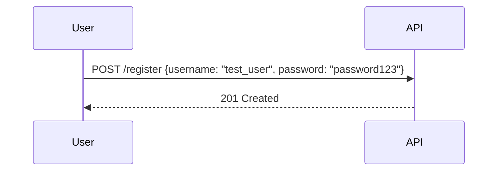
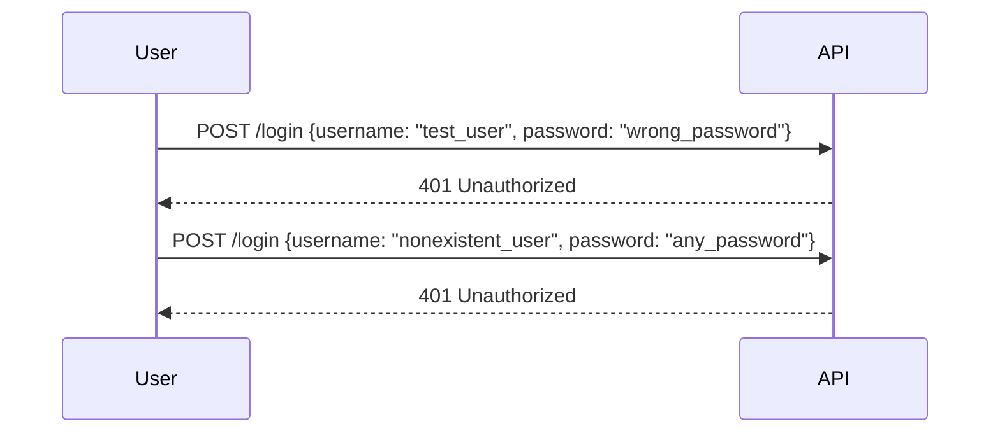

## User Enumeration in APIs

### Introduction to User Enumeration

User enumeration is a common vulnerability in web applications and APIs where an attacker can determine whether a specific username or email address exists within the system. This information can be used to launch further attacks, such as brute-force password guessing or social engineering. Understanding how user enumeration works and how to prevent it is crucial for securing your application.

### Background Theory

#### What is User Enumeration?

User enumeration occurs when an application provides different error messages or response codes based on whether a given username exists or not. For example, if a user attempts to log in with a non-existent username, the application might return an error message like "Username does not exist." Conversely, if the username exists but the password is incorrect, the application might return a message like "Incorrect password."

#### Why Does User Enumeration Matter?

User enumeration is significant because it allows attackers to gather valid usernames or email addresses, which can be used to target specific users. Once an attacker knows a valid username, they can attempt to guess the password using various techniques, such as brute force or dictionary attacks. This makes it easier for attackers to gain unauthorized access to accounts.

### How User Enumeration Works

#### Example Scenario

Let's consider an API that allows users to register and log in. The API has two endpoints:

1. **POST /register**: Used to create a new user account.
2. **POST /login**: Used to authenticate a user.

Here’s how user enumeration might occur in this scenario:

1. **Register a New User**:
    - An attacker registers a new user with a unique username, e.g., `test_user`.
    - The API responds with a success message indicating that the user was created.

2. **Attempt Login with Existing Username**:
    - The attacker tries to log in with the newly registered username (`test_user`) and an incorrect password.
    - The API returns an error message indicating that the password is incorrect.

3. **Attempt Login with Non-Existent Username**:
    - The attacker tries to log in with a non-existent username (`nonexistent_user`) and any password.
    - The API returns an error message indicating that the username does not exist.

By comparing the error messages returned by the API, the attacker can determine whether a given username exists or not.

### Real-World Examples

#### Recent CVEs and Breaches

One notable example of user enumeration leading to a breach is the LinkedIn breach in 2012. Attackers were able to exploit a user enumeration vulnerability to gather millions of valid usernames, which were then used to launch brute-force attacks. This resulted in the theft of over 6.5 million hashed passwords.

Another example is the breach of the popular dating app Ashley Madison in 2015. The attackers exploited a user enumeration vulnerability to gather valid usernames, which were then used to launch targeted attacks against high-profile users.

### Detailed Example with Code

Let's walk through a detailed example of how user enumeration can occur in an API and how to detect and prevent it.

#### Vulnerable API Implementation

Consider the following simplified API implementation in Python using Flask:

```python
from flask import Flask, request, jsonify

app = Flask(__name__)

# Simulated database of users
users = {
    "test_user": "password123",
    "another_user": "another_password"
}

@app.route('/register', methods=['POST'])
def register():
    data = request.json
    username = data.get('username')
    password = data.get('password')

    if username in users:
        return jsonify({"message": "Username already exists"}), 400
    else:
        users[username] = password
        return jsonify({"message": "User created successfully"}), 201

@app.route('/login', methods=['POST'])
def login():
    data = request.json
    username = data.get('username')
    password = data.get('password')

    if username not in users:
        return jsonify({"message": "Username does not exist"}), 404
    elif users[username] != password:
        return jsonify({"message": "Incorrect password"}), 401
    else:
        return jsonify({"message": "Login successful"}), 200

if __name__ == '__main__':
    app.run(debug=True)
```

#### Vulnerability Analysis

In this implementation, the `/login` endpoint returns different error messages based on whether the username exists or not:

- If the username does not exist, it returns a `404 Not Found` status code with the message "Username does not exist."
- If the username exists but the password is incorrect, it returns a `401 Unauthorized` status code with the message "Incorrect password."

This difference in error messages allows an attacker to determine whether a given username exists.

### Detection and Prevention

#### How to Detect User Enumeration

To detect user enumeration, you can perform the following steps:

1. **Monitor API Responses**: Analyze the API responses for different error messages and status codes.
2. **Automated Scanning**: Use automated tools to scan the API for user enumeration vulnerabilities. Tools like Burp Suite, OWASP ZAP, and Wfuzz can help automate this process.

#### How to Prevent User Enumeration

To prevent user enumeration, follow these best practices:

1. **Consistent Error Messages**: Return the same error message and status code regardless of whether the username exists or not. For example, always return a `401 Unauthorized` status code with the message "Invalid credentials."

2. **Rate Limiting**: Implement rate limiting to prevent attackers from making too many requests in a short period of time.

3. **Account Lockout Policies**: Implement account lockout policies to temporarily lock out accounts after a certain number of failed login attempts.

4. **Secure Coding Practices**: Ensure that your code does not leak information about the existence of usernames or email addresses.

### Secure Code Implementation

Here’s how you can modify the previous API implementation to prevent user enumeration:

```python
from flask import Flask, request, jsonify

app = Flask(__name__)

# Simulated database of users
users = {
    "test_user": "password123",
    "another_user": "another_password"
}

@app.route('/register', methods=['POST'])
def register():
    data = request.json
    username = data.get('username')
    password = data.get('password')

    if username in users:
        return jsonify({"message": "Registration failed"}), 400
    else:
        users[username] = password
        return jsonify({"message": "User created successfully"}), 201

@app.route('/login', methods=['POST'])
def login():
    data = request.json
    username = data.get('username')
    password = data.get('password')

    if username in users and users[username] == password:
        return jsonify({"message": "Login successful"}), 200
    else:
        return jsonify({"message": "Invalid credentials"}), 401

if __name__ == '__main__':
    app.run(debug=True)
```

In this modified implementation, the `/login` endpoint always returns the same error message "Invalid credentials" regardless of whether the username exists or not.

### Mermaid Diagrams

#### User Registration Flow



#### User Login Flow



### Common Pitfalls

#### Returning Different Error Codes

Returning different error codes based on whether the username exists or not can lead to user enumeration. Always return the same error code and message regardless of the input.

#### Logging Sensitive Information

Logging sensitive information, such as usernames or error messages, can also lead to user enumeration. Ensure that your logs do not contain any sensitive information.

### Hands-On Labs

For hands-on practice with user enumeration, consider the following labs:

- **PortSwigger Web Security Academy**: Offers a comprehensive course on web security, including user enumeration.
- **OWASP Juice Shop**: A deliberately insecure web application for practicing web security skills.
- **DVWA (Damn Vulnerable Web Application)**: A PHP/MySQL web application that contains numerous security vulnerabilities.

These labs provide a safe environment to practice identifying and preventing user enumeration vulnerabilities.

### Conclusion

User enumeration is a serious vulnerability that can be exploited by attackers to gather valid usernames and launch further attacks. By understanding how user enumeration works and implementing best practices to prevent it, you can significantly improve the security of your API. Always ensure that your error messages and status codes are consistent, and avoid logging sensitive information. Regularly test your API for user enumeration vulnerabilities using automated tools and hands-on labs to stay ahead of potential threats.

---
<!-- nav -->
[[API Security/18-User Enumeration/02-User Demonstration Demonstration/02-User Enumeration in API Security|User Enumeration in API Security]] | [[API Security/18-User Enumeration/02-User Demonstration Demonstration/00-Overview|Overview]] | [[API Security/18-User Enumeration/02-User Demonstration Demonstration/04-Practice Questions & Answers|Practice Questions & Answers]]
