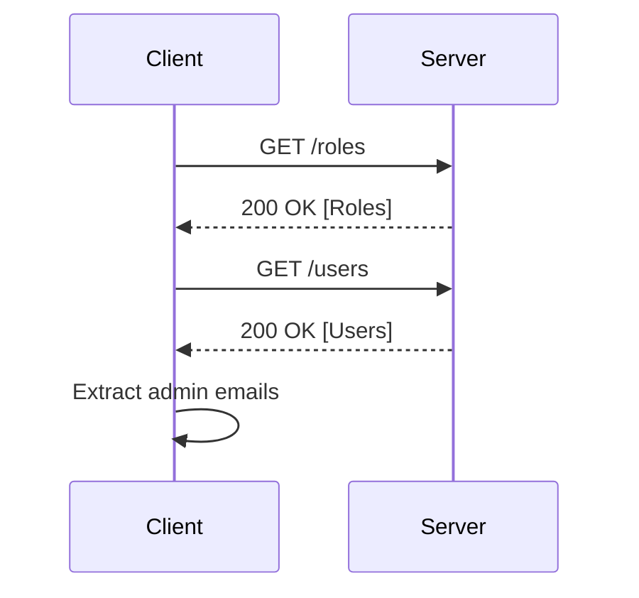

## User Enumeration via Email Addresses of Administrators

### Introduction to User Enumeration

User enumeration is a common vulnerability in web applications and APIs where an attacker can determine whether a specific username or email address exists within the system. This can be achieved through various means, such as analyzing error messages, response times, or specific HTTP status codes. In this context, we will focus on how an attacker might enumerate user accounts to discover the email addresses of administrators, which can then be used for targeted phishing attacks or other malicious activities.

### Background Theory

#### What is User Enumeration?

User enumeration occurs when an application provides feedback to the user that reveals whether a given username or email address exists in the system. This feedback can come in the form of error messages, HTTP status codes, or even differences in response times. For example, if an application returns a different error message when a username does not exist compared to when it does, an attacker can use this information to enumerate valid usernames.

#### Why Does User Enumeration Matter?

User enumeration is significant because it can lead to several security risks:

1. **Targeted Attacks**: Once an attacker knows valid usernames or email addresses, they can target these accounts with more sophisticated attacks, such as spear-phishing or brute-force password guessing.
2. **Information Gathering**: Enumerating user accounts can provide valuable information about the structure of the organization, such as the existence of administrative accounts.
3. **Account Takeover**: If an attacker can identify valid usernames, they may attempt to gain unauthorized access to those accounts, potentially leading to a full account takeover.

### Real-World Examples

#### Recent Breaches and CVEs

Several high-profile breaches have been linked to user enumeration vulnerabilities:

1. **CVE-2021-21972**: This vulnerability was found in the WordPress REST API, where attackers could enumerate user IDs and extract sensitive information, including email addresses.
2. **CVE-2020-14774**: A user enumeration vulnerability in the Joomla CMS allowed attackers to determine valid usernames and email addresses, which were then used in targeted phishing campaigns.

These examples highlight the importance of securing against user enumeration attacks.

### Attack Scenario: Enumerating Administrator Emails

Let's consider a scenario where an attacker wants to enumerate user accounts to find the email addresses of administrators. We will use a hypothetical API and demonstrate how this can be done using tools like Postman.

#### Step-by-Step Mechanics

1. **Identify the API Endpoints**:
   - First, the attacker needs to identify the API endpoints that handle user-related operations. Common endpoints include `/users`, `/roles`, etc.

2. **Enumerate Roles**:
   - The attacker starts by enumerating the available roles. This can be done by making a GET request to the `/roles` endpoint.

```http
GET /roles HTTP/1.1
Host: example.com
Authorization: Bearer <access_token>
```

Response:

```http
HTTP/1.1 200 OK
Content-Type: application/json

{
  "roles": [
    {
      "id": 1,
      "name": "admin"
    },
    {
      "id": 2,
      "name": "user"
    }
  ]
}
```

3. **Enumerate Users**:
   - Next, the attacker makes a request to the `/users` endpoint to retrieve a list of users along with their associated roles.

```http
GET /users HTTP/1.1
Host: example.com
Authorization: Bearer <access_token>
```

Response:

```http
HTTP/1.1 200 OK
Content-Type: application/json

{
  "users": [
    {
      "id": 1,
      "email": "admin@example.com",
      "role_id": 1
    },
    {
      "id": 2,
      "email": "user1@example.com",
      "role_id": 2
    },
    {
      "id": 3,
      "email": "user2@example.com",
      "role_id": 2
    }
  ]
}
```

4. **Identify Administrator Emails**:
   - By examining the `role_id` field, the attacker can identify which users have the `admin` role and extract their email addresses.

### Mermaid Diagrams

#### API Request Flow



### Pitfalls and Common Mistakes

#### Error Messages

One common mistake is providing detailed error messages that reveal whether a username or email exists. For example, returning an error message like "User not found" when a username does not exist can be exploited.

#### Response Times

Another pitfall is differences in response times. If the server takes longer to respond when a username does not exist, an attacker can use timing analysis to infer the existence of a username.

### How to Prevent / Defend Against User Enumeration

#### Detection

To detect user enumeration attempts, organizations should monitor API logs for patterns indicative of enumeration attacks. Tools like intrusion detection systems (IDS) can help identify suspicious activity.

#### Prevention

1. **Consistent Error Messages**:
   - Ensure that error messages are consistent regardless of whether a username or email exists. For example, return a generic error message like "Invalid credentials" for both valid and invalid inputs.

2. **Rate Limiting**:
   - Implement rate limiting to restrict the number of login attempts or user enumeration requests from a single IP address within a given time frame.

3. **Obfuscation**:
   - Obfuscate error messages and response times to make it harder for attackers to distinguish between valid and invalid inputs.

#### Secure Coding Fixes

Here is an example of how to implement a secure login function that prevents user enumeration:

```python
def login(username, password):
    # Check if the username exists
    user = get_user_by_username(username)
    
    if user:
        # Verify the password
        if verify_password(user['password'], password):
            return True
        else:
            # Return a generic error message
            return False
    else:
        # Return a generic error message
        return False
```

#### Configuration Hardening

Ensure that your API configurations are hardened against user enumeration attacks. Here is an example of an Nginx configuration that limits the number of requests per IP address:

```nginx
http {
    limit_req_zone $binary_remote_addr zone=api_limit:10m rate=1r/s;

    server {
        location /api {
            limit_req zone=api_limit burst=5 nodelay;
            proxy_pass http://backend;
        }
    }
}
```

### Practice Labs

For hands-on practice with user enumeration, consider the following labs:

- **PortSwigger Web Security Academy**: Offers interactive labs on user enumeration and other web security topics.
- **OWASP Juice Shop**: A deliberately insecure web application for practicing web security skills.
- **DVWA (Damn Vulnerable Web Application)**: A PHP/MySQL web application that demonstrates web application vulnerabilities.

By thoroughly understanding and implementing the preventive measures discussed, organizations can significantly reduce the risk of user enumeration attacks and protect sensitive information.

### Conclusion

User enumeration is a critical vulnerability that can lead to serious security risks. By understanding the mechanics of user enumeration, recognizing real-world examples, and implementing robust preventive measures, organizations can better protect their systems and data from such attacks.

---
<!-- nav -->
[[API Security/18-User Enumeration/03-User Enumeration Email of the Adminstrator/00-Overview|Overview]] | [[API Security/18-User Enumeration/03-User Enumeration Email of the Adminstrator/02-Practice Questions & Answers|Practice Questions & Answers]]
