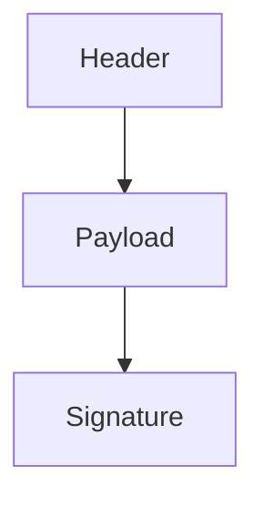
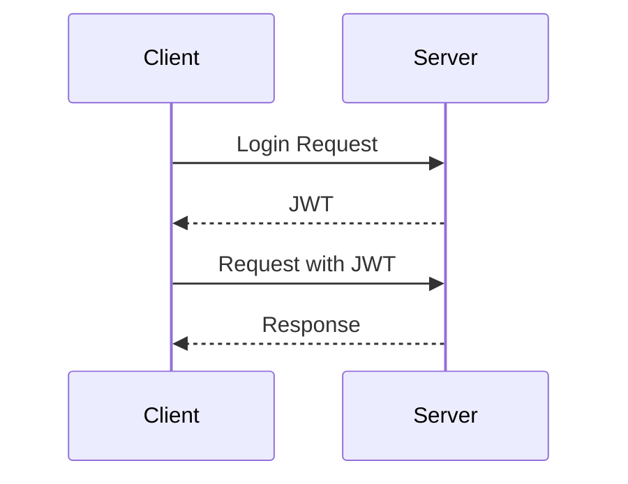

## Introduction to JSON Web Tokens (JWT)

JSON Web Tokens (JWT) are a widely adopted method for securely transmitting information between parties as a JSON object. They are particularly useful in the context of APIs, where they can be used to authenticate and authorize users. JWTs are designed to be compact and URL-safe, making them ideal for transmission via URL, POST parameter, or within an HTTP header.

### What is a JWT?

A JWT is essentially a string of characters that can be easily transmitted between parties. It consists of three parts separated by dots (`.`):

1. **Header**: Contains metadata about the token, such as the type of token and the signing algorithm used.
2. **Payload**: Contains the actual claims or data being transmitted. This can include user-specific information like username, roles, etc.
3. **Signature**: Ensures the integrity of the token and verifies that it was issued by a trusted party.

The structure of a JWT can be visualized as follows:



### Why Use JWTs?

JWTs provide several benefits:

- **Compactness**: JWTs are small and easy to transmit.
- **Self-contained**: All necessary information is contained within the token itself.
- **Stateless**: Servers do not need to store session information, reducing the load on the server.
- **Secure**: JWTs can be signed to ensure their authenticity and integrity.

### How Does a JWT Work?

A typical workflow for JWTs involves the following steps:

1. **Authentication**: A user logs in with their credentials.
2. **Token Generation**: Upon successful authentication, the server generates a JWT containing the user's information.
3. **Token Transmission**: The JWT is sent to the client, typically in an HTTP response.
4. **Token Usage**: The client includes the JWT in subsequent requests to the server, usually in the `Authorization` header.
5. **Token Verification**: The server verifies the JWT and extracts the claims to determine the user's identity and permissions.

This process can be illustrated with the following sequence diagram:



### Real-World Example: Recent Breaches

One notable breach involving JWTs occurred in 2021, where a popular social media platform had a vulnerability in their JWT implementation. The issue stemmed from the fact that the JWTs were not properly signed, allowing attackers to forge tokens and impersonate users. This highlights the importance of proper JWT usage and validation.

### Structure of a JWT

Let's break down the structure of a JWT in more detail:

#### Header

The header typically contains two parts:

- **Type**: Specifies the type of token, usually `JWT`.
- **Algorithm**: Specifies the signing algorithm used, such as `HS256` (HMAC SHA-256) or `RS256` (RSA SHA-256).

Here is an example of a JWT header:

```json
{
  "alg": "HS256",
  "typ": "JWT"
}
```

#### Payload

The payload contains the claims, which are statements about an entity (typically the user) and additional data. Claims are encoded as key-value pairs. There are three types of claims:

- **Registered Claims**: Standardized claims like `iss` (issuer), `sub` (subject), `aud` (audience), `exp` (expiration time), etc.
- **Public Claims**: Custom claims that are not standardized but are agreed upon by the parties involved.
- **Private Claims**: Custom claims that are specific to the application.

Here is an example of a JWT payload:

```json
{
  "sub": "1234567890",
  "name": "John Doe",
  "iat": 1516239022,
  "exp": 1516242622
}
```

#### Signature

The signature ensures the integrity of the token and verifies that it was issued by a trusted party. It is generated by taking the base64Url encoded header and payload, concatenating them with a period (`.`), and then signing the result with the specified algorithm and secret key.

Here is an example of how the signature is generated:

```plaintext
base64UrlEncode(header) + "." + base64UrlEncode(payload)
```

The resulting string is then signed using the specified algorithm and secret key.

### Common Pitfalls and Vulnerabilities

Despite their benefits, JWTs can introduce several vulnerabilities if not implemented correctly:

- **Weak Keys**: Using weak keys can make the JWT susceptible to brute-force attacks.
- **Missing or Weak Signatures**: Not signing the JWT or using a weak signing algorithm can lead to forgery.
- **Expiration Time**: Not setting an expiration time can allow tokens to be reused indefinitely.
- **Insecure Storage**: Storing JWTs insecurely (e.g., in local storage) can expose them to XSS attacks.

### How to Prevent / Defend Against JWT Vulnerabilities

To ensure the security of JWTs, follow these best practices:

#### Secure Key Management

Use strong, unique keys for signing JWTs. Avoid using default or weak keys.

**Vulnerable Code:**

```python
import jwt

secret_key = "default_key"
payload = {"user_id": 12345}
token = jwt.encode(payload, secret_key, algorithm="HS256")
```

**Secure Code:**

```python
import jwt
import os

secret_key = os.urandom(32)  # Generate a strong, random key
payload = {"user_id": 12345}
token = jwt.encode(payload, secret_key, algorithm="HS256")
```

#### Proper Signing Algorithm

Use a strong signing algorithm like `RS256` instead of `HS256`. `RS256` uses public-key cryptography, which is more secure than symmetric algorithms.

**Vulnerable Code:**

```python
import jwt

secret_key = "default_key"
payload = {"user_id": 12345}
token = jwt.encode(payload, secret_key, algorithm="HS256")
```

**Secure Code:**

```python
import jwt
from cryptography.hazmat.primitives.asymmetric import rsa
from cryptography.hazmat.primitives import serialization

# Generate RSA key pair
private_key = rsa.generate_private_key(public_exponent=65537, key_size=2048)
public_key = private_key.public_key()

# Serialize keys
private_pem = private_key.private_bytes(
    encoding=serialization.Encoding.PEM,
    format=serialization.PrivateFormat.PKCS8,
    encryption_algorithm=serialization.NoEncryption()
)
public_pem = public_key.public_bytes(
    encoding=serialization.Encoding.PEM,
    format=
    serialization.PublicFormat.SubjectPublicKeyInfo
)

# Encode JWT with RS256
token = jwt.encode(payload, private_pem, algorithm="RS256")
```

#### Set Expiration Time

Always set an expiration time for JWTs to limit their validity.

**Vulnerable Code:**

```python
import jwt

secret_key = "default_key"
payload = {"user_id": 12345}
token = jwt.encode(payload, secret_key, algorithm="HS256")
```

**Secure Code:**

```python
import jwt
import datetime

secret_key = "default_key"
payload = {
    "user_id": 12345,
    "exp": datetime.datetime.utcnow() + datetime.timedelta(minutes=30)
}
token = jwt.encode(payload, secret_key, algorithm="HS256")
```

#### Secure Storage

Store JWTs securely, preferably in HTTP-only cookies to mitigate XSS attacks.

**Vulnerable Code:**

```javascript
localStorage.setItem('jwt', token);
```

**Secure Code:**

```javascript
document.cookie = `jwt=${token}; HttpOnly; Secure; SameSite=Strict`;
```

### Detection and Prevention Tools

Several tools can help detect and prevent JWT vulnerabilities:

- **OWASP ZAP**: An open-source web application security scanner that can detect JWT-related issues.
- **jwt.io**: A website that allows you to decode and verify JWTs.
- **jwt-cli**: A command-line tool for working with JWTs.

### Practice Labs

For hands-on practice with JWTs, consider the following labs:

- **PortSwigger Web Security Academy**: Offers a section on JWT vulnerabilities and how to exploit them.
- **OWASP Juice Shop**: A deliberately insecure web app that includes JWT-based authentication mechanisms.

By following these guidelines and best practices, you can ensure the secure implementation and usage of JWTs in your applications.

### Conclusion

JSON Web Tokens are a powerful tool for securing API communications. By understanding their structure, usage, and potential vulnerabilities, you can implement them securely and effectively. Always prioritize secure key management, proper signing algorithms, and secure storage to mitigate risks.

---
<!-- nav -->
[[API Security/19-JSON Web Token/01-JSON WEB TOKEN Concept Refer Hunter 20/00-Overview|Overview]] | [[API Security/19-JSON Web Token/01-JSON WEB TOKEN Concept Refer Hunter 20/02-JSON Web Tokens (JWT)|JSON Web Tokens (JWT)]]
