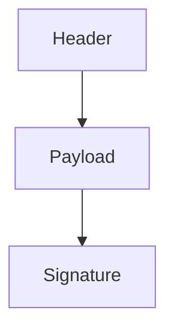

## JSON Web Tokens (JWT)

### Introduction to JSON Web Tokens

JSON Web Tokens (JWT) are a compact, URL-safe means of representing claims to be transferred between two parties. They allow you to encode information in a way that can be verified and trusted because it is digitally signed. JWTs can be signed using a secret (with the HMAC algorithm) or a public/private key pair using RSA or ECDSA.

#### Structure of a JWT

A JWT consists of three parts separated by dots (`.`):

1. **Header**: Contains metadata about the token, such as the type of token and the signing algorithm used.
2. **Payload**: Contains the claims. Claims are statements about an entity (typically, the user) and additional data.
3. **Signature**: Used to verify the integrity of the message. The signature is created using the encoded header, the encoded payload, a secret, and the algorithm specified in the header.



### Example of a JWT

Let's consider a simple example where a user logs in and receives a JWT. The user's credentials are:

- Username: `Vikar`
- Password: `Ricardo`

Upon successful login, the server generates a JWT. Here’s a step-by-step breakdown:

1. **Login Post Request**:
   
   ```http
   POST /login HTTP/1.1
   Host: example.com
   Content-Type: application/json
   
   {
       "username": "Vikar",
       "password": "Ricardo"
   }
   ```

2. **Server Response**:
   
   ```http
   HTTP/1.1 200 OK
   Content-Type: application/json
   
   {
       "token": "eyJhbGciOiJIUzI1NiIsInR5cCI6IkpXVCJ9.eyJzdWIiOiJWaWthciIsInJvbGVzIjpbInVzZXIiXX0.0BhY2lE4Q"
   }
   ```

The token received is a JWT. Let's break it down:

- **Header**:
  
  ```json
  {
      "alg": "HS256",
      "typ": "JWT"
  }
  ```

- **Payload**:
  
  ```json
  {
      "sub": "Vikar",
      "roles": ["user"]
  }
  ```

- **Signature**:
  
  This is generated using the header and payload, along with a secret key.

### Decoding a JWT

To decode a JWT, you can use tools like JWT.io. Let's decode the token `eyJhbGciOiJIUzI1NiIsInR5cCI6IkpXVCJ9.eyJzdWIiOiJWaWthciIsInJvbGVzIjpbInVzZXIiXX0.0BhY2lE4Q`:

1. **Paste the token into JWT.io**:
   
   - **Header**: 
     ```json
     {
         "alg": "HS256",
         "typ": "JWT"
     }
     ```
   
   - **Payload**:
     ```json
     {
         "sub": "Vikar",
         "roles": ["user"]
     }
     ```

2. **Signature**:
   
   The signature ensures the integrity of the token. Without the secret key, you cannot verify the signature.

### Modifying a JWT

If you modify the payload of a JWT, the signature will no longer be valid unless you re-sign it with the correct secret key. For example, changing the roles from `["user"]` to `["admin"]` would invalidate the signature.

#### Example of a Modified Payload

Original Payload:
```json
{
    "sub": "Vikar",
    "roles": ["user"]
}
```

Modified Payload:
```json
{
    "sub": "Vikar",
    "roles": ["admin"]
}
```

### Brute Forcing the Secret Key

If an attacker modifies the payload and tries to validate the token, they would need to brute force the secret key to generate a valid signature. This is computationally expensive and time-consuming.

#### Real-World Example: CVE-2021-21972

CVE-2021-21972 is a vulnerability in the Spring framework where JWTs were not properly validated, allowing attackers to bypass authentication. This highlights the importance of proper validation and secure coding practices.

### How to Prevent / Defend Against JWT Vulnerabilities

#### Detection

- **Logging and Monitoring**: Implement logging and monitoring to detect unauthorized access attempts.
- **Rate Limiting**: Limit the number of login attempts to prevent brute force attacks.

#### Prevention

- **Secure Secret Management**: Store the secret key securely and rotate it regularly.
- **Strong Algorithms**: Use strong algorithms like RS256 or ES256 instead of HS256.
- **Validation**: Always validate the JWT on the server-side to ensure it has not been tampered with.

#### Secure Coding Fixes

**Vulnerable Code**:
```python
import jwt

def authenticate(token):
    try:
        decoded = jwt.decode(token, 'secret', algorithms=['HS256'])
        return decoded['sub']
    except jwt.ExpiredSignatureError:
        return None
```

**Fixed Code**:
```python
import jwt

def authenticate(token):
    try:
        decoded = jwt.decode(token, 'secret', algorithms=['HS256'], options={"verify_signature": True})
        return decoded['sub']
    except jwt.ExpiredSignatureError:
        return None
```

### Configuration Hardening

- **Environment Variables**: Store secrets in environment variables rather than hardcoding them.
- **Configuration Files**: Ensure configuration files are not exposed in version control systems.

### Conclusion

Understanding JWTs is crucial for securing APIs. By following best practices and implementing robust validation mechanisms, you can mitigate the risks associated with JWT vulnerabilities. Always stay updated with the latest security advisories and patches to ensure your applications remain secure.

### Practice Labs

For hands-on practice with JWT security, consider the following labs:

- **PortSwigger Web Security Academy**: Offers detailed modules on JWT security.
- **OWASP Juice Shop**: Provides a vulnerable application to practice JWT exploitation and mitigation techniques.
- **DVWA**: Another vulnerable web application for practicing security concepts, including JWT.

By engaging with these resources, you can gain practical experience in securing JWT-based applications.

---
<!-- nav -->
[[API Security/19-JSON Web Token/01-JSON WEB TOKEN Concept Refer Hunter 20/01-Introduction to JSON Web Tokens (JWT)|Introduction to JSON Web Tokens (JWT)]] | [[API Security/19-JSON Web Token/01-JSON WEB TOKEN Concept Refer Hunter 20/00-Overview|Overview]] | [[API Security/19-JSON Web Token/01-JSON WEB TOKEN Concept Refer Hunter 20/03-Practice Questions & Answers|Practice Questions & Answers]]
