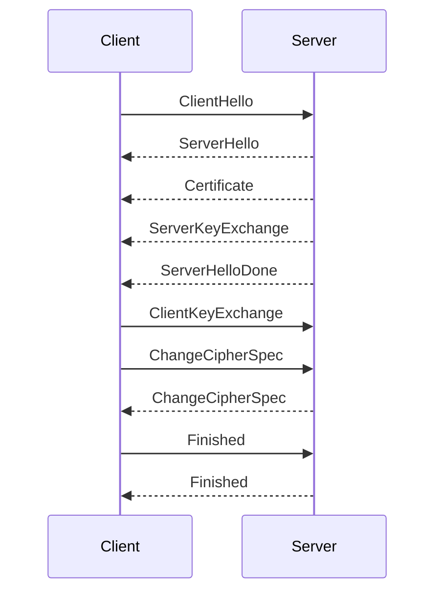

## Introduction to Transport Layer Security (TLS)

Transport Layer Security (TLS) is a cryptographic protocol designed to provide communication security over a computer network. It aims to prevent eavesdropping, tampering, and message forgery. TLS is widely used to secure web traffic, email, instant messaging, and other types of data transmission. Before diving into the specifics of TLS, it is essential to understand the broader context of API security, which lies at the intersection of three key security domains: network security, application security, and information security.

### Network Security

Network security focuses on protecting the integrity, confidentiality, and availability of data transmitted over a network. This includes securing the physical infrastructure, such as routers and switches, as well as the logical components, such as firewalls and intrusion detection systems. Network security measures are crucial for preventing unauthorized access, data breaches, and denial-of-service attacks.

### Application Security

Application security encompasses the practices and tools used to protect applications from threats. This includes identifying and fixing vulnerabilities in the code, implementing secure coding practices, and ensuring that applications are resilient against attacks such as SQL injection, cross-site scripting (XSS), and buffer overflows. Application security is critical because even the most robust network security measures can be bypassed if the applications themselves are vulnerable.

### Information Security

Information security is concerned with the protection of information throughout its entire lifecycle, from creation and storage to transmission and eventual destruction. This includes safeguarding sensitive data from unauthorized access, ensuring data integrity, and maintaining confidentiality. Information security measures are essential for protecting personal data, financial records, and intellectual property.

### Intersection of Security Domains

The intersection of these three security domains forms the basis of API security. APIs (Application Programming Interfaces) are the means by which different software applications communicate with each other. They are essential for enabling interoperability between various systems and services. However, APIs also introduce new security challenges, particularly in the context of transport layer security.

### Transport Layer Security (TLS)

TLS is the successor to SSL (Secure Sockets Layer) and is used to secure communications over the internet. It provides end-to-end encryption, ensuring that data transmitted between a client and a server remains confidential and cannot be intercepted by unauthorized parties. TLS also ensures data integrity, preventing tampering during transmission, and provides authentication, verifying the identity of the communicating parties.

#### TLS Handshake Process

The TLS handshake process is a critical component of establishing a secure connection. It involves several steps:

1. **Client Hello**: The client initiates the connection by sending a `ClientHello` message to the server. This message includes the supported TLS version, cipher suites, and compression methods.
2. **Server Hello**: The server responds with a `ServerHello` message, selecting the TLS version, cipher suite, and compression method to be used.
3. **Certificate Exchange**: The server sends its digital certificate to the client. This certificate contains the server's public key and is used to verify the server's identity.
4. **Server Key Exchange**: In some cases, the server may send additional parameters required for the key exchange process.
5. **Server Hello Done**: The server indicates that it has completed its part of the handshake.
6. **Client Key Exchange**: The client generates a pre-master secret and encrypts it using the server's public key. This encrypted pre-master secret is sent to the server.
7. **Change Cipher Spec**: Both the client and the server send a `ChangeCipherSpec` message to indicate that subsequent messages will be encrypted.
8. **Finished Messages**: Both the client and the server send `Finished` messages, which are encrypted using the newly established session keys. These messages confirm that the handshake process is complete and that both parties are ready to start exchanging encrypted data.



### Recent Real-World Examples

Several high-profile breaches have highlighted the importance of proper TLS implementation and management. One notable example is the Heartbleed vulnerability (CVE-2014-0160), which affected OpenSSL, a widely-used TLS library. This vulnerability allowed attackers to read sensitive information from the memory of servers and clients, including private keys, passwords, and other sensitive data. Another example is the POODLE attack (CVE-2014-3566), which exploited a flaw in SSLv3 to decrypt HTTPS traffic.

### Common Pitfalls in TLS Implementation

Despite the robustness of TLS, there are several common pitfalls that can compromise its effectiveness:

1. **Outdated TLS Versions**: Using outdated versions of TLS, such as TLS 1.0 or 1.1, can expose systems to known vulnerabilities. It is essential to upgrade to the latest version of TLS (currently TLS 1.3).
2. **Weak Cipher Suites**: Using weak or deprecated cipher suites can weaken the security of the connection. It is important to configure the server to support only strong cipher suites.
3. **Inadequate Certificate Management**: Poorly managed certificates can lead to issues such as expired certificates, misconfigured intermediate certificates, or weak key lengths. Proper certificate management is crucial for maintaining trust in the connection.
4. **Man-in-the-Middle Attacks**: Failure to properly validate the server's certificate can allow man-in-the-middle (MITM) attacks. It is essential to implement strict certificate validation policies.

### How to Prevent / Defend Against TLS Vulnerabilities

#### Detection

To detect potential TLS vulnerabilities, organizations should regularly perform security audits and penetration testing. Tools such as SSL Labs' SSL Test can be used to assess the security of TLS configurations. Additionally, monitoring tools can be employed to detect unusual patterns in network traffic that may indicate an ongoing attack.

#### Prevention

1. **Upgrade to Latest TLS Version**: Ensure that all systems are configured to use the latest version of TLS (currently TLS 1.3). Older versions should be disabled to prevent downgrade attacks.
2. **Configure Strong Cipher Suites**: Configure the server to support only strong cipher suites. Weak or deprecated cipher suites should be disabled.
3. **Implement Strict Certificate Validation**: Implement strict certificate validation policies to ensure that the server's certificate is properly validated. This includes checking the certificate chain, revocation status, and key length.
4. **Use HSTS (HTTP Strict Transport Security)**: Implement HSTS to enforce the use of HTTPS and prevent downgrade attacks. HSTS instructs browsers to only use HTTPS for future connections to the site.

#### Secure Coding Fixes

Here is an example of a vulnerable configuration and its secure counterpart:

**Vulnerable Configuration:**

```nginx
server {
    listen 443 ssl;
    ssl_certificate /etc/nginx/certs/example.crt;
    ssl_certificate_key /etc/nginx/certs/example.key;
    ssl_protocols TLSv1 TLSv1.1 TLSv1.2;
    ssl_ciphers HIGH:!aNULL:!MD5;
}
```

**Secure Configuration:**

```nginx
server {
    listen 443 ssl;
    ssl_certificate /etc/nginx/certs/example.crt;
    ssl_certificate_key /etc/nginx/certs/example.key;
    ssl_protocols TLSv1.2 TLSv1.3;
    ssl_ciphers ECDHE-ECDSA-AES256-GCM-SHA384:ECDHE-RSA-AES256-GCM-SHA384:ECDHE-ECDSA-CHACHA20-POLY1305:ECDHE-RSA-CHACHA20-POLY1305:ECDHE-ECDSA-AES128-GCM-SHA256:ECDHE-RSA-AES128-GCM-SHA256;
    ssl_prefer_server_ciphers on;
    ssl_session_timeout 10m;
    ssl_session_cache shared:SSL:10m;
    ssl_dhparam /etc/nginx/dhparams.pem;
    add_header Strict-Transport-Security "max-age=31536000; includeSubDomains";
}
```

### Conclusion

Transport Layer Security (TLS) is a critical component of API security, providing end-to-end encryption, data integrity, and authentication. Understanding the intersection of network security, application security, and information security is essential for implementing effective TLS measures. By avoiding common pitfalls and implementing robust detection and prevention strategies, organizations can significantly enhance the security of their API communications.

### Practice Labs

For hands-on practice with TLS and API security, consider the following well-known labs:

- **PortSwigger Web Security Academy**: Offers comprehensive modules on TLS and API security, including practical exercises and challenges.
- **OWASP Juice Shop**: A deliberately insecure web application that includes numerous security vulnerabilities, including those related to TLS and API security.
- **DVWA (Damn Vulnerable Web Application)**: A PHP/MySQL web application that is riddled with vulnerabilities, including those related to TLS and API security.

By engaging with these labs, you can gain practical experience in identifying and mitigating TLS-related vulnerabilities in real-world scenarios.

---
<!-- nav -->
[[API Security/20-Transport Layer Security Issues/02-Basic of Transport Layer Security/00-Overview|Overview]] | [[02-Basic Authorization Over HTTP|Basic Authorization Over HTTP]]
