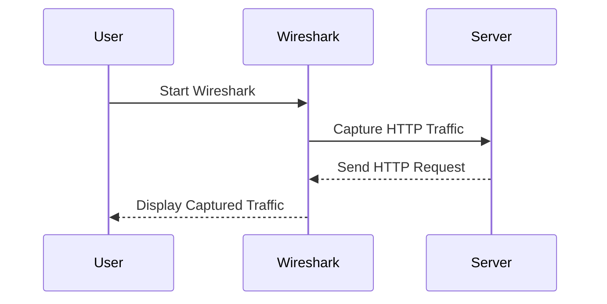

## Introduction to Transport Layer Security Issues

Transport Layer Security (TLS) is a cryptographic protocol designed to provide communications security over a computer network. It is widely used to secure web applications, ensuring that data transmitted between a client and a server remains confidential and unaltered. However, one of the most critical issues in TLS is the submission of passwords in clear text, which can lead to severe security vulnerabilities.

### What is Clear Text Password Submission?

Clear text password submission occurs when a user's password is sent over the network without being encrypted. This means that anyone who intercepts the transmission can easily read and misuse the password. This is particularly dangerous because passwords are often reused across multiple services, making the compromise of a single password potentially devastating.

### Why Does Clear Text Password Submission Matter?

Clear text password submission is a significant security risk because:

1. **Interception**: An attacker can intercept the password using tools like Wireshark, a network protocol analyzer, and gain unauthorized access to the user's account.
2. **Reusability**: Users often reuse passwords across different services, meaning that a compromised password could lead to further security breaches.
3. **Compliance**: Many regulatory frameworks, such as GDPR and HIPAA, require the protection of sensitive information, including passwords. Failure to comply can result in hefty fines and legal consequences.

### How Does Clear Text Password Submission Work?

When a user submits a password in clear text, the password is sent over the network in plain view. This can happen due to several reasons:

1. **HTTP Instead of HTTPS**: Using HTTP instead of HTTPS means that the communication is not encrypted.
2. **Misconfigured Servers**: Servers may be misconfigured to allow unencrypted connections.
3. **Client-Side Vulnerabilities**: Client-side applications might fail to enforce encryption, leading to clear text transmission.

### Real-World Examples

#### Recent Breaches Involving Clear Text Passwords

1. **Equifax Data Breach (2017)**: Equifax, a major credit reporting agency, suffered a massive data breach that exposed personal information, including passwords, of approximately 147 million people. While the breach itself was due to a vulnerability in Apache Struts, the lack of proper encryption allowed attackers to access sensitive data, including passwords.

2. **Yahoo Data Breach (2013-2014)**: Yahoo experienced a series of data breaches that exposed the personal information of billions of users. In one instance, hackers obtained hashed passwords, but the lack of proper hashing algorithms made it easier to crack the passwords.

### Identifying Clear Text Password Submission

To identify clear text password submission, you can use tools like Wireshark to monitor network traffic. Here’s an example of how to set up Wireshark to capture HTTP traffic:



#### Setting Up Wireshark

1. **Start Wireshark**: Open Wireshark and select the appropriate network interface (e.g., Wi-Fi).
2. **Filter Traffic**: Apply a filter to capture only HTTP traffic. You can do this by entering `http` in the filter box.
3. **Capture Traffic**: Start capturing traffic and perform actions that involve submitting passwords (e.g., logging in).

#### Example HTTP Request and Response

Here is an example of an HTTP request and response where a password is submitted in clear text:

```http
POST /login HTTP/1.1
Host: example.com
Content-Type: application/x-www-form-urlencoded
Content-Length: 29

username=admin&password=secret123
```

```http
HTTP/1.1 200 OK
Date: Mon, 23 Jan 2023 12:00:00 GMT
Content-Type: text/html; charset=UTF-8
Content-Length: 12

Login successful!
```

In this example, the password `secret123` is sent in clear text, making it vulnerable to interception.

### How to Prevent / Defend Against Clear Text Password Submission

#### Detection

1. **Network Monitoring Tools**: Use tools like Wireshark to monitor network traffic and identify unencrypted password submissions.
2. **Security Scanners**: Use automated security scanners like Burp Suite or ZAP to scan for insecure password submission practices.

#### Prevention

1. **Use HTTPS**: Ensure that all communication between the client and server is encrypted using HTTPS. This can be achieved by configuring the server to only accept HTTPS connections.
2. **Enforce Strong Authentication**: Implement strong authentication mechanisms, such as multi-factor authentication (MFA), to reduce the risk of password-based attacks.
3. **Secure Coding Practices**: Follow secure coding practices to ensure that passwords are never stored or transmitted in clear text.

#### Secure Code Fix

Here is an example of how to fix a vulnerable login form to ensure that passwords are not submitted in clear text:

**Vulnerable Code**

```html
<form action="/login" method="post">
    <input type="text" name="username" placeholder="Username">
    <input type="text" name="password" placeholder="Password">
    <button type="submit">Login</button>
</form>
```

**Fixed Code**

```html
<form action="/login" method="post">
    <input type="text" name="username" placeholder="Username">
    <input type="password" name="password" placeholder="Password">
    <button type="submit">Login</button>
</form>
```

In the fixed code, the `type` attribute of the password input field is changed from `text` to `password`, ensuring that the password is masked and not visible to others.

#### Configuration Hardening

1. **Server Configuration**: Configure the server to only accept HTTPS connections. This can be done by disabling HTTP and enabling HTTPS in the server configuration files.
2. **Certificate Management**: Ensure that SSL/TLS certificates are properly managed and renewed to avoid certificate expiration issues.

### Practical Labs

For hands-on practice with API security, consider the following labs:

- **PortSwigger Web Security Academy**: Offers a comprehensive set of labs covering various aspects of web security, including API security.
- **OWASP Juice Shop**: A deliberately insecure web application for security training purposes, which includes API security challenges.
- **DVWA (Damn Vulnerable Web Application)**: Another popular web application for security training, which includes API security exercises.

By following these steps and practicing with real-world examples, you can ensure that your applications are secure against clear text password submission and other transport layer security issues.

### Conclusion

Clear text password submission is a serious security issue that can lead to significant data breaches and compliance violations. By understanding the risks, identifying vulnerabilities, and implementing robust security measures, you can protect your applications and users from these threats. Always ensure that passwords are transmitted securely and follow best practices for secure coding and configuration management.

---
<!-- nav -->
[[API Security/20-Transport Layer Security Issues/03-Clear Text Password Submission/00-Overview|Overview]] | [[02-Transport Layer Security Issues Clear Text Password Submission|Transport Layer Security Issues Clear Text Password Submission]]
