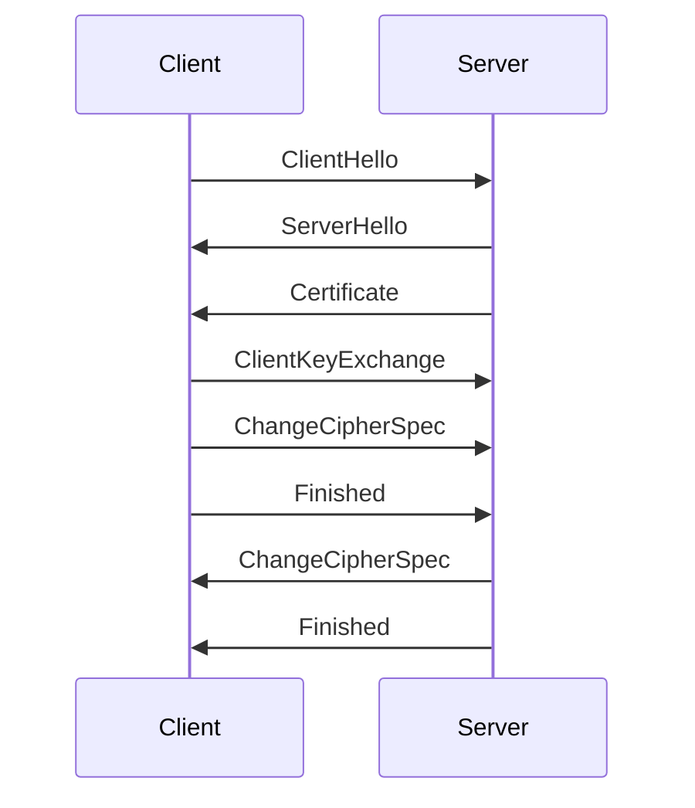
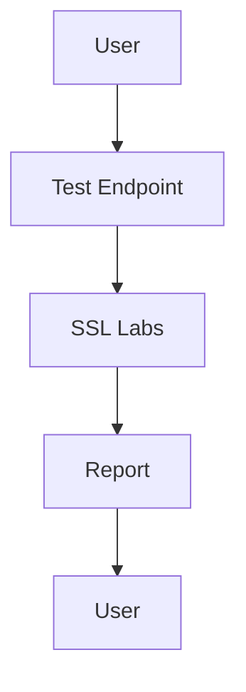

## Introduction to Transport Layer Security (TLS)

Transport Layer Security (TLS) is a cryptographic protocol designed to provide communications security over a computer network. It is widely used to secure web applications, APIs, and other network services. TLS ensures that data transmitted between a client and a server remains confidential and unaltered during transmission. This chapter will delve into the various issues related to SSL/TLS in the context of API security, providing a comprehensive understanding of the concepts, their implications, and how to mitigate potential vulnerabilities.

### Background Theory

#### What is TLS?

TLS is the successor to Secure Sockets Layer (SSL), which was widely used until it was found to have several security weaknesses. TLS operates at the transport layer of the OSI model and provides end-to-end encryption, authentication, and integrity protection. The protocol uses a combination of symmetric and asymmetric cryptography to establish a secure connection.

#### How TLS Works

1. **Handshake Process**: 
    - **Client Hello**: The client initiates the connection by sending a `ClientHello` message to the server. This message includes the supported TLS version, cipher suites, and compression methods.
    - **Server Hello**: The server responds with a `ServerHello` message, selecting the TLS version, cipher suite, and compression method.
    - **Certificate Exchange**: The server sends its certificate to the client, which contains the server's public key.
    - **Key Exchange**: The client generates a pre-master secret, encrypts it using the server's public key, and sends it to the server. Both parties then derive the master secret and session keys.
    - **Finished Messages**: Both the client and server send `Finished` messages to confirm that the handshake process is complete.

2. **Data Encryption**:
    - Once the handshake is completed, the client and server use the derived session keys to encrypt and decrypt data sent over the connection.

### Common SSL/TLS Issues in API Security

#### Insecure Cipher Suites

One of the most critical issues in SSL/TLS configurations is the use of insecure cipher suites. Cipher suites determine the encryption algorithms used for the connection. Weak cipher suites can be easily broken, compromising the confidentiality and integrity of the data.

##### Example of an Insecure Cipher Suite

```plaintext
TLS_RSA_WITH_RC4_128_SHA
```

This cipher suite uses RC4, which has known vulnerabilities and should be avoided.

##### Secure Alternative

```plaintext
TLS_ECDHE_RSA_WITH_AES_256_GCM_SHA384
```

This cipher suite uses Elliptic Curve Diffie-Hellman (ECDH) for key exchange, AES-256-GCM for encryption, and SHA-384 for hashing, providing strong security.

#### Outdated TLS Versions

Using outdated versions of TLS can expose your API to known vulnerabilities. For instance, TLS 1.0 and 1.1 have been deprecated due to various security issues.

##### Example of Outdated TLS Version

```plaintext
TLS 1.0
```

##### Secure Alternative

```plaintext
TLS 1.2 or TLS 1.3
```

These versions have stronger security features and are recommended for use.

#### Certificate Misconfiguration

Misconfigured certificates can lead to man-in-the-middle (MITM) attacks. This includes issues such as expired certificates, self-signed certificates, and certificates issued to incorrect domains.

##### Example of a Misconfigured Certificate

```plaintext
Expired Certificate: CN=example.com, Not After=2022-12-31
```

##### Secure Configuration

Ensure that certificates are valid and issued to the correct domain. Use trusted Certificate Authorities (CAs) to issue certificates.

#### Lack of Forward Secrecy

Forward secrecy ensures that even if a long-term key is compromised, past session keys remain secure. Without forward secrecy, an attacker who gains access to the long-term key can decrypt all past sessions.

##### Example of a Cipher Suite Without Forward Secrecy

```plaintext
TLS_RSA_WITH_AES_256_CBC_SHA
```

##### Secure Alternative

```plaintext
TLS_ECDHE_RSA_WITH_AES_256_GCM_SHA384
```

This cipher suite uses ECDH for key exchange, ensuring forward secrecy.

### Real-World Examples and Breaches

#### Heartbleed Bug (CVE-2014-0160)

The Heartbleed bug was a serious vulnerability in the OpenSSL implementation of the TLS heartbeat extension. This vulnerability allowed attackers to read sensitive information from the memory of servers and clients, including private keys, passwords, and other sensitive data.

##### Impact

- **Exploitation**: Attackers could extract private keys from servers, allowing them to decrypt intercepted traffic and perform MITM attacks.
- **Mitigation**: Updating to a patched version of OpenSSL and reissuing certificates were necessary steps to mitigate the vulnerability.

#### POODLE Attack (CVE-2014-3566)

The POODLE attack exploited a vulnerability in SSL 3.0, allowing attackers to decrypt HTTPS traffic. This attack targeted the SSLv3 fallback mechanism, which could be forced to downgrade connections to SSL 3.0.

##### Impact

- **Exploitation**: Attackers could decrypt HTTPS traffic, leading to exposure of sensitive data.
- **Mitigation**: Disabling SSL 3.0 and ensuring that connections use TLS 1.0 or higher were necessary steps to mitigate the vulnerability.

### Detection and Prevention

#### How to Detect SSL/TLS Issues

1. **SSL Labs Test**: Use tools like SSL Labs to test your API endpoints for SSL/TLS configuration issues. These tools provide detailed reports on cipher suites, TLS versions, and certificate configurations.

    ```plaintext
    https://www.ssllabs.com/ssltest/
    ```

2. **Penetration Testing**: Conduct regular penetration testing to identify and remediate SSL/TLS vulnerabilities.

#### How to Prevent SSL/TLS Issues

1. **Update TLS Versions**: Ensure that your API supports only the latest and most secure versions of TLS (TLS 1.2 or TLS 1.3).

    ```plaintext
    # Example Nginx Configuration
    ssl_protocols TLSv1.2 TLSv1.3;
    ```

2. **Configure Strong Cipher Suites**: Use strong cipher suites that provide forward secrecy and strong encryption.

    ```plaintext
    # Example Nginx Configuration
    ssl_ciphers ECDHE-RSA-AES256-GCM-SHA384:ECDHE-RSA-AES128-GCM-SHA256:DHE-RSA-AES256-GCM-SHA384:DHE-RSA-AES128-GCM-SHA256:ECDHE-RSA-AES256-SHA384:ECDHE-RSA-AES128-SHA256:DHE-RSA-AES256-SHA256:DHE-RSA-AES128-SHA256;
    ```

3. **Use Trusted Certificates**: Obtain certificates from trusted CAs and ensure that they are valid and issued to the correct domain.

    ```plaintext
    # Example Nginx Configuration
    ssl_certificate /etc/nginx/ssl/example.crt;
    ssl_certificate_key /etc/nginx/ssl/example.key;
    ```

4. **Enable HSTS**: HTTP Strict Transport Security (HSTS) ensures that browsers only communicate with your API over HTTPS.

    ```plaintext
    # Example Nginx Configuration
    add_header Strict-Transport-Security "max-age=31536000; includeSubDomains";
    ```

### Mermaid Diagrams

#### TLS Handshake Process



#### SSL Labs Test Flow



### Hands-On Labs

#### PortSwigger Web Security Academy

PortSwigger Web Security Academy offers a series of labs that cover various aspects of SSL/TLS security. These labs provide practical experience in identifying and mitigating SSL/TLS vulnerabilities.

- **Lab URL**: https://portswigger.net/web-security

#### OWASP Juice Shop

OWASP Juice Shop is a deliberately insecure web application that can be used to practice identifying and exploiting SSL/TLS vulnerabilities.

- **Lab URL**: https://owasp.org/www-project-juice-shop/

### Conclusion

Understanding and addressing SSL/TLS issues is crucial for securing APIs and other network services. By following best practices, using strong cipher suites, updating TLS versions, and configuring certificates correctly, you can significantly enhance the security of your API. Regular testing and monitoring are essential to detect and remediate any potential vulnerabilities.

---
<!-- nav -->
[[API Security/20-Transport Layer Security Issues/05-SSLTLS Issues/00-Overview|Overview]] | [[API Security/20-Transport Layer Security Issues/05-SSLTLS Issues/02-Practice Questions & Answers|Practice Questions & Answers]]
