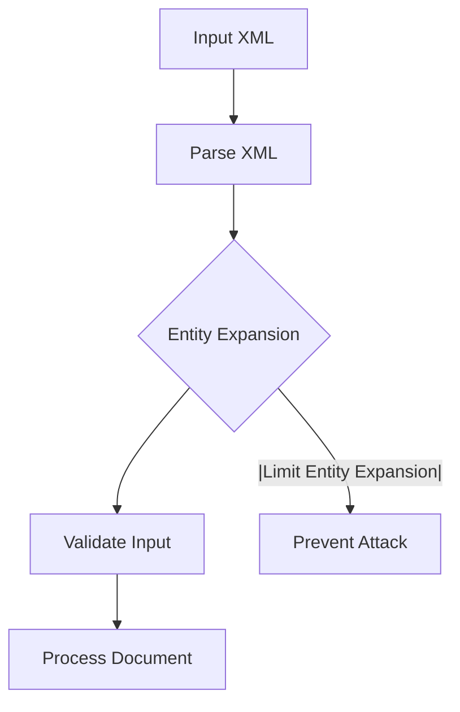

## Billion Laugh Attack

### Introduction

The Billion Laugh Attack, also known as the XML Bomb, is a type of denial-of-service (DoS) attack that exploits the recursive processing capabilities of XML parsers. This attack can cause a system to consume excessive memory and CPU resources, leading to a denial of service. The name "Billion Laugh" comes from the structure of the attack, which uses a large number of nested entities to create a massive amount of data from a relatively small input.

### Background Theory

XML (Extensible Markup Language) is a markup language that defines a set of rules for encoding documents in a format that is both human-readable and machine-readable. XML parsers are used to read and process these documents. One feature of XML is the ability to define entities, which are placeholders that can be replaced with actual content during parsing.

An entity in XML is defined using the `<!ENTITY>` declaration. For example:

```xml
<!DOCTYPE root [
    <!ENTITY ent1 "AAAAAAAAAAAAAAA">
]>
```

In this example, `ent1` is an entity that contains the string "AAAAAAAAAAAAAAA". When the parser encounters a reference to `ent1`, such as `&ent1;`, it replaces it with the string "AAAAAAAAAAAAAAA".

### Recursive Entities

The Billion Laugh Attack exploits the recursive nature of entities. By defining entities that reference other entities, a small input can expand into a very large output. Here is a simple example:

```xml
<!DOCTYPE root [
    <!ENTITY ent1 "AAAAAAAAAAAAAAA">
    <!ENTITY ent2 "&ent1;&ent1;">
    <!ENTITY ent3 "&ent2;&ent2;">
]>
```

In this case, `ent1` is a string of 15 characters. `ent2` references `ent1` twice, resulting in a string of 30 characters. `ent3` references `ent2` twice, resulting in a string of 60 characters. This recursive expansion can continue to create extremely large outputs from a small input.

### Real-World Example

A notable real-world example of the Billion Laugh Attack occurred in 2013 with the Apache Xerces library. The vulnerability was identified in CVE-2013-1330. An attacker could send a specially crafted XML document to a server using the Xerces library, causing the server to consume excessive memory and CPU resources, leading to a denial of service.

Here is a simplified example of an XML bomb:

```xml
<!DOCTYPE lolz [
    <!ENTITY lol "lol">
    <!ENTITY lol1 "&lol;&lol;&lol;&lol;&lol;&lol;&lol;&lol;&lol;&lol;">
    <!ENTITY lol2 "&lol1;&lol1;&lol1;&lol1;&lol1;&lol1;&lol1;&lol1;&lol1;&lol1;">
    <!ENTITY lol3 "&lol2;&lol2;&lol2;&lol2;&lol2;&lol2;&lol2;&lol2;&lol2;&lol2;">
    <!ENTITY lol4 "&lol3;&lol3;&lol3;&lol3;&lol3;&lol3;&lol3;&lol3;&lol3;&lol3;">
    <!ENTITY lol5 "&lol4;&lol4;&lol4;&lol4;&lol4;&lol4;&lol4;&lol4;&lol4;&lol4;">
    <!ENTITY lol6 "&lol5;&lol5;&lol5;&lol5;&lol5;&lol5;&lol5;&lol5;&lol5;&lol5;">
    <!ENTITY lol7 "&lol6;&lol6;&lol6;&lol6;&lol6;&lol6;&lol6;&lol6;&lol6;&lol6;">
    <!ENTITY lol8 "&lol7;&lol7;&lol7;&lol7;&lol7;&lol7;&lol7;&lol7;&lol7;&lol7;">
    <!ENTITY lol9 "&lol8;&lol8;&lol8;&lol8;&lol8;&lol8;&lol8;&lol8;&lol8;&lol8;">
]>
<foo>&lol9;</foo>
```

This XML document, when parsed, would expand to a string of approximately 1 billion characters, consuming a significant amount of memory.

### How the Attack Works

When an XML parser encounters an entity reference, it recursively expands the entity until it reaches the base string. In the case of the Billion Laugh Attack, the recursive expansion can lead to an exponential increase in the size of the output. This can cause the parser to consume excessive memory and CPU resources, leading to a denial of service.

### Detection and Prevention

#### Detection

To detect a Billion Laugh Attack, you can monitor the memory and CPU usage of your systems. If you notice a sudden spike in resource consumption, especially when processing XML documents, it may indicate an attack. Additionally, you can use tools like Wireshark to analyze network traffic and look for suspicious XML documents.

#### Prevention

To prevent a Billion Laugh Attack, you should configure your XML parsers to limit the depth of entity expansion. Most modern XML parsers provide options to control this behavior. For example, in Java, you can use the `javax.xml.parsers.DocumentBuilderFactory` class to set limits on entity expansion:

```java
DocumentBuilderFactory dbFactory = DocumentBuilderFactory.newInstance();
dbFactory.setFeature("http://apache.org/xml/features/disallow-doctype-decl", true);
dbFactory.setFeature("http://apache.org/xml/features/nonvalidating/load-external-dtd", false);
dbFactory.setXIncludeAware(false);
dbFactory.setExpandEntityReferences(false);
```

In Python, you can use the `defusedxml` library, which provides safer versions of standard XML libraries:

```python
from defusedxml.ElementTree import parse

tree = parse('input.xml')
```

#### Secure Coding Practices

When processing XML documents, you should validate the input to ensure it does not contain malicious content. You can use XML Schema Definition (XSD) to validate the structure of the XML document. Additionally, you should avoid parsing untrusted XML documents whenever possible.

### Complete Example

Let's walk through a complete example of how to defend against a Billion Laugh Attack using Python and the `defusedxml` library.

#### Vulnerable Code

Here is an example of vulnerable code that parses an XML document without any validation:

```python
import xml.etree.ElementTree as ET

# Load the XML document
tree = ET.parse('input.xml')

# Process the document
root = tree.getroot()
for child in root:
    print(child.tag, child.text)
```

#### Secure Code

Here is the same code, but using the `defusedxml` library to prevent entity expansion attacks:

```python
from defusedxml.ElementTree import parse

# Load the XML document
tree = parse('input.xml')

# Process the document
root = tree.getroot()
for child in root:
    print(child.tag, child.text)
```

### Mermaid Diagrams

#### XML Parsing Flow



### Conclusion

The Billion Laugh Attack is a serious threat to systems that process XML documents. By understanding the underlying principles and implementing proper defenses, you can protect your systems from this type of attack. Always validate and sanitize input, and use secure coding practices to prevent attacks.

### Practice Labs

For hands-on practice with API security and the Billion Laugh Attack, consider the following labs:

- **PortSwigger Web Security Academy**: Offers a module on XML External Entity (XXE) attacks, which includes the Billion Laugh Attack.
- **OWASP Juice Shop**: Provides a vulnerable web application that you can use to practice identifying and mitigating various security vulnerabilities, including XML-based attacks.

By completing these labs, you can gain practical experience in detecting and preventing the Billion Laugh Attack.

---
<!-- nav -->
[[01-Introduction to Billion Laugh Attack|Introduction to Billion Laugh Attack]] | [[API Security/21-Billion Laugh Attack/01-Billion Laugh Attack Demonstration/00-Overview|Overview]] | [[API Security/21-Billion Laugh Attack/01-Billion Laugh Attack Demonstration/03-Practice Questions & Answers|Practice Questions & Answers]]
