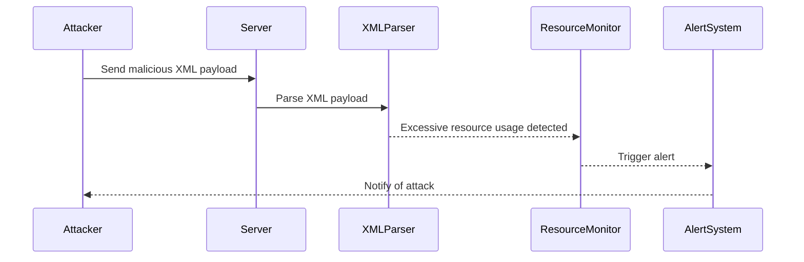
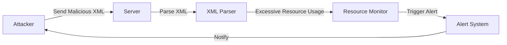

## Billion Laugh Attack: An In-Depth Analysis

### Introduction to Billion Laugh Attack

The Billion Laugh Attack, also known as the Quine-Bomb or XML Bomb, is a specific type of Denial of Service (DoS) attack that exploits the way XML parsers handle entity expansions. This attack can cause significant resource exhaustion on the server, leading to a denial of service. Understanding the mechanics of this attack is crucial for developers and security professionals to ensure the robustness of their systems.

### Background Theory

#### What is an XML Entity?

An XML entity is a named reference to a piece of data that can be reused throughout an XML document. Entities can be defined within the document itself or in external documents. The general syntax for defining an entity is:

```xml
<!ENTITY name "value">
```

For example:

```xml
<!DOCTYPE root [
    <!ENTITY test "example">
]>
<root>
    <element>&test;</element>
</root>
```

In this example, `&test;` will be replaced with `"example"` during parsing.

#### XML Entity Expansion

XML parsers expand entities during the parsing process. This means that every occurrence of an entity reference (e.g., `&test;`) is replaced with the value of the entity. However, this expansion can be recursive, meaning that an entity can reference another entity, which can reference yet another entity, and so on.

### Mechanism of the Billion Laugh Attack

The Billion Laugh Attack exploits the recursive nature of XML entity expansion. By creating a large number of nested entities, the attacker can force the XML parser to perform an enormous amount of work, leading to resource exhaustion.

#### Example of a Billion Laugh Attack

Consider the following XML snippet:

```xml
<!DOCTYPE lolz [
    <!ENTITY a "AAAAAAAAAAAAAAAAAAAAAAAAAAAAAAAAAAAAAAAAAAAAAAAAAAAAAA">
    <!ENTITY b "&a;&a;&a;&a;&a;&a;&a;&a;&a;&a;">
    <!ENTITY c "&b;&b;&b;&b;&b;&b;&b;&b;&b;&b;">
    <!ENTITY d "&c;&c;&c;&c;&c;&c;&c;&c;&c;&c;">
    <!ENTITY e "&d;&d;&d;&d;&d;&d;&d;&d;&d;&d;">
    <!ENTITY f "&e;&e;&e;&e;&e;&e;&e;&e;&e;&e;">
]>
<lolz>&f;</lolz>
```

In this example:
- `&a;` expands to a string of 40 'A's.
- `&b;` expands to 10 instances of `&a;`, resulting in a string of 400 'A's.
- `&c;` expands to 10 instances of `&b;`, resulting in a string of 4000 'A's.
- `&d;` expands to 10 instances of `&c;`, resulting in a string of 40,000 'A's.
- `&e;` expands to 10 instances of `&d;`, resulting in a string of 400,000 'A's.
- `&f;` expands to 10 instances of `&e;`, resulting in a string of 4,000,000 'A's.

When the XML parser tries to expand `&f;`, it generates a string of 4 million characters, which can consume a significant amount of memory and CPU resources.

### Real-World Examples and CVEs

#### CVE-2018-11317: Apache Struts 2

One notable real-world example of a Billion Laugh Attack is CVE-2018-11317, which affected Apache Struts 2. This vulnerability allowed attackers to execute arbitrary commands on the server by exploiting the XML parser used by Struts 2. The attack vector involved sending a specially crafted XML payload that triggered excessive entity expansion, leading to resource exhaustion and potential remote code execution.

#### CVE-2019-10100: Java XML Parsing Libraries

Another example is CVE-2019-10100, which affected various Java XML parsing libraries such as Xerces and Woodstox. These libraries were vulnerable to Billion Laugh Attacks due to improper handling of entity expansion limits. Attackers could send malicious XML payloads that caused the parser to consume excessive resources, leading to a denial of service.

### How to Prevent / Defend Against Billion Laugh Attacks

#### Detection

To detect Billion Laugh Attacks, organizations should monitor their systems for unusual resource consumption patterns. This includes monitoring CPU usage, memory usage, and disk space. Tools like Nagios, Prometheus, and Grafana can be used to set up alerts for abnormal resource usage.

#### Prevention

1. **Limit Entity Expansion**: Configure XML parsers to enforce strict limits on entity expansion. Most modern XML parsers allow setting a maximum entity expansion limit. For example, in Java, you can configure the `DocumentBuilderFactory` as follows:

    ```java
    DocumentBuilderFactory dbFactory = DocumentBuilderFactory.newInstance();
    dbFactory.setFeature("http://apache.org/xml/features/disallow-doctype-decl", true);
    dbFactory.setFeature("http://xml.org/sax/features/external-general-entities", false);
    dbFactory.setFeature("http://xml.org/sax/features/external-parameter-entities", false);
    dbFactory.setFeature("http://apache.org/xml/features/nonvalidating/load-external-dtd", false);
    dbFactory.setFeature("http://apache.org/xml/features/security/disable-doctype-decl", true);
    ```

2. **Disable External Entities**: Disable the processing of external entities to prevent attacks that rely on external DTDs. This can be done by setting the appropriate features in the XML parser.

3. **Use Secure XML Libraries**: Ensure that you are using secure XML libraries that have been patched against known vulnerabilities. Regularly update these libraries to incorporate the latest security patches.

4. **Input Validation**: Validate all input data to ensure that it does not contain malicious XML entities. Use regular expressions or dedicated validation libraries to check for suspicious patterns.

#### Secure Coding Practices

Here is an example of how to securely parse XML data in Java:

**Vulnerable Code:**

```java
DocumentBuilderFactory dbFactory = DocumentBuilderFactory.newInstance();
DocumentBuilder dBuilder = dbFactory.newDocumentBuilder();
Document doc = dBuilder.parse(new InputSource(new StringReader(xmlString)));
```

**Secure Code:**

```java
DocumentBuilderFactory dbFactory = DocumentBuilderFactory.newInstance();
dbFactory.setFeature("http://apache.org/xml/features/disallow-doctype-decl", true);
dbFactory.setFeature("http://xml.org/sax/features/external-general-entities", false);
dbFactory.setFeature("http://xml.org/sax/features/external-parameter-entities", false);
dbFactory.setFeature("http://apache.org/xml/features/nonvalidating/load-external-dtd", false);
dbFactory.setFeature("http://apache.org/xml/features/security/disable-doctype-decl", true);

DocumentBuilder dBuilder = dbFactory.newDocumentBuilder();
Document doc = dBuilder.parse(new InputSource(new StringReader(xmlString)));
```

### Complete Example: HTTP Request and Response

#### Vulnerable Scenario

**HTTP Request:**

```http
POST /api/data HTTP/1.1
Host: example.com
Content-Type: application/xml
Content-Length: 1024

<!DOCTYPE lolz [
    <!ENTITY a "AAAAAAAAAAAAAAAAAAAAAAAAAAAAAAAAAAAAAAAAAAAAAAAAAAAAAA">
    <!ENTITY b "&a;&a;&a;&a;&a;&a;&a;&a;&a;&a;">
    <!ENTITY c "&b;&b;&b;&b;&b;&b;&b;&b;&b;&b;">
    <!ENTITY d "&c;&c;&c;&c;&c;&c;&c;&c;&c;&c;">
    <!ENTITY e "&d;&d;&d;&d;&d;&d;&d;&d;&d;&d;">
    <!ENTITY f "&e;&e;&e;&e;&e;&e;&e;&e;&e;&e;">
]>
<lolz>&f;</lolz>
```

**HTTP Response:**

```http
HTTP/1.1 500 Internal Server Error
Content-Type: text/html
Content-Length: 123

<!DOCTYPE html>
<html>
<head>
<title>500 Internal Server Error</title>
</head>
<body>
<h1>Internal Server Error</h1>
<p>The server encountered an unexpected condition that prevented it from fulfilling the request.</p>
</body>
</html>
```

#### Secure Scenario

**HTTP Request:**

```http
POST /api/data HTTP/1.1
Host: example.com
Content-Type: application/xml
Content-Length: 1024

<!DOCTYPE lolz [
    <!ENTITY a "AAAAAAAAAAAAAAAAAAAAAAAAAAAAAAAAAAAAAAAAAAAAAAAAAAAAAA">
    <!ENTITY b "&a;&a;&a;&a;&a;&a;&a;&a;&a;&a;">
    <!ENTITY c "&b;&b;&b;&b;&b;&b;&b;&b;&b;&b;">
    <!ENTITY d "&c;&c;&c;&c;&c;&c;&c;&c;&c;&c;">
    <!ENTITY e "&d;&d;&d;&d;&d;&d;&d;&d;&d;&d;">
    <!ENTITY f "&e;&e;&e;&e;&e;&e;&e;&e;&e;&e;">
]>
<lolz>&f;</lolz>
```

**HTTP Response:**

```http
HTTP/1.1 400 Bad Request
Content-Type: text/html
Content-Length: 123

<!DOCTYPE html>
<html>
<head>
<title>400 Bad Request</title>
</head>
<body>
<h1>Bad Request</h1>
<p>Your request was invalid and could not be processed.</p>
</body>
</html>
```

### Mermaid Diagrams

#### Attack Chain Diagram



#### System Architecture Diagram



### Hands-On Labs

For hands-on practice with Billion Laugh Attacks, consider the following labs:

- **PortSwigger Web Security Academy**: Offers a module on XML External Entity (XXE) attacks, including Billion Laugh Attacks.
- **OWASP Juice Shop**: Contains several vulnerabilities related to XML parsing, including Billion Laugh Attacks.
- **DVWA (Damn Vulnerable Web Application)**: Provides a vulnerable application that can be exploited using various XML-based attacks.

These labs provide a practical environment to understand and mitigate the risks associated with Billion Laugh Attacks.

### Conclusion

Understanding and defending against Billion Laugh Attacks is essential for maintaining the security and reliability of XML-based systems. By implementing proper input validation, configuring XML parsers correctly, and regularly updating security measures, organizations can significantly reduce the risk of such attacks.

---
<!-- nav -->
[[API Security/21-Billion Laugh Attack/02-Billion Laugh Attack Refer XXE Expansion/00-Overview|Overview]] | [[02-Billion Laugh Attack Understanding and Mitigating XML External Entity (XXE) Expansion|Billion Laugh Attack Understanding and Mitigating XML External Entity (XXE) Expansion]]
