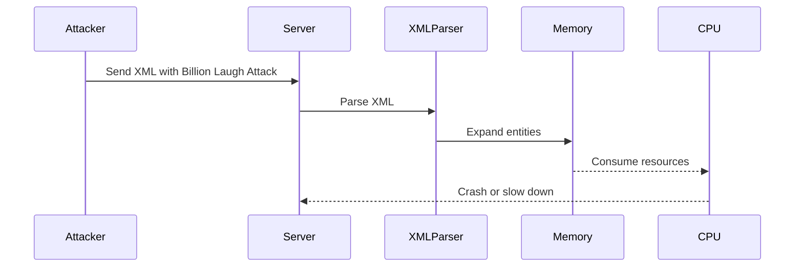
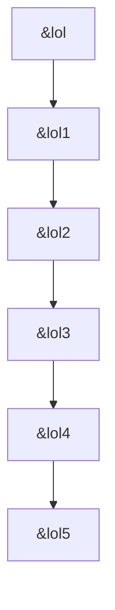

## Billion Laugh Attack: Understanding and Mitigating XML External Entity (XXE) Expansion

### Introduction to Billion Laugh Attack

The Billion Laugh Attack, also known as the Quine Bomb, is a type of XML External Entity (XXE) attack that exploits the recursive expansion of entities within an XML document. This attack can lead to significant resource consumption, potentially causing a denial-of-service (DoS) condition on the targeted server. The name "Billion Laugh" comes from the fact that the attack can generate an extremely large amount of data from a relatively small input, often resulting in a server consuming vast amounts of memory and CPU resources.

### Background Theory

To understand the Billion Laugh Attack, it is essential to first grasp the basics of XML and XML External Entities (XXE).

#### XML Basics

XML (Extensible Markup Language) is a markup language used to encode documents in a format that is both human-readable and machine-readable. XML documents consist of elements, attributes, and text content. Elements are defined using tags, and attributes provide additional information about the element.

For example, consider the following simple XML document:

```xml
<?xml version="1.0"?>
<root>
    <person id="1">
        <name>John Doe</name>
        <age>30</age>
    </person>
</root>
```

In this example, `<root>` is the root element, and `<person>` is a child element with an attribute `id`. The `<name>` and `<age>` elements contain text content.

#### XML External Entities (XXE)

XML External Entities (XXE) allow an XML parser to reference external resources, such as files or URLs, within an XML document. This feature is useful for including data from external sources, but it can also be exploited by attackers to perform various types of attacks, including the Billion Laugh Attack.

An XML document can define external entities using the `<!ENTITY>` declaration. For example:

```xml
<?xml version="1.0"?>
<!DOCTYPE root [
    <!ENTITY xxe SYSTEM "file:///etc/passwd">
]>
<root>
    <data>&xxe;</data>
</root>
```

In this example, the `<!ENTITY xxe SYSTEM "file:///etc/passwd">` declaration defines an external entity named `xxe` that references the `/etc/passwd` file. When the XML parser processes this document, it will replace the `&xxe;` entity with the contents of the `/etc/passwd` file.

### The Billion Laugh Attack Mechanism

The Billion Laugh Attack exploits the recursive expansion of entities within an XML document. By defining entities that reference other entities, an attacker can create a chain of expansions that results in an exponentially large output.

Consider the following XML document:

```xml
<?xml version="1.0"?>
<!DOCTYPE lolz [
    <!ENTITY lol "lol">
    <!ENTITY lol1 "&lol;&lol;&lol;&lol;&lol;&lol;&lol;&lol;&lol;&lol;">
    <!ENTITY lol2 "&lol1;&lol1;&lol1;&lol1;&lol1;&lol1;&lol1;&lol1;&lol1;&lol1;">
    <!ENTITY lol3 "&lol2;&lol2;&lol2;&lol2;&lol2;&lol2;&lol2;&lol2;&lol2;&lol2;">
    <!ENTITY lol4 "&lol3;&lol3;&lol3;&lol3;&lol3;&lol3;&lol3;&lol3;&lol3;&lol3;">
    <!ENTITY lol5 "&lol4;&lol4;&lol4;&lol4;&lol4;&lol4;&lol4;&lol4;&lol4;&lol4;">
]>
<root>
    &lol5;
</root>
```

In this example, the `<!ENTITY>` declarations define a series of entities (`lol`, `lol1`, `lol2`, etc.) that reference each other recursively. Each entity expands to a larger string, resulting in an exponential increase in the size of the final output.

- `&lol;` expands to `"lol"`.
- `&lol1;` expands to `"lol lol lol lol lol lol lol lol lol lol"`.
- `&lol2;` expands to a string containing 100 "lol"s.
- `&lol3;` expands to a string containing 1000 "lol"s.
- `&lol4;` expands to a string containing 10,000 "lol"s.
- `&lol5;` expands to a string containing 100,000 "lol"s.

When the XML parser processes this document, it will expand the `&lol5;` entity to a string containing 100,000 "lol"s, resulting in a significant amount of memory usage.

### Real-World Examples and Recent CVEs

The Billion Laugh Attack has been observed in several real-world scenarios and has been documented in various Common Vulnerabilities and Exposures (CVE) entries.

#### CVE-2017-16946

In 2017, a vulnerability was discovered in the Apache Struts framework, which allowed attackers to exploit the Billion Laugh Attack to cause a denial-of-service condition. The vulnerability was assigned the CVE identifier CVE-2017-16946.

#### CVE-2018-11776

Another notable example is CVE-2018-11776, which affected the Apache Tomcat server. This vulnerability allowed attackers to exploit the Billion Laugh Attack to cause a denial-of-service condition by consuming excessive memory and CPU resources.

### Complete Code Example

Let's walk through a complete example of the Billion Laugh Attack using a Python script that simulates the attack.

#### Vulnerable Code

Consider the following Python code that parses an XML document using the `defusedxml` library, which is designed to mitigate XXE vulnerabilities:

```python
import defusedxml.ElementTree as ET

xml_data = """
<?xml version="1.0"?>
<!DOCTYPE lolz [
    <!ENTITY lol "lol">
    <!ENTITY lol1 "&lol;&lol;&lol;&lol;&lol;&lol;&lol;&lol;&lol;&lol;">
    <!ENTITY lol2 "&lol1;&lol1;&lol1;&lol1;&lol1;&lol1;&lol1;&lol1;&lol1;&lol1;">
    <!ENTITY lol3 "&lol2;&lol2;&lol2;&lol2;&lol2;&lol2;&lol2;&lol2;&lol2;&lol2;">
    <!ENTITY lol4 "&lol3;&lol3;&lol3;&lol3;&lol3;&lol3;&lol3;&lol3;&lol3;&lol3;">
    <!ENTITY lol5 "&lol4;&lol4;&lol4;&lol4;&lol4;&lol4;&lol4;&lol4;&lol4;&lol4;">
]>
<root>
    &lol5;
</root>
"""

try:
    tree = ET.fromstring(xml_data)
    print(tree.find('root').text)
except Exception as e:
    print(f"Error: {e}")
```

#### Explanation

- The `xml_data` variable contains the XML document with the Billion Laugh Attack.
- The `ET.fromstring()` function attempts to parse the XML document.
- If the parsing fails due to the Billion Laugh Attack, an exception is raised.

### How to Prevent / Defend

To prevent and defend against the Billion Laugh Attack, several measures can be taken:

#### Secure Coding Practices

1. **Disable External Entity Processing**: Ensure that the XML parser does not process external entities. This can be achieved by configuring the parser to disable external entity processing.

   ```python
   import defusedxml.ElementTree as ET

   parser = ET.XMLParser(resolve_entities=False)
   tree = ET.fromstring(xml_data, parser=parser)
   ```

2. **Use Secure Libraries**: Use libraries that are designed to mitigate XXE vulnerabilities, such as `defusedxml`.

#### Configuration Hardening

1. **Limit Memory Usage**: Configure the server to limit the amount of memory that can be consumed by a single process. This can help prevent a single malicious request from consuming all available memory.

2. **Rate Limiting**: Implement rate limiting to prevent an attacker from sending a large number of requests in a short period of time.

#### Detection

1. **Monitoring**: Monitor server logs and performance metrics to detect unusual activity that may indicate a Billion Laugh Attack.

2. **IDS/IPS**: Deploy Intrusion Detection Systems (IDS) and Intrusion Prevention Systems (IPS) to detect and block malicious traffic.

### Mermaid Diagrams

#### Attack Chain Diagram



#### Recursive Entity Expansion Diagram



### Practice Labs

To practice and understand the Billion Laugh Attack, consider the following real-world labs:

- **PortSwigger Web Security Academy**: Offers a module on XML External Entity (XXE) attacks, including the Billion Laugh Attack.
- **OWASP Juice Shop**: Provides a vulnerable application that can be used to practice various web security attacks, including XXE attacks.
- **DVWA (Damn Vulnerable Web Application)**: Contains a vulnerable application that can be used to practice XXE attacks.

By understanding the mechanics of the Billion Laugh Attack and implementing the necessary defenses, you can protect your systems from this type of attack and ensure the security of your applications.

---
<!-- nav -->
[[01-Billion Laugh Attack An In-Depth Analysis|Billion Laugh Attack An In-Depth Analysis]] | [[API Security/21-Billion Laugh Attack/02-Billion Laugh Attack Refer XXE Expansion/00-Overview|Overview]] | [[03-Billion Laugh Attack Understanding and Mitigating XML External Entity (XXE) Vulnerabilities|Billion Laugh Attack Understanding and Mitigating XML External Entity (XXE) Vulnerabilities]]
