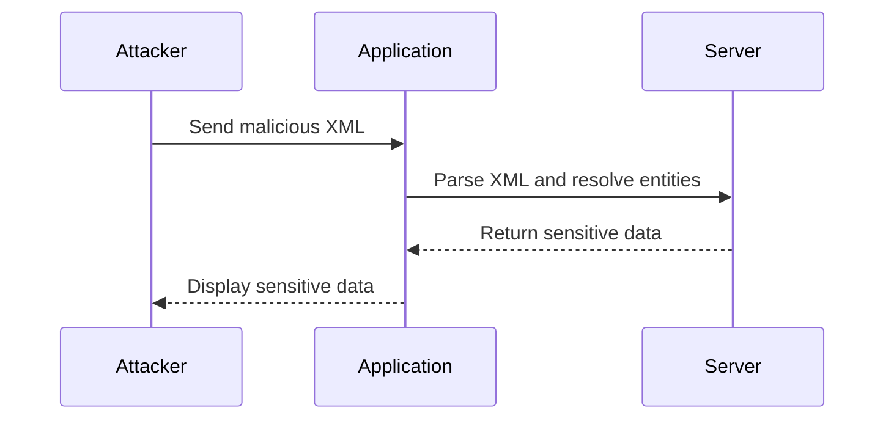
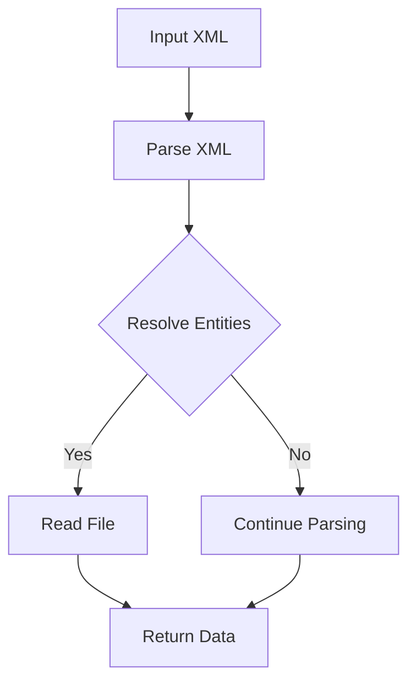

## Introduction to XML External Entity (XXE) Attacks

XML External Entity (XXE) attacks are a type of security vulnerability that occurs when an application improperly processes XML input. This vulnerability allows an attacker to inject malicious XML data that references external entities, which can lead to unauthorized access to sensitive information, denial of service, or even remote code execution.

### What is XML?

XML (Extensible Markup Language) is a markup language designed to store and transport data. Unlike HTML, which is primarily used for displaying data, XML focuses on the structure and semantics of the data. XML documents consist of elements, attributes, and text content, and they can be validated against a schema to ensure they conform to a specific structure.

### What is an XML Entity?

An XML entity is a named reference to a piece of data within an XML document. Entities can be either internal or external. Internal entities are defined within the same document and are used to represent commonly repeated strings or complex structures. External entities, on the other hand, reference data stored outside the current document, such as in a file or a URL.

### What is an XXE Attack?

An XXE attack exploits the ability of an XML parser to resolve external entities. By injecting malicious XML data that references external entities, an attacker can trick the parser into accessing sensitive files, performing unintended operations, or even executing arbitrary code.

### Why Does XXE Matter?

XXE attacks are significant because they can lead to severe security breaches. For instance, an attacker might use an XXE vulnerability to read sensitive files on the server, such as configuration files or user databases. This can result in data exfiltration, leading to privacy violations and potential financial losses. Additionally, XXE attacks can be used to perform denial-of-service (DoS) attacks by overwhelming the server with large amounts of data or causing infinite loops.

### Real-World Examples of XXE Attacks

#### CVE-2018-11776: Apache Struts XXE Vulnerability

In 2018, a critical XXE vulnerability was discovered in Apache Struts, a popular Java framework used for building web applications. The vulnerability allowed attackers to bypass security measures and execute arbitrary commands on the server. This led to several high-profile breaches, including the Equifax data breach, where attackers exploited the vulnerability to gain unauthorized access to sensitive customer data.

#### CVE-2-2019-11510: Jenkins XXE Vulnerability

Another notable example is the XXE vulnerability found in Jenkins, a widely used automation server. In 2019, researchers discovered that Jenkins could be exploited through an XXE attack to read arbitrary files on the server. This vulnerability affected millions of Jenkins installations worldwide, highlighting the widespread impact of XXE vulnerabilities.

### How XXE Works Under the Hood

To understand how XXE attacks work, let's break down the process:

1. **Injection of Malicious XML**: An attacker injects malicious XML data into an application that processes XML input. This data typically includes references to external entities.
   
2. **Parsing by the XML Parser**: The XML parser processes the injected data and attempts to resolve the external entities. Depending on the configuration of the parser, this can lead to various outcomes, such as reading sensitive files or executing unintended operations.

3. **Exploitation**: Once the parser resolves the external entities, the attacker can leverage the results to achieve their goals, such as reading sensitive files or causing a DoS condition.

### Example of an XXE Attack

Let's walk through a detailed example of an XXE attack using a hypothetical scenario.

#### Scenario: Reading Sensitive Files

Suppose we have an application that processes XML input and displays the contents of an XML element. The application is vulnerable to XXE attacks because it allows the resolution of external entities.

```xml
<!DOCTYPE foo [
  <!ENTITY xxe SYSTEM "file:///etc/passwd">
]>
<root>&xxe;</root>
```

In this example, the attacker injects an XML document that defines an external entity `xxe` pointing to the `/etc/passwd` file on the server. When the application parses this XML, it will attempt to resolve the `xxe` entity, resulting in the contents of `/etc/passwd` being displayed.

### Detailed Steps of the Attack

1. **Injecting the XML Data**:
   The attacker sends the following XML data to the application:

   ```xml
   <!DOCTYPE foo [
     <!ENTITY xxe SYSTEM "file:///etc/passwd">
   ]>
   <root>&xxe;</root>
   ```

2. **Parsing the XML Data**:
   The XML parser in the application processes the injected data and resolves the `xxe` entity. Since the entity points to the `/etc/passwd` file, the parser reads the contents of this file.

3. **Displaying the Results**:
   The application displays the contents of `/etc/passwd`, allowing the attacker to read sensitive information.

### Common Pitfalls and Mistakes

#### Misconfigured XML Parsers

One of the most common reasons for XXE vulnerabilities is misconfigured XML parsers. Many parsers allow the resolution of external entities by default, which can lead to security issues. To mitigate this, parsers should be configured to disable the resolution of external entities unless explicitly required.

#### Lack of Input Validation

Another common mistake is failing to validate XML input properly. Applications should ensure that XML input is well-formed and does not contain any malicious content. This can be achieved through proper input validation and sanitization techniques.

### How to Prevent / Defend Against XXE Attacks

#### Secure Configuration of XML Parsers

To prevent XXE attacks, XML parsers should be configured securely. This involves disabling the resolution of external entities and ensuring that the parser operates in a safe mode. Here’s an example of how to configure an XML parser in Python to disable external entity resolution:

```python
import xml.etree.ElementTree as ET

def parse_xml(xml_data):
    parser = ET.XMLParser(resolve_entities=False)
    root = ET.fromstring(xml_data, parser=parser)
    return root

xml_data = """
<!DOCTYPE foo [
  <!ENTITY xxe SYSTEM "file:///etc/passwd">
]>
<root>&xxe;</root>
"""

try:
    parsed_data = parse_xml(xml_data)
    print(ET.tostring(parsed_data))
except Exception as e:
    print(f"Error parsing XML: {e}")
```

In this example, the `resolve_entities` parameter is set to `False`, which disables the resolution of external entities.

#### Input Validation and Sanitization

Applications should implement robust input validation and sanitization mechanisms to ensure that XML input is safe. This can involve checking for well-formedness, validating against a schema, and removing any potentially harmful content.

#### Detection and Monitoring

Regular monitoring and logging can help detect and respond to XXE attacks. Applications should log any suspicious activity related to XML processing and alert administrators when potential attacks are detected.

### Complete Example: Reading Sensitive Files

Let's walk through a complete example of an XXE attack, including the full HTTP request, response, and result.

#### HTTP Request

The attacker sends the following HTTP request to the application:

```http
POST /process-xml HTTP/1.1
Host: example.com
Content-Type: application/xml

<!DOCTYPE foo [
  <!ENTITY xxe SYSTEM "file:///etc/passwd">
]>
<root>&xxe;</root>
```

#### HTTP Response

The application responds with the contents of `/etc/passwd`:

```http
HTTP/1.1 200 OK
Content-Type: text/plain

root:x:0:0:root:/root:/bin/bash
daemon:x:1:1:daemon:/usr/sbin:/usr/sbin/nologin
bin:x:2:2:bin:/bin:/usr/sbin/nologin
sys:x:3:3:sys:/dev:/usr/sbin/nologin
sync:x:4:65534:sync:/bin:/bin/sync
games:x:5:60:games:/usr/games:/usr/sbin/nologin
man:x:6:12:man:/var/cache/man:/usr/sbin/nologin
...
```

#### Result

The attacker successfully reads the contents of `/etc/passwd`, gaining access to sensitive information.

### Secure Coding Practices

To prevent XXE attacks, developers should follow secure coding practices. This includes:

- Disabling external entity resolution in XML parsers.
- Implementing robust input validation and sanitization.
- Logging and monitoring XML processing activities.

### Mermaid Diagrams

#### Attack Chain Diagram



#### XML Parsing Flow Diagram



### Practice Labs

For hands-on practice with XXE attacks, consider the following well-known labs:

- **PortSwigger Web Security Academy**: Offers interactive labs on XXE attacks, including detailed walkthroughs and challenges.
- **OWASP Juice Shop**: Provides a vulnerable web application that can be used to practice various security attacks, including XXE.
- **DVWA (Damn Vulnerable Web Application)**: Contains a variety of web application vulnerabilities, including XXE, that can be exploited for educational purposes.

By following these guidelines and practicing with real-world examples, you can gain a deep understanding of XXE attacks and learn how to defend against them effectively.

---
<!-- nav -->
[[API Security/22-Offensive XXE Exploitation/04-Basic XXE Exploitation/00-Overview|Overview]] | [[API Security/22-Offensive XXE Exploitation/04-Basic XXE Exploitation/02-Practice Questions & Answers|Practice Questions & Answers]]
