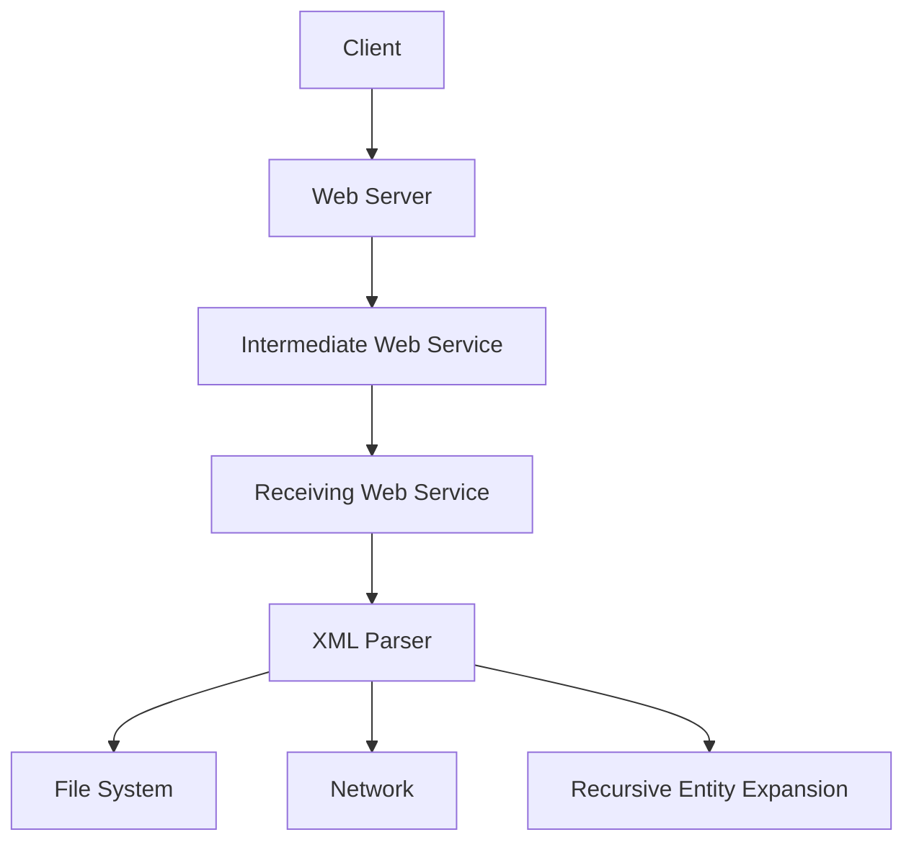

## Background Concept of XML Entity Expansion

### What is XML Entity Expansion?

XML Entity Expansion is a feature within XML documents that allows the inclusion of predefined entities or external resources. An entity is a named reference to a piece of data, which can be text, a file, or even a URL. This mechanism is used to modularize XML content, making it easier to manage large documents and reuse common pieces of data.

### Why Does XML Entity Expansion Matter?

XML Entity Expansion is crucial because it provides flexibility and reusability in XML documents. However, it also introduces significant security risks, particularly when dealing with untrusted input. Attackers can exploit this feature to inject malicious content, leading to various types of vulnerabilities such as XML External Entity (XXE) attacks.

### How Does XML Entity Expansion Work Under the Hood?

When an XML parser encounters an entity reference, it resolves the reference according to the defined entity. Entities can be internal (defined within the document) or external (referencing an external resource). External entities are particularly dangerous because they can reference local files, network resources, or even perform denial-of-service (DoS) attacks through recursive entity expansion.

#### Example of XML Entity Expansion

Consider the following XML document:

```xml
<!DOCTYPE foo [
  <!ENTITY xxe SYSTEM "file:///etc/passwd">
]>
<root>
  <data>&xxe;</data>
</root>
```

In this example, the `&xxe;` entity references the `/etc/passwd` file on the local system. If an XML parser processes this document without proper validation, it will attempt to read the contents of `/etc/passwd` and insert them into the XML document.

### Real-World Examples of XML Entity Expansion Vulnerabilities

#### CVE-2019-1010156: Apache Struts XXE Vulnerability

Apache Struts is a popular Java framework for building web applications. In 2019, a critical XXE vulnerability was discovered in Apache Struts versions 2.3.x and 2.5.x. This vulnerability allowed attackers to read arbitrary files on the server by exploiting the XML parser's handling of external entities.

**Impact:** 
- **Data Exposure:** Attackers could read sensitive files such as configuration files, log files, and other important system files.
- **Denial of Service:** Recursive entity expansion could lead to excessive memory usage, causing the application to crash.

**Exploit Example:**

```http
POST /struts2-showcase/orders.action HTTP/1.1
Host: target.example.com
Content-Type: application/x-www-form-urlencoded

name=John Doe&address=<foo xmlns:xi="http://www.w3.org/2001/XInclude"><xi:include href="file:///etc/passwd"/></foo>
```

### Graphical Representation of an XXE Attack

To better understand the flow of an XXE attack, consider the following diagram:



### Categories of XXE Attacks

#### 1. Schema Validation

Schema validation is a process where an XML document is checked against a predefined schema to ensure it adheres to certain rules. However, if the schema does not properly validate external entities, it can be exploited.

**Example:**

```xml
<!DOCTYPE root [
  <!ELEMENT root ANY>
  <!ATTLIST root entity CDATA #IMPLIED>
]>
<root entity="&xxe;">
  <data>&xxe;</data>
</root>
```

If the schema does not explicitly disallow external entities, the above XML can be exploited.

#### 2. Signature Verification

Signature verification ensures that the XML document has not been tampered with. However, if the signature is not properly verified, an attacker can inject malicious content.

**Example:**

```xml
<root>
  <data>&xxe;</data>
</root>
```

If the signature is not validated correctly, the `&xxe;` entity can be injected.

#### 3. Encryption

Encryption is used to protect the confidentiality of XML data. However, if the encryption is not properly implemented, an attacker can still exploit external entities.

**Example:**

```xml
<root>
  <data>&xxe;</data>
</root>
```

If the encryption is weak or improperly implemented, the `&xxe;` entity can be injected.

### How to Prevent / Defend Against XXE Attacks

#### Detection

To detect XXE attacks, you should monitor your systems for unusual file access patterns and network traffic. Additionally, you can use security tools to scan for vulnerabilities.

#### Prevention

1. **Disable External Entity Expansion:**
   Ensure that your XML parsers are configured to disable external entity expansion. This can be done by setting appropriate flags or configurations.

   **Secure Configuration Example:**

   ```java
   DocumentBuilderFactory dbFactory = DocumentBuilderFactory.newInstance();
   dbFactory.setFeature("http://apache.org/xml/features/disallow-doctype-decl", true);
   dbFactory.setFeature("http://xml.org/sax/features/external-general-entities", false);
   dbFactory.setFeature("http://xml.org/sax/features/external-parameter-entities", false);
   dbFactory.setFeature("http://apache.org/xml/features/nonvalidating/load-external-dtd", false);
   ```

2. **Use Secure Parsing Libraries:**
   Use libraries that are designed to handle XML securely. For example, `Defuse` in PHP or `JAXB` in Java provide secure parsing capabilities.

3. **Validate Input:**
   Validate all input to ensure it does not contain malicious content. Use regular expressions or other validation techniques to filter out potentially harmful input.

4. **Monitor and Audit:**
   Regularly monitor and audit your systems for signs of XXE attacks. Use security tools to scan for vulnerabilities and ensure your systems are up-to-date with the latest security patches.

### Complete Example of XXE Attack and Defense

#### Vulnerable Code Example

```java
DocumentBuilderFactory dbFactory = DocumentBuilderFactory.newInstance();
DocumentBuilder dBuilder = dbFactory.newDocumentBuilder();
Document doc = dBuilder.parse(new File("input.xml"));
doc.getDocumentElement().normalize();
System.out.println(doc.getElementsByTagName("data").item(0).getTextContent());
```

#### Secure Code Example

```java
DocumentBuilderFactory dbFactory = DocumentBuilderFactory.newInstance();
dbFactory.setFeature("http://apache.org/xml/features/disallow-doctype-decl", true);
dbFactory.setFeature("http://xml.org/sax/features/external-general-entities", false);
dbFactory.setFeature("http://xml.org/sax/features/external-parameter-entities", false);
dbFactory.setFeature("http://apache.org/xml/features/nonvalidating/load-external-dtd", false);
DocumentBuilder dBuilder = dbFactory.newDocumentBuilder();
Document doc = dBuilder.parse(new File("input.xml"));
doc.getDocumentElement().normalize();
System.out.println(doc.getElementsByTagName("data").item(.getTextContent()));
```

### Hands-On Labs

For hands-on practice with XXE attacks and defenses, consider the following labs:

- **PortSwigger Web Security Academy:** Offers interactive labs on XXE attacks and defenses.
- **OWASP Juice Shop:** Provides a vulnerable web application for practicing various security attacks, including XXE.
- **DVWA (Damn Vulnerable Web Application):** Contains a variety of web application vulnerabilities, including XXE.

By thoroughly understanding the concepts, mechanisms, and practical implications of XML Entity Expansion, you can effectively defend against XXE attacks and ensure the security of your applications.

---
<!-- nav -->
[[API Security/22-Offensive XXE Exploitation/07-Deep Insight of XML Entity Expansion/00-Overview|Overview]] | [[02-Introduction to XML Entity Expansion Attacks|Introduction to XML Entity Expansion Attacks]]
