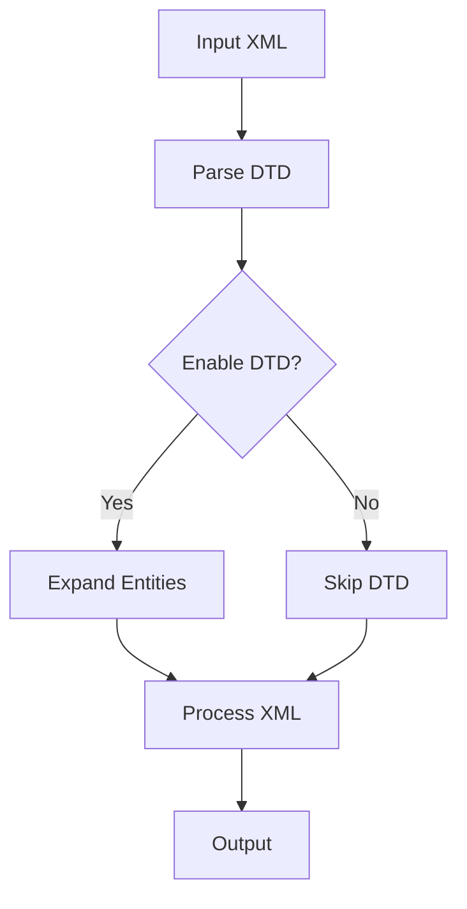
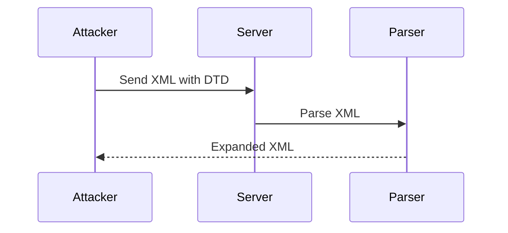

## Introduction to XML Entity Expansion Attacks

XML (Extensible Markup Language) is a markup language designed to store and transport data. It is widely used in web applications for data exchange between different systems. However, XML has several vulnerabilities, one of which is the XML External Entity (XXE) attack. This attack exploits the Document Type Definition (DTD) feature of XML, which allows the definition of entities that can be expanded during parsing.

### What is XML?

XML is a markup language that defines a set of rules for encoding documents in a format that is both human-readable and machine-readable. It is used to store and transmit data across different platforms and applications. XML documents consist of elements, attributes, and text content, and they can be validated against a schema or DTD to ensure they conform to a specific structure.

### Document Type Definition (DTD)

A Document Type Definition (DTD) is a set of rules that define the structure and content of an XML document. DTDs allow the definition of elements, attributes, and entities within an XML document. One of the key features of DTDs is the ability to define entities, which are placeholders that can be expanded during parsing.

#### Entities in DTDs

Entities in DTDs are variables that can be used to define shortcuts to strings or special characters. There are two main types of entities:

1. **General Entities**: These are used to replace a string of text within the document.
2. **Parameter Entities**: These are used within the DTD itself and are denoted by `%`.

For example, consider the following DTD:

```xml
<!DOCTYPE root [
  <!ENTITY example "This is an example entity">
]>
```

In this DTD, `example` is a general entity that can be referenced within the XML document using `&example;`. When the XML parser encounters this reference, it will replace it with the value `"This is an example entity"`.

### XML Entity Expansion Attacks

XML Entity Expansion attacks exploit the DTD feature to perform various malicious actions. These attacks can be categorized into three main types:

1. **Generic Entity Expansion**
2. **Recursive Entity Expansion**
3. **Remote Entity Expansion**

Each type of attack has its own characteristics and potential impacts on the system.

#### Generic Entity Expansion

Generic Entity Expansion involves defining an entity that expands to a large amount of data. This can cause the XML parser to consume excessive memory and CPU resources, leading to a denial of service (DoS) condition.

##### Example of Generic Entity Expansion

Consider the following DTD:

```xml
<!DOCTYPE root [
  <!ENTITY large "This is a very large string that repeats many times">
]>
```

If the entity `large` is referenced multiple times within the XML document, it can lead to significant memory usage. For instance:

```xml
<root>
  &large;&large;&large;&large;&large;
</root>
```

When parsed, this XML document will expand to a much larger size than the original input, potentially overwhelming the parser.

#### Recursive Entity Expansion

Recursive Entity Expansion involves defining entities that reference each other, creating a chain of expansions. This can result in exponential growth in the size of the expanded XML document, leading to resource exhaustion.

##### Example of Recursive Entity Expansion

Consider the following DTD:

```xml
<!DOCTYPE root [
  <!ENTITY a "AAAAAA">
  <!ENTITY b "&a;&a;">
  <!ENTITY c "&b;&b;">
]>
```

Here, the entity `c` references `b`, which in turn references `a`. When expanded, this results in a large amount of data:

```xml
<root>
  &c;
</root>
```

The expanded form would be:

```xml
<root>
  AAAAAA AAAAAA AAAAAA AAAAAA AAAAAA AAAAAA AAAAAA AAAAAA
</root>
```

This can quickly consume a large amount of memory and CPU resources.

#### Remote Entity Expansion

Remote Entity Expansion involves defining entities that reference external resources, such as files or URLs. This can be used to read sensitive information from the server or to perform other malicious actions.

##### Example of Remote Entity Expansion

Consider the following DTD:

```xml
<!DOCTYPE root [
  <!ENTITY xxe SYSTEM "file:///etc/passwd">
]>
```

Here, the entity `xxe` references the `/etc/passwd` file on the server. When the XML document is parsed, the entity will be replaced with the contents of the file:

```xml
<root>
  &xxe;
</root>
```

The expanded form would be:

```xml
<root>
  root:x:0:0:root:/root:/bin/bash
  daemon:x:1:1:daemon:/usr/sbin:/usr/sbin/nologin
  ...
</root>
```

This can be used to read sensitive information from the server.

### Real-World Examples and CVEs

Several real-world examples and CVEs have highlighted the risks associated with XML Entity Expansion attacks. Here are a few notable cases:

1. **CVE-2017-16342**: This vulnerability affected the Apache Struts framework, allowing attackers to execute arbitrary commands on the server by exploiting a flaw in the XML parser.
2. **CVE-2018-11776**: This vulnerability affected the Spring Framework, allowing attackers to bypass security checks and execute arbitrary code on the server.
3. **CVE-2-2019-1010155**: This vulnerability affected the Oracle WebLogic Server, allowing attackers to execute arbitrary commands on the server by exploiting a flaw in the XML parser.

These examples demonstrate the severe impact that XML Entity Expansion attacks can have on web applications and servers.

### How to Prevent / Defend Against XML Entity Expansion Attacks

To prevent XML Entity Expansion attacks, it is essential to implement proper security measures and configurations. Here are some steps to follow:

1. **Disable DTD Processing**: Most modern XML parsers provide options to disable DTD processing. This can prevent the parser from expanding entities defined in the DTD.

2. **Use Secure XML Libraries**: Ensure that the XML libraries used in your application are up-to-date and patched against known vulnerabilities.

3. **Validate Input Data**: Validate all input data to ensure it conforms to expected formats and does not contain malicious content.

4. **Limit Resource Usage**: Implement resource limits to prevent excessive memory and CPU usage during XML parsing.

5. **Monitor and Log**: Monitor and log XML parsing activities to detect and respond to suspicious behavior.

#### Secure Configuration Example

Here is an example of how to configure an XML parser to disable DTD processing in Java:

```java
import javax.xml.parsers.DocumentBuilderFactory;
import org.w3c.dom.Document;

public class SecureXmlParser {
    public static void main(String[] args) {
        try {
            DocumentBuilderFactory dbFactory = DocumentBuilderFactory.newInstance();
            dbFactory.setFeature("http://apache.org/xml/features/disallow-doctype-decl", true);
            dbFactory.setFeature("http://xml.org/sax/features/external-general-entities", false);
            dbFactory.setFeature("http://xml.org/sax/features/external-parameter-entities", false);
            dbFactory.setFeature("http://apache.org/xml/features/nonvalidating/load-external-dtd", false);

            Document doc = dbFactory.newDocumentBuilder().parse("input.xml");
            // Process the document
        } catch (Exception e) {
            e.printStackTrace();
        }
    }
}
```

In this example, the `DocumentBuilderFactory` is configured to disable DTD processing and external entity resolution, preventing potential attacks.

### Conclusion

XML Entity Expansion attacks pose a significant threat to web applications and servers. By understanding the nature of these attacks and implementing proper security measures, developers can protect their systems from exploitation. Regularly updating and validating input data, disabling DTD processing, and monitoring XML parsing activities are crucial steps in defending against these attacks.

### Practice Labs

To gain hands-on experience with XML Entity Expansion attacks, consider the following practice labs:

- **PortSwigger Web Security Academy**: Offers interactive labs on XML External Entity (XXE) attacks.
- **OWASP Juice Shop**: Provides a vulnerable web application for practicing various security attacks, including XXE.
- **DVWA (Damn Vulnerable Web Application)**: Contains a variety of vulnerable web applications, including those susceptible to XXE attacks.

By working through these labs, you can deepen your understanding of XML Entity Expansion attacks and improve your skills in detecting and preventing them.

### Diagrams

#### Mermaid Diagram: XML Parsing Flow



This diagram illustrates the flow of XML parsing, highlighting the decision points related to DTD processing and entity expansion.

#### Mermaid Diagram: Attack Chain



This diagram shows the sequence of events during an XML Entity Expansion attack, illustrating the interaction between the attacker, server, and XML parser.

### Summary

XML Entity Expansion attacks exploit the DTD feature of XML to perform various malicious actions, such as resource exhaustion and data exfiltration. By understanding the nature of these attacks and implementing proper security measures, developers can protect their systems from exploitation. Regularly updating and validating input data, disabling DTD processing, and monitoring XML parsing activities are crucial steps in defending against these attacks.

---
<!-- nav -->
[[01-Background Concept of XML Entity Expansion|Background Concept of XML Entity Expansion]] | [[API Security/22-Offensive XXE Exploitation/07-Deep Insight of XML Entity Expansion/00-Overview|Overview]] | [[03-Introduction to XML Entity Expansion|Introduction to XML Entity Expansion]]
