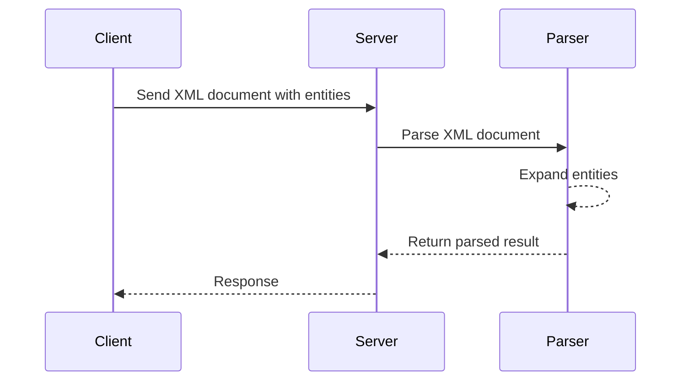

## Understanding XML Entity Expansion

### Background Theory

XML (Extensible Markup Language) is a markup language designed to store and transport data. It allows users to define their own tags and structure the data in a hierarchical manner. One of the key features of XML is the ability to define entities, which are placeholders that can be replaced with specific content during parsing.

An XML entity is defined within a `<!DOCTYPE>` declaration and can be referenced throughout the document. Entities can be used to insert predefined content, such as special characters or large chunks of text, into an XML document. This feature can be exploited in a technique known as XML External Entity (XXE) attacks.

### Generic XML Entity Expansion

#### What is Generic XML Entity Expansion?

Generic XML Entity Expansion refers to the process of defining and expanding entities within an XML document. An entity is a named placeholder that can be replaced with specific content during parsing. This can be used to insert large amounts of data into an XML document, leading to potential security vulnerabilities.

#### How Does It Work?

To understand how generic XML entity expansion works, let's break down the process:

1. **XML Declaration**: The XML document starts with an XML declaration, specifying the version and encoding.
2. **DOCTYPE Declaration**: The `<!DOCTYPE>` declaration defines the document type and can include entity definitions.
3. **Entity Definition**: Within the `<!DOCTYPE>` declaration, entities are defined using the `<!ENTITY>` tag.
4. **Entity Reference**: Entities are referenced in the XML document using the `&entityname;` syntax.

Here is an example of a simple XML document with entity expansion:

```xml
<?xml version="1.0"?>
<!DOCTYPE root [
    <!ENTITY x "This is a very long string that will be expanded">
]>
<root>
    <data>&x;</data>
</root>
```

In this example, the entity `x` is defined with a long string of text. When the XML parser encounters the reference `&x;`, it replaces it with the defined content.

#### Why Is It Important?

Understanding how XML entity expansion works is crucial because it forms the basis for several types of attacks, including XML External Entity (XXE) attacks. These attacks can lead to information disclosure, denial of service (DoS), and other security issues.

### Real-World Examples

#### Recent CVEs and Breaches

One notable example of an XXE attack is the CVE-2018-11776, which affected the Atlassian Confluence application. This vulnerability allowed attackers to read arbitrary files on the server by exploiting the XML entity expansion feature.

Another example is the CVE-2019-11510, which affected the Jenkins Continuous Integration server. This vulnerability allowed attackers to read sensitive files and execute commands on the server by exploiting the XML entity expansion feature.

### Detailed Example

Let's walk through a detailed example of how an attacker might exploit generic XML entity expansion to perform a DoS attack.

#### Constructing the Request

The attacker constructs an XML document with a large number of entities, each containing a long string of text. Here is an example of such an XML document:

```xml
<?xml version="1.0"?>
<!DOCTYPE root [
    <!ENTITY x "This is a very long string that will be expanded">
    <!ENTITY y "This is another very long string that will be expanded">
    <!ENTITY z "This is yet another very long string that will be expanded">
]>
<root>
    <data>&x;&y;&z;</data>
</root>
```

In this example, the entities `x`, `y`, and `z` are defined with long strings of text. When the XML parser encounters the references `&x;`, `&y;`, and `&z;`, it replaces them with the defined content.

#### Parsing the Document

When the XML parser processes this document, it expands each entity, resulting in a significant amount of memory usage. If the number of entities and the length of the strings are sufficiently large, this can cause the parser to exhaust the available memory, leading to a DoS condition.

### Mermaid Diagrams

#### XML Entity Expansion Flow

A mermaid diagram can help visualize the flow of XML entity expansion:



### Pitfalls and Common Mistakes

#### Overlooking Entity Expansion

One common mistake is overlooking the potential for entity expansion in XML documents. Developers may not realize that entities can be used to insert large amounts of data, leading to security vulnerabilities.

#### Incorrect Configuration

Another common mistake is incorrect configuration of XML parsers. Many parsers have options to disable external entity expansion, but these options are often left enabled by default.

### How to Prevent / Defend

#### Detection

To detect XXE attacks, you can monitor for unusual patterns in XML documents, such as a large number of entities or unusually long strings. You can also use tools like Burp Suite or OWASP ZAP to scan for potential vulnerabilities.

#### Prevention

To prevent XXE attacks, you should configure your XML parsers to disable external entity expansion. This can be done by setting the appropriate configuration options in your parser library.

#### Secure Coding Fixes

Here is an example of how to configure an XML parser to disable external entity expansion in Java:

```java
import javax.xml.parsers.DocumentBuilderFactory;
import org.w3c.dom.Document;

public class SecureXMLParser {
    public static void main(String[] args) {
        DocumentBuilderFactory dbFactory = DocumentBuilderFactory.newInstance();
        dbFactory.setFeature("http://apache.org/xml/features/disallow-doctype-decl", true);
        dbFactory.setFeature("http://xml.org/sax/features/external-general-entities", false);
        dbFactory.setFeature("http://xml.org/sax/features/external-parameter-entities", false);
        dbFactory.setFeature("http://apache.org/xml/features/nonvalidating/load-external-dtd", false);

        try {
            Document doc = dbFactory.newDocumentBuilder().parse("input.xml");
            // Process the document
        } catch (Exception e) {
            e.printStackTrace();
        }
    }
}
```

In this example, the `DocumentBuilderFactory` is configured to disable external entity expansion by setting the appropriate features.

#### Hardening

To further harden your system against XXE attacks, you should:

1. **Validate Input**: Ensure that all input is properly validated and sanitized.
2. **Use Secure Libraries**: Use libraries that are known to be secure and regularly updated.
3. **Monitor Logs**: Regularly monitor logs for signs of unusual activity.

### Practice Labs

For hands-on practice with XML entity expansion and XXE attacks, consider the following labs:

- **PortSwigger Web Security Academy**: Offers interactive labs on XXE attacks.
- **OWASP Juice Shop**: A deliberately insecure web application for practicing web security techniques.
- **DVWA (Damn Vulnerable Web Application)**: A PHP/MySQL web application that is riddled with vulnerabilities for educational purposes.

These labs provide real-world scenarios and challenges to help you master the concepts of XML entity expansion and XXE attacks.

By understanding the mechanics of XML entity expansion and taking the necessary precautions, you can protect your systems from potential security threats.

---
<!-- nav -->
[[04-Introduction to XML Recursive Entity Expansion|Introduction to XML Recursive Entity Expansion]] | [[API Security/22-Offensive XXE Exploitation/07-Deep Insight of XML Entity Expansion/00-Overview|Overview]] | [[06-Understanding XML External Entity (XXE) Attacks|Understanding XML External Entity (XXE) Attacks]]
