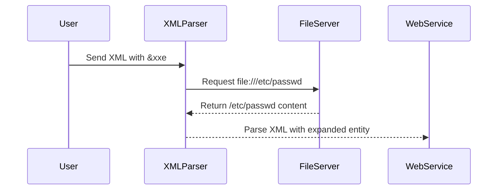
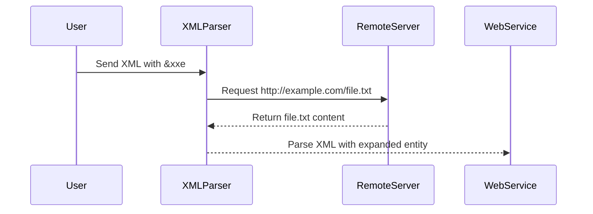

## XML External Entity (XXE) Exploitation

### Introduction to XML External Entity (XXE)

XML External Entity (XXE) attacks are a type of injection attack where an attacker can inject malicious XML data into an application. This data can contain references to external entities, which can be used to perform various types of attacks, including information disclosure, denial of service (DoS), and remote code execution.

In this section, we will delve deep into the mechanics of XML entity expansion, particularly focusing on external entity expansion and how it can be exploited offensively. We will also cover defensive measures to prevent such attacks.

### Understanding XML Entities

#### What are XML Entities?

An XML entity is a named reference to a piece of data. There are two types of entities in XML:

1. **Internal Entities**: These are defined within the document itself using the `<!ENTITY>` declaration.
2. **External Entities**: These are defined outside the document and can reference files or URLs.

#### Why Do XML Entities Matter?

Entities allow XML documents to include reusable pieces of data. However, external entities can be exploited to access sensitive data or cause resource exhaustion.

### XML Entity Expansion Process

When an XML parser encounters an entity reference, it expands the entity to retrieve the referenced data. This process can involve multiple levels of entity expansion, leading to complex and potentially dangerous scenarios.

#### Example of XML Entity Expansion

Consider the following XML document:

```xml
<!DOCTYPE root [
    <!ENTITY xxe SYSTEM "file:///etc/passwd">
]>
<root>&xxe;</root>
```

Here, the `xxe` entity is defined as an external entity that points to the `/etc/passwd` file on the server. When the XML parser expands this entity, it reads the contents of the `/etc/passwd` file and includes it in the document.

### External Entity Expansion (XXE)

#### What is External Entity Expansion?

External entity expansion occurs when an XML parser expands an entity that references an external resource, such as a file or URL. This can lead to various types of attacks, depending on the nature of the external resource.

#### How Does External Entity Expansion Work?

When an XML parser encounters an external entity reference, it attempts to fetch the referenced resource. This can involve multiple levels of indirection, where one external entity references another, and so on.

#### Example of Multiple Levels of Indirection

Consider the following XML document:

```xml
<!DOCTYPE root [
    <!ENTITY xxe1 SYSTEM "file:///etc/passwd">
    <!ENTITY xxe2 SYSTEM "http://example.com/entity.dtd">
]>
<root>&xxe1;&xxe2;</root>
```

Here, `xxe1` references the `/etc/passwd` file, while `xxe2` references an external DTD (`entity.dtd`) located at `http://example.com`. The parser will first expand `xxe1`, then attempt to fetch and parse `entity.dtd`.

### Remote Entity Expansion

#### What is Remote Entity Expansion?

Remote entity expansion occurs when an XML parser expands an entity that references a remote resource, such as a URL. This can be used to perform various types of attacks, including information disclosure and DoS.

#### How Does Remote Entity Expansion Work?

When an XML parser encounters a remote entity reference, it sends a request to the specified URL to fetch the referenced resource. This can involve multiple levels of indirection, similar to local entity expansion.

#### Example of Remote Entity Expansion

Consider the following XML document:

```xml
<!DOCTYPE root [
    <!ENTITY xxe SYSTEM "http://example.com/file.txt">
]>
<root>&xxe;</root>
```

Here, the `xxe` entity references a remote file located at `http://example.com/file.txt`. When the XML parser expands this entity, it sends a request to the specified URL to fetch the file.

### Canonicalization (C14N) Entity Expansion

#### What is Canonicalization?

Canonicalization is the process of converting an XML document into a standard form. This is often done to ensure that different representations of the same document are considered equivalent.

#### How Does Canonicalization Affect Entity Expansion?

During canonicalization, the XML parser may resolve entities differently than during normal parsing. This can lead to different behavior and potential vulnerabilities.

#### Example of C14N Entity Expansion

Consider the following XML document:

```xml
<!DOCTYPE root [
    <!ENTITY xxe SYSTEM "file:///etc/passwd">
]>
<root>&xxe;</root>
```

When this document is canonicalized, the `xxe` entity may be expanded differently than during normal parsing. This can lead to unexpected behavior and potential vulnerabilities.

### Real-World Examples and CVEs

#### Recent Breaches and CVEs

Several high-profile breaches have been attributed to XXE vulnerabilities. Here are a few recent examples:

1. **CVE-2021-3129**: This vulnerability affected several versions of Apache Struts and allowed attackers to execute arbitrary commands via XXE.
2. **CVE-2020-14882**: This vulnerability affected several versions of Atlassian Jira and allowed attackers to read arbitrary files via XXE.

#### How These Examples Matter

These examples demonstrate the real-world impact of XXE vulnerabilities. They highlight the importance of proper input validation and entity resolution in XML parsers.

### Complete Code Examples

#### Vulnerable XML Parsing Code

Consider the following Python code that parses an XML document:

```python
import xml.etree.ElementTree as ET

def parse_xml(xml_data):
    try:
        tree = ET.fromstring(xml_data)
        return tree
    except Exception as e:
        print(f"Error parsing XML: {e}")
        return None

xml_data = """
<!DOCTYPE root [
    <!ENTITY xxe SYSTEM "file:///etc/passwd">
]>
<root>&xxe;</root>
"""

parse_xml(xml_data)
```

This code is vulnerable to XXE because it allows the XML parser to expand external entities.

#### Secure XML Parsing Code

To prevent XXE, you should disable external entity expansion in the XML parser. Here is the corrected code:

```python
import xml.etree.ElementTree as ET

def parse_xml(xml_data):
    try:
        parser = ET.XMLParser(resolve_entities=False)
        tree = ET.fromstring(xml_data, parser=parser)
        return tree
    except Exception as e:
        print(f"Error parsing XML: {e}")
        return None

xml_data = """
<!DOCTYPE root [
    <!ENTITY xxe SYSTEM "file:///etc/passwd">
]>
<root>&xxe;</root>
"""

parse_xml(xml_data)
```

### Mermaid Diagrams

#### XML Entity Expansion Flow



#### Remote Entity Expansion Flow



### Pitfalls and Common Mistakes

#### Common Pitfalls

1. **Disabling External Entity Expansion**: Many developers forget to disable external entity expansion in their XML parsers, leaving them vulnerable to XXE attacks.
2. **Improper Input Validation**: Failing to validate user input can lead to XXE vulnerabilities.
3. **Using Insecure Libraries**: Using outdated or insecure libraries can expose your application to XXE attacks.

#### How to Avoid These Pitfalls

1. **Disable External Entity Expansion**: Always disable external entity expansion in your XML parsers.
2. **Validate User Input**: Ensure that all user input is properly validated before being processed by the XML parser.
3. **Use Secure Libraries**: Keep your libraries up to date and use secure libraries that are known to handle XML safely.

### How to Prevent / Defend Against XXE Attacks

#### Detection

1. **Logging and Monitoring**: Implement logging and monitoring to detect unusual XML parsing activity.
2. **Security Scanning Tools**: Use security scanning tools to identify potential XXE vulnerabilities in your codebase.

#### Prevention

1. **Disable External Entity Expansion**: Disable external entity expansion in your XML parsers.
2. **Input Validation**: Validate all user input to ensure it does not contain malicious XML data.
3. **Secure Coding Practices**: Follow secure coding practices to prevent XXE vulnerabilities.

#### Secure-Coding Fixes

#### Vulnerable Pattern

```python
import xml.etree.ElementTree as ET

def parse_xml(xml_data):
    try:
        tree = ET.fromstring(xml_data)
        return tree
    except Exception as e:
        print(f"Error parsing XML: {e}")
        return None
```

#### Corrected Secure Version

```python
import xml.etree.ElementTree as ET

def parse_xml(xml_data):
    try:
        parser = ET.XMLParser(resolve_entities=False)
        tree = ET.fromstring(xml_data, parser=parser)
        return tree
    except Exception as e:
        print(f"Error parsing XML: {e}")
        return None
```

### Configuration Hardening

#### Secure Configuration Example

For example, in an Apache server configuration, you might disable external entity expansion as follows:

```apache
<IfModule mod_xml2enc.c>
    Xml2EncDisable On
</IfModule>
```

### Hands-On Labs

#### Recommended Labs

- **PortSwigger Web Security Academy**: Offers a comprehensive course on XXE attacks and how to defend against them.
- **OWASP Juice Shop**: Provides a vulnerable web application that can be used to practice exploiting XXE vulnerabilities.
- **DVWA (Damn Vulnerable Web Application)**: Includes several XXE vulnerabilities that can be exploited and defended against.

By following these steps and practicing in real-world environments, you can gain a deep understanding of XML entity expansion and how to defend against XXE attacks effectively.

---
<!-- nav -->
[[08-XML External Entity (XXE) Attacks Deep Insight into XML Entity Expansion|XML External Entity (XXE) Attacks Deep Insight into XML Entity Expansion]] | [[API Security/22-Offensive XXE Exploitation/07-Deep Insight of XML Entity Expansion/00-Overview|Overview]] | [[API Security/22-Offensive XXE Exploitation/07-Deep Insight of XML Entity Expansion/10-Practice Questions & Answers|Practice Questions & Answers]]
