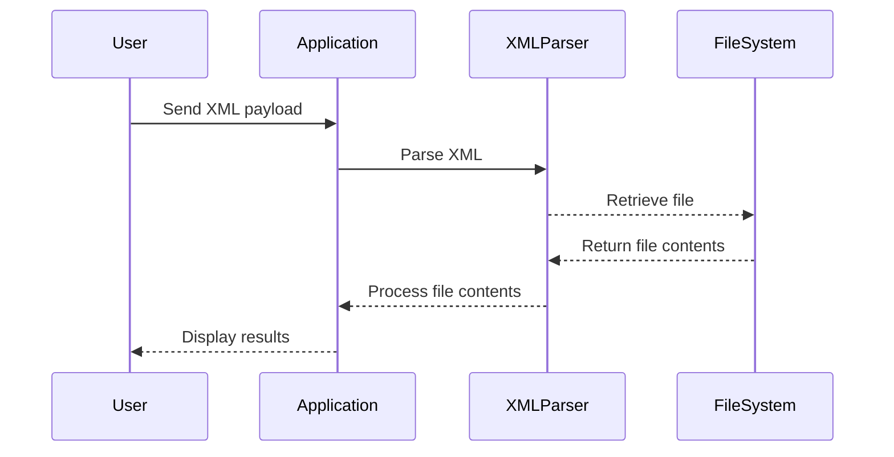

## Introduction to Offensive XXE Exploitation

### What is XXE?

XML External Entity (XXE) attacks occur when an application parses untrusted XML input without properly validating it. This can lead to unauthorized access to sensitive data, denial of service, server-side request forgery (SSRF), and other vulnerabilities. An XML document can contain references to external entities, which can be used to retrieve arbitrary files from the server or even perform remote code execution.

### Why Does XXE Matter?

XXE attacks are significant because they can expose sensitive information such as passwords, private keys, and other critical data stored on the server. They can also be used to bypass security controls and gain unauthorized access to internal networks. Recent real-world examples include:

- **CVE-2019-11510**: A XXE vulnerability in the Atlassian Confluence Server and Data Center products allowed attackers to read arbitrary files from the server.
- **CVE-2020-13952**: A XXE vulnerability in the Apache Struts framework allowed attackers to execute arbitrary commands on the server.

### How Does XXE Work?

An XML document can define entities that reference external resources. These entities can be used to retrieve arbitrary files from the server or perform other malicious actions. Here’s a basic example of an XML document with an external entity:

```xml
<?xml version="1.0"?>
<!DOCTYPE foo [
<!ENTITY xxe SYSTEM "file:///etc/passwd">
]>
<foo>&xxe;</foo>
```

In this example, the `&xxe;` entity references the `/etc/passwd` file on the server. When the XML parser processes this document, it will attempt to retrieve the contents of `/etc/passwd`.

### Example of XXE Attack

Let’s consider a scenario where an application accepts XML input and processes it without proper validation. The attacker can send an XML payload that includes an external entity to retrieve sensitive data from the server.

#### Vulnerable Code Example

Here’s a simple Python script that demonstrates a vulnerable XML parser:

```python
import xml.etree.ElementTree as ET

def parse_xml(xml_data):
    root = ET.fromstring(xml_data)
    print(root.text)

xml_data = """<?xml version="1.0"?>
<!DOCTYPE foo [
<!ENTITY xxe SYSTEM "file:///etc/passwd">
]>
<foo>&xxe;</foo>"""

parse_xml(xml_data)
```

When this script runs, it will attempt to retrieve the contents of `/etc/passwd` and print them.

### Steps to Perform XXE Exploitation

To perform an XXE attack, follow these steps:

1. **Identify the Vulnerability**: Determine if the application accepts XML input and processes it without proper validation.
2. **Craft the Payload**: Create an XML document with an external entity that references the desired file.
3. **Send the Payload**: Send the crafted XML payload to the application.
4. **Retrieve the Data**: If successful, the application will process the XML and retrieve the contents of the specified file.

### Example of XXE Exploitation

Let’s walk through an example of performing an XXE attack using the PortSwigger Web Security Academy lab.

#### Step 1: Identify the Vulnerability

First, identify the endpoint that accepts XML input. In this case, let’s assume the endpoint is `/api/xml`.

#### Step 2: Craft the Payload

Create an XML payload that includes an external entity to retrieve the `/etc/passwd` file:

```xml
<?xml version="1.0"?>
<!DOCTYPE foo [
<!ENTITY xxe SYSTEM "file:///etc/passwd">
]>
<foo>&xxe;</foo>
```

#### Step 3: Send the Payload

Use a tool like Burp Suite to send the XML payload to the `/api/xml` endpoint.

```http
POST /api/xml HTTP/1.1
Host: vulnerable-app.com
Content-Type: application/xml

<?xml version="1.0"?>
<!DOCTYPE foo [
<!ENTITY xxe SYSTEM "file:///etc/passwd">
]>
<foo>&xxe;</foo>
```

#### Step 4: Retrieve the Data

If the application is vulnerable, it will process the XML and retrieve the contents of `/etc/passwd`. You should see the contents of the file in the response.

### Common Pitfalls and Mistakes

1. **Incorrect Entity Syntax**: Ensure that the entity syntax is correct and matches the expected format.
2. **File Path Errors**: Double-check the file path to ensure it exists and is accessible.
3. **Application Validation**: Some applications may validate the XML input, preventing the exploitation of XXE vulnerabilities.

### How to Prevent / Defend Against XXE Attacks

#### Detection

1. **Static Analysis Tools**: Use tools like SonarQube, Fortify, or Checkmarx to scan your code for potential XXE vulnerabilities.
2. **Dynamic Analysis Tools**: Use tools like Burp Suite, OWASP ZAP, or Nessus to test your application for XXE vulnerabilities.

#### Prevention

1. **Disable External Entities**: Configure your XML parser to disable external entities. For example, in Python, you can use the `defusedxml` library:

    ```python
    import defusedxml.ElementTree as ET

    def parse_xml(xml_data):
        root = ET.fromstring(xml_data)
        print(root.text)

    xml_data = """<?xml version="1.0"?>
    <!DOCTYPE foo [
    <!ENTITY xxe SYSTEM "file:///etc/passwd">
    ]>
    <foo>&xxe;</foo>"""

    parse_xml(xml_data)
    ```

2. **Input Validation**: Validate all XML input to ensure it does not contain external entities. Use libraries like `lxml` with the `defuse` option enabled.

    ```python
    from lxml import etree

    def parse_xml(xml_data):
        parser = etree.XMLParser(resolve_entities=False)
        root = etree.fromstring(xml_data, parser=parser)
        print(root.text)

    xml_data = """<?xml version="1.0"?>
    <!DOCTYPE foo [
    <!ENTITY xxe SYSTEM "file:///etc/passwd">
    ]>
    <foo>&xxe;</foo>"""

    parse_xml(xml_data)
    ```

3. **Secure Coding Practices**: Follow secure coding practices and avoid parsing untrusted XML input directly. Use libraries that provide built-in protection against XXE attacks.

### Secure Code Fix Example

#### Vulnerable Code

```python
import xml.etree.ElementTree as ET

def parse_xml(xml_data):
    root = ET.fromstring(xml_data)
    print(root.text)

xml_data = """<?xml version="1.0"?>
<!DOCTYPE foo [
<!ENTITY xxe SYSTEM "file:///etc/passwd">
]>
<foo>&xxe;</foo>"""

parse_xml(xml_data)
```

#### Fixed Code

```python
from lxml import etree

def parse_xml(xml_data):
    parser = etree.XMLParser(resolve_entities=False)
    root = etree.fromstring(xml_data, parser=parser)
    print(root.text)

xml_data = """<?xml version="1.0"?>
<!DOCTYPE foo [
<!ENTITY xxe SYSTEM "file:///etc/passwd">
]>
<foo>&xxe;</foo>"""

parse_xml(xml_data)
```

### Conclusion

XXE attacks are a serious threat to the security of applications that handle XML input. By understanding how these attacks work and implementing proper defenses, you can protect your applications from unauthorized access and data exfiltration.

### Practice Labs

For hands-on practice with XXE attacks, consider the following labs:

- **PortSwigger Web Security Academy**: Offers a comprehensive set of labs covering various web security topics, including XXE.
- **OWASP Juice Shop**: A deliberately insecure web application for practicing web security skills.
- **DVWA (Damn Vulnerable Web Application)**: A PHP/MySQL web application that is riddled with vulnerabilities for educational purposes.

By completing these labs, you can gain practical experience in identifying and exploiting XXE vulnerabilities, as well as learning how to defend against them.

### Diagrams

#### XML Parsing Process



#### XXE Attack Flow

```mermaid
sequenceDiagram
    participant Attacker
    participant Application
    participant XMLParser
    participant FileSystem

    Attacker->>Application: Send XML payload with &lt;!ENTITY&gt;
    Application->>XMLParser: Parse XML
    XMLParser-->>FileSystem: Retrieve file (e.g., /etc/passwd)
    FileSystem-->>XMLParser: Return file contents
    XMLParser-->>Application: Process file contents
    Application-->>Attacker: Display file contents
```

### Summary

XXE attacks are a significant threat to applications that handle XML input. By understanding the mechanics of these attacks and implementing proper defenses, you can protect your applications from unauthorized access and data exfiltration. Use static and dynamic analysis tools to detect vulnerabilities, and follow secure coding practices to prevent XXE attacks.

---
<!-- nav -->
[[API Security/22-Offensive XXE Exploitation/08-Exfiltration with local DTD on Lab/00-Overview|Overview]] | [[02-Introduction to XML External Entity (XXE) Attacks|Introduction to XML External Entity (XXE) Attacks]]
