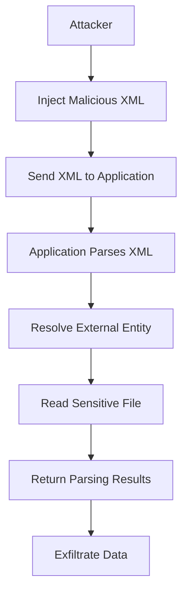

## XML External Entity (XXE) Vulnerability

### Introduction to XML External Entity (XXE)

XML External Entity (XXE) vulnerabilities arise from the ability of an attacker to inject malicious XML input into an application that parses XML documents. This vulnerability can lead to various attacks, including information disclosure, denial of service, and remote code execution. The core issue lies in the way XML parsers handle external entities, which can be exploited to access sensitive files, perform SSRF (Server-Side Request Forgery), or even execute arbitrary commands.

### Understanding XML Entities

#### What Are XML Entities?

XML entities are placeholders that represent specific pieces of data within an XML document. They can be used to define reusable content, such as special characters or common strings. Entities are defined using the `<!ENTITY>` declaration and can be referenced within the document using the `&entityname;` syntax.

For example, consider the following XML document:

```xml
<!DOCTYPE root [
    <!ENTITY example "Hello, World!">
]>
<root>
    <message>&example;</message>
</root>
```

In this example, the `&example;` entity reference is replaced with the string "Hello, World!" during parsing.

#### Internal vs. External Entities

Entities can be categorized into two types: internal and external.

- **Internal Entities**: These are defined within the same XML document and do not reference external resources. They are typically used for defining reusable content within the document itself.

- **External Entities**: These entities reference external resources, such as files or URLs. They are defined using the `SYSTEM` keyword followed by a URI.

For example:

```xml
<!DOCTYPE root [
    <!ENTITY example SYSTEM "file:///etc/passwd">
]>
<root>
    <message>&example;</message>
</root>
```

In this case, the `&example;` entity references the `/etc/passwd` file on the local filesystem.

### XML External Entity (XXE) Attack

#### How XXE Works

An XXE attack exploits the way XML parsers handle external entities. When an XML parser encounters an external entity, it attempts to resolve the referenced resource. If the parser is configured to allow external entities, an attacker can inject malicious XML input that references sensitive files or performs other actions.

Consider the following XML input:

```xml
<!DOCTYPE foo [
    <!ENTITY xxe SYSTEM "file:///etc/passwd">
]>
<root>
    <data>&xxe;</data>
</root>
```

If the application parses this XML input and returns the contents of the `<data>` element, the attacker can read the contents of the `/etc/passwd` file.

#### Real-World Example: CVE-2018-11776

A notable example of an XXE vulnerability is CVE-2018-11776, which affected the Apache Struts framework. This vulnerability allowed attackers to bypass certain security checks and execute arbitrary commands on the server.

The vulnerability was exploited through the `Content-Type` header in HTTP requests, which allowed attackers to inject malicious XML input. By leveraging this vulnerability, attackers could read sensitive files, perform SSRF attacks, and potentially gain unauthorized access to the server.

### Common Files to Read

When conducting an XXE attack, attackers often target specific files that contain sensitive information. Some common files to read include:

- **/etc/passwd**: Contains user account information.
- **/etc/shadow**: Contains password hashes for user accounts.
- **/etc/hosts**: Contains mappings of IP addresses to hostnames.
- **/etc/network/interfaces**: Contains network interface configurations.

These files can provide valuable information to attackers, such as usernames, passwords, and network configurations.

### XXE Attack Example

Let's walk through a detailed example of an XXE attack.

#### Step 1: Inject Malicious XML Input

The attacker crafts an XML input that references an external entity pointing to a sensitive file:

```xml
<!DOCTYPE root [
    <!ENTITY xxe SYSTEM "file:///etc/passwd">
]>
<root>
    <data>&xxe;</data>
</root>
```

#### Step 2: Send the XML Input to the Application

The attacker sends the crafted XML input to the application via an HTTP request:

```http
POST /api/v1/process HTTP/1.1
Host: example.com
Content-Type: application/xml

<!DOCTYPE root [
    <!ENTITY xxe SYSTEM "file:///etc/passwd">
]>
<root>
    <data>&xxe;</data>
</root>
```

#### Step 3: Parse the XML Input

The application parses the XML input and processes the `<data>` element. If the parser is configured to allow external entities, it will attempt to resolve the referenced file.

#### Step 4: Return the Parsing Results

The application returns the parsing results, which include the contents of the `/etc/passwd` file:

```http
HTTP/1.1 200 OK
Content-Type: application/xml

<root>
    <data>x:0:0:root:/root:/bin/bash
daemon:1:1:daemon:/usr/sbin:/usr/sbin/nologin
bin:2:2:bin:/bin:/usr/sbin/nologin
sys:3:3:sys:/dev:/usr/sbin/nologin
...
</data>
</root>
```

### How to Prevent / Defend Against XXE Attacks

#### Detection

To detect XXE attacks, organizations can implement the following measures:

- **Logging and Monitoring**: Monitor XML parsing activities and log any suspicious behavior.
- **IDS/IPS**: Deploy Intrusion Detection Systems (IDS) and Intrusion Prevention Systems (IPS) to detect and block malicious XML input.

#### Prevention

To prevent XXE attacks, organizations should take the following steps:

- **Disable External Entities**: Configure XML parsers to disable the processing of external entities. This can be achieved by setting the `external-general-entities` and `external-parameter-entities` features to `false`.

  ```java
  DocumentBuilderFactory dbFactory = DocumentBuilderFactory.newInstance();
  dbFactory.setFeature("http://apache.org/xml/features/disallow-doctype-decl", true);
  dbFactory.setFeature("http://apache.org/xml/features/nonvalidating/load-external-dtd", false);
  ```

- **Input Validation**: Validate and sanitize all XML input to ensure it does not contain malicious content.
- **Use Secure Libraries**: Use secure XML parsing libraries that are designed to prevent XXE attacks.

#### Secure Coding Fixes

Here is an example of how to securely parse XML input using Java:

**Vulnerable Code:**

```java
DocumentBuilderFactory dbFactory = DocumentBuilderFactory.newInstance();
DocumentBuilder dBuilder = dbFactory.newDocumentBuilder();
Document doc = dBuilder.parse(new InputSource(new StringReader(xmlInput)));
```

**Secure Code:**

```java
DocumentBuilderFactory dbFactory = DocumentBuilderFactory.newInstance();
dbFactory.setFeature("http://apache.org/xml/features/disallow-doctype-decl", true);
dbFactory.setFeature("http://apache.org/xml/features/nonvalidating/load-external-dtd", false);
DocumentBuilder dBuilder = dbFactory.newDocumentBuilder();
Document doc = dBuilder.parse(new InputSource(new StringReader(xmlInput)));
```

### Hands-On Labs

To practice and understand XXE attacks, you can use the following labs:

- **PortSwigger Web Security Academy**: Offers a comprehensive course on XXE attacks, including practical exercises.
- **OWASP Juice Shop**: Provides a vulnerable web application that includes XXE vulnerabilities.
- **DVWA (Damn Vulnerable Web Application)**: Includes XXE vulnerabilities that can be exploited for educational purposes.

### Conclusion

XML External Entity (XXE) vulnerabilities pose significant risks to applications that parse XML input. By understanding how these vulnerabilities work and implementing proper defenses, organizations can mitigate the risk of XXE attacks and protect their systems from potential exploitation.

### Diagrams

#### XML Entity Resolution Flow

```mermaid
sequenceDiagram
    participant User
    participant Application
    participant XMLParser
    participant Filesystem

    User->>Application: Send XML input with &xxe;
    Application->>XMLParser: Parse XML input
    XMLParser->>Filesystem: Resolve &xxe; to file:///etc/passwd
    Filesystem-->>XMLParser: Return contents of /etc/passwd
    XMLParser-->>Application: Process parsed XML
    Application-->>User: Return parsing results
```

#### XXE Attack Chain



### Summary

Understanding and defending against XML External Entity (XXE) vulnerabilities is crucial for securing applications that parse XML input. By disabling external entities, validating input, and using secure libraries, organizations can significantly reduce the risk of XXE attacks. Regularly practicing with hands-on labs and monitoring for suspicious activity can further enhance the security posture of an organization.

---
<!-- nav -->
[[03-XML External Entity (XXE) Exploitation|XML External Entity (XXE) Exploitation]] | [[API Security/22-Offensive XXE Exploitation/12-XML Entities/00-Overview|Overview]] | [[API Security/22-Offensive XXE Exploitation/12-XML Entities/05-Practice Questions & Answers|Practice Questions & Answers]]
