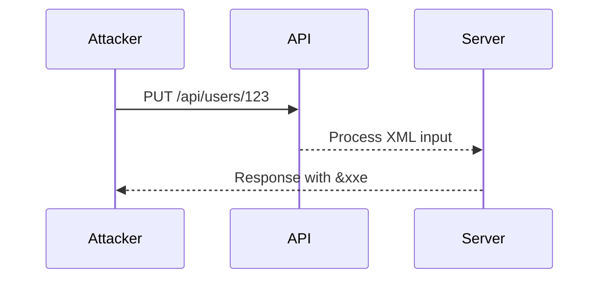
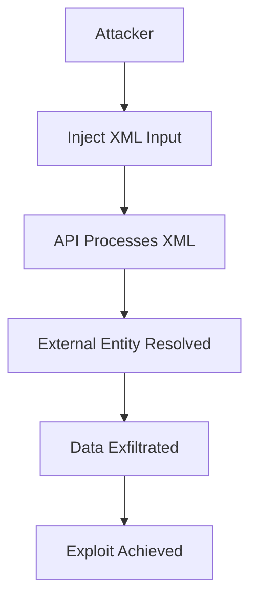

## XML External Entity Injection (XXE) in APIs

### Introduction to XML External Entity Injection (XXE)

XML External Entity Injection (XXE) is a type of security vulnerability that occurs when an application improperly processes XML input. This vulnerability allows attackers to inject malicious XML entities into the input, which can lead to various types of attacks such as data exfiltration, denial of service, and remote code execution. In the context of APIs, XXE vulnerabilities can be particularly dangerous because APIs often handle sensitive data and are frequently exposed to external users.

### Background Theory

#### What is XML?

XML (Extensible Markup Language) is a markup language designed to store and transport data. Unlike HTML, which is primarily used for displaying data, XML focuses on the structure and semantics of the data. XML documents consist of elements, attributes, and text content. Elements are defined by tags, and attributes provide additional information about the element.

#### What is an XML Entity?

An XML entity is a named unit of data that can be referenced within an XML document. Entities can be either internal or external. Internal entities are defined within the document itself, while external entities reference data outside the document.

#### What is an XML External Entity?

An XML External Entity (XXE) is an entity that references data from an external source. This can include files on the local filesystem, network resources, or other external data sources. The syntax for defining an external entity is as follows:

```xml
<!DOCTYPE root [
  <!ENTITY entityName SYSTEM "externalURL">
]>
```

In this example, `entityName` is the name of the entity, and `externalURL` is the URL or path to the external resource.

### XXE Vulnerability in APIs

#### How XXE Works

When an application processes XML input, it may parse and resolve any external entities defined in the input. If the application does not properly validate or sanitize the input, an attacker can inject malicious XML entities that reference external resources. This can lead to various types of attacks, including:

- **Data Exfiltration**: An attacker can read sensitive data from the server's filesystem or network.
- **Denial of Service**: An attacker can cause the application to make excessive network requests or consume large amounts of memory.
- **Remote Code Execution**: In some cases, an attacker can execute arbitrary code on the server.

#### Example Scenario

Consider an API endpoint that accepts XML input for updating user information. The API endpoint might look like this:

```http
PUT /api/users/123 HTTP/1.1
Host: example.com
Content-Type: application/xml

<user>
  <name>John Doe</name>
  <email>johndoe@example.com</email>
</user>
```

If the application does not properly validate the XML input, an attacker could inject an external entity to read sensitive data from the server's filesystem. For example:

```http
PUT /api/users/123 HTTP/1/1
Host: example.com
Content-Type: application/xml

<!DOCTYPE foo [ 
  <!ENTITY xxe SYSTEM "file:///etc/passwd"> ]>
<user>
  <name>&xxe;</name>
  <email>johndoe@example.com</email>
</user>
```

In this example, the attacker has injected an external entity `&xxe;` that references the `/etc/passwd` file on the server's filesystem. If the application resolves this entity, it will read the contents of the `/etc/passwd` file and potentially expose sensitive information.

### Recent Real-World Examples

#### CVE-2021-21972: Apache Struts XXE Vulnerability

In 2021, a critical XXE vulnerability was discovered in Apache Struts, a popular Java framework for building web applications. The vulnerability allowed attackers to read arbitrary files from the server's filesystem by injecting malicious XML entities into the input.

**Impact**: The vulnerability affected versions of Apache Struts prior to 2.5.29 and 2.3.38. Attackers could exploit this vulnerability to read sensitive files, such as configuration files and credentials, leading to potential data exfiltration and further exploitation.

**Mitigation**: The vulnerability was patched in Apache Struts 2.5.29 and 2.3.38. Users were advised to update to the latest version and ensure proper validation and sanitization of XML input.

#### CVE-2022-22965: Spring Framework XXE Vulnerability

In 2022, a critical XXE vulnerability was discovered in the Spring Framework, a widely-used Java framework for building enterprise applications. The vulnerability allowed attackers to read arbitrary files from the server's filesystem by injecting malicious XML entities into the input.

**Impact**: The vulnerability affected versions of the Spring Framework prior to 5.3.13 and 5.2.17. Attackers could exploit this vulnerability to read sensitive files, such as configuration files and credentials, leading to potential data exfiltration and further exploitation.

**Mitigation**: The vulnerability was patched in Spring Framework 5.3.13 and 5.2.17. Users were advised to update to the latest version and ensure proper validation and sanitization of XML input.

### Complete Code Example

Let's walk through a complete example of how an attacker could exploit an XXE vulnerability in an API endpoint.

#### Vulnerable Code

Consider the following Python code that processes XML input using the `lxml` library:

```python
from lxml import etree

def process_xml(xml_input):
    parser = etree.XMLParser(resolve_entities=True)
    tree = etree.fromstring(xml_input, parser)
    return tree

xml_input = """
<!DOCTYPE foo [ 
  <!ENTITY xxe SYSTEM "file:///etc/passwd"> ]>
<user>
  <name>&xxe;</name>
  <email>johndoe@example.com</email>
</user>
"""

tree = process_xml(xml_input)
print(etree.tostring(tree))
```

In this example, the `resolve_entities=True` parameter allows the parser to resolve external entities. If an attacker injects the above XML input, the parser will attempt to read the contents of the `/etc/passwd` file and include it in the output.

#### Secure Code

To prevent XXE vulnerabilities, you should disable external entity resolution and validate the XML input. Here's the secure version of the code:

```python
from lxml import etree

def process_xml(xml_input):
    parser = etree.XMLParser(resolve_entities=False)
    tree = etree.fromstring(xml_input, parser)
    return tree

xml_input = """
<!DOCTYPE foo [ 
  <!ENTITY xxe SYSTEM "file:///etc/passwd"> ]>
<user>
  <name>&xxe;</name>
  <email>johndoe@example.com</email>
</user>
"""

try:
    tree = process_xml(xml_input)
    print(etree.tostring(tree))
except etree.XMLSyntaxError as e:
    print(f"Invalid XML input: {e}")
```

In this secure version, the `resolve_entities=False` parameter disables external entity resolution. If an attacker injects the above XML input, the parser will raise an `XMLSyntaxError` due to the invalid XML input.

### Mermaid Diagrams

#### Request/Response Flow

Here's a mermaid diagram showing the request/response flow for an XXE attack:



#### Attack Chain

Here's a mermaid diagram showing the attack chain for an XXE attack:



### Pitfalls and Common Mistakes

#### Disabling External Entity Resolution

One common mistake is forgetting to disable external entity resolution. If the parser is configured to resolve external entities, an attacker can easily exploit the vulnerability.

#### Improper Validation

Another common mistake is improper validation of XML input. If the input is not properly validated, an attacker can inject malicious XML entities that can lead to various types of attacks.

#### Lack of Error Handling

A lack of error handling can also lead to XXE vulnerabilities. If the parser encounters an error while processing the input, it should raise an exception and terminate the operation.

### How to Prevent / Defend

#### Detection

To detect XXE vulnerabilities, you can use static analysis tools and dynamic testing tools. Static analysis tools can analyze the source code for potential vulnerabilities, while dynamic testing tools can simulate attacks and detect vulnerabilities in real-time.

#### Prevention

To prevent XXE vulnerabilities, you should:

1. Disable external entity resolution in the XML parser.
2. Validate and sanitize XML input to ensure it does not contain malicious entities.
3. Implement proper error handling to detect and terminate operations when encountering errors.

#### Secure Coding Fixes

Here's a comparison of the vulnerable and secure code:

**Vulnerable Code**

```python
from lxml import etree

def process_xml(xml_input):
    parser = etree.XMLParser(resolve_entities=True)
    tree = etree.fromstring(xml_input, parser)
    return tree

xml_input = """
<!DOCTYPE foo [ 
  <!ENTITY xxe SYSTEM "file:///etc/passwd"> ]>
<user>
  <name>&xxe;</name>
  <email>johndoe@example.com</email>
</user>
"""

tree = process_xml(xml_input)
print(etree.tostring(tree))
```

**Secure Code**

```python
from lxml import etree

def process_xml(xml_input):
    parser = etree.XMLParser(resolve_entities=False)
    tree = etree.fromstring(xml_input, parser)
    return tree

xml_input = """
<!DOCTYPE foo [ 
  <!ENTITY xxe SYSTEM "file:///etc/passwd"> ]>
<user>
  <name>&xxe;</name>
  <email>johndoe@example.com</email>
</user>
"""

try:
    tree = process_xml(xml_input)
    print(etree.tostring(tree))
except etree.XMLSyntaxError as e:
    print(f"Invalid XML input: {e}")
```

### Configuration Hardening

To harden the configuration, you should:

1. Disable external entity resolution in the XML parser.
2. Configure the parser to raise exceptions when encountering errors.
3. Implement proper validation and sanitization of XML input.

### Hands-On Labs

For hands-on practice with XXE vulnerabilities, you can use the following labs:

- **PortSwigger Web Security Academy**: Offers interactive labs on XXE vulnerabilities.
- **OWASP Juice Shop**: Provides a vulnerable web application for practicing XXE attacks.
- **DVWA (Damn Vulnerable Web Application)**: Includes XXE vulnerabilities for testing and learning.

These labs provide a safe environment for practicing and learning about XXE vulnerabilities.

### Conclusion

XML External Entity Injection (XXE) is a serious security vulnerability that can lead to various types of attacks. By understanding the background theory, recent real-world examples, and complete code examples, you can effectively prevent and defend against XXE vulnerabilities in your APIs. Always ensure proper validation and sanitization of XML input, disable external entity resolution, and implement proper error handling to protect your applications from XXE attacks.

---
<!-- nav -->
[[01-XML External Entity Injection (XXE) in API Security|XML External Entity Injection (XXE) in API Security]] | [[API Security/22-Offensive XXE Exploitation/16-XML External Entity Injection in API Part 3/00-Overview|Overview]] | [[API Security/22-Offensive XXE Exploitation/16-XML External Entity Injection in API Part 3/03-Practice Questions & Answers|Practice Questions & Answers]]
