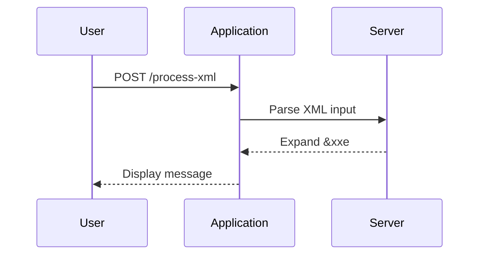
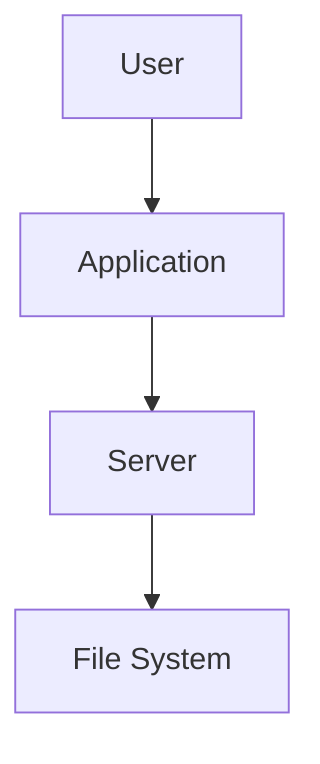

## XML External Entity (XXE) Attacks

### Introduction to XML External Entity (XXE) Attacks

XML External Entity (XXE) attacks are a type of security vulnerability that occurs when an application improperly processes user-supplied XML input. This vulnerability allows an attacker to inject malicious XML content that can lead to unauthorized access to sensitive information, denial of service, or even remote code execution. Understanding how XXE attacks work and how to defend against them is crucial for securing applications that process XML data.

### Background Theory

#### What is XML?

XML (Extensible Markup Language) is a markup language designed to store and transport data. Unlike HTML, which is primarily used for displaying data, XML focuses on the structure and meaning of the data. XML documents consist of elements, attributes, and text content, all enclosed within tags.

#### Entities in XML

Entities in XML are placeholders that represent specific pieces of data. They can be used to define reusable content, such as symbols or commonly used strings. There are two types of entities:

1. **Internal Entities**: Defined within the document itself using the `<!ENTITY>` declaration.
2. **External Entities**: Refer to external resources, such as files or URLs, using the `SYSTEM` keyword.

#### Example of Internal Entity

```xml
<!DOCTYPE root [
  <!ENTITY example "This is an example">
]>
<root>
  <message>&example;</message>
</root>
```

In this example, the internal entity `&example;` is replaced with the string "This is an example".

#### Example of External Entity

```xml
<!DOCTYPE root [
  <!ENTITY example SYSTEM "file:///etc/passwd">
]>
<root>
  <message>&example;</message>
</root>
```

In this example, the external entity `&example;` attempts to read the contents of `/etc/passwd`, a file containing system user information.

### How XXE Attacks Work

#### Injection of Malicious XML Content

An XXE attack occurs when an attacker injects malicious XML content that includes external entities. These entities can reference local or remote resources, leading to various security issues.

#### Example of XXE Attack

Consider an application that processes XML input and displays the content of a `<message>` element:

```http
POST /process-xml HTTP/1.1
Host: example.com
Content-Type: application/xml

<!DOCTYPE root [
  <!ENTITY xxe SYSTEM "file:///etc/passwd">
]>
<root>
  <message>&xxe;</message>
</root>
```

If the application does not properly validate or sanitize the input, the external entity `&xxe;` will be expanded, potentially exposing sensitive information from the server.

### Real-World Examples

#### CVE-2019-14548

CVE-2019-14548 is a vulnerability in the Apache Struts framework that allows attackers to perform XXE attacks. By injecting malicious XML content, attackers can read arbitrary files on the server, leading to information disclosure.

#### CVE-2020-14882

CVE-2020-14882 is another XXE vulnerability found in the Atlassian Confluence application. This vulnerability allows attackers to read arbitrary files on the server, including sensitive configuration files.

### Detection and Prevention

#### How to Detect XXE Vulnerabilities

To detect XXE vulnerabilities, you can use automated tools such as static application security testing (SAST) and dynamic application security testing (DAST) tools. These tools can identify potential XXE attack vectors in your codebase and during runtime.

#### Secure Coding Practices

To prevent XXE attacks, follow these secure coding practices:

1. **Disable External Entity Processing**: Ensure that your XML parser is configured to disable external entity processing. This prevents the expansion of external entities.

2. **Input Validation**: Validate and sanitize all XML input to ensure it does not contain malicious content.

3. **Use Secure Libraries**: Use libraries and frameworks that have built-in protections against XXE attacks.

#### Example of Secure Configuration

Here is an example of configuring an XML parser to disable external entity processing in Java:

```java
DocumentBuilderFactory dbFactory = DocumentBuilderFactory.newInstance();
dbFactory.setFeature("http://apache.org/xml/features/disallow-doctype-decl", true);
dbFactory.setFeature("http://xml.org/sax/features/external-general-entities", false);
dbFactory.setFeature("http://xml.org/sax/features/external-parameter-entities", false);
dbFactory.setFeature("http://apache.org/xml/features/nonvalidating/load-external-dtd", false);

DocumentBuilder dBuilder = dbFactory.newDocumentBuilder();
Document doc = dBuilder.parse(new InputSource(new StringReader(xmlInput)));
```

### Mermaid Diagrams

#### Sequence Diagram for XXE Attack



#### Network Topology Diagram



### Practice Labs

For hands-on practice with XXE attacks, consider the following labs:

- **PortSwigger Web Security Academy**: Offers interactive labs on XXE attacks.
- **OWASP Juice Shop**: Contains several XXE vulnerabilities for testing and learning.
- **DVWA (Damn Vulnerable Web Application)**: Provides a variety of web application vulnerabilities, including XXE.

### Conclusion

Understanding and defending against XXE attacks is essential for securing applications that process XML data. By disabling external entity processing, validating input, and using secure libraries, you can significantly reduce the risk of XXE vulnerabilities. Regularly testing your applications with automated tools and practicing with real-world scenarios will help you stay ahead of potential threats.

---
<!-- nav -->
[[01-Introduction to XML Generic Entity Expansion Attack|Introduction to XML Generic Entity Expansion Attack]] | [[API Security/22-Offensive XXE Exploitation/17-XML Generic Entity Expansion Attack/00-Overview|Overview]] | [[03-XML Generic Entity Expansion Attack|XML Generic Entity Expansion Attack]]
