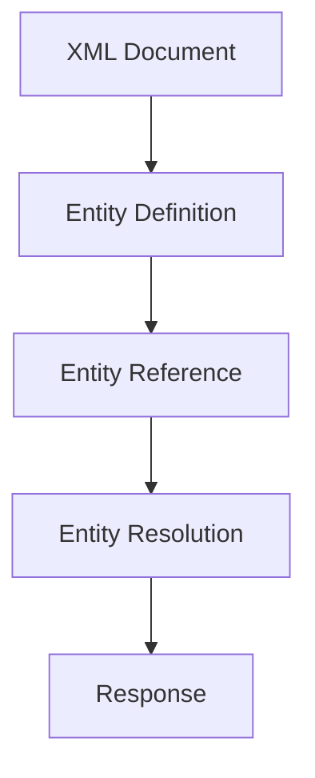

## XML Generic Entity Expansion Attack

### Introduction

XML External Entity (XXE) attacks are a type of vulnerability that occurs when an application parses untrusted XML input without properly validating it. This can lead to various security issues, including information disclosure, denial of service, and remote code execution. In this section, we will delve into the specifics of the XML Generic Entity Expansion attack, which is a subset of XXE attacks.

### What is an XML Generic Entity Expansion Attack?

An XML Generic Entity Expansion attack involves the exploitation of XML external entities to perform malicious actions. XML documents can contain references to external entities, which are defined using the `<!ENTITY>` directive. These entities can reference local files, network resources, or even execute system commands.

#### Example of XML with External Entities

Consider the following XML document:

```xml
<?xml version="1.0"?>
<!DOCTYPE foo [
  <!ENTITY xxe SYSTEM "file:///etc/passwd">
]>
<foo>&xxe;</foo>
```

In this example, the `<!ENTITY xxe SYSTEM "file:///etc/passwd">` directive defines an entity named `xxe` that references the `/etc/passwd` file on the local filesystem. When this XML document is parsed, the entity `&xxe;` will be replaced with the contents of `/etc/passwd`.

### Why Does This Matter?

XML Generic Entity Expansion attacks can be used to:

1. **Read sensitive files**: By referencing local files, attackers can read sensitive data such as configuration files, passwords, or other critical information.
2. **Denial of Service (DoS)**: By referencing large files or infinite loops, attackers can cause the XML parser to consume excessive resources, leading to a denial of service.
3. **Remote Code Execution**: In some cases, attackers can use XXE to execute arbitrary commands on the server.

### How Does It Work Under the Hood?

When an XML document containing external entities is parsed, the parser resolves these entities by fetching the referenced resources. This process can be exploited by an attacker to perform unauthorized actions.

#### Parsing Process

The parsing process involves the following steps:

1. **Entity Definition**: The XML document defines external entities using the `<!ENTITY>` directive.
2. **Entity Reference**: The document references these entities using the `&entityname;` syntax.
3. **Entity Resolution**: The parser resolves the entity references by fetching the referenced resources.

### Real-World Examples

#### CVE-2019-11510: Apache Struts XXE Vulnerability

In 2019, a critical XXE vulnerability was discovered in Apache Struts, a popular Java framework. The vulnerability allowed attackers to read arbitrary files on the server by exploiting the XML parser used by Struts.

**Example Exploit:**

```xml
<?xml version="1.0"?>
<!DOCTYPE foo [
  <!ENTITY xxe SYSTEM "file:///etc/passwd">
]>
<foo>&xxe;</foo>
```

This XML payload could be sent to the Struts application, causing it to read the `/etc/passwd` file and potentially disclose sensitive information.

### How to Test for XXE Vulnerabilities

Testing for XXE vulnerabilities involves sending specially crafted XML payloads to the application and observing the response. You can test this on various endpoints such as posts, users, or any other endpoint that accepts XML input.

#### Testing Steps

1. **Identify Endpoints**: Identify endpoints that accept XML input.
2. **Craft Payloads**: Create XML payloads that define and reference external entities.
3. **Send Payloads**: Send the payloads to the identified endpoints.
4. **Observe Responses**: Analyze the responses to determine if the external entities were resolved.

### Complete Example

Let's consider a scenario where an application accepts XML input through an HTTP POST request. We will craft an XML payload to test for XXE vulnerabilities.

#### Vulnerable Application Endpoint

```http
POST /api/user HTTP/1.1
Host: example.com
Content-Type: application/xml

<?xml version="1.0"?>
<!DOCTYPE foo [
  <!ENTITY xxe SYSTEM "file:///etc/passwd">
]>
<user>
  <name>&xxe;</name>
</user>
```

#### Response

If the application is vulnerable, the response might look like this:

```http
HTTP/1.1 200 OK
Content-Type: application/xml

<?xml version="1.0"?>
<response>
  <message>/bin/bash
root:x:0:0:root:/root:/bin/bash
daemon:x:1:1:daemon:/usr/sbin:/usr/sbin/nologin
...
</message>
</response>
```

### How to Prevent / Defend Against XXE Attacks

#### Detection

To detect XXE vulnerabilities, you can use automated tools such as:

- **OWASP ZAP**: A free and open-source web application security scanner.
- **Burp Suite**: A comprehensive toolkit for web application security testing.

These tools can help identify potential XXE vulnerabilities by analyzing the XML input and responses.

#### Prevention

To prevent XXE attacks, follow these best practices:

1. **Disable External Entity Loading**: Configure the XML parser to disable loading of external entities.
2. **Validate Input**: Validate all XML input to ensure it does not contain malicious entities.
3. **Use Secure Libraries**: Use libraries that are known to handle XML securely, such as `defusedxml` in Python.

#### Secure Coding Fixes

Here is an example of how to configure an XML parser to disable external entity loading in Python:

```python
import defusedxml.ElementTree as ET

# Parse XML without loading external entities
tree = ET.fromstring(xml_data)
```

And here is an example of how to configure an XML parser in Java:

```java
DocumentBuilderFactory dbFactory = DocumentBuilderFactory.newInstance();
dbFactory.setFeature("http://apache.org/xml/features/disallow-doctype-decl", true);
dbFactory.setFeature("http://xml.org/sax/features/external-general-entities", false);
dbFactory.setFeature("http://xml.org/sax/features/external-parameter-entities", false);
dbFactory.setFeature("http://apache.org/xml/features/nonvalidating/load-external-dtd", false);

DocumentBuilder dBuilder = dbFactory.newDocumentBuilder();
Document doc = dBuilder.parse(new InputSource(new StringReader(xmlData)));
```

### Mermaid Diagrams

#### XML Parsing Flow



#### Attack Chain

```mermaid
sequenceDiagram
    participant User
    participant Server
    User->>Server: Send XML with &lt;!ENTITY&gt;
    Server-->>User: Resolve &amp;entity;
    Server-->>User: Return sensitive data
```

### Practice Labs

For hands-on practice with XXE vulnerabilities, consider the following labs:

- **PortSwigger Web Security Academy**: Offers a detailed XXE lab that guides you through the process of exploiting and preventing XXE vulnerabilities.
- **OWASP Juice Shop**: Contains several XXE challenges that can help you understand and mitigate these vulnerabilities.

By thoroughly understanding and implementing these preventive measures, you can significantly reduce the risk of XXE attacks in your applications.

---
<!-- nav -->
[[02-XML External Entity (XXE) Attacks|XML External Entity (XXE) Attacks]] | [[API Security/22-Offensive XXE Exploitation/17-XML Generic Entity Expansion Attack/00-Overview|Overview]] | [[API Security/22-Offensive XXE Exploitation/17-XML Generic Entity Expansion Attack/04-Practice Questions & Answers|Practice Questions & Answers]]
