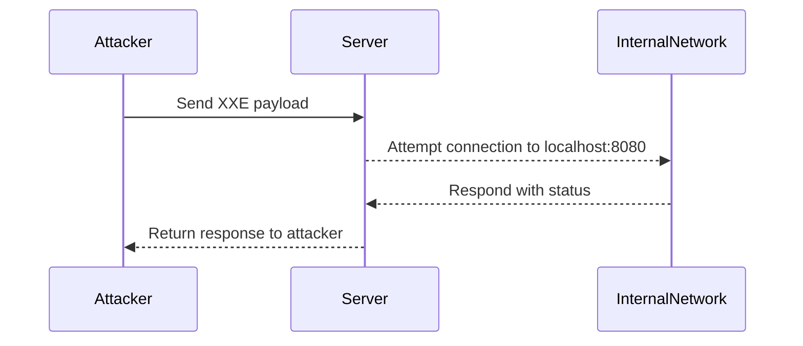

## Understanding XML External Entity (XXE) Attacks

### Background Theory

XML External Entity (XXE) attacks occur when an application parses untrusted XML input without proper validation. This allows an attacker to inject malicious XML entities that can lead to various security issues such as data exfiltration, denial of service (DoS), and internal port scanning. XML documents can contain references to external entities using the `<!ENTITY>` directive. If these references are not properly controlled, an attacker can exploit them to access sensitive information or perform other malicious actions.

### XXE Internal Port Scanning

Internal port scanning using XXE attacks involves leveraging the XML parser to make network connections to specific ports within the internal network. This can help an attacker map out the internal network topology and identify services that may be vulnerable to further exploitation.

#### Example Scenario

Consider an application that accepts XML input and processes it using a vulnerable XML parser. An attacker can craft an XML document that includes an entity reference to an internal IP address and port number. By observing the response time and error messages, the attacker can determine whether the port is open or closed.

### Crafting the XXE Payload

To perform an internal port scan using XXE, an attacker needs to construct an XML document with a carefully crafted entity reference. Here’s a detailed breakdown of the process:

#### Step-by-Step Mechanics

1. **Identify the Vulnerable Endpoint**: Find an endpoint that accepts XML input and processes it using a vulnerable XML parser.
2. **Craft the XML Document**: Create an XML document that includes an entity reference to an internal IP address and port number.
3. **Send the Request**: Send the crafted XML document to the vulnerable endpoint.
4. **Analyze the Response**: Observe the response time and error messages to determine the status of the port.

#### Example XML Payload

```xml
<?xml version="1.0"?>
<!DOCTYPE root [
<!ENTITY % remote SYSTEM "http://localhost:8080">
]>
<root>&remote;</root>
```

In this example, the `SYSTEM` keyword specifies the URL to which the XML parser should connect. The `localhost` IP address and port `8080` are used for demonstration purposes.

### Full HTTP Request and Response

Here is a complete HTTP request and response for the XXE payload:

#### HTTP Request

```http
POST /vulnerable-endpoint HTTP/1.1
Host: example.com
Content-Type: application/xml
Content-Length: 123

<?xml version="1.0"?>
<!DOCTYPE root [
<!ENTITY % remote SYSTEM "http://localhost:8080">
]>
<root>&remote;</root>
```

#### HTTP Response

```http
HTTP/1.1 200 OK
Date: Mon, 20 Nov 2023 12:00:00 GMT
Server: Apache/2.4.41 (Ubuntu)
Content-Length: 0
Content-Type: text/html; charset=UTF-8
```

### Analyzing the Response Time

The response time can provide valuable information about the status of the port:

- **Short Response Time (e.g., 5 milliseconds)**: Indicates that the port is likely open and the connection was successful.
- **Long Response Time or Timeout**: Indicates that the port is likely closed or the connection failed.

### Real-World Examples

#### Recent CVEs and Breaches

One notable example of XXE vulnerabilities leading to internal port scanning is the case of the Apache Struts framework. In 2017, a critical vulnerability (CVE-2017-5638) allowed attackers to exploit XXE vulnerabilities to gain unauthorized access to internal networks. This led to significant breaches, including the Equifax data breach, where attackers were able to exploit XXE vulnerabilities to map out the internal network and identify additional vulnerabilities.

### Common Pitfalls

When performing XXE internal port scanning, several common pitfalls can arise:

1. **Incorrect Syntax**: Ensure that the XML syntax is correct and that the entity reference is properly formatted.
2. **Network Latency**: Network latency can affect the accuracy of the response time analysis. Consider performing multiple tests to get a more accurate result.
3. **Firewall Rules**: Firewalls and network security policies may block certain types of traffic, making it difficult to accurately determine the status of the port.

### How to Prevent / Defend

#### Detection

1. **Logging and Monitoring**: Implement logging and monitoring mechanisms to detect unusual XML input patterns and response times.
2. **Network Traffic Analysis**: Use network traffic analysis tools to monitor for unexpected outbound connections from the server.

#### Prevention

1. **Disable External Entity Loading**: Configure the XML parser to disable loading of external entities. This can be done by setting the appropriate configuration options in the parser library.
2. **Input Validation**: Validate all XML input to ensure that it does not contain any malicious entity references.
3. **Secure Coding Practices**: Follow secure coding practices to avoid introducing vulnerabilities in the first place.

#### Secure Code Fix

Here is an example of how to configure the XML parser to disable external entity loading in Python:

```python
import defusedxml.ElementTree as ET

# Disable external entity loading
ET.fromstring(xml_input, forbid_dtd=True)
```

### Mermaid Diagrams

#### Attack Chain Diagram



### Practice Labs

For hands-on practice with XXE attacks, consider the following real-world labs:

- **PortSwigger Web Security Academy**: Offers interactive labs specifically designed to teach and test XXE vulnerabilities.
- **OWASP Juice Shop**: A deliberately insecure web application that includes XXE vulnerabilities for educational purposes.
- **DVWA (Damn Vulnerable Web Application)**: Another popular web application with various security vulnerabilities, including XXE.

By thoroughly understanding the mechanics of XXE attacks and practicing with real-world examples, you can better defend against these types of vulnerabilities in your applications.

---
<!-- nav -->
[[API Security/22-Offensive XXE Exploitation/21-XXE Internal Port Scanning/01-Introduction to XML External Entity (XXE) Attacks|Introduction to XML External Entity (XXE) Attacks]] | [[API Security/22-Offensive XXE Exploitation/21-XXE Internal Port Scanning/00-Overview|Overview]] | [[API Security/22-Offensive XXE Exploitation/21-XXE Internal Port Scanning/03-Practice Questions & Answers|Practice Questions & Answers]]
