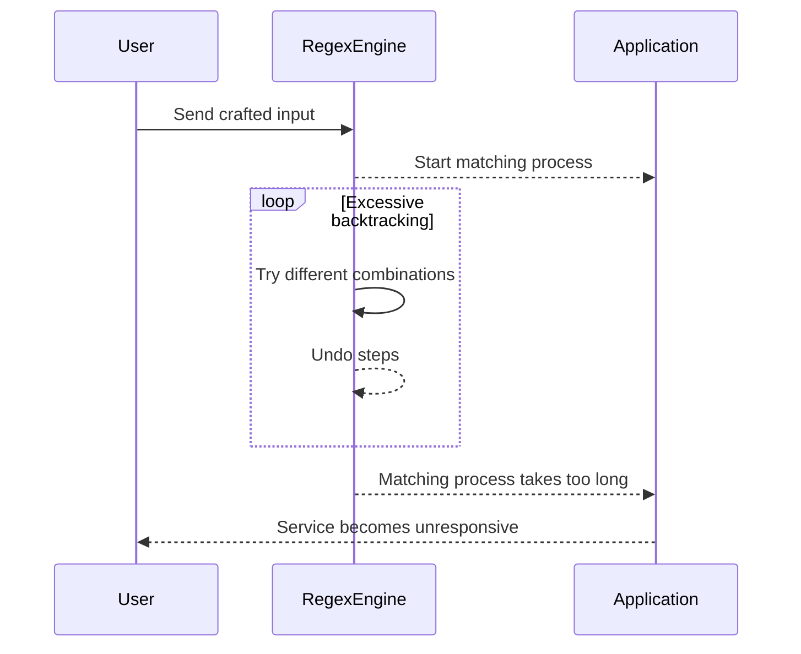

## Introduction to Regular Expression Denial of Service (ReDoS)

Regular Expression Denial of Service (ReDoS) is a type of attack that exploits the computational complexity of certain regular expressions (regexes) to cause a denial of service (DoS). This attack occurs when an attacker provides input that causes the regex engine to perform an excessive number of operations, leading to a significant slowdown or even a complete halt of the application. Understanding ReDoS is crucial for developers and security professionals to ensure the robustness and reliability of their applications.

### What is a Regular Expression?

A regular expression (regex) is a sequence of characters that defines a search pattern. It is used to match strings or pieces of text according to specific rules. Regular expressions are widely used in various programming languages and tools for tasks such as searching, replacing, and validating text patterns.

### How Does ReDoS Work?

ReDoS attacks take advantage of the way regex engines process certain patterns. Most regex engines use a backtracking algorithm to match patterns. Backtracking involves trying different paths to find a match and undoing steps when a path fails. This backtracking mechanism can lead to exponential time complexity in certain scenarios, especially when dealing with nested quantifiers or overlapping patterns.

#### Example of a Vulnerable Regular Expression

Consider the following regular expression:

```regex
/(a+)+b/
```

This regex matches a string that starts with one or more 'a' characters followed by a 'b'. However, if the input string contains many 'a' characters without a trailing 'b', the regex engine will spend a lot of time backtracking through all possible combinations of 'a' characters.

For instance, if the input is `"aaaaaaaaaaaaaaaaaaaaaaa"`, the regex engine will try to match the first 'a', then the first two 'a's, then the first three 'a's, and so on, until it exhausts all possibilities. This can lead to a significant delay or even a crash of the application.

### Real-World Examples of ReDoS Attacks

ReDoS attacks have been observed in various real-world scenarios, leading to significant disruptions. Here are a few notable examples:

1. **CVE-2018-17190**: This vulnerability affected the `express` middleware in Node.js applications. The `express` framework uses regular expressions to parse URLs, and a specific pattern could cause the regex engine to perform an excessive number of operations, leading to a denial of service.

2. **CVE-2019-16779**: This vulnerability was found in the `path-to-regexp` library, which is commonly used in Node.js applications for URL routing. An attacker could craft a malicious URL that would cause the regex engine to perform an excessive number of operations, resulting in a denial of service.

### How to Detect ReDoS Vulnerabilities

Detecting ReDoS vulnerabilities requires a thorough analysis of the regular expressions used in your application. Here are some steps to help you identify potential ReDoS vulnerabilities:

1. **Static Analysis Tools**: Use static analysis tools like ESLint, SonarQube, or Snyk Code to scan your codebase for potentially problematic regular expressions.

2. **Manual Review**: Manually review the regular expressions used in your application. Look for patterns that involve nested quantifiers, overlapping patterns, or complex alternations.

3. **Performance Testing**: Perform performance testing with large inputs to see if the application slows down significantly. This can help identify potential ReDoS vulnerabilities.

### How to Prevent / Defend Against ReDoS Attacks

Preventing ReDoS attacks involves both coding practices and configuration hardening. Here are some strategies to mitigate ReDoS vulnerabilities:

#### Secure Coding Practices

1. **Avoid Nested Quantifiers**: Avoid using nested quantifiers in your regular expressions. Instead, use simpler patterns that are less likely to cause backtracking.

2. **Use Atomic Groups**: Atomic groups can prevent backtracking within a group. For example, `(?>a+)` ensures that once a match is found, the engine does not backtrack to try other possibilities.

3. **Limit Quantifier Usage**: Limit the usage of quantifiers like `*`, `+`, and `{}` to avoid excessive backtracking. Consider using non-greedy quantifiers (`*?`, `+?`) when appropriate.

#### Configuration Hardening

1. **Timeouts and Limits**: Implement timeouts and limits for regex matching operations. For example, in Node.js, you can set a timeout for regex operations using the `RegExp.prototype.exec` method.

2. **Input Validation**: Validate input data before passing it to regex operations. Ensure that the input conforms to expected patterns and does not contain malicious content.

#### Example of a Vulnerable vs. Fixed Regular Expression

Let's consider the following vulnerable regular expression:

```regex
/(a+)+b/
```

This regex can cause excessive backtracking. To fix this, we can use an atomic group to prevent backtracking:

```regex
/(?>a+)b/
```

Here is a comparison of the vulnerable and fixed versions:

**Vulnerable Version:**

```javascript
const vulnerableRegex = /(a+)+b/;
const input = 'a'.repeat(10000);
console.time('vulnerable');
vulnerableRegex.test(input);
console.timeEnd('vulnerable'); // Takes a long time to execute
```

**Fixed Version:**

```javascript
const fixedRegex = /(?>a+)b/;
const input = 'a'.repeat(10000);
console.time('fixed');
fixedRegex.test(input);
console.timeEnd('fixed'); // Executes quickly
```

### Detailed Explanation of the Attack Mechanism

To understand the attack mechanism in more detail, let's break down the steps involved in a ReDoS attack:

1. **Crafting the Input**: The attacker crafts an input string that is designed to cause the regex engine to perform an excessive number of operations. This input typically contains a large number of characters that match the pattern but do not satisfy the final condition.

2. **Matching Process**: The regex engine attempts to match the input string against the regular expression. Due to the nested quantifiers or overlapping patterns, the engine spends a significant amount of time backtracking through all possible combinations.

3. **Denial of Service**: The excessive backtracking causes the application to slow down or become unresponsive, effectively denying service to legitimate users.

### Mermaid Diagrams for Visualization

To better visualize the attack mechanism, let's use a mermaid diagram to illustrate the backtracking process:



### Real-World Example: Express Middleware Vulnerability

Let's look at a real-world example of a ReDoS vulnerability in the `express` middleware:

#### Vulnerable Code

```javascript
const express = require('express');
const app = express();

app.get('/users/:id', (req, res) => {
    const userId = req.params.id;
    if (/^(\d+|a+)$/.test(userId)) {
        res.send(`User ID: ${userId}`);
    } else {
        res.status(400).send('Invalid user ID');
    }
});

app.listen(3000, () => {
    console.log('Server started on port 3000');
});
```

In this example, the regular expression `/^(\d+|a+)$/` is used to validate the `userId` parameter. If the input contains a large number of 'a' characters, the regex engine will perform an excessive number of operations, leading to a denial of service.

#### Fixed Code

To fix this vulnerability, we can simplify the regular expression and use atomic groups:

```javascript
const express = require('express');
const app = express();

app.get('/users/:id', (req, res) => {
    const userId = req.params.id;
    if (/^(?>\d+|a+)$/.test(userId)) {
        res.send(`User ID: ${userId}`);
    } else {
        res.status(400).send('Invalid user ID');
    }
});

app.listen(3000, () => {
    console.log('Server started on port 3000');
});
```

### Hands-On Labs for Practice

To gain practical experience with ReDoS attacks and defenses, you can use the following hands-on labs:

1. **PortSwigger Web Security Academy**: This platform offers a module on ReDoS attacks where you can practice identifying and mitigating ReDoS vulnerabilities in web applications.

2. **OWASP Juice Shop**: This intentionally vulnerable web application includes several ReDoS vulnerabilities that you can explore and fix.

3. **DVWA (Damn Vulnerable Web Application)**: This web application includes various security vulnerabilities, including ReDoS, that you can practice exploiting and fixing.

By practicing in these environments, you can gain a deeper understanding of ReDoS attacks and how to defend against them.

### Conclusion

Regular Expression Denial of Service (ReDoS) is a serious threat to the performance and reliability of applications that use regular expressions. By understanding the mechanisms behind ReDoS attacks and implementing secure coding practices and configuration hardening, you can protect your applications from these types of attacks. Always validate input data and use simple, efficient regular expressions to minimize the risk of ReDoS vulnerabilities.

---
<!-- nav -->
[[API Security/24-Regular Expression DOS Attack/01-Regex DOS A Real Issue/00-Overview|Overview]] | [[02-Introduction to Regular Expressions (Regex)|Introduction to Regular Expressions (Regex)]]
