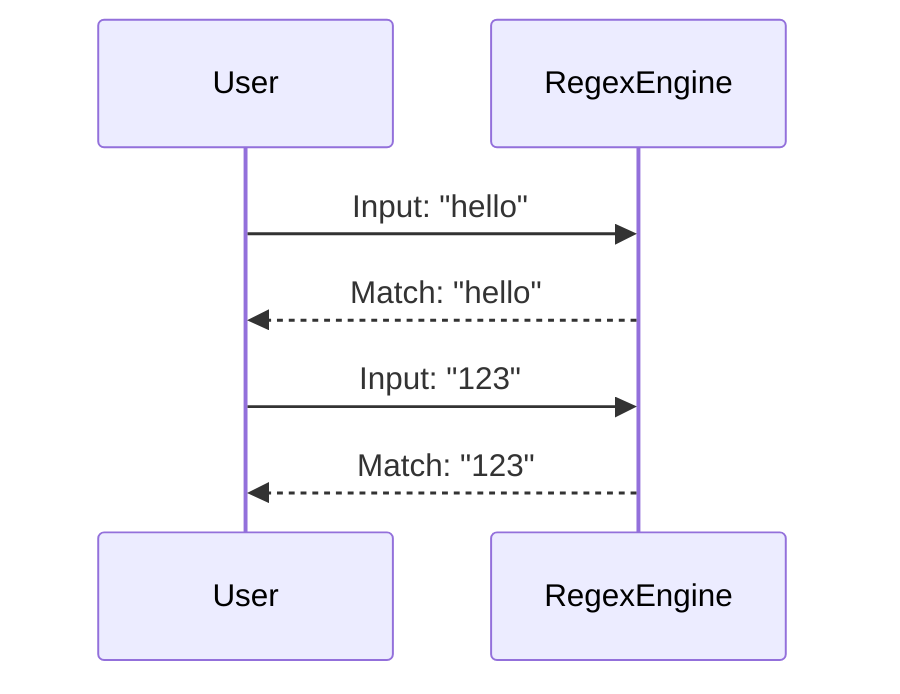
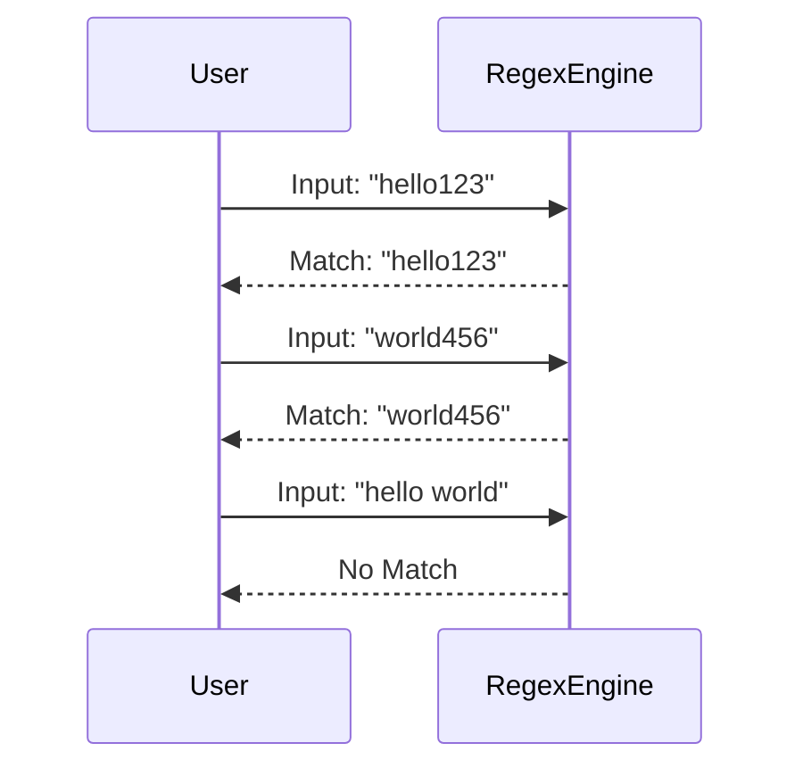

## Introduction to Regular Expressions (Regex)

Regular expressions, often abbreviated as regex, are powerful tools used to match patterns within strings. They are widely used in programming languages, text editors, and various utilities to search, edit, and manipulate text. Understanding regex is crucial for developers, especially those working with APIs, as regex can be used to validate input data, extract specific parts of a string, or perform complex text transformations.

### Basic Components of a Regular Expression

A regular expression consists of a combination of literal characters and special characters that represent patterns. Here are some fundamental components:

- **Literal Characters**: These are the characters that appear exactly as they are written in the regex. For example, `abc` will match the exact string "abc".
  
- **Special Characters**: These characters have special meanings in regex. Some common ones include:
  - `.` (dot): Matches any single character except newline.
  - `*`: Matches zero or more occurrences of the preceding character or group.
  - `+`: Matches one or more occurrences of the preceding character or group.
  - `?`: Matches zero or one occurrence of the preceding character or group.
  - `[]`: Defines a character class, which matches any one character inside the brackets.
  - `^`: Negates the character class if placed inside brackets; otherwise, it matches the start of a line.
  - `$`: Matches the end of a line.
  - `\`: Escapes the next character, allowing you to match special characters literally.

### Example of a Simple Regex

Consider the following regex: `w+`.

- `w`: This matches any word character (alphanumeric and underscore).
- `+`: This quantifier matches one or more occurrences of the preceding character.

So, `w+` matches one or more word characters. For example, it would match "hello", "world", and "123".

### Complex Regex Example

Let's consider a more complex regex: `w+ d+`.

- `w+`: Matches one or more word characters.
- `d+`: Matches one or more digit characters.

This regex would match strings like "hello123" or "world456". However, it would not match "hello world" because there is a space between the word and the digits.

---
<!-- nav -->
[[01-Introduction to Regular Expression Denial of Service (ReDoS)|Introduction to Regular Expression Denial of Service (ReDoS)]] | [[API Security/24-Regular Expression DOS Attack/01-Regex DOS A Real Issue/00-Overview|Overview]] | [[API Security/24-Regular Expression DOS Attack/01-Regex DOS A Real Issue/03-Regular Expression Denial of Service (ReDoS)|Regular Expression Denial of Service (ReDoS)]]
