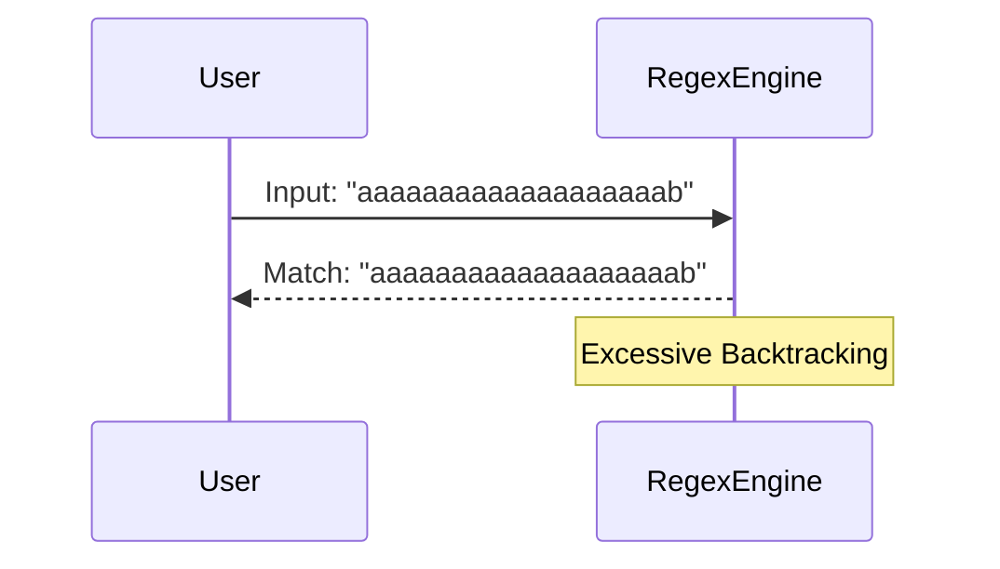
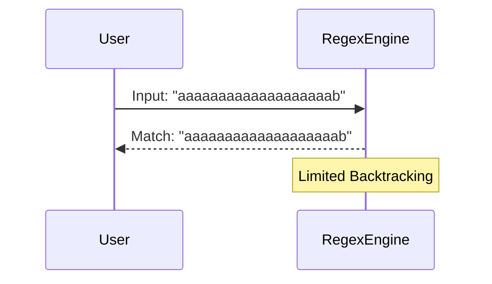

## Regular Expression Denial of Service (ReDoS)

Regular Expression Denial of Service (ReDoS) is a type of attack where an attacker uses carefully crafted input to cause a regular expression engine to consume excessive CPU time. This can lead to a denial of service, where the server becomes unresponsive due to high CPU usage.

### How ReDoS Works

ReDoS attacks exploit the way regex engines handle certain patterns. Specifically, they take advantage of the backtracking mechanism used by regex engines to try different combinations of matching patterns. When the input is designed to maximize backtracking, the regex engine can spend an enormous amount of time trying to find a match.

#### Example of a Vulnerable Regex

Consider the following regex: `(a+)+b`.

- `(a+)`: This matches one or more 'a' characters.
- `+`: This quantifier matches one or more occurrences of the preceding group.
- `b`: This matches the character 'b'.

If the input is a long string of 'a' characters followed by a 'b', the regex engine will spend a lot of time backtracking to find the correct match. For example, the input `"aaaaaaaaaaaaaaaaaaab"` will cause significant backtracking.



### Real-World Examples of ReDoS Attacks

ReDoS attacks have been observed in various real-world scenarios. One notable example is the CVE-2017-17455, which affected the Node.js `path` module. The vulnerability was caused by a regex used to validate file paths, which could be exploited using a specially crafted input string.

Another example is CVE-2018-1117, which affected the `express` middleware in Node.js. The regex used to parse URL parameters could be exploited to cause excessive backtracking.

### Detection and Prevention of ReDoS

To prevent ReDoS attacks, it is essential to understand the regex patterns used in your application and ensure they are optimized to avoid excessive backtracking.

#### Secure Coding Practices

1. **Avoid Catastrophic Backtracking**: Use non-greedy quantifiers (`??`, `*?`, `+?`) instead of greedy ones (`*`, `+`). This can help reduce the number of backtracking steps.

2. **Use Atomic Groups**: Atomic groups (`(?>...)`) prevent backtracking once a match is found, reducing the risk of excessive backtracking.

3. **Limit Quantifiers**: Avoid using large quantifiers (e.g., `{1,1000}`) unless absolutely necessary. Instead, use smaller ranges or fixed lengths.

4. **Validate Inputs**: Ensure that inputs are validated before being passed to regex patterns. This can help prevent malicious input from causing excessive backtracking.

#### Example of a Vulnerable vs. Secure Regex

Consider the following vulnerable regex: `(a+)+b`.


To make this regex secure, we can use a non-greedy quantifier and limit the number of repetitions:



**Vulnerable Regex**:
```regex
(a+)+b
```

**Secure Regex**:
```regex
(a+?){1,10}b
```

### Real-World Lab Exercises

To practice and understand ReDoS attacks and their prevention, you can use the following labs:

- **PortSwigger Web Security Academy**: This platform offers a series of labs that cover various web security topics, including ReDoS attacks. You can practice identifying and preventing ReDoS vulnerabilities in a controlled environment.
- **OWASP Juice Shop**: This is a deliberately insecure web application that you can use to practice finding and exploiting security vulnerabilities, including ReDoS attacks.

By understanding the principles of regular expressions and the risks associated with ReDoS attacks, you can write more secure and efficient code, ensuring that your applications are resilient against such attacks.

---
<!-- nav -->
[[02-Introduction to Regular Expressions (Regex)|Introduction to Regular Expressions (Regex)]] | [[API Security/24-Regular Expression DOS Attack/01-Regex DOS A Real Issue/00-Overview|Overview]] | [[API Security/24-Regular Expression DOS Attack/01-Regex DOS A Real Issue/04-Practice Questions & Answers|Practice Questions & Answers]]
