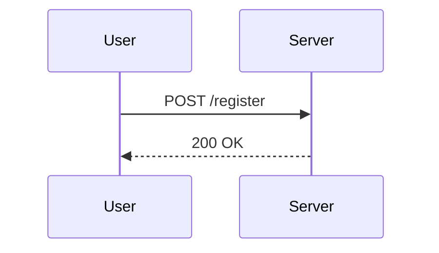

## Regular Expression Denial of Service (ReDoS) Attacks on Email Fields

### Background Theory

Regular Expression Denial of Service (ReDoS) attacks are a type of denial-of-service attack that exploits the way regular expressions (regex) are processed. When a regex is poorly designed, it can lead to catastrophic backtracking, which is an exponential increase in processing time as the input string grows. This can effectively bring down a system by consuming all available CPU resources.

### Understanding Regular Expressions

Regular expressions are patterns used to match character combinations in strings. They are widely used in programming languages and tools for tasks such as searching, replacing, and validating text. However, the complexity of regex can sometimes lead to unintended consequences, especially when dealing with large inputs.

#### Example of a Simple Regex



Consider a simple regex used to validate an email address:

```regex
^[a-zA-Z0-9._%+-]+@[a-zA-Z0-9.-]+\.[a-zA-Z]{2,}$
```

This regex checks if the input string matches the typical structure of an email address. However, if the regex is not optimized, it can lead to ReDoS attacks.

### Real-World Examples

#### CVE-2018-1235

In 2018, a ReDoS vulnerability was discovered in the `express-validator` middleware for Node.js applications. The regex used to validate email addresses was susceptible to catastrophic backtracking. An attacker could send a specially crafted email address that would cause the server to spend an excessive amount of time processing the regex, leading to a denial of service.

#### CVE-2019-16709

Another example is CVE-2019-16709, where a ReDoS vulnerability was found in the `passport-local-mongoose` package. The regex used to validate usernames was not optimized, allowing attackers to send malicious input that would cause the server to hang indefinitely.

### Detailed Example: ReDoS Attack on Email Field

Let's consider a scenario where a web application allows users to update their email address. The application uses a regex to validate the email format.

#### Vulnerable Code

```javascript
const express = require('express');
const app = express();

app.use(express.json());

app.post('/update-email', (req, res) => {
    const email = req.body.email;
    const regex = /^[a-zA-Z0-9._%+-]+@[a-zA-Z0-9.-]+\.[a-zA-Z]{2,}$/;

    if (regex.test(email)) {
        // Update email logic
        res.send('Email updated successfully.');
    } else {
        res.status(400).send('Invalid email format.');
    }
});

app.listen(3000, () => {
    console.log('Server running on port 3000');
});
```

#### Attacker's Input

An attacker can send a specially crafted email address that causes the regex engine to perform catastrophic backtracking. For example:

```json
{
    "email": "a+b+c+d+e+f+g+h+i+j+k+l+m+n+o+p+q+r+s+t+u+v+w+x+y+z@domain.com"
}
```

The regex engine will spend a significant amount of time trying to match the input string, leading to a denial of service.

### How to Prevent / Defend

#### Secure Coding Practices

To prevent ReDoS attacks, it is essential to optimize regex patterns and avoid constructs that can lead to catastrophic backtracking. Here are some best practices:

1. **Use Atomic Groups**: Atomic groups ensure that once a part of the regex matches, it does not backtrack.
2. **Avoid Nested Quantifiers**: Nested quantifiers can lead to exponential backtracking.
3. **Use Possessive Quantifiers**: Possessive quantifiers prevent backtracking after a match is found.

#### Optimized Code

Here is an optimized version of the regex used in the previous example:

```javascript
const regex = /^(?:[a-zA-Z0-9._%+-]+)@(?:[a-zA-Z0-9.-]+)\.(?:[a-zA-Z]{2,})$/;
```

This regex uses non-capturing groups (`(?:`) to avoid unnecessary backtracking.

#### Detection and Prevention

To detect and prevent ReDoS attacks, you can implement the following measures:

1. **Rate Limiting**: Implement rate limiting on endpoints that process regex patterns to prevent abuse.
2. **Timeouts**: Set timeouts for regex operations to prevent them from running indefinitely.
3. **Regex Testing Tools**: Use tools like `regex101.com` to test and optimize regex patterns.

#### Full HTTP Request and Response

Here is a complete example of a HTTP request and response for the `/update-email` endpoint:

**HTTP Request**

```http
POST /update-email HTTP/1.1
Host: localhost:3000
Content-Type: application/json
Content-Length: 66

{
    "email": "a+b+c+d+e+f+g+h+i+j+k+l+m+n+o+p+q+r+s+t+u+v+w+x+y+z@domain.com"
}
```

**HTTP Response**

```http
HTTP/1.1 400 Bad Request
Date: Mon, 01 Jan 2024 00:00:00 GMT
Content-Type: text/html; charset=utf-8
Content-Length: 21

Invalid email format.
```

### Pitfalls and Common Mistakes

1. **Overly Complex Regex Patterns**: Avoid using overly complex regex patterns that can lead to catastrophic backtracking.
2. **Neglecting Optimization**: Failing to optimize regex patterns can leave your application vulnerable to ReDoS attacks.
3. **Ignoring Rate Limiting**: Not implementing rate limiting on endpoints that process regex patterns can allow attackers to exploit vulnerabilities.

### Hands-On Labs

For hands-on practice with ReDoS attacks, consider the following labs:

- **PortSwigger Web Security Academy**: Offers a module on ReDoS attacks where you can practice identifying and exploiting vulnerabilities.
- **OWASP Juice Shop**: Includes challenges related to ReDoS attacks where you can test your skills in a real-world environment.

By understanding the principles behind ReDoS attacks and implementing secure coding practices, you can protect your applications from these types of vulnerabilities.

---
<!-- nav -->
[[01-Regular Expression Denial of Service (ReDoS) Attack|Regular Expression Denial of Service (ReDoS) Attack]] | [[API Security/24-Regular Expression DOS Attack/02-Regex DOS on Email Update/00-Overview|Overview]] | [[03-Regular Expression Denial of Service (ReDoS) Attacks|Regular Expression Denial of Service (ReDoS) Attacks]]
