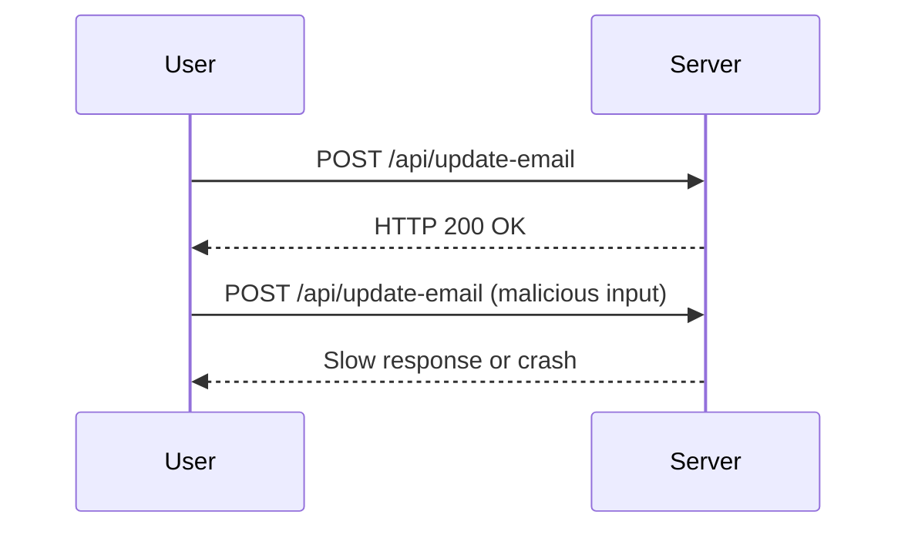
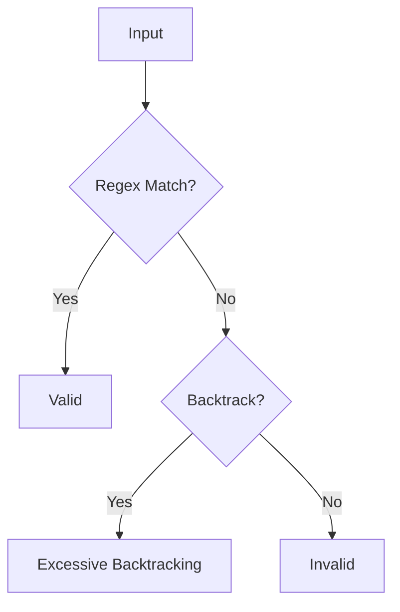

## Regular Expression Denial of Service (ReDoS) Attacks

### Introduction

Regular Expression Denial of Service (ReDoS) attacks are a type of denial-of-service attack that exploits the way regular expressions are processed in many programming languages. These attacks can cause a program to consume excessive amounts of CPU time, leading to a denial of service. In the context of web applications, ReDoS attacks can be particularly dangerous when they target APIs that handle user input, such as email addresses.

### Background Theory

#### What is a Regular Expression?

A regular expression (regex) is a sequence of characters that defines a search pattern. It is used to match strings or pieces of text according to specific rules. Regular expressions are widely used in various programming languages and tools for tasks like searching, replacing, and validating text patterns.

#### How Regular Expressions Work

Regular expressions work by matching patterns within strings. They use a combination of literal characters and special symbols called metacharacters to define these patterns. For example, the regex `^abc$` matches the string "abc" exactly, while `a.*b` matches any string that starts with "a" and ends with "b", with any number of characters in between.

#### Backtracking and Catastrophic Backtracking

Backtracking is a mechanism used by regex engines to try different paths when a match fails. This is necessary because many regex patterns can match the same string in multiple ways. However, in some cases, especially with complex patterns, the regex engine might spend an excessive amount of time trying different combinations, leading to catastrophic backtracking. This can cause the program to become unresponsive or crash.

### Real-World Examples

#### Recent CVEs and Breaches

One notable example of a ReDoS attack is CVE-2018-14574, which affected the popular Node.js package `express-validator`. This vulnerability allowed attackers to craft malicious input that would cause the regex engine to perform excessive backtracking, leading to a denial of service. Another example is CVE-2020-14182, which affected the `npm` package `semver`, allowing similar attacks.

### Example Scenario: Email Address Validation

Let's consider a scenario where a web application allows users to update their email addresses through an API. The application uses a regular expression to validate the email format. If the regex is not optimized, it can be exploited by an attacker to cause a denial of service.

#### Vulnerable Code Example

```python
import re

def validate_email(email):
    pattern = r'^[a-zA-Z0-9._%+-]+@[a-zA-Z0-9.-]+\.[a-zA-Z]{2,}$'
    return re.match(pattern, email) is not None

email = "A.B.C@V.Rate.Gmail.com"
print(validate_email(email))
```

In this example, the regex pattern is relatively simple and should work fine for most valid email addresses. However, if the pattern is more complex or if the input is specifically crafted to trigger catastrophic backtracking, the function could become very slow or even crash.

### Attack Scenario

An attacker can exploit this vulnerability by sending a large number of requests with specially crafted email addresses that cause the regex engine to perform excessive backtracking. For instance:

```python
malicious_email = "A.B.C@V.Rate.Gmail.com" * 1000
print(validate_email(malicious_email))
```

This input is designed to trigger catastrophic backtracking, causing the regex engine to spend a lot of time trying different combinations, leading to a denial of service.

### HTTP Request and Response

Here is an example of an HTTP request and response for updating an email address:

```http
POST /api/update-email HTTP/1.1
Host: example.com
Content-Type: application/json

{
  "email": "A.B.C@V.Rate.Gmail.com"
}
```

```http
HTTP/1.1 200 OK
Content-Type: application/json

{
  "status": "success",
  "message": "Email updated successfully"
}
```

If the server is vulnerable to ReDoS, the response might take a long time or the server might crash, leading to a denial of service.

### How to Prevent / Defend

#### Secure Coding Practices

To prevent ReDoS attacks, it is crucial to optimize regular expressions and avoid patterns that can lead to catastrophic backtracking. Here are some best practices:

1. **Use Atomic Groups**: Atomic groups can help prevent backtracking. For example, `(?>pattern)` ensures that once a match is found, the engine does not backtrack.

2. **Avoid Repetition Operators with Alternation**: Patterns like `(a|b)*` can lead to catastrophic backtracking. Instead, use more specific patterns.

3. **Limit Backtracking Depth**: Some regex engines allow you to set a limit on the number of backtracking steps. For example, in Python, you can use the `re.setrecursionlimit()` function to limit the recursion depth.

#### Secure Code Example

Here is an example of a secure regex pattern for email validation:

```python
import re

def validate_email(email):
    pattern = r'^[a-zA-Z0-9._%+-]+@(?:[a-zA-Z0-9-]+\.)+[a-zA-Z]{2,}$'
    return re.match(pattern, email) is not None

email = "A.B.C@V.Rate.Gmail.com"
print(validate_email(email))
```

In this example, the pattern is optimized to avoid catastrophic backtracking.

#### Detection and Prevention

To detect and prevent ReDoS attacks, you can implement the following measures:

1. **Rate Limiting**: Implement rate limiting on API endpoints to prevent a single client from making too many requests in a short period.

2. **Monitoring**: Monitor server performance and logs for signs of unusual activity, such as high CPU usage or slow response times.

3. **Security Tools**: Use security tools like static analysis tools to identify potential ReDoS vulnerabilities in your code.

### Mermaid Diagrams

#### Attack Chain Diagram



#### Regex Engine Flow Diagram



### Practice Labs

For hands-on practice with ReDoS attacks, consider the following labs:

- **PortSwigger Web Security Academy**: Offers interactive labs on various web security topics, including ReDoS attacks.
- **OWASP Juice Shop**: A deliberately insecure web application for security training purposes, which includes scenarios related to ReDoS attacks.
- **DVWA (Damn Vulnerable Web Application)**: A PHP/MySQL web application that is riddled with vulnerabilities, including those related to regular expressions.

By thoroughly understanding the concepts, theory, and practical aspects of ReDoS attacks, you can better protect your applications from these types of vulnerabilities.

---
<!-- nav -->
[[02-Regular Expression Denial of Service (ReDoS) Attacks on Email Fields|Regular Expression Denial of Service (ReDoS) Attacks on Email Fields]] | [[API Security/24-Regular Expression DOS Attack/02-Regex DOS on Email Update/00-Overview|Overview]] | [[API Security/24-Regular Expression DOS Attack/02-Regex DOS on Email Update/04-Practice Questions & Answers|Practice Questions & Answers]]
