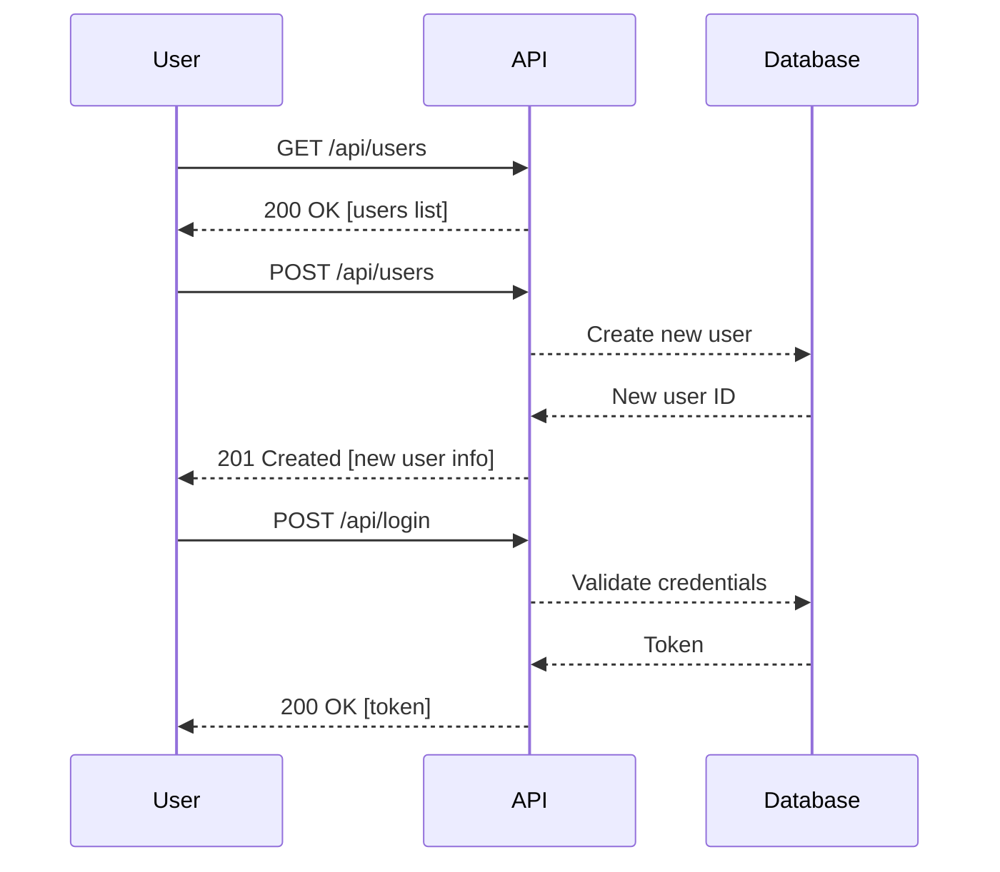

## Hidden API Functionality Exposure

### Introduction

Hidden API functionality exposure refers to the scenario where an application exposes additional or hidden functionalities through its APIs that are not documented or intended for public use. This can lead to security vulnerabilities, as attackers may discover and exploit these hidden functionalities to gain unauthorized access or perform malicious actions.

### Understanding Hidden API Functionality

When designing APIs, developers often create endpoints that serve specific purposes. However, sometimes additional functionalities are exposed unintentionally, either due to incomplete documentation, leftover debugging features, or unintended behavior. These hidden functionalities can be exploited by attackers to bypass normal authentication mechanisms or access sensitive data.

#### Example Scenario

Consider an API designed to manage user accounts. The API has documented endpoints for creating, reading, updating, and deleting user accounts. However, during development, a hidden endpoint was created to quickly test user authentication. This endpoint might look like `/api/auth/test`, which returns detailed user information without proper authentication checks.

### Real-World Examples

Recent real-world examples of hidden API functionality exposure include:

1. **CVE-2021-21972**: A vulnerability in the Zoom API allowed attackers to access internal Zoom APIs that were not intended for public use. This exposed sensitive data and allowed unauthorized access to internal systems.
   
2. **CVE-2020-1472**: In Microsoft Exchange Server, a hidden API endpoint was discovered that allowed attackers to execute arbitrary code and take control of the server.

### Detailed Analysis

To understand the mechanics of hidden API functionality exposure, let's break down the process step-by-step using the example provided in the lecture transcript.

#### Step-by-Step Analysis

1. **Initial Request**:
    - The initial GET request to `/api/users` returns basic user information.
    - ```http
      GET /api/users HTTP/1.1
      Host: example.com
      Authorization: Bearer <token>
      
      HTTP/1.1 200 OK
      Content-Type: application/json
      
      [
        {
          "id": 1,
          "username": "john_doe",
          "status": "active"
        },
        {
          "id": 2,
          "username": "jane_doe",
          "status": "inactive"
        }
      ]
      ```

2. **Hidden POST Request**:
    - A hidden POST request to `/api/users` allows creation of new users with detailed information.
    - ```http
      POST /api/users HTTP/1.1
      Host: example.com
      Authorization: Bearer <token>
      Content-Type: application/json
      
      {
        "username": "new_user",
        "password": "secure_password",
        "status": "active"
      }
      
      HTTP/1.1 201 Created
      Content-Type: application/json
      
      {
        "id": 3,
        "username": "new_user",
        "status": "active"
      }
      ```

3. **Login POST Request**:
    - A hidden POST request to `/api/login` generates authentication tokens.
    - ```http
      POST /api/login HTTP/1.1
      Host: example.com
      Content-Type: application/json
      
      {
        "username": "admin",
        "password": "admin_password"
      }
      
      HTTP/1.1 200 OK
      Content-Type: application/json
      
      {
        "token": "eyJhbGciOiJIUzI1NiIsInR5cCI6IkpXVCJ9..."
      }
      ```

### Mermaid Diagrams

#### Sequence Diagram



### Pitfalls and Common Mistakes

1. **Incomplete Documentation**: Developers often forget to document all endpoints, leading to hidden functionalities being exposed.
2. **Leftover Debugging Features**: Debugging endpoints or features left in production code can expose sensitive information.
3. **Improper Authentication Checks**: Endpoints that bypass normal authentication mechanisms can be exploited by attackers.

### How to Prevent / Defend

#### Detection

1. **API Scanning Tools**: Use tools like Burp Suite, OWASP ZAP, or commercial solutions to scan for undocumented endpoints.
2. **Logging and Monitoring**: Implement comprehensive logging and monitoring to detect unusual API activity.

#### Prevention

1. **Thorough Documentation**: Ensure all endpoints are properly documented and reviewed.
2. **Code Reviews**: Conduct regular code reviews to identify and remove leftover debugging features.
3. **Strict Authentication**: Enforce strict authentication checks on all endpoints.

#### Secure Coding Fixes

##### Vulnerable Code

```python
@app.route('/api/users', methods=['POST'])
def create_user():
    data = request.json
    username = data['username']
    password = data['password']
    status = data['status']
    # Create user in database
    return jsonify({"id": 3, "username": username, "status": status}), 201
```

##### Secure Code

```python
from flask import Flask, request, jsonify
from functools import wraps

app = Flask(__name__)

def token_required(f):
    @wraps(f)
    def decorated(*args, **kwargs):
        token = request.headers.get('Authorization')
        if not token:
            return jsonify({'message': 'Token is missing!'}), 401
        # Validate token
        if not validate_token(token):
            return jsonify({'message': 'Invalid token!'}), 401
        return f(*args, **kwargs)
    return decorated

@app.route('/api/users', methods=['POST'])
@token_required
def create_user():
    data = request.json
    username = data['username']
    password = data['password']
    status = data['status']
    # Create user in database
    return jsonify({"id": 3, "username": username, "status": status}), 201
```

### Configuration Hardening

1. **Rate Limiting**: Implement rate limiting to prevent abuse of API endpoints.
2. **Input Validation**: Validate all input parameters to prevent injection attacks.

### Hands-On Labs

For practical experience in detecting and preventing hidden API functionality exposure, consider the following labs:

- **PortSwigger Web Security Academy**: Offers modules on API security, including hidden functionality detection.
- **OWASP Juice Shop**: Provides a vulnerable web application with hidden API endpoints for practice.
- **DVWA (Damn Vulnerable Web Application)**: Contains various API-related vulnerabilities for hands-on learning.

By thoroughly understanding and implementing the preventive measures discussed, you can significantly reduce the risk of hidden API functionality exposure and enhance the overall security of your applications.

---
<!-- nav -->
[[03-Findings|Findings]] | [[API Security/25-Hidden API Functionality Exposure/02-Hidden API Exposure/00-Overview|Overview]] | [[05-Understanding Hidden API Functionality Exposure|Understanding Hidden API Functionality Exposure]]
