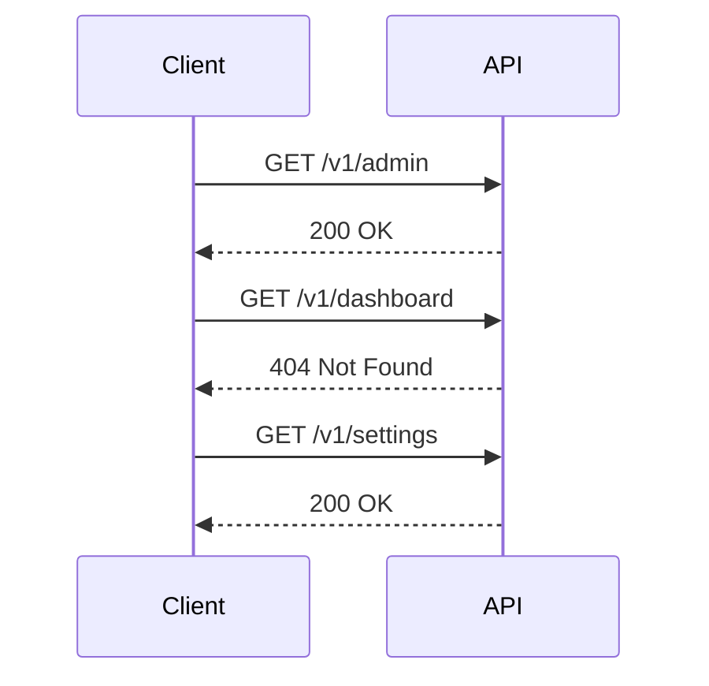

## Hidden API Functionality Exposure

### Introduction

Hidden API functionality exposure refers to the situation where an application exposes additional, undocumented API endpoints that could potentially be exploited by attackers. These hidden endpoints might not be visible through standard documentation or discovery methods, making them a significant security risk. In this section, we will delve into the details of how to identify and mitigate such exposures.

### Understanding Swagger UI Documentation

Swagger UI is a popular tool used to document APIs. It provides a user-friendly interface for exploring and testing APIs. By examining the Swagger UI documentation, you can identify the documented endpoints and their functionalities. However, it is important to note that not all endpoints might be listed in the Swagger UI documentation, leading to potential hidden functionality.

#### Example of Swagger UI Documentation

Consider the following Swagger UI documentation for a hypothetical API:

```yaml
openapi: 3.0.0
info:
  title: Sample API
  description: A sample API to demonstrate Swagger UI documentation
  version: 1.0.0
servers:
  - url: https://api.example.com/v1
paths:
  /users:
    get:
      summary: Retrieve a list of users
      responses:
        '200':
          description: A list of users
  /users/{id}:
    get:
      summary: Retrieve a specific user
      parameters:
        - name: id
          in: path
          required: true
          schema:
            type: integer
      responses:
        '200':
          description: A specific user
```

In this example, the `/users` and `/users/{id}` endpoints are documented. However, there might be additional endpoints that are not listed here.

### Dictionary Attack on APIs

A dictionary attack involves systematically trying a large number of possible inputs to discover valid endpoints. This method can be particularly effective in uncovering hidden API functionality.

#### Steps to Perform a Dictionary Attack

1. **Prepare a Word List**: Create a list of common API endpoint names. This list can include terms like `admin`, `dashboard`, `settings`, etc.
2. **Automate the Attack**: Use tools like Burp Suite Intruder or similar to automate the process of sending requests to the API with different endpoint names from the word list.
3. **Analyze Responses**: Look for successful responses that indicate the presence of hidden endpoints.

#### Example Using Burp Suite Intruder

Here’s an example of how to set up a dictionary attack using Burp Suite Intruder:

1. **Capture a Request**: Capture a request to an existing endpoint, such as `/users`.
2. **Configure Intruder**:
   - Set the target URL to `https://api.example.com/v1/<WORDLIST>`.
   - Add the word list containing common endpoint names.
   - Send the requests and analyze the responses.



### Real-World Examples

Hidden API functionality exposure has been a factor in several real-world vulnerabilities. One notable example is the case of the Tesla API, where researchers discovered hidden endpoints that allowed unauthorized access to vehicle data.

#### Tesla API Case Study

In 2019, researchers found that the Tesla API had undocumented endpoints that could be accessed without proper authentication. These endpoints provided sensitive information about the vehicle, including location and diagnostic data. This exposure was due to the lack of proper documentation and access controls.

### How to Prevent / Defend

To prevent hidden API functionality exposure, it is crucial to implement robust security measures and practices.

#### Secure Coding Practices

1. **Document All Endpoints**: Ensure that all API endpoints are properly documented, including those that are intended to be internal or hidden.
2. **Access Controls**: Implement strict access controls and authentication mechanisms to ensure that only authorized users can access sensitive endpoints.
3. **Rate Limiting**: Use rate limiting to prevent brute-force attacks and limit the number of requests that can be made to the API within a given time frame.

#### Example of Secure Coding

Here’s an example of how to secure an API endpoint using access controls:

```python
from flask import Flask, request, jsonify
from functools import wraps

app = Flask(__name__)

def require_auth(f):
    @wraps(f)
    def decorated_function(*args, **kwargs):
        auth_header = request.headers.get('Authorization')
        if not auth_header or auth_header != 'Bearer <YOUR_SECRET_TOKEN>':
            return jsonify({"error": "Unauthorized"}), 401
        return f(*args, **kwargs)
    return decorated_function

@app.route('/admin', methods=['GET'])
@require_auth
def admin_endpoint():
    return jsonify({"message": "Welcome to the admin panel"})

if __name__ == '__main__':
    app.run()
```

#### Hardening Configuration

1. **Use HTTPS**: Ensure that all API communications are encrypted using HTTPS to prevent eavesdropping and man-in-the-middle attacks.
2. **Input Validation**: Validate all input parameters to prevent injection attacks and ensure that only valid data is processed.
3. **Logging and Monitoring**: Implement comprehensive logging and monitoring to detect and respond to suspicious activity.

#### Example of Hardened Configuration

Here’s an example of how to configure Nginx to enforce HTTPS and rate limiting:

```nginx
server {
    listen 80;
    server_name api.example.com;
    return 301 https://$host$request_uri;
}

server {
    listen 40;
    server_name api.example.com;

    location / {
        proxy_pass http://localhost:5000;
        proxy_set_header Host $host;
        proxy_set_header X-Real-IP $remote_addr;
        proxy_set_header X-Forwarded-For $proxy_add_x_forwarded_for;
        proxy_set_header X-Forwarded-Proto $scheme;
    }

    location /admin {
        limit_req zone=one burst=5 nodelay;
        proxy_pass http://localhost:5000;
        proxy_set_header Host $host;
        proxy_set_header X-Real-IP $remote_addr;
        proxy_set_header X-Forwarded-For $proxy_add_x_forwarded_for;
        proxy_set_header X-Forwarded-Proto $scheme;
    }
}
```

### Hands-On Labs

To practice identifying and mitigating hidden API functionality exposure, consider the following labs:

- **PortSwigger Web Security Academy**: Offers a series of labs focused on API security, including hidden functionality exposure.
- **OWASP Juice Shop**: A deliberately insecure web application that includes various API-related vulnerabilities, including hidden endpoints.
- **DVWA (Damn Vulnerable Web Application)**: Provides a range of web application vulnerabilities, including some related to API security.

These labs provide practical experience in identifying and securing hidden API functionality.

### Conclusion

Hidden API functionality exposure is a significant security risk that can lead to unauthorized access and data breaches. By understanding the methods to identify and mitigate such exposures, you can enhance the security of your APIs and protect against potential threats. Always ensure thorough documentation, robust access controls, and comprehensive monitoring to maintain the integrity and security of your APIs.

---
<!-- nav -->
[[API Security/25-Hidden API Functionality Exposure/03-Hidden API Functionality Exposure/00-Overview|Overview]] | [[API Security/25-Hidden API Functionality Exposure/03-Hidden API Functionality Exposure/02-Practice Questions & Answers|Practice Questions & Answers]]
